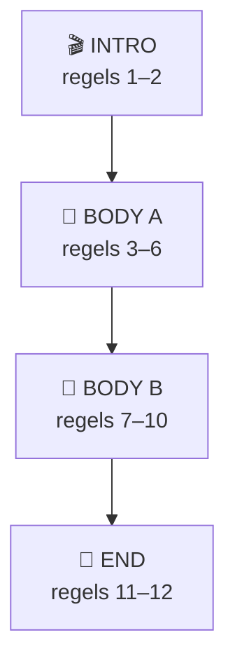
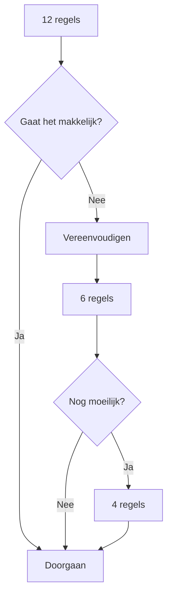

# 🧱 The 12-Line Method

De **12-Line Method** is de standaard tekststructuur voor de eerste Vliegbasis71-workshops.

Het doel is niet een universele songwritingformule te creëren.

Het doel is:

> **een voorspelbaar speelveld creëren waarin beginners snel kunnen bijdragen.**

---

# 🗺️ Basisstructuur

```text
INTRO
01  ______________________
02  ______________________

BODY A
03  ______________________
04  ______________________
05  ______________________
06  ______________________

BODY B
07  ______________________
08  ______________________
09  ______________________
10  ______________________

END
11  ______________________
12  ______________________
```

Visueel:



---

# 🧠 Waarom twaalf?

Twaalf regels zijn:

- lang genoeg om ontwikkeling te voelen;
- kort genoeg voor een workshop;
- makkelijk in blokken te verdelen;
- geschikt voor herhaling;
- makkelijk te verkorten.

Het getal twaalf is geen muzikale wet.

Het is een **facilitatietool**.

---

# 🪜 Beginner scaffolding

Voor beginners vult de facilitator vooraf vier regels in.

Aanbevolen:

```text
01  FACILITATOR
02  DEELNEMER

03  FACILITATOR
04  DEELNEMER
05  DEELNEMER
06  DEELNEMER

07  FACILITATOR
08  DEELNEMER
09  DEELNEMER
10  DEELNEMER

11  FACILITATOR
12  DEELNEMER
```

Visueel:



```mermaid
flowchart LR

    F1["⚓ 01 Facilitator"]
    P2["👤 02 Participant"]
    F3["⚓ 03 Facilitator"]
    P4["👤 04 Participant"]
    P5["👤 05 Participant"]
    P6["👤 06 Participant"]
    F7["⚓ 07 Facilitator"]
    P8["👤 08 Participant"]
    P9["👤 09 Participant"]
    P10["👤 10 Participant"]
    F11["⚓ 11 Facilitator"]
    P12["👤 12 Participant"]

    F1 --> P2 --> F3 --> P4 --> P5 --> P6
    P6 --> F7 --> P8 --> P9 --> P10 --> F11 --> P12
```

De vooraf geschreven regels noemen we:

# ⚓ Anchor Lines

Anchor Lines geven richting zonder het lied volledig vast te leggen.

---

# 🌞 Voorbeeld — thema Zondag

Vooraf:

```text
01  Wakker met koffie
03  Buiten wordt het licht
07  We lopen langzaam verder
11  Morgen komt vanzelf
```

Deelnemers vullen aan:

```text
01  Wakker met koffie
02  Regen op het raam

03  Buiten wordt het licht
04  Vogels zingen zacht
05  Kat naast mijn stoel
06  Ontbijt op tafel

07  We lopen langzaam verder
08  Langs bomen en het strand
09  De middag wordt rustig
10  De stad ademt uit

11  Morgen komt vanzelf
12  Maar vandaag is zondag
```

---

# 🎭 Functie van de vier blokken

| Blok | Regels | Functie | Vraag |
|---|---:|---|---|
| 🎬 Intro | 1–2 | situatie openen | Waar zijn we? |
| 🌱 Body A | 3–6 | wereld bouwen | Wat gebeurt er? |
| 🚶 Body B | 7–10 | beweging/verandering | Waar gaat het heen? |
| 🏁 End | 11–12 | afronding | Waar landen we? |

De facilitator hoeft deze theorie niet volledig aan deelnemers uit te leggen.

De structuur werkt op de achtergrond.

---

# ✍️ Regellengte

Voor beginners:

> **ongeveer 2–6 woorden per regel.**

Voorbeelden:

🟢 Zeer bruikbaar:

```text
Wakker met koffie
Regen tegen ramen
Vogels zingen buiten
Vandaag hoeft niets
```

🟡 Mogelijk:

```text
Ik word langzaam wakker met koffie
```

🔴 Lastiger voor live gebruik:

```text
Terwijl de ochtendzon langzaam door mijn gordijnen
naar binnen begint te vallen
```

---

# 🥁 Ritmische compatibiliteit

De regels hoeven niet exact evenveel lettergrepen te bevatten.

Maar ze moeten makkelijk uitspreekbaar blijven.

Bijvoorbeeld:

```text
Wak-ker met kof-fie
1   &   2   &

Re-gen op ra-men
1   &  2  &
```

De facilitator mag woorden:

- uitrekken;
- eerder inzetten;
- later inzetten;
- herhalen;
- ritmisch spreken.

---

# 🔁 Herhaling is toegestaan

Een regel mag terugkomen.

Bijvoorbeeld:

```text
Wakker met koffie
Wakker met koffie

Buiten wordt het licht
Buiten wordt het licht
```

Herhaling is geen gebrek aan creativiteit.

In muziek is herhaling structuur.

---

# 🔄 Variant: Body B spiegelt Body A

Een nuttige eenvoudige variant:

```text
BODY A
03 Vogels zingen buiten
04 Koffie op tafel
05 Regen op ramen
06 Vandaag heel langzaam

BODY B
07 Vogels zingen buiten
08 Koffie op tafel
09 Regen op ramen
10 Vandaag gaan we verder
```

Alleen regel 10 verandert.

Daardoor ontstaat onmiddellijk herkenning én ontwikkeling.

---

# 🔀 Variant: X → Y

Een ander patroon:

```text
A
A
A
X

A
A
A
Y
```

Bijvoorbeeld:

```text
Zondag wordt wakker
Koffie staat klaar
Vogels zijn buiten
Vandaag blijven we thuis

Zondag wordt wakker
Koffie staat klaar
Vogels zijn buiten
Vandaag gaan we op pad
```

De laatste regel verandert de betekenis.

---

# 👥 Acht deelnemers

Wanneer vier Anchor Lines vooraf bestaan, blijven acht regels over.

Dat geeft een interessante workshopvorm:

```text
Facilitator → regel 01
Persoon 1   → regel 02

Facilitator → regel 03
Persoon 2   → regel 04
Persoon 3   → regel 05
Persoon 4   → regel 06

Facilitator → regel 07
Persoon 5   → regel 08
Persoon 6   → regel 09
Persoon 7   → regel 10

Facilitator → regel 11
Persoon 8   → regel 12
```

Iedereen hoeft slechts **één kleine bijdrage** te leveren.

---

# 👥 Minder deelnemers?

Geen probleem.

Bij vier deelnemers:

```text
P1 → regel 2 + 8
P2 → regel 4 + 9
P3 → regel 5 + 10
P4 → regel 6 + 12
```

Bij één deelnemer:

```text
FACILITATOR
      ↕
DEELNEMER
      ↕
FACILITATOR
      ↕
DEELNEMER
```

---

# 🤖 Oefenen met AI

ChatGPT kan de acht deelnemers simuleren.

Voorbeeldprompt:

```text
We oefenen de Vliegbasis71 12-Line Method.

Thema: zondag.

Ik ben facilitator.

Ik heb vooraf regels 1, 3, 7 en 11 voorbereid.

Jij speelt acht verschillende deelnemers.

Geef NIET meteen alle antwoorden.

Reageer alleen als de deelnemer die ik aanspreek.

Iedere deelnemer geeft maximaal één korte regel
van ongeveer 2–6 woorden.

Sommige deelnemers mogen twijfelen of iets onverwachts zeggen.

Ik moet zelf de workshop faciliteren.
Help mij dus niet tenzij ik expliciet om coaching vraag.
```

Dit onderscheid is belangrijk:

```text
AI ALS COACH
      ≠
AI ALS DEELNEMER
```

Tijdens een simulatie moet AI niet voortdurend de facilitator redden.

---

# 🚨 Rescue Mode

Als het proces vastloopt:

## Rescue 1 — geef twee keuzes

> "Koffie of regen?"

## Rescue 2 — maak zin af

> "Zondag voelt als..."

## Rescue 3 — hergebruik woord

```text
koffie
↓
warme koffie
↓
koffie wordt koud
```

## Rescue 4 — gebruik Anchor Line

Als niemand iets weet:

> gebruik de vooraf voorbereide regel.

Geen probleem.

---

# ✂️ Short Mode

Geen tijd voor twaalf regels?

Gebruik zes:

```text
01 Anchor
02 Participant

03 Anchor
04 Participant

05 Anchor
06 Participant
```

Of zelfs vier:

```text
01 Facilitator
02 Participant
03 Facilitator
04 Participant
```

---

# 🧠 Belangrijk ontwerpprincipe



De structuur dient de groep.

**De groep dient niet de structuur.**

---

# 🎯 Definition of Done

Een 12-Line sessie is geslaagd wanneer:

- een thema bestaat;
- minimaal vier regels bestaan;
- meerdere bijdragen verwerkt zijn;
- de tekst minstens één keer hardop is uitgevoerd.

Bonus:

- ritme;
- gitaar;
- zang;
- publiek zingt mee.

Maar die zijn niet noodzakelijk.

---

# ⭐ Samenvatting

```text
THEMA
  ↓
WOORDEN
  ↓
ANCHOR LINES
  ↓
12 REGELS
  ↓
HARDOP SPREKEN
  ↓
PULS
  ↓
MUZIEK
  ↓
GROEP
  ↓
PERFORMANCE
```

> **Don't write the perfect song.  
> Build the smallest structure in which people can create together.**

