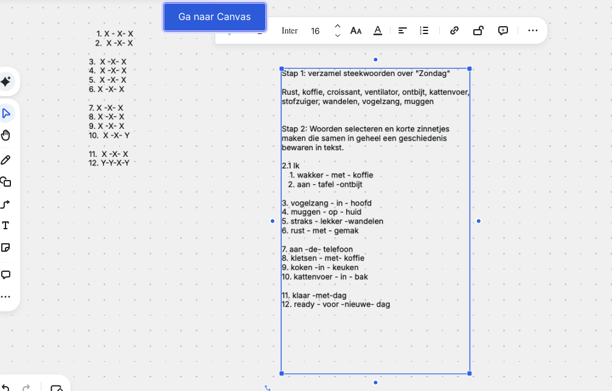

# 🧱 De 12-Line Collaborative Song Method

> **Twaalf korte regels. Vier voorbereid. Acht open. Eén gezamenlijk resultaat.**

De 12-Line Method is de kernvorm van de
**Vliegbasis71 Collaborative Song Method**.

De methode ontstond vanuit een praktische vraag:

> Hoe kan een groep mensen zonder ervaring met songwriting binnen korte tijd
> gezamenlijk iets maken dat daarna gesproken, gechant of gezongen kan worden?

Het antwoord is niet:

**geef de groep maximale vrijheid.**

Het antwoord is:

**geef de groep een eenvoudig raamwerk waarbinnen vrijheid mogelijk wordt.**

---

# 🎯 Het basisidee

De tekst bestaat uit twaalf regels.

De facilitator bereidt vier regels vooraf voor:

```text
01
03
07
11
```

Dit zijn de **ankerregels**.

De overige regels worden tijdens de sessie samen ontwikkeld.

```text
┌──────────────────────────────────────────────┐
│ 01  🟦 ANKER       facilitator              │
│ 02  🟢 OPEN        deelnemer                 │
│                                              │
│ 03  🟦 ANKER       facilitator              │
│ 04  🟢 OPEN        deelnemer                 │
│ 05  🟢 OPEN        deelnemer                 │
│ 06  🟢 OPEN        deelnemer                 │
│                                              │
│ 07  🟦 ANKER       facilitator              │
│ 08  🟢 OPEN        deelnemer                 │
│ 09  🟢 OPEN        deelnemer                 │
│ 10  🟢 OPEN        deelnemer                 │
│                                              │
│ 11  🟦 ANKER       facilitator              │
│ 12  🟢 OPEN        deelnemer                 │
└──────────────────────────────────────────────┘
```

Daarmee is de pagina nooit volledig leeg.

---

# 🧠 Waarom precies 1, 3, 7 en 11?

De posities hebben een functie.

| Regel | Functie | Vraag |
|---:|---|---|
| 🟦 01 | Start | Waar beginnen we? |
| 🟦 03 | Richting | Waar gaat dit heen? |
| 🟦 07 | Beweging | Wat verandert er? |
| 🟦 11 | Landing | Waar willen we eindigen? |

De facilitator schrijft dus niet vier willekeurige mooie regels.

De regels functioneren als **wegwijzers**.

---

# 🌳 De verhaalboom

```text
                    THEMA
                      │
                      ▼
                🟦 REGEL 01
                  "begin"
                      │
                 🟢 regel 02
                      │
                      ▼
                🟦 REGEL 03
                 "richting"
                      │
              ┌───────┼───────┐
              ▼       ▼       ▼
             04      05       06
              └───────┬───────┘
                      │
                      ▼
                🟦 REGEL 07
                 "beweging"
                      │
              ┌───────┼───────┐
              ▼       ▼       ▼
             08      09       10
              └───────┬───────┘
                      │
                      ▼
                🟦 REGEL 11
                  "landing"
                      │
                      ▼
                 🟢 regel 12
                      │
                      ▼
                 🎵 EINDE
```

De deelnemers hoeven deze architectuur niet te kennen.

De facilitator wel.

---




---

# 🚦 Beginner Mode

Voor een eerste sessie geldt:

> **Geen rijmverplichting. Geen melodieverplichting. Geen zangverplichting.**

De minimale eisen zijn:

```text
12 korte regels
      +
begrijpelijke volgorde
      +
spreekbaar ritme
      =
GESLAAGD
```

---

# 🟢 Stap 0 — Voorbereiden

De facilitator kiest vooraf:

```yaml
theme: "Zondag"

anchor_lines:
  1: "Wakker met koffie"
  3: "Zon door het raam"
  7: "Buiten wordt het rustig"
  11: "Klaar voor morgen"
```

Daarnaast:

- 8–12 reservewoorden;
- eenvoudige muzikale basis;
- maximale sessieduur;
- backupvorm zonder muziek.

---

# 🟢 Stap 1 — Introduceer het thema

Zeg bijvoorbeeld:

> "Ons thema is vandaag **zondag**."

Daarna één eenvoudige vraag:

> "Welke één tot drie woorden horen voor jou bij zondag?"

Niet meer uitleggen.

---

# 🟢 Stap 2 — Verzamel woorden

Voorbeeld:

```text
☕ koffie
🥐 ontbijt
☀️ zon
🐈 kat
🚶 wandelen
🌳 park
🎵 muziek
🌧️ regen
🛋️ rust
📖 boek
🍳 keuken
🌙 avond
```

## Belangrijk

Op dit moment zijn het alleen woorden.

Niet:

- beoordelen;
- rijmen;
- metrisch corrigeren;
- melodieën verzinnen.

---

# 🟢 Stap 3 — Maak de woorden zichtbaar

Gebruik:

- whiteboard;
- flip-over;
- papier;
- tablet;
- scherm.

Bijvoorbeeld:

```text
┌────────── WOORDENBANK ──────────┐
│                                 │
│ koffie        wandelen          │
│ ontbijt       park              │
│ zon           muziek            │
│ kat           regen             │
│ rust          keuken            │
│ boek          avond             │
│                                 │
└─────────────────────────────────┘
```

---

# 🟢 Stap 4 — Toon regel 1

De facilitator heeft:

> **01 — Wakker met koffie**

Vraag vervolgens:

> "Wat zou daarna kunnen gebeuren?"

Dat is veel eenvoudiger dan:

> "Wie kan regel twee van ons lied schrijven?"

---

# 🟢 Stap 5 — Bouw regel 2

Een deelnemer zegt bijvoorbeeld:

> "Ik zit aan tafel te ontbijten."

De facilitator kan vragen:

> "Kunnen we die kort maken?"

Mogelijke groepversie:

> **Ontbijt aan tafel**

Nu:

```text
01  Wakker met koffie
02  Ontbijt aan tafel
```

---

# 🟢 Stap 6 — Gebruik anker 3

De facilitator onthult:

```text
03  Zon door het raam
```

Nu heeft de groep opnieuw richting.

```text
01  Wakker met koffie
02  Ontbijt aan tafel
03  Zon door het raam
04  __________________
05  __________________
06  __________________
```

---

# 🟢 Stap 7 — Bouw regels 4–6

Gebruik de woordenbank.

Bijvoorbeeld:

```text
04  Vogelzang in mijn hoofd
05  Wandelen door het park
06  Regen op mijn jas
```

Streep eventueel gebruikte woorden door.

```text
koffie       ✓
ontbijt      ✓
zon          ✓
wandelen     ✓
park         ✓
regen        ✓
kat
rust
boek
muziek
keuken
avond
```

Dit geeft deelnemers visuele feedback:

**er ontstaat iets.**

---

# 🟡 Stap 8 — De beweging bij regel 7

Nu komt het tweede grote anker:

```text
07  Buiten wordt het rustig
```

Dit mag inhoudelijk een kleine verandering introduceren.

Bijvoorbeeld:

```text
ochtend
   ↓
activiteit
   ↓
BUITEN WORDT HET RUSTIG
   ↓
avond
```

---

# 🟢 Stap 9 — Regels 8–10

De groep bouwt verder:

```text
08  Kattenvoer in de bak
09  Muziek zachtjes aan
10  Rust komt in huis
```

Perfect rijm is niet nodig.

---

# 🟦 Stap 10 — Regel 11: de landing

De facilitator geeft:

```text
11  Klaar voor morgen
```

De groep maakt het slot.

Bijvoorbeeld:

```text
12  Zondag mag verdwijnen
```

of:

```text
12  Tot de nieuwe dag
```

De groep kiest.

---

# 🎉 Eerste complete tekst

```text
01  Wakker met koffie
02  Ontbijt aan tafel

03  Zon door het raam
04  Vogelzang in mijn hoofd
05  Wandelen door het park
06  Regen op mijn jas

07  Buiten wordt het rustig
08  Kattenvoer in de bak
09  Muziek zachtjes aan
10  Rust komt in huis

11  Klaar voor morgen
12  Tot de nieuwe dag
```

**Stop.**

Dit is al een resultaat.

---

# 🛑 Wat nu NIET moet gebeuren

De facilitator denkt misschien:

> "Nu moeten we het mooier maken."

Niet automatisch.

Doe eerst:

```text
TEKST KLAAR
    ↓
HARDOP LEZEN
```

Pas daarna beslissen wat nodig is.

---

# 🔍 Stap 11 — Sanity check

Lees de twaalf regels langzaam.

Stel drie vragen:

### 1. Kunnen we het zeggen?

Als een regel struikelt:

**korter maken.**

### 2. Kunnen we het onthouden?

Als niemand hem kan onthouden:

**korter maken.**

### 3. Begrijpen we ongeveer wat er gebeurt?

Zo ja:

**doorgaan.**

---

# 🔧 Redactieregel

Gebruik deze volgorde:

```text
BEHOUDEN
   ↓
INKORTEN
   ↓
VERSCHUIVEN
   ↓
VERVANGEN
```

Vervangen is de laatste optie.

---

# 🔄 Alternatief: herhalingsstructuur

De oorspronkelijke brainstorm met Patricia bevatte ook een interessant
herhalingsprincipe.

Bijvoorbeeld:

```text
BODY 1
A
B
C
X

BODY 2
A
B
C
Y
```

Alleen het laatste element verandert.

Dat kan een sterk effect geven.

### Voorbeeld

```text
Koffie op tafel
Zon door het raam
Voeten naar buiten
Vandaag blijf ik thuis

Koffie op tafel
Zon door het raam
Voeten naar buiten
Vandaag ga ik weg
```

De laatste regel verandert de betekenis van wat eraan voorafgaat.

---

# 🧩 Variant — ABCX / ABCY

```text
A ─┐
B  │
C  ├── HERHALING
X ─┘

A ─┐
B  │
C  ├── HERHALING
Y ─┘
```

Deze variant kan later worden gebruikt wanneer de standaard 12-Line Method
vertrouwd voelt.

Niet noodzakelijk tijdens de eerste workshop.

---

# 👥 Deelnemersverdeling

Bij acht deelnemers kan iedere persoon één open regel bijdragen.

```text
Facilitator  → 01
Persoon A    → 02
Facilitator  → 03
Persoon B    → 04
Persoon C    → 05
Persoon D    → 06
Facilitator  → 07
Persoon E    → 08
Persoon F    → 09
Persoon G    → 10
Facilitator  → 11
Persoon H    → 12
```

Maar:

> **dit is een hulpmiddel, geen verplichting.**

Eén deelnemer mag meerdere regels bijdragen.

Een deelnemer mag ook niets bijdragen.

---

# 🤖 AI Simulation Mode

Dezelfde methode kan met een AI worden geoefend.

## Rollen

```yaml
roles:
  facilitator: human
  participant: ai
```

De AI krijgt nadrukkelijk NIET de opdracht om het hele lied te schrijven.

De AI simuleert alleen deelnemers.

### Voorbeeldinstructie

```text
Je bent deelnemer aan mijn beginnersworkshop.

Ik ben de facilitator.

Geef alleen antwoord op de concrete vraag die ik stel.

Schrijf niet zelfstandig het lied.

Maak mijn workshop niet voor mij af.

Je mag soms:
- een bruikbaar antwoord geven;
- twijfelen;
- een vreemd woord voorstellen;
- zeggen dat je niets weet;
- mijn instructie verkeerd begrijpen.

Ik moet leren faciliteren.
```

---

# 🧪 Training Mode

Voor zelfstandig oefenen:

```text
RONDE 1
AI = makkelijke deelnemer

RONDE 2
AI = verlegen deelnemer

RONDE 3
AI = deelnemer met lange antwoorden

RONDE 4
AI = deelnemer die alles wil laten rijmen

RONDE 5
AI = deelnemer die zegt:
     "ik kan niet zingen"

RONDE 6
AI = gemengde groep
```

---

# 📊 Success criteria

Een 12-Line sessie is succesvol wanneer:

```yaml
success:
  twelve_lines_completed: preferred
  collaborative_input: required
  perfect_rhyme: false
  melody_required: false
  singing_required: false
  musical_perfection: false
  participant_choice_preserved: true
  shared_performance: preferred
```

---

# ⭐ De essentie

```text
LEGE PAGINA
     ↓
4 ANKERS
     ↓
WOORDEN
     ↓
8 OPEN RUIMTES
     ↓
12 REGELS
     ↓
SPREKEN
     ↓
RITME
     ↓
MUZIEK
```

De methode maakt creativiteit niet kleiner.

**Ze maakt de ingang kleiner.**

