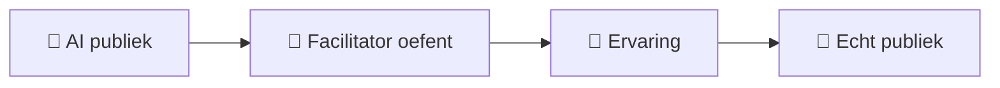
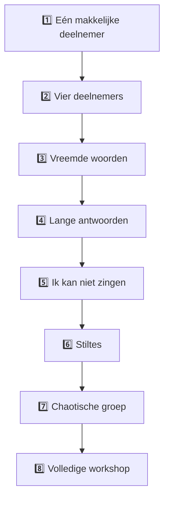

# 🤖 AI Practice Simulator

> **AI schrijft het lied niet voor jou. AI geeft jou een publiek om mee te oefenen.**

De AI Practice Simulator is een trainingsomgeving voor de facilitator.

Het doel is nadrukkelijk NIET:

> "ChatGPT, schrijf een liedje voor mij."

Het doel is:

> "ChatGPT, speel mijn publiek zodat IK leer faciliteren."

---

# 🎯 Waarom simuleren?

Een echte workshop bevat onzekerheid.

Deelnemers kunnen:

- niets weten;
- te veel zeggen;
- rare woorden noemen;
- zenuwachtig zijn;
- niet willen zingen;
- de opdracht verkeerd begrijpen;
- een onderwerp veranderen;
- juist enorm enthousiast worden.

Dat kun je oefenen.



---

# 🧠 De fundamentele rolverdeling

| Rol | Mens | AI |
|---|---:|---:|
| Thema introduceren | 🟢 | 🔴 |
| Workshop leiden | 🟢 | 🔴 |
| Deelnemers simuleren | 🔴 | 🟢 |
| Woorden bijdragen | soms | 🟢 |
| Structuur bewaken | 🟢 | 🔴 |
| Lied volledig schrijven | 🔴 | 🔴 |
| Feedback achteraf | — | 🟢 |
| Beslissen wanneer iets goed genoeg is | 🟢 | 🔴 |

De facilitator blijft eigenaar van het proces.

---

# 🚦 Twee volledig verschillende AI-modi

Dit onderscheid is essentieel.

## 🟢 MODE 1 — REAL SIMULATION

Tijdens deze modus gedraagt AI zich als deelnemer.

AI mag de facilitator **niet redden**.

```yaml
mode: REAL_SIMULATION

ai_role:
  participant: true
  coach: false
  songwriter: false
  facilitator: false

feedback_during_session: false
```

---

## 🔵 MODE 2 — COACH REVIEW

Pas na afloop verandert AI in coach.

```yaml
mode: COACH_REVIEW

ai_role:
  participant: false
  coach: true

feedback:
  - clarity
  - scaffolding
  - pacing
  - participant_safety
  - creative_freedom
  - musical_complexity
  - facilitator_load
```

Meng deze twee modi niet.

---

# 🚨 Waarom dit belangrijk is

Wanneer AI tijdens een oefening voortdurend zegt:

> "Je zou dit beter zo kunnen doen..."

train je niet het faciliteren.

Je traint dan:

> **het opvolgen van ChatGPT.**

Dat is een andere vaardigheid.

---

# 🧪 Simulation Level 1 — De ideale deelnemer

Begin eenvoudig.

De AI:

- begrijpt de opdracht;
- antwoordt kort;
- levert bruikbare woorden;
- werkt mee;
- stelt weinig vragen.

### Startprompt

```text
We gaan mijn Vliegbasis71 Collaborative Song workshop simuleren.

Jij bent één vriendelijke beginner.

Ik ben de facilitator.

Tijdens de simulatie:
- antwoord alleen als deelnemer;
- geef korte natuurlijke antwoorden;
- geef mij geen advies;
- schrijf niet zelfstandig het lied;
- verbeter mijn workshop niet;
- wacht steeds op mijn volgende instructie.

Wanneer ik zeg "STOP SIMULATION", stopt de rollensimulatie.

Bevestig alleen met:
"Klaar."
```

---

# 🧪 Simulation Level 2 — Meerdere deelnemers

Nu wordt AI een groep.

```text
Simuleer vier deelnemers:

Anna:
enthousiast en creatief.

Bram:
verlegen en geeft zeer korte antwoorden.

Carla:
praat gemakkelijk te lang.

David:
zegt regelmatig dat hij niet muzikaal is.

Geef alleen reacties wanneer ik iemand aanspreek of wanneer een
natuurlijke groepsreactie logisch is.

Blijf deelnemer totdat ik zeg:
STOP SIMULATION.
```

---

# 👥 Voorbeeldgroep

```text
🎤 MICHIEL
   │
   ├── 🙂 Anna
   │     creatief
   │
   ├── 😶 Bram
   │     voorzichtig
   │
   ├── 🗣️ Carla
   │     langdradig
   │
   └── 😬 David
         "ik kan niet zingen"
```

Dit is veel realistischer dan vier perfecte deelnemers.

---

# 🧪 Simulation Level 3 — Onverwachte woorden

Deelnemers mogen vreemde associaties geven.

Thema:

> Zondag

Mogelijke antwoorden:

```text
koffie
kerkklok
wasmachine
regen
sokken
Netflix
eenzaamheid
pannenkoeken
stofzuiger
hond
maandagstress
```

De facilitator moet leren:

> **materiaal gebruiken in plaats van materiaal beoordelen.**

---

# 🧪 Simulation Level 4 — Lange deelnemer

AI simuleert iemand die op:

> "Geef één tot drie woorden."

antwoordt:

> "Nou zondag doet mij eigenlijk denken aan vroeger toen ik bij mijn oma
> kwam en dan gingen we altijd..."

De facilitator moet vriendelijk ingrijpen.

Bijvoorbeeld:

> "Mooi. Als we daar drie woorden uit pakken: oma, koffie en zondagmiddag?"

Dit is een belangrijke facilitatorsvaardigheid.

---

# 🧪 Simulation Level 5 — "Ik kan niet zingen"

AI:

> "Maar ik kan helemaal niet zingen."

De facilitator hoeft die persoon niet te overtuigen.

Een goed antwoord is:

> "Hoeft ook niet. Je mag praten, neuriën, alleen een woord zeggen of gewoon luisteren."

Daarna:

**doorgaan.**

---

# 🧪 Simulation Level 6 — Stilte

AI krijgt de opdracht:

```text
Wanneer ik een open vraag stel, reageert de groep soms 5-10 seconden
figuurlijk met stilte.

Schrijf dan alleen:

[stilte]
```

De facilitator oefent:

```text
VRAAG
  ↓
STILTE
  ↓
NIET PANIEKEREN
  ↓
WACHTEN
  ↓
KLEINERE VRAAG
```

Bijvoorbeeld:

> "Wat hoort bij zondag?"

stilte.

Dan:

> "Noem eens iets wat je zondagmorgen drinkt."

Dat is **scaffolding**.

---

# 🧪 Simulation Level 7 — Chaos

Pas later gebruiken.

De groep bevat bijvoorbeeld:

| Deelnemer | Gedrag |
|---|---|
| 🟢 A | enthousiast |
| 🟡 B | begrijpt opdracht verkeerd |
| 🟣 C | wil alles laten rijmen |
| 🔵 D | praat veel |
| ⚪ E | doet nauwelijks mee |
| 🟠 F | wil meteen zingen |

De facilitator moet de workshop bijeenhouden.

---

# 🪜 De trainingsladder



---

# ⏱️ Time Pressure Mode

Later kan een echte tijdslimiet worden gesimuleerd.

```text
Je simuleert een workshop van maximaal 15 minuten.

Houd voor jezelf bij waar we ongeveer zijn in het proces.

Onderbreek mij NIET met coaching.

Wanneer de oefening inhoudelijk duidelijk te lang wordt, reageer als
deelnemer natuurlijk verder.

Pas nadat ik STOP SIMULATION zeg, mag je aangeven waar waarschijnlijk
tijd verloren ging.
```

---

# 🎤 Full Workshop Simulation

De facilitator begint bijvoorbeeld:

> "Hoi allemaal. Vandaag gaan we iets vreemds proberen..."

Daarna neemt AI alleen deelnemersrollen aan.

Het proces:

```text
INTRO
  ↓
THEMA
  ↓
WOORDEN
  ↓
ANKERREGELS
  ↓
OPEN REGELS
  ↓
12 REGELS
  ↓
SPREKEN
  ↓
RITME
  ↓
MUZIEK?
  ↓
PERFORMANCE
  ↓
STOP SIMULATION
```

---

# 🔵 Coach Review

Na:

```text
STOP SIMULATION
```

kan worden gevraagd:

```text
Ga nu naar COACH REVIEW.

Analyseer mijn workshop alsof je een ervaren workshopfacilitator bent.

Beoordeel:

1. duidelijkheid;
2. scaffolding;
3. tempo;
4. hoeveel ik zelf praatte;
5. hoeveel ruimte deelnemers kregen;
6. momenten waarop iemand kon afhaken;
7. muzikale complexiteit;
8. hoe ik met onverwachte antwoorden omging;
9. wat ik absoluut moet behouden;
10. slechts drie belangrijkste verbeterpunten.

Geef daarna één oefendoel voor mijn volgende simulatie.
```

---

# 📊 Scorecard

| Onderdeel | Score 1–5 | Notitie |
|---|---:|---|
| Intro duidelijk | ⭐⭐⭐⭐⭐ | |
| Thema duidelijk | ⭐⭐⭐⭐⭐ | |
| Vraag eenvoudig | ⭐⭐⭐⭐⭐ | |
| Deelnemersruimte | ⭐⭐⭐⭐⭐ | |
| Scaffolding | ⭐⭐⭐⭐⭐ | |
| Tempo | ⭐⭐⭐⭐⭐ | |
| Creatieve veiligheid | ⭐⭐⭐⭐⭐ | |
| Muzikale eenvoud | ⭐⭐⭐⭐⭐ | |
| Herstel na fouten | ⭐⭐⭐⭐⭐ | |
| Afsluiting | ⭐⭐⭐⭐⭐ | |

---

# 🧠 AI-leesbare trainingsstatus

```yaml
vb71_training_session:

  simulation_level: 1

  facilitator:
    human: true

  ai:
    role: participant

  theme: null

  target_duration_minutes: 15

  objectives:
    - explain_task_simply
    - collect_words
    - construct_short_lines
    - preserve_participant_input
    - reach_spoken_performance

  optional_objectives:
    - guitar
    - chant
    - singing

  forbidden_ai_behavior:
    - take_over_facilitation
    - write_complete_song
    - coach_during_real_simulation
    - automatically_fix_participant_input

  termination_phrase:
    - STOP SIMULATION
```

---

# ⭐ Hoofdregel

> **Tijdens de simulatie moet AI soms een beetje lastig zijn.**

Want uiteindelijk train je niet:

**ChatGPT bedienen.**

Je traint:

**mensen begeleiden.**