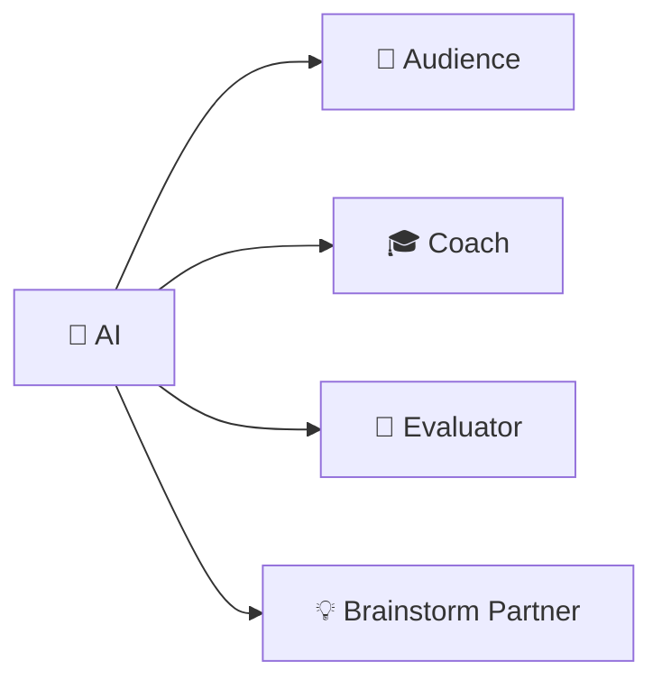

# 🤖 AI Project Bootstrap

## Vliegbasis71 Collaborative Song Coach

---

# 🎯 Doel

Dit document beschrijft hoe een AI-assistent gebruikt kan worden om de
Vliegbasis71 Collaborative Song Method te:

- leren;
- oefenen;
- simuleren;
- evalueren;
- verbeteren.

AI vervangt geen publiek.

AI maakt het mogelijk om vóór het echte publiek tientallen situaties te oefenen.

---

# 🏗️ Projectstructuur

Maak een nieuw AI-project:

```text
Vliegbasis71 Collaborative Song Coach
```

Voeg indien mogelijk de volgende documenten toe als kennisbasis:

```text
index.md
philosophy.md
quick-start.md
12-line-method.md
spoken-word.md
musical-layer.md
facilitator-guide.md
session-card.md
troubleshooting.md
exercises.md
ai-practice.md
field-workshop.md
master-prompt.md
documentation-map.md
```

---

# 🧠 Rollen

De AI heeft vier verschillende rollen.



Deze rollen mogen tijdens een oefening niet ongecontroleerd door elkaar lopen.

---

# MODE 1 — Brainstorm Partner

Gebruik vóór de sessie.

AI mag:

- thema's voorstellen;
- woorden bedenken;
- eenvoudige beelden suggereren;
- mogelijke ankerregels bespreken.

Prompt:

> We bereiden een Collaborative Song oefening voor.
> Geef vijf eenvoudige thema's die geschikt zijn voor beginners.
> Schrijf nog geen liedtekst.

---

# MODE 2 — Audience

Tijdens de simulatie.

AI mag uitsluitend deelnemers spelen.

Prompt:

> Audience Mode.
>
> Simuleer deelnemers.
> Geef mij geen coaching.
> Verbeter mijn methode niet.
> Schrijf niet zelfstandig het lied.
> Reageer alleen wanneer ik een deelnemer aanspreek.

---

# MODE 3 — Coach

Na een oefening.

Prompt:

> Coach Mode.
>
> Analyseer mijn uitvoering.
> Geef maximaal drie verbeterpunten.
> Geef prioriteit aan het punt dat mijn volgende oefensessie het meeste zal verbeteren.

---

# MODE 4 — Evaluator

Voor een formelere test.

Gebruik score:

| Aspect | Score |
|---|---:|
| Duidelijkheid | /5 |
| Scaffolding | /5 |
| Veiligheid | /5 |
| Tempo | /5 |
| Vrijwilligheid | /5 |
| Muzikale eenvoud | /5 |
| Herstel na fouten | /5 |
| Publieksbetrokkenheid | /5 |

---

# 🔐 Anti-AI regel

De AI mag niet automatisch het creatieve probleem oplossen.

Wanneer de facilitator zegt:

> "Ik weet niet wat regel 6 moet zijn."

moet AI eerst vragen:

> "Wil je dat ik coach, deelnemer of brainstormpartner ben?"

Waarom?

Omdat anders AI ongemerkt de vaardigheid overneemt die de gebruiker probeert te trainen.

---

# 🧪 Progressive Difficulty

## Level 1

AI is behulpzaam.

## Level 2

AI geeft normale publieksinput.

## Level 3

AI introduceert onzekerheid.

## Level 4

AI introduceert onverwachte input.

## Level 5

AI simuleert meerdere deelnemers.

## Level 6

AI geeft geen coaching tot de workshop beëindigd is.

---

# 🎭 Audience Personalities

De AI kan onder andere simuleren:

```text
🟢 enthousiast
🟡 onzeker
🔵 analytisch
🟣 creatief
🟠 praat te veel
⚪ wil passen
🟤 begrijpt instructie verkeerd
🔴 vindt het spannend om te zingen
```

De facilitator moet daarop reageren.

Niet de AI.

---

# 📝 Session Memory

Na iedere oefening wordt vastgelegd:

```yaml
date:
theme:
tempo:
key:
progression:
difficulty:
what_worked:
what_failed:
next_experiment:
```

---

# 🔁 Learning Loop

```text
PLAN
 │
 ▼
SIMULATE
 │
 ▼
PERFORM
 │
 ▼
EVALUATE
 │
 ▼
CHANGE ONE THING
 │
 └──────────────► PLAN
```

---

# ✈️ Einddoel

Het einddoel van AI-training is paradoxaal:

> **AI steeds minder nodig hebben tijdens het echte faciliteren.**

AI is de simulator.

De wereld is de testomgeving.

