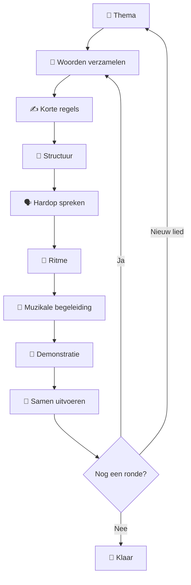
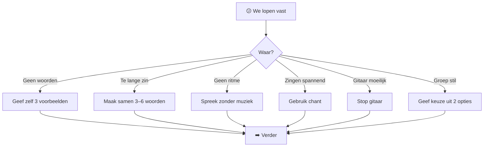
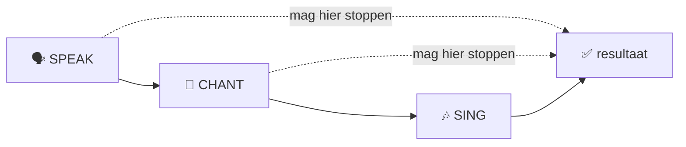
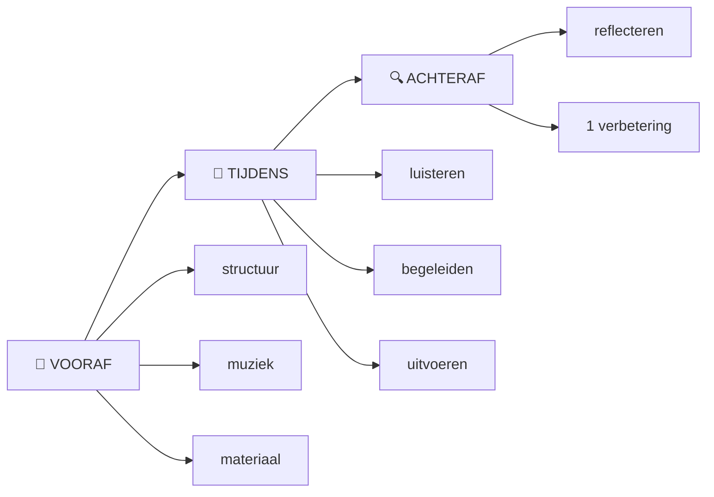
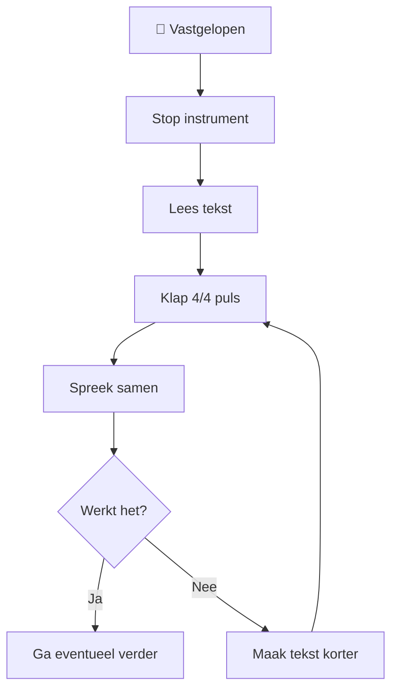
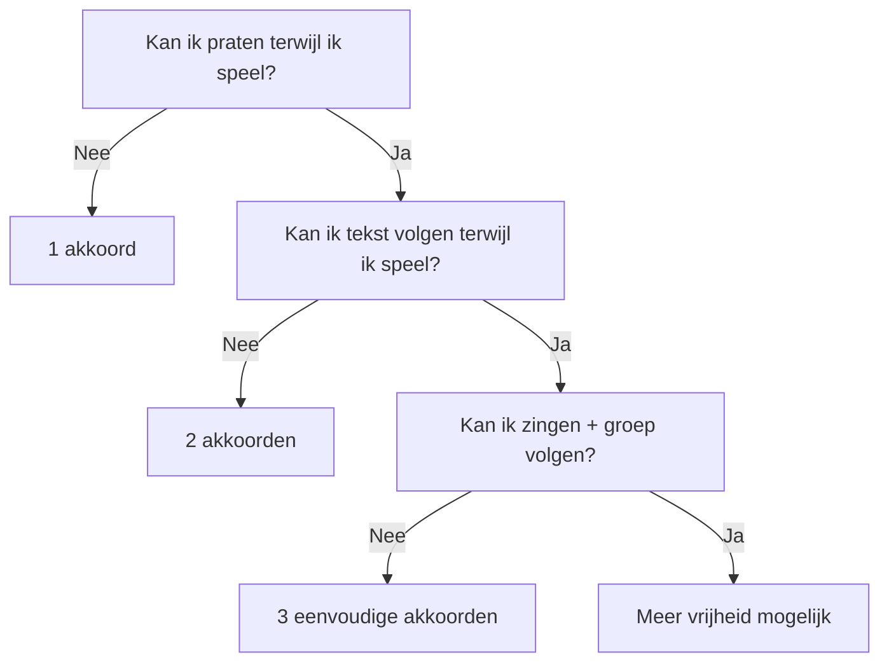
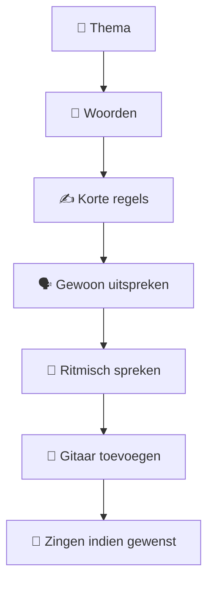
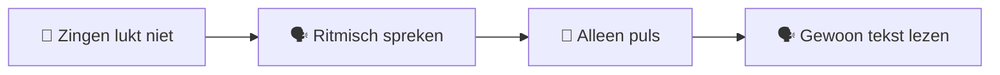
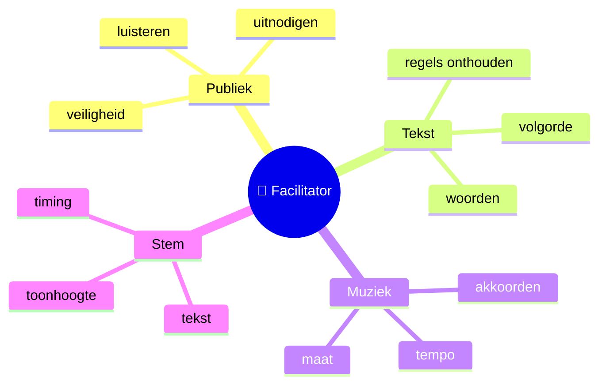
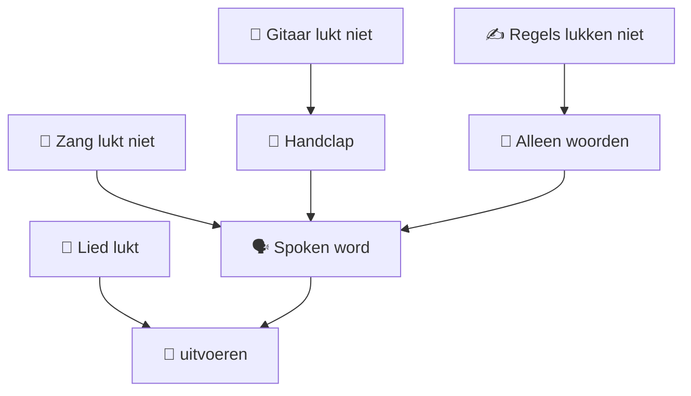

[2026-08-09 16:05 CEST, ID: V7K3M9R2]

Denkpatroon: Ik zie dit niet als “nog een liedjesworkshopdocument”, maar als een nieuwe praktische module bovenop het bestaande Vliegbasis71 Live Song System: een reproduceerbare methode waarmee een beginner samen met een publiek in real time van thema → woorden → korte regels → structuur → ritme → gitaar → gezamenlijke uitvoering gaat. Ik heb ook je repository bekeken: die is al opgezet rond docs/, mkdocs.yml en een gegenereerde site/, dus deze methode kan later logisch als MkDocs-documentatie aan het bestaande systeem worden toegevoegd.  

Antwoord:

Ja, ik begrijp de opdracht. En belangrijk: we gaan nu nog géén Markdown-bestanden produceren. Jij wilt eerst iteratief het ontwerp hard maken. Pas nadat ronde 4 door jou geaccepteerd is, wordt ronde 5 de daadwerkelijke generatie/finalisering van de documentatie.

1. Wat je eigenlijk aan het bouwen bent

De methode die vandaag met Johanneke ontstond is volgens mij groter dan alleen:

“Hoe schrijf ik samen met mensen een liedje?”

Je bouwt een Live Collaborative Song Method voor mensen die geen songwriter, zanger of muzikant hoeven te zijn.

De essentie is:

                 VLIEGBASIS71
             LIVE SONG SYSTEM
                     │
                     ▼
         LIVE COLLABORATIVE SONG
                  METHOD
                     │
       ┌─────────────┼─────────────┐
       ▼             ▼             ▼
   VOORBEREIDEN   CO-CREËREN    UITVOEREN
       │             │             │
     thema          woorden       gitaar
   structuur        regels        ritme
   startregels      verhaal       zang
   akkoorden        ordening      publiek
       │             │             │
       └─────────────┼─────────────┘
                     ▼
                 REFLECTEREN
                     │
                     ▼
               VOLGENDE RONDE

En precies omdat jij zelf nog aan het leren bent om tegelijk gitaar te spelen én te zingen, moet het systeem niet alleen eenvoudig zijn voor het publiek. Het moet ook jouw cognitieve belasting als facilitator/muzikant drastisch verminderen.

Dat vind ik een cruciaal ontwerpprincipe.

⸻

2. De Johanneke-doorbraak moet onderdeel van de methode worden

Je oorspronkelijke neiging was ongeveer:

ter plekke alles bedenken.

Thema kiezen → publiek woorden laten bedenken → ter plekke structuur maken → rijm bedenken → ritme zoeken → gitaar spelen → zingen → publiek meenemen.

Dat is te veel tegelijk.

Johanneke’s sterkste interventie was eigenlijk:

Scaffold het vooraf.

Dus vóórdat je publiek verschijnt, heeft Michiel bijvoorbeeld al:

* 3 mogelijke thema’s;
* een gekozen eenvoudige liedstructuur;
* enkele reservewoorden;
* regels 1, 3, 7 en 11;
* één akkoordprogressie;
* één strumming/arpeggiopatroon;
* tempo;
* eventueel een voorbeeldrefrein.

Het publiek creëert dus niet vanuit een leeg vel.

Het publiek maakt een halfgebouwde raket af.

Dat moet een centraal principe worden.

⸻

3. De screenshots zijn eigenlijk prototype v0.1

Ik lees jouw screenshots als twee afzonderlijke lagen.

Laag A — structuur

Je eerste afbeelding definieert ongeveer:

01  X - X - X
02  X - X - X
03  X - X - X
04  X - X - X
05  X - X - X
06  X - X - X
07  X - X - X
08  X - X - X
09  X - X - X
10  X - X - Y
11  X - X - X
12  Y - Y - X - Y

Dat is nog geen muzieknotatie. Het is een taalcontainer.

Dat onderscheid moeten we bewaren.

Eerst wordt taal georganiseerd. Pas daarna leggen we muziek eronder.

Laag B — concrete invulling

Thema:

Zondag

Brainstorm:

rust — koffie — croissant — ventilator — ontbijt — kattenvoer — stofzuiger — wandelen — vogelzang — muggen

Daarna ontstaat:

1. wakker - met - koffie
2. aan - tafel - ontbijt
3. vogelzang - in - hoofd
4. muggen - op - huid
5. straks - lekker - wandelen
6. rust - met - gemak
7. aan - de - telefoon
8. kletsen - met - koffie
9. koken - in - keuken
10. kattenvoer - in - bak
11. klaar - met - dag
12. ready - voor - nieuwe - dag

Dat is precies het soort eenvoud dat je nodig hebt.

Niet:

“Schrijf nu vier jambische regels met ABAB-eindrijm.”

Maar:

“Geef mij drie woorden over zondag.”

Dat kan bijna iedereen.

⸻

4. Ik zou de methode voorlopig in zeven fasen modelleren

Nog niet als definitieve structuur, maar als werkmodel voor onze volgende reviews:

FASE 0 — PREP
   │
   ├── thema's voorbereiden
   ├── startregels voorbereiden
   ├── akkoordprogressie kiezen
   ├── ritme kiezen
   └── backupmateriaal
   │
   ▼
FASE 1 — THEMA
   │
   └── waar gaat ons liedje over?
   │
   ▼
FASE 2 — WOORDEN
   │
   └── iedereen levert 1–3 woorden
   │
   ▼
FASE 3 — REGELS
   │
   └── woorden → ultrakorte zinnen
   │
   ▼
FASE 4 — STRUCTUUR
   │
   └── 12 regels ordenen
   │
   ▼
FASE 5 — MUZIEK
   │
   ├── vaste akkoorden
   ├── vast ritme
   └── woorden passend maken
   │
   ▼
FASE 6 — LIVE
   │
   ├── Michiel demonstreert
   ├── publiek probeert
   └── gezamenlijk uitvoeren
   │
   ▼
FASE 7 — ITERATIE
       ├── nogmaals?
       ├── nieuw thema?
       └── moeilijkheid +1?

Dat laatste is belangrijk.

Het systeem moet loops hebben.

Je hoeft na liedje één niet ineens naar moeilijke songwriting te springen.

Je kunt gewoon zeggen:

“Nog eentje?”

Nieuw thema. Zelfde structuur. Zelfde E/C-achtige eenvoudige akkoordenset. Zelfde ritme.

Dat is juist oefenen.

⸻

5. Jouw persoonlijke leerpad moet parallel lopen

Dit is volgens mij een tweede spoor dat absoluut in de documentatie thuishoort.

Je workshopvaardigheid en muzikale vaardigheid zijn namelijk niet hetzelfde.

       WORKSHOP                         MUZIEK
          │                               │
woorden verzamelen                  akkoord spelen
          │                               │
regels begeleiden                   ritme vasthouden
          │                               │
groep begeleiden                    hardop tekst spreken
          │                               │
structuur bewaken                   zingen
          │                               │
improviseren                        zingen + spelen
          │                               │
publiek meenemen                    publiek + spelen + zingen
          └──────────────┬────────────────┘
                         ▼
                 LIVE FACILITATOR

En je hoeft niet bovenaan te beginnen.

Jouw oefenladder kan bijvoorbeeld worden:

niveau 1: gitaar alleen
niveau 2: tekst ritmisch spreken zonder gitaar
niveau 3: zingen zonder gitaar
niveau 4: gitaar + één gesproken regel
niveau 5: gitaar + eenvoudige zang
niveau 6: volledig liedje
niveau 7: liedje terwijl iemand anders meedoet
niveau 8: kleine oefengroep
niveau 9: Toastmasters
niveau 10: onbekende deelnemers / park.

Dat voorkomt dat het project afhankelijk wordt van: “Eerst moet ik goed kunnen zingen en gitaar spelen.”

Nee.

Je kunt morgen al niveau 1–3 oefenen.

⸻

6. ChatGPT krijgt daarin een expliciete rol

Dit heb ik heel duidelijk uit je opdracht gehaald.

Je wilt mij eerst gebruiken als gesimuleerd publiek.

Niet als AI die alles voor je schrijft.

Dat verschil is essentieel.

In oefenmodus kan het ongeveer zo werken:

MICHIEL
   │
   │ "We gaan oefenen."
   ▼
CHATGPT = PUBLIEK
   │
   ├── geeft thema-opties
   │
   ▼
MICHIEL kiest thema
   │
   ▼
CHATGPT geeft publiekswoorden
   │
   ▼
MICHIEL faciliteert
   │
   ▼
CHATGPT speelt deelnemers
   │
   ├── makkelijke bijdrage
   ├── rare bijdrage
   ├── deelnemer zonder idee
   └── onverwacht woord
   │
   ▼
MICHIEL bouwt regels
   │
   ▼
CHATGPT geeft feedback
   │
   ▼
MICHIEL speelt het

Dat vind ik zelfs beter dan wanneer ik onmiddellijk twaalf perfecte regels genereer.

Want dan oefen jij niets.

Later kunnen we verschillende simulatiemodi maken:

Easy audience — behulpzaam en voorspelbaar.

Normal audience — verschillende soorten bijdragen.

Chaotic audience — iemand begrijpt de opdracht niet, iemand geeft zes woorden, iemand wil niet meedoen, iemand komt met “belastinginspecteur” terwijl het thema romantiek is.

Die laatste modus wordt uiteindelijk ontzettend nuttig voor live voorbereiding.

⸻

7. Gitaar moet bewust simpel blijven

Je noemt een eenvoudige E/C-manier akkoordprogressie en een bekend arpeggio/ritmepatroon.

Ik begrijp daaruit vooral het ontwerpprincipe:

Muziek ondersteunt de taal; muziek mag de facilitator niet bezighouden.

Dus aanvankelijk geen:

* ingewikkelde akkoordwisselingen;
* improvisatiesolo’s;
* complexe fingerstyle;
* onverwachte maatwisselingen;
* moeilijke melodieën.

Wel:

4/4
↓
langzaam/middeltempo
↓
bekende akkoordvormen
↓
repeterend patroon
↓
zelfde patroon gedurende vrijwel hele lied

Want jouw brein moet capaciteit overhouden voor:

publiek → woorden → timing → zang → groepsdynamiek.

⸻

8. De uiteindelijke documentatieset

Na goedkeuring van ronde 4 verwacht ik niet één gigantische README.md, maar een kleine, bruikbare documentatiestructuur die aansluit op de bestaande MkDocs-repository. De repository bevat momenteel inderdaad een docs-directory en mkdocs.yml, dus technisch past dit goed bij wat er al staat.  

Conceptueel denk ik aan iets als:

docs/
└── live-collaborative-song/
    │
    ├── index.md
    ├── methodology.md
    ├── facilitator-preparation.md
    ├── workshop-step-by-step.md
    ├── beginner-song-template.md
    ├── guitar-and-rhythm.md
    ├── chatgpt-practice-mode.md
    ├── audience-simulation.md
    ├── practice-plan.md
    ├── troubleshooting.md
    └── examples/
        └── zondag.md

Nog niet definitief. Dat gaan we juist reviewen.

⸻

9. En daarnaast komt de grote projectprompt

Je wilt bovendien een zelfstandige uitgebreide prompt waarmee je een nieuw ChatGPT Project kunt starten.

Die prompt moet voldoende context bevatten dat een nieuwe ChatGPT niet eerst deze hele conversatie hoeft te kennen.

Die krijgt dus onder andere:

IDENTITEIT
Vliegbasis71 Live Song System
DOEL
live collaborative songwriting leren
ROL CHATGPT
coach + publiek + simulator + reviewer
ROL MICHIEL
facilitator + beginnende live muzikant
METHODE
thema → woorden → regels → structuur → muziek → performance
BEGINNERSPRINCIPE
scaffolding boven improvisatie
MUZIKALE BEPERKINGEN
eenvoudige gitaar
4/4
repeterende patronen
SIMULATIEMODI
easy / normal / chaotic
OEFENPROTOCOL
één vaardigheid tegelijk
OUTPUT
Markdown / MkDocs-compatible
INTERACTIEREGELS
AI doet niet automatisch het creatieve werk voor Michiel

Die prompt mag inderdaad uitgebreid worden — rond jouw genoemde orde van grootte van circa 4.000 woorden als dat nodig blijkt.

⸻

10. De reviewcyclus heb ik zo begrepen

En hier wil ik strikt aan vasthouden:

NU
│
└── Begripscontrole       ← huidige antwoord
        │
        ▼
RONDE 1
Algemene inhoudelijke feedback
        │
        ▼
RONDE 2
Verbeterpunten + aangepast model
        │
        ▼
RONDE 3
Tweede kritische review
+ verdere vereenvoudiging
        │
        ▼
RONDE 4
Definitief ontwerp ter acceptatie
        │
        ▼
      JIJ:
   GO / NO-GO
        │
        ▼
RONDE 5
FINALISERING
        │
        ├── alle Markdown
        ├── MkDocs structuur
        ├── oefeningen
        ├── templates
        ├── voorbeeld "Zondag"
        ├── ChatGPT simulator
        ├── persoonlijke leerroute
        └── standalone projectprompt

En na jouw GO op ronde 4 ga ik niet opnieuw om toestemming vragen voor ieder Markdown-bestand. Dan is de architectuur goedgekeurd en genereer ik de afgesproken set.

Het einddoel is dus niet dat je maanden documentatie zit te ontwerpen voordat er ooit muziek klinkt. Juist andersom: de documentatie moet ervoor zorgen dat je deze week kunt oefenen, daarna met een paar mensen kunt testen en uiteindelijk letterlijk ergens kunt gaan staan en zeggen: “Gee my drie woorde — ons maak nou ’n liedjie.”

Dat is wat ik uit je opdracht begrijp.

⁠Vliegbasis71 Live Song System op GitHub

---

[2026-08-09 16:09 CEST, ID: Q6M3K8R2]

Denkpatroon: Akkoord. We behandelen dit nu als een klein ontwikkelproject: eerst de methode werkend krijgen, daarna pas documenteren. De bestaande repository heeft al docs/, site/ en mkdocs.yml, dus bij de documentatiefase kunnen we rechtstreeks aansluiten op de huidige MkDocs-structuur.  

Antwoord:

Ik heb ook vastgelegd dat ik je bij de Markdown/MkDocs-stap moet herinneren aan onze afspraak: pas na jouw acceptatie van ronde 4 gaan we in ronde 5 in één keer de documentatieset genereren.

Ordelijk stappenplan

VLIEGBASIS71 — LIVE COLLABORATIVE SONG METHOD
│
├── RONDE 1  ← NU
│   Methode functioneel ontwerpen
│
├── RONDE 2
│   Problemen / cognitieve belasting verwijderen
│
├── RONDE 3
│   Praktijksimulatie met ChatGPT
│
├── RONDE 4
│   Definitieve methode + acceptatie
│
└── RONDE 5
    Markdown + MkDocs + Project Prompt

Ronde 1 — van idee naar werkbare methode

Ik zou nog vóór muziek beginnen. We moeten eerst bewijzen dat het taalspel werkt.

Stap 0 — facilitator bereidt voor

Voor iedere oefensessie leg jij vooraf klaar:

THEMA: Zondag
Reservewoorden:
koffie
wandelen
rust
ontbijt
zon
vogels
Vooraf ingevulde ankerregels:
1.  wakker met koffie
3.  vogelzang in hoofd
7.  aan de telefoon
11. klaar met dag
Muziek:
4/4
eenvoudig tempo
1 vaste akkoordprogressie
1 vast speelpatroon

Dat is Johanneke’s scaffolding-principe: jij hoeft tijdens de workshop niet tegelijkertijd de fundering én het huis te bouwen.

Stap 1 — kies één thema

Voor de eerste oefeningen géén volledig vrije keuze.

Jij hebt bijvoorbeeld drie kaarten:

ZONDAG
ZOMER
REIZEN

Publiek kiest er één.

Later kunnen deelnemers zelf thema’s verzinnen.

Stap 2 — woorden oogsten

De instructie moet bijna kinderlijk eenvoudig zijn:

“Noem één tot drie woorden waaraan jij bij zondag denkt.”

Geen rijm. Geen liedtekst. Geen muzikaal denken.

Bijvoorbeeld:

koffie
uitslapen
strand
kat
croissant
wandelen
familie
regen
telefoon

Stap 3 — woorden naar microzinnen

Nu komt pas de taalconstructie.

Bijvoorbeeld:

koffie + wakker
→ wakker met koffie
strand + wandelen
→ wandelen langs strand
kat + eten
→ kattenvoer in bak

Doel: meestal ongeveer 3–5 woorden per regel.

Stap 4 — vul de 12-regelige container

Daarvoor gebruiken we jouw prototype:

1.  ANKERREGEL
2.  publiek
3.  ANKERREGEL
4.  publiek
5.  publiek
6.  publiek
7.  ANKERREGEL
8.  publiek
9.  publiek
10. publiek / kleine variatie
11. ANKERREGEL
12. gezamenlijke afsluiting

Hiermee hoeven deelnemers nooit tegen een leeg vel aan te kijken.

Stap 5 — eerst spreken, nog niet zingen

Dit lijkt mij essentieel.

De groep spreekt eerst ritmisch:

wakker — met — koffie
aan — tafel — ontbijt

Pas wanneer de woorden lekker lopen, komt muziek erbij.

Dus:

TEKST
 ↓
SPREKEN
 ↓
RITMISCH SPREKEN
 ↓
GITAAR ERONDER
 ↓
MEEPRATEN
 ↓
PAS DAN ZINGEN

Hiermee scheiden we problemen van elkaar.

Stap 6 — Michiel demonstreert de muzikale motor

Je gebruikt één akkoordprogressie die je praktisch automatisch kunt spelen.

Niet tijdens de workshop bedenken.

Je speelt eerst alleen de gitaar:

“Dit is het ritme.”

Daarna spreek je de tekst eroverheen.

Daarna zing je hem.

Het publiek hoeft aanvankelijk alleen maar te luisteren.

Stap 7 — call-and-response

Dit kan jouw eerste brug naar gezamenlijk zingen worden.

Jij:

Wakker met koffie…

Publiek:

Wakker met koffie…

Jij:

Aan tafel ontbijt…

Publiek:

Aan tafel ontbijt…

Dat is waarschijnlijk veel eenvoudiger dan:

“Oké allemaal, zing nu het hele lied.”

Stap 8 — één gezamenlijke uitvoering

Nu pas:

gitaar
   +
Michiel
   +
publiek
   +
12 regels
   =
LIEDJIE #1

Perfectie doet er niet toe.

Het bewijs is:

tien minuten geleden bestond dit liedje niet.

Dat is volgens mij zelfs het magische moment van het concept.

Stap 9 — onmiddellijk tweede liedje

En dit is pedagogisch interessant.

Niet vervolgens twintig minuten analyseren.

Gewoon:

“Mooi. Nog een. Nieuw thema.”

De tweede ronde gebruikt exact dezelfde structuur en muziek.

Daardoor hoeft het brein alleen nieuwe taal te verwerken.

⸻

Parallel: jouw persoonlijke oefenprogramma

Je hoeft dus niet te wachten totdat je zingen+gitaar volledig beheerst.

OEFENING A
12 regels hardop lezen
        ↓
OEFENING B
regels ritmisch spreken
        ↓
OEFENING C
gitaar zonder stem
        ↓
OEFENING D
gitaar + spreken
        ↓
OEFENING E
gitaar + één gezongen regel
        ↓
OEFENING F
4 regels zingen
        ↓
OEFENING G
12 regels
        ↓
OEFENING H
ChatGPT-publiek
        ↓
OEFENING I
één echt persoon
        ↓
OEFENING J
kleine groep

En hier wil ik een belangrijk principe invoeren:

Never increase two difficulties at once.

Als je nieuwe akkoorden oefent → bekende tekst.

Als je nieuwe tekst improviseert → bekende akkoorden.

Als je voor het eerst publiek begeleidt → bekend liedformat.

Als je voor het eerst in een park staat → géén nieuwe muzikale techniek.

Dat kan een kernregel van Vliegbasis71 worden.

Ronde 1 heeft daarom één concrete eindtest

Voordat we naar ronde 2 gaan, moet jij met mij daadwerkelijk één volledige simulatie uitvoeren.

Niet erover praten.

Doen.

Ik word dan het publiek en jij bent facilitator.

Ik geef bewust geen perfecte songwriter-antwoorden. Ik gedraag me als een normaal nieuwsgierig persoon.

Onze test:

1. Jij opent de workshop.
2. Jij geeft mij 2–3 thema's.
3. Ik kies.
4. Jij vraagt woorden.
5. Ik geef woorden.
6. Jij begeleidt mij naar korte regels.
7. We vullen jouw 12-regelige template.
8. Jij kiest je muziek.
9. Jij vertelt hoe je hem zou uitvoeren.
10. We evalueren waar jij vastliep.

Dat wordt onze eerstvolgende stap.

Daarna begint ronde 2 niet vanuit theorie, maar vanuit bewijs: waar werd het werkelijk moeilijk?

En wanneer we uiteindelijk bij RONDE 5 — Markdown/MkDocs aankomen, herinner ik je expliciet aan de afspraak voordat de documentgeneratie begint. De output wordt dan passend gemaakt voor de bestaande Vliegbasis71-repository en GitHub Pages/MkDocs-opzet.  

⁠Vliegbasis71 Live Song System

---

[2026-08-09 16:14 CEST, ID: H4R8K2M7]

Denkpatroon: Ronde 1 staat inhoudelijk. De volgende stap is daarom niet nóg meer ontwerpen, maar de methode veranderen in een oefenbaar protocol. We maken eerst de simulator waarmee jij zonder publiek kunt trainen; daarna gebruiken we wat daar fout of stroef gaat als input voor ronde 2.

Antwoord:

Deel 2 — Vliegbasis71 oefenprotocol met ChatGPT-publiek

Dit wordt de brug tussen “ik heb een gaaf idee” en “ik kan dit daadwerkelijk voor zes onbekende mensen uitvoeren.”

1. Drie verschillende oefenrollen voor ChatGPT

Ik wil voorkomen dat ChatGPT stiekem jouw workshop overneemt. Daarom krijgt AI drie expliciete rollen:

                    CHATGPT
                       │
          ┌────────────┼────────────┐
          ▼            ▼            ▼
       PUBLIEK       COACH       REVIEWER
          │            │            │
      reageert       helpt pas     analyseert
      als mens        wanneer       achteraf
                     gevraagd

Tijdens een simulatie mag ik maar één rol tegelijk hebben.

A. Publiek-modus

Jij bent facilitator.

Ik ben deelnemer.

Als jij vraagt:

“Waar denk je aan bij zondag?”

dan antwoord ik bijvoorbeeld:

“Koffie, uitslapen en mijn fiets.”

Niet:

“Hier zijn twaalf prachtig metrisch passende songregels in ABAB-structuur.”

Want daarmee verpest AI jouw oefening.

B. Coach-modus

Jij kunt de simulatie tijdelijk stoppen:

“Coach, ik loop vast.”

Dan help ik bijvoorbeeld:

“Je hebt al fiets, zon en straat. Vraag je deelnemer nu één korte zin met fiets.”

Daarna:

“Publiek-modus.”

En ik word weer deelnemer.

C. Reviewer-modus

Pas na de oefening analyseren we:

* waar liep je vast?
* welke instructie was onduidelijk?
* wat kostte te veel denkwerk?
* welke voorbereiding ontbrak?
* waar hielp scaffolding?
* wat moet simpeler?

Dat levert echte ontwerpdata op voor ronde 2.

⸻

2. Moeilijkheidsniveaus

We gaan niet onmiddellijk een chaotische groep simuleren.

Niveau 1 — vriendelijke beginner

De deelnemer begrijpt alles en geeft bruikbare antwoorden.

Bijvoorbeeld:

Michiel: Geef drie woorden over zomer.

Publiek: Zon, strand, ijsje.

Dit niveau gebruik jij om jouw proces te leren.

⸻

Niveau 2 — normale deelnemer

Sommige antwoorden zijn minder bruikbaar.

Zon, vakantie, ehhh… gezellig?

Jij moet daar iets mee kunnen zonder dat ik mezelf corrigeer.

⸻

Niveau 3 — echte groep

Ik simuleer bijvoorbeeld vier mensen:

ANNA
"strand, zon, vrienden"
PETER
"bier"
FATIMA
"warme avond en familie"
JAN
"ik weet eigenlijk niks"

Nu moet jij faciliteren.

Niet componeren.

⸻

Niveau 4 — rommelig publiek

Daar wordt het leuk.

Iemand praat te lang.

Iemand wil rijmen terwijl dat nog niet hoeft.

Iemand zegt:

“Kunnen we niet gewoon Bohemian Rhapsody doen?”

Een ander wil niet zingen.

Iemand begrijpt de opdracht verkeerd.

Jouw taak is dan vriendelijk terugsturen:

“Prima, bier houden we. Eén woord is genoeg.”

⸻

Niveau 5 — live stress test

Pas veel later.

Daar simuleer ik bijvoorbeeld:

8 deelnemers
│
├── 2 enthousiast
├── 2 verlegen
├── 1 dominante prater
├── 1 muzikant die alles beter weet
├── 1 persoon die niet wil zingen
└── 1 persoon die halverwege aansluit

Als je dát soepel kunt begeleiden, wordt een park waarschijnlijk gemakkelijker dan de simulator. 😛

⸻

3. Jouw vaste facilitator-script

Hier zit volgens mij nog een belangrijke verbetering.

Je moet niet iedere workshop opnieuw bedenken wat je gaat zeggen.

Je openingsinstructie moet bijna automatisch worden.

Bijvoorbeeld:

“Ons gaan saam iets maak. Jy hoef nie te kan sing nie en jy hoef niks van musiek te weet nie. Ek vra net ’n paar eenvoudige woorde. Daaruit maak ons kort sinne, ek sit ’n eenvoudige ritme daaronder en dan kyk ons wat gebeur.”

Voor Nederlandstalig publiek uiteraard Nederlands.

Daarna één concrete opdracht:

“Noem één tot drie woorden die bij het thema passen.”

Meer uitleg is op dat moment waarschijnlijk contraproductief.

⸻

4. De 12 regels worden jouw vangrail

Ik zou Johanneke’s scaffolding nog iets verder doorvoeren.

Je hoeft aanvankelijk niet eens alle twaalf regels live door deelnemers te laten maken.

Beginner facilitator — versie A

1.  MICHIEL       ← vooraf
2.  publiek
3.  MICHIEL       ← vooraf
4.  publiek
5.  MICHIEL       ← eventueel vooraf
6.  publiek
7.  MICHIEL       ← vooraf
8.  publiek
9.  MICHIEL       ← reserve
10. publiek
11. MICHIEL       ← vooraf
12. SAMEN

Je hebt dus een escape route.

Als deelnemers fantastisch gaan:

laat ze meer maken.

Als het moeizaam gaat:

gebruik je voorbereide regel.

Dat betekent dat de workshop vrijwel niet kan vastlopen.

Later:

Ervaren facilitator — versie B

1. Michiel
2–6 publiek
7. Michiel
8–10 publiek
11–12 publiek

En uiteindelijk:

Gevorderd — versie C

Alle regels live.

⸻

5. Muzikaal bouwen we dezelfde veiligheid in

Ik zou voor jouw eerste experiment één muzikale motor kiezen en daar voorlopig niet vanaf wijken.

Bijvoorbeeld conceptueel:

4/4
│
├── vast BPM
│
├── 4 eenvoudige akkoorden
│
├── steeds dezelfde progression
│
└── steeds hetzelfde strumming/
    arpeggiopatroon

Liedje 1: zondag.

Zelfde muziek.

Liedje 2: vakantie.

Zelfde muziek.

Liedje 3: Den Haag.

Zelfde muziek.

Daarmee train jij feitelijk niet drie liedjes.

Je traint één muzikaal platform waarop steeds andere taal landt.

Dat past bovendien uitstekend bij het bredere Live Song System: de repository positioneert het project al als een systeem rond live songwriting/performance; deze methode wordt daarmee een concrete interactieve workflow binnen dat grotere concept.

⸻

6. Specifiek probleem: zingen + spelen

Hier moeten we streng zijn.

Je schreef:

ik kan apart sing, ik kan apart speel, maar nog niet tegelijk.

Dan moet onze methode niet doen alsof je dat al kunt.

We ontleden het.

FASE A
Gitaar:
E  →  ?  →  ?  →  ?
100% automatisch
        │
        ▼
FASE B
Gitaar spelen
+
hardop tellen
"1 2 3 4"
        │
        ▼
FASE C
Gitaar
+
woorden spreken
        │
        ▼
FASE D
Gitaar
+
één toon zingen
        │
        ▼
FASE E
Gitaar
+
één regel zingen
        │
        ▼
FASE F
vier regels
        │
        ▼
FASE G
volledig lied

Ik vermoed dat spreken over gitaar voor jouw concept veel belangrijker gaat worden dan het nu lijkt.

Want daarmee kun je al een spoken-word-workshop uitvoeren voordat zang volledig lukt.

Zang wordt vervolgens een uitbreiding.

Dat betekent:

Vliegbasis71 hoeft niet te wachten op Michiel-de-zanger.

⸻

7. En nu komt het belangrijkste: daadwerkelijke test #1

Vanaf mijn volgende beurt kunnen we stoppen met ontwerpen.

Jij gaat de workshop geven.

Ik ga niets verbeteren tenzij je COACH zegt.

Simulatieconfiguratie #001

Facilitator : Michiel
Publiek     : ChatGPT
Niveau      : 1 — vriendelijke beginner
Personen    : 1
Ervaring    : geen songwriting
Muzikaal    : geen
Doel        : 12-regelig mini-lied
Tijdsdoel   : later ≤ 15 minuten
Thema       : door facilitator te kiezen
AI-regel    : geen ongevraagd helpen

Jij begint dus alsof ik tegenover je zit.

Bijvoorbeeld niet tegen ChatGPT praten, maar tegen een deelnemer:

“Hoi, we gaan iets proberen…”

Vanaf dat moment ben ik gewoon je publiek.

Wanneer jij COACH schrijft, bevriezen we de oefening en help ik.

Wanneer jij REVIEW schrijft, beëindigen we hem en analyseren we hem.

Wanneer jij RESET schrijft, beginnen we opnieuw.

Wat we na test #1 meten

             TEST #001
                 │
        ┌────────┼─────────┐
        ▼        ▼         ▼
     TAAL      PROCES     MICHIEL
        │        │         │
 begrijpelijk? volgorde?  stress?
 te moeilijk?  tempo?     vastlopen?
        │        │         │
        └────────┼─────────┘
                 ▼
           RONDE 2 INPUT

En pas daarna gaan we methodiek v0.2 ontwerpen.

Dat voorkomt precies het gevaar waar je vaker tegenaan loopt bij interessante projecten: een schitterende architectuur bouwen voor iets wat nog geen enkele keer daadwerkelijk uitgevoerd is.

Dus vanaf hier is mijn volgende rol simpel:

jij bent de workshopbegeleider; ik ben deelnemer nummer één.

⁠Vliegbasis71 Live Song System repository


# chat
[2026-08-09 16:14 CEST, ID: H4R8K2M7], [2026-08-09 16:09 CEST, ID: Q6M3K8R2] 100% akkord, ja echt goed!
Ga door met de volgende deel. ga zo door, je snapt het helemaal! :)   

[2026-08-09 16:18 CEST, ID: N8K4R2M7]

Denkpatroon: We hebben nu het concept én het oefenprotocol. De volgende logische laag is Ronde 2: verbeterpunten en operationalisering: precies bepalen wat jij vooraf voorbereidt, wat live ontstaat, wat ChatGPT wel/niet doet en hoe we voorkomen dat muziek, taal en faciliteren tegelijk te zwaar worden. Ik heb ook de repository opnieuw bekeken: er staat al een docs/, site/ en mkdocs.yml, dus onze latere documentatie kan rechtstreeks aansluiten op de bestaande MkDocs-structuur.  

Antwoord:

Ronde 2 — Van concept naar uitvoerbare Vliegbasis71-methodiek

Ik zie inmiddels vier systemen die tegelijkertijd moeten werken:

Vliegbasis71 Live Song Workshop
│
├── 1. FACILITATOR
│      ├── instructies geven
│      ├── groep begeleiden
│      └── tempo bewaken
│
├── 2. TAAL
│      ├── thema
│      ├── woorden
│      ├── korte regels
│      └── 12-regelige structuur
│
├── 3. MUZIEK
│      ├── akkoordprogressie
│      ├── ritme
│      ├── zang / spoken word
│      └── gezamenlijke uitvoering
│
└── 4. VEILIGHEID / SPEL
       ├── vrijwillige deelname
       ├── geen muzikale kennis nodig
       ├── fouten zijn toegestaan
       └── resultaat hoeft niet "goed" te zijn

De belangrijkste ontwerpregel wordt:

Niet alle vier systemen tegelijk improviseren.

Dat is volgens mij dé verbetering voor versie 0.2.

⸻

1. De 70/30-regel

Voor jouw eerste workshops zou ik ongeveer 70% vooraf vastzetten en 30% live laten ontstaan.

Dat lijkt misschien tegenstrijdig met improvisatie, maar juist daardoor ontstaat speelruimte.

Vooraf vast

Jij bepaalt:

* thema;
* tempo;
* toonsoort;
* akkoordprogressie;
* gitaarpatroon;
* regels 1, 3, 7 en 11;
* workshopinstructie;
* maximaal aantal regels;
* tijdslimiet;
* noodoplossingen.

Live

Het publiek bepaalt:

* associaties;
* woorden;
* regels 2, 4, 5, 6, 8, 9, 10 en 12;
* eventueel kleine tekstwijzigingen;
* uiteindelijk de energie van de uitvoering.

Dus:

VOORBEREIDING                 LIVE
──────────────                ────
thema ───────────────────────► associaties
muzikale motor ──────────────► woorden
regel 1 ─────────────────────► regel 2
regel 3 ─────────────────────► regels 4-6
regel 7 ─────────────────────► regels 8-10
regel 11 ────────────────────► regel 12
ritme ───────────────────────► tekst aanpassen
structuur ───────────────────► gezamenlijk resultaat

Dat is geen valsspelen.

Dat is scaffolding.

En precies dat was volgens mij Johanneke’s sterkste bijdrage.

⸻

2. Maak niet eerst een liedje — maak eerst een speelbaar prototype

Jouw screenshot bevat eigenlijk al prototype #001.

Thema:

Zondag

Woorden:

rust, koffie, croissant, ventilator, ontbijt, kattenvoer, stofzuiger, wandelen, vogelzang, muggen

Daaruit ontstond ongeveer:

wakker met koffie
aan tafel ontbijt
vogelzang in hoofd
muggen op huid
straks lekker wandelen
rust met gemak
aan de telefoon
kletsen met koffie
koken in keuken
kattenvoer in bak
klaar met dag
ready voor nieuwe dag

Nu moeten we nog helemaal niet gaan optimaliseren of dat geweldige poëzie is.

Het prototype heeft een andere testvraag:

Kan Michiel dit comfortabel ritmisch uitvoeren?

Dat is alles.

⸻

3. Muzikale Prototype A

Voor de eerste oefeningen wil ik het muzikaal bijna belachelijk eenvoudig houden.

Bijvoorbeeld:

E – A – B – A

of, wanneer vier open akkoorden comfortabeler blijken:

E – A – D – A

We hoeven nu nog niet eens te besluiten welke definitief wordt.

Belangrijker:

| E       | A       | B       | A       |
| 1 2 3 4 | 1 2 3 4 | 1 2 3 4 | 1 2 3 4 |

Eerst alleen spelen.

20×.

Dan:

één – twee – drie – vier

erboven praten.

Daarna:

wakker – met – koffie

erboven.

En pas daarna zingen.

⸻

4. Er ontstaat hierdoor een veel betere leerladder

Niet:

lied schrijven
      ↓
gitaar pakken
      ↓
zingen
      ↓
HELP

Maar:

LEVEL 0
akkoorden automatisch spelen
        │
        ▼
LEVEL 1
spelen + tellen
        │
        ▼
LEVEL 2
spelen + spreken
        │
        ▼
LEVEL 3
spelen + ritmisch spreken
        │
        ▼
LEVEL 4
spelen + één toon zingen
        │
        ▼
LEVEL 5
spelen + eenvoudige melodie
        │
        ▼
LEVEL 6
publiek zingt / spreekt mee
        │
        ▼
LEVEL 7
live woorden verzamelen
        │
        ▼
LEVEL 8
live nieuwe tekst uitvoeren

Dat laatste is jouw uiteindelijke parkconcept.

Maar Level 2 is al een werkende Vliegbasis71-workshop.

Dat vind ik belangrijk.

Je hoeft dus niet te wachten totdat zingen + spelen perfect lukt.

⸻

5. Spoken word wordt een officiële modus

Dat zou ik nu expliciet aan de methodiek toevoegen.

Vliegbasis71 krijgt minstens drie uitvoeringsvormen:

Mode A — Spoken Rhythm

Gitaar speelt.

Tekst wordt ritmisch gesproken.

Publiek kan onmiddellijk deelnemen.

Mode B — Chant / mantra

Heel kleine toonafstand.

Bijvoorbeeld praktisch bijna:

wak-ker met kof-fie 🎵

Eén of twee tonen.

Mode C — Song

Eenvoudige melodie boven dezelfde akkoordprogressie.

Dat geeft een prachtige progressie:

SPREKEN
   │
   ▼
RITMISCH SPREKEN
   │
   ▼
CHANT
   │
   ▼
ZINGEN

En deelnemers mogen individueel stoppen waar zij comfortabel zijn.

Iemand die zegt:

“Ik zing echt niet.”

Prima.

“Spreek maar mee.”

Drempel weg.

⸻

6. De workshop moet twee succescriteria krijgen

Dit is een belangrijke wijziging.

Tot nu toe lijkt succes:

We hebben een liedje gemaakt.

Ik zou dat veranderen.

Primair succes

Mensen hebben gezamenlijk met taal gespeeld.

Secundair succes

Daar is een uitvoerbaar muzikaal resultaat uit ontstaan.

Dus:

         WORKSHOP
            │
            ▼
       mensen doen mee
            │
            ▼
      woorden ontstaan
            │
            ▼
       regels ontstaan
            │
            ▼
    gezamenlijk ritme
            │
            ▼
     misschien zang
            │
            ▼
           🎵

Het muziekje is daarmee bijna de beloning aan het einde.

Niet de examenopdracht.

Dat sluit ook veel beter aan op Toastmasters.

⸻

7. Toastmasters-positionering

Hier had Johanneke terecht een sterk punt.

Je moet kunnen antwoorden op:

“Wat heeft dit met Toastmasters te maken?”

Het antwoord moet geen verdediging van twee minuten zijn.

Eén zin:

“Een speech en een lied beginnen allebei met hetzelfde probleem: je hebt een leeg vel en moet losse gedachten veranderen in een verhaal dat andere mensen kunnen volgen.”

Bam.

Daarna demonstreren.

Je traint namelijk:

* improvisatie;
* woordkeuze;
* luisteren;
* storytelling;
* samenwerking;
* timing;
* voordracht;
* publieksparticipatie;
* omgaan met onverwachte input.

Daarmee is muziek het medium, niet het eigenlijke leerdoel.

⸻

8. Jouw voorbereiding wordt uiteindelijk één A4

Ik wil voorkomen dat jij straks vóór iedere parksessie een halve technische handleiding nodig hebt.

Uiteindelijk moet je iets als dit kunnen printen:

┌─────────────────────────────────────┐
│ VLIEGBASIS71 LIVE SONG CARD         │
├─────────────────────────────────────┤
│ THEMA                               │
│ Zondag                              │
│                                     │
│ STARTWOORDEN                        │
│ koffie / rust / wandelen / ochtend  │
│                                     │
│ ANKERREGELS                         │
│ 1. wakker met koffie                │
│ 3. vogelzang in hoofd               │
│ 7. aan de telefoon                  │
│ 11. klaar met dag                   │
│                                     │
│ MUZIEK                              │
│ Key: E                              │
│ BPM: 80                             │
│ 4/4                                 │
│ E – A – B – A                       │
│                                     │
│ MODE                                │
│ Spoken / Chant / Song               │
│                                     │
│ FLOW                                │
│ woorden → regels → ritme → spelen   │
│                                     │
│ REGEL                               │
│ Meedoen mag. Overslaan mag.         │
└─────────────────────────────────────┘

Dat wordt later waarschijnlijk één van de handigste downloads op de website.

⸻

9. ChatGPT krijgt straks een vaste Vliegbasis71-prompt

En hier kom ik terug op iets dat jij expliciet vroeg en dat we niet mogen vergeten wanneer we de Markdown-documenten gaan genereren.

We maken een aparte prompt waarmee je een leeg ChatGPT-project kunt starten.

Die gaat ongeveer deze architectuur krijgen:

VLIEGBASIS71 AI FACILITATOR
│
├── PROJECT CONTEXT
│
├── METHODOLOGY
│
├── USER SKILL LEVEL
│
├── MUSICAL CONSTRAINTS
│
├── WORKSHOP STRUCTURE
│
├── AI ROLES
│      ├── Audience
│      ├── Coach
│      └── Reviewer
│
├── COMMANDS
│      ├── PUBLIC
│      ├── COACH
│      ├── REVIEW
│      └── RESET
│
├── DIFFICULTY LEVELS
│
├── SONG TEMPLATE
│
├── PRACTICE PROTOCOL
│
└── SESSION LOG

En daar wil ik inderdaad een uitgebreide standalone masterprompt van maken, zodat een nieuwe ChatGPT-conversatie niets van onze huidige geschiedenis hoeft te kennen.

Dat hoort expliciet bij de latere Markdown-set.

⸻

10. Voorlopige MkDocs-documentstructuur

Nog niet genereren.

Maar ik wil hem nu parkeren zodat we niets vergeten.

Je repository heeft momenteel daadwerkelijk een docs/-directory, een gegenereerde site/ en mkdocs.yml; de README verwijst bovendien naar de Live Song System-site. Onze uitbreiding past dus technisch netjes in het bestaande model.  

Later zou ik ongeveer dit maken:

docs/
│
├── index.md
│
├── methodology/
│   ├── overview.md
│   ├── live-song-method.md
│   ├── twelve-line-method.md
│   ├── scaffolding.md
│   └── facilitation.md
│
├── practice/
│   ├── learning-path.md
│   ├── guitar-and-voice.md
│   ├── spoken-word.md
│   └── simulation.md
│
├── workshops/
│   ├── beginner-workshop.md
│   ├── toastmasters.md
│   ├── park-session.md
│   └── facilitator-card.md
│
├── ai/
│   ├── chatgpt-workflow.md
│   ├── audience-simulator.md
│   └── master-prompt.md
│
└── examples/
    ├── sunday.md
    └── blank-template.md

Dat is voorlopig een documentatiekaart, geen definitieve architectuur.

⸻

11. Maar nu geen documentatie meer

Hier wil ik bewust een grens trekken.

We hebben genoeg ontworpen om iets te doen.

De eerstvolgende informatie die we nodig hebben kan geen architectuur ons geven.

Alleen jouw vingers, stem en brein kunnen dat vertellen.

Dus:

           IDEE
            │
            ▼
        RONDE 1
            │
            ▼
     OEFENPROTOCOL
            │
            ▼
        RONDE 2       ← HIER ZIJN WE
            │
            ▼
       PROTOTYPE
            │
            ▼
       ECHT OEFENEN   ← VOLGENDE
            │
            ▼
      WAT GAAT MIS?
            │
            ▼
        RONDE 3

En daarmee verander ik voor het volgende deel van architect naar publiek.

Geen prachtige AI-songteksten. Geen twintig suggesties. Geen reddingsactie zodra het even ongemakkelijk wordt.

Jij moet ervaren:

“Kan ek iemand daadwerkelijk door hierdie proses lei?”

Daarna bekijken we samen waar het systeem kraakt.

En juist dát wordt Ronde 3.

⁠Vliegbasis71 Live Song System op GitHub


[2026-08-09 16:17 CEST, ID: C7M4K9R2]

Denkpatroon: De methodiek is nu voldoende ontworpen om hem expres te laten botsen met de werkelijkheid. Daarom wordt Ronde 3 geen extra architectuurronde, maar een gecontroleerde praktijktest waarin ik jouw eerste publiek speel; daarna gebruiken we de fouten en frictie als requirements voor de definitieve Vliegbasis71-handleiding.

Antwoord:

Ronde 3 — Prototype #001: jij faciliteert, ik ben het publiek

Vanaf dit punt verander ik mijn rol.

Ik ga het liedjie niet voor jou maken. Jij leidt mij door jouw methode alsof ik iemand ben die je morgen bij Toastmasters, later in een workshop of uiteindelijk ergens in een park ontmoet.

De keten die we daadwerkelijk gaan testen is:

Michiel kiest kader
        │
        ▼
Publiek krijgt eenvoudige opdracht
        │
        ▼
Publiek levert woorden
        │
        ▼
Michiel verwerkt woorden
        │
        ▼
12 regels
        │
        ▼
ritme
        │
        ▼
gitaar
        │
        ▼
spreken / zingen
        │
        ▼
SAMEN UITVOEREN
        │
        ▼
reflectie

1. Wat we nu bewust NIET testen

Geen perfecte zang. Geen mooie productie. Geen complexe akkoorden. Geen Suno. Geen looper. Geen effecten. Geen AI die stiekem het creatieve probleem oplost.

We onderzoeken één vraag:

Kan jij een gewone deelnemer stap voor stap meenemen van niets → woorden → tekst → muziek?

Dat is de kernproef.

⸻

2. Ik krijg vanaf nu drie verschillende rollen

Dit moet later ook onderdeel worden van de ChatGPT-projectprompt.

                    ChatGPT
                       │
        ┌──────────────┼──────────────┐
        ▼              ▼              ▼
     PUBLIC          COACH          REVIEWER
        │              │              │
  doet opdracht    helpt alleen     analyseert
  letterlijk       wanneer nodig    achteraf

PUBLIC

Ik simuleer een normale deelnemer.

Ik weet niets van jouw interne methodiek. Als jij vraagt:

“Geef drie woorden waaraan jij bij zondag denkt.”

dan krijg je bijvoorbeeld:

uitslapen — zonlicht — pannenkoeken

Niet vervolgens een compleet couplet omdat ik toevallig een taalmodel ben.

COACH

Alleen wanneer jij expliciet zegt:

COACH

stap ik uit de simulatie.

Dan mag ik bijvoorbeeld zeggen:

“Deze instructie bevat drie opdrachten tegelijk. Maak er één van.”

REVIEW

Na een oefening:

REVIEW

Dan analyseren we waar het vastliep.

Dit onderscheid vind ik belangrijk genoeg om uiteindelijk formeel onderdeel van Vliegbasis71 te maken.

⸻

3. En ik wil nóg een modus toevoegen: REAL

Dit kwam pas duidelijk naar voren toen ik naar jouw uiteindelijke doel keek.

PUBLIC is een vriendelijke simulatie.

Maar echte mensen gedragen zich niet als ChatGPT.

Dus later:

REAL

Ik mag dan dingen doen zoals:

“Moet ik zingen?”

of:

“Ik weet geen woord.”

of:

“Pizza.”

of:

“Waarom doen we dit eigenlijk?”

of twee woorden geven terwijl jij drie vroeg.

Niet om vervelend te doen, maar omdat je methode uiteindelijk mensbestendig moet worden.

De ontwikkelvolgorde wordt daarom:

PUBLIC
  │
  │ methode leren
  ▼
REAL
  │
  │ methode stress-testen
  ▼
ECHTE PERSOON
  │
  ▼
KLEINE GROEP
  │
  ▼
TOASTMASTERS
  │
  ▼
OPENBARE WORKSHOP
  │
  ▼
PARK

Je hoeft dus niet twee jaar te wachten op het parkconcept. Het park is Level 7; je kunt Level 1 vandaag al doen.

⸻

4. De facilitator mag NIET alles improviseren

Hier wil ik Johanneke’s inzicht nog scherper maken.

Voor Prototype #001 bereid jij vooraf voor:

THEMA
↓
4 ankerregels
↓
akkoordprogressie
↓
ritme
↓
BPM
↓
eerste instructie

Het publiek levert de rest.

Stel dat het thema Zondag blijft.

Dan zou jouw facilitatorblad vóórdat iemand binnenkomt bijvoorbeeld bevatten:

THEMA
Zondag
ANKERS
1.  wakker met koffie
3.  vogelzang in hoofd
7.  aan de telefoon
11. klaar met dag
KEY
E
TEMPO
± 80 BPM
TIME
4/4
PROGRESSION
E – A – B – A

En verder niets.

Dat is belangrijk.

Je moet niet twintig reservecoupletten schrijven, want dan doe je alsof het publiek creëert terwijl jij feitelijk het lied al hebt geschreven.

⸻

5. Een tweede belangrijke verbetering: scheid CREËREN en CORRIGEREN

Dit zag ik in het gesprek met Johanneke gebeuren.

Jullie gingen soms tegelijk:

* woorden bedenken;
* rijmen;
* lettergrepen tellen;
* verhaalstructuur bewaken;
* muzikale uitvoerbaarheid beoordelen.

Daar wordt het cognitief zwaar van.

Vliegbasis71 moet daarom een expliciete regel krijgen:

Tijdens creëren mag iets lelijk zijn. Tijdens de volgende stap mag het passend worden gemaakt.

Dus:

FASE A — VERZAMELEN
"zon"
"koffie"
"kat"
"regen"
"moeder"
"wandelen"
GEEN CORRECTIE
        │
        ▼
FASE B — BOUWEN
"koffie in de zon"
"kat ligt op tafel"
...
        │
        ▼
FASE C — PASSEND MAKEN
lettergrepen
ritme
herhaling
eventueel rijm
        │
        ▼
FASE D — UITVOEREN

Dat voorkomt dat iemand na zijn eerste woord onmiddellijk hoort:

“Nee, dat past metrisch niet.”

Dat zou de creativiteit doodslaan.

⸻

6. Nog een verbetering: de 12 regels zijn een hulpmiddel, geen gevangenis

Jouw screenshot is uitstekend als Template 12.

Maar ik zou Vliegbasis71 niet definiëren als de twaalf-regelige liedjesmethode.

De bredere methodiek is:

Collectieve input omzetten naar een onmiddellijk uitvoerbare taalvorm.

Daaronder kunnen later bestaan:

Vliegbasis71 Live Creation
│
├── 4-Line Micro Song
│
├── 8-Line Mantra
│
├── 12-Line Song        ← huidige prototype
│
├── Spoken Word
│
├── Call & Response
│
└── Looper Song

Voor beginners zou ik zelfs uiteindelijk waarschijnlijk vóór Template 12 een vier-regelige versie introduceren.

Vier mensen kunnen dan binnen enkele minuten meemaken:

“Holy shit, ons vier losse woorden is nou ’n liedjie.”

Daarna kun je opschalen.

⸻

7. Het echte leerprobleem voor jou

Hier zit volgens mij jouw grootste persoonlijke technische uitdaging.

Niet:

akkoorden kennen.

Niet:

een liedje kunnen verzinnen.

Maar:

       gitaar automatiseren
               +
       tekst onthouden/lezen
               +
        timing vasthouden
               +
          stem gebruiken
               +
        publiek aankijken
               +
        workshop begeleiden
               =
         COGNITIEVE BOEM

Daarom mag jouw oefentraject niet beginnen met al die dingen.

We ontkoppelen ze.

Training A

Gitaar + metronoom.

Training B

Gitaar + hardop tellen.

Training C

Gitaar + gewone woorden spreken.

Training D

Gitaar + ritmisch spreken.

Training E

Gitaar + chant op één toon.

Training F

Gitaar + eenvoudige melodie.

Training G

Zelfde terwijl iemand tegenover je zit.

Training H

Zelfde terwijl die persoon onverwachte input geeft.

Pas daarna faciliteer je tijdens het spelen.

Dat wordt later een apart learning-path.md.

⸻

8. Wat is dan jouw minimale eerste experiment?

Niet morgen meteen:

“Beste Toastmasters, we gaan gezamenlijk een lied componeren!”

Je eerste laboratorium kan letterlijk jij + ChatGPT zijn.

En daar beginnen we nu mee.

Ik ben vanaf het moment dat jij antwoordt:

PUBLIC — Beginner #001

Mijn eigenschappen:

* ik ben geïnteresseerd;
* ik speel geen instrument;
* ik weet niets van songwriting;
* ik ben niet bang om iets te zeggen;
* ik wil niet solo zingen;
* ik kan wel woorden zeggen en eventueel gezamenlijk iets meezeggen;
* ik weet niets van jouw twaalfregelsysteem.

En belangrijk:

ik help jou niet tenzij jij mij duidelijk instrueert.

⸻

9. Jij opent de workshop

Jij moet dus niet tegen mij zeggen:

“ChatGPT, maak drie woorden voor zondag.”

Je doet alsof ik voor je zit.

Bijvoorbeeld:

“Hoi, we gaan iets proberen…”

Maar gebruik jouw eigen woorden.

Daarmee testen we meteen iets wezenlijks: kan een onbekende uit jouw introductie begrijpen wat hij moet doen?

Ik antwoord daarna uitsluitend vanuit PUBLIC.

Als je instructie onduidelijk is, ga ik niet automatisch repareren wat je waarschijnlijk bedoelde.

Dat is juist waardevolle testinformatie.

⸻

10. Wat ik tijdens de simulatie stilletjes bijhoud

Na afloop beoordelen we minstens:

FACILITATOR TEST
│
├── Begreep deelnemer de opdracht?
├── Hoeveel uitleg was nodig?
├── Wanneer ontstond twijfel?
├── Wanneer werd het leuk?
├── Wanneer werd het moeilijk?
├── Hoeveel keuzes kreeg deelnemer?
├── Was deelname werkelijk vrijwillig?
├── Kon Michiel structuur vasthouden?
├── Waren 12 regels te veel?
├── Werkte het ritme?
├── Werkte gesproken tekst?
├── Werkte zang?
└── Hoe lang duurde alles?

Dat is veel waardevoller dan nog twintig pagina’s theoretisch ontwerp.

⸻

11. Daarna komt Ronde 4

Ronde 4 wordt nadrukkelijk de acceptatiecandidate.

Dus niet nog eens alles opnieuw bedenken.

We nemen de praktijktest en beslissen:

BEHOUDEN
WIJZIGEN
SCHRAPPEN
TOEVOEGEN

Daaruit ontstaat:

Vliegbasis71 Live Collaborative Song Method v0.1

Jij reviewt die.

Wanneer jij Ronde 4 accepteert, gaan we zoals afgesproken naar Ronde 5: finalisering + Markdown-generatie.

En ja: ik heb je eerdere requirement nog vast:

Bij die Markdown-stap moeten we óók de uitgebreide standalone ChatGPT-project/masterprompt maken waarmee een nieuwe ChatGPT-conversatie de volledige Vliegbasis71-methodiek kan uitvoeren.

De repository is daarvoor geschikt: hij bevat daadwerkelijk docs/, site/ en mkdocs.yml en noemt zichzelf het startpunt voor de Vliegbasis71 Live Song System-site.  

Dus nog geen docs schrijven.

Nu moet het systeem voor het eerst leven.

⸻

🎭 PUBLIC — Beginner #001

Ik zit voor je.

Ik weet alleen dat jij iets met muziek en woorden met mij wilt gaan doen.

Jij bent de facilitator. Begin maar.


---

# chat
[2026-08-09 16:14 CEST, ID: H4R8K2M7], [2026-08-09 16:09 CEST, ID: Q6M3K8R2], [2026-08-09 16:18 CEST, ID: N8K4R2M7], [2026-08-09 16:17 CEST, ID: C7M4K9R2]:  100% akkord, ja echt goed!
Ga door met de volgende deel. ga zo door, je snapt het helemaal! :)   

[2026-08-09 16:23 CEST, ID: F6K2R8M4]

Denkpatroon: De vorige rondes zijn inhoudelijk goedgekeurd. De volgende logische stap is daarom Ronde 4: acceptance candidate: niet opnieuw brainstormen, maar alles terugbrengen tot één uitvoerbaar systeem dat straks rechtstreeks vertaald kan worden naar de Markdown-documentatie van Vliegbasis71.

Antwoord:

Ronde 4 — Vliegbasis71 Collaborative Song Method v0.1 — Acceptance Candidate

Ik beschouw vanaf nu drie dingen als gescheiden maar gekoppelde producten:

VLIEGBASIS71 LIVE SONG SYSTEM
│
├── A. METHOD
│   └── Hoe maak je met mensen live iets muzikaals?
│
├── B. FACILITATOR LEARNING PATH
│   └── Hoe leert Michiel dit zelf uitvoeren?
│
└── C. AI PRACTICE SYSTEM
    └── Hoe gebruik je ChatGPT als oefenpubliek,
        coach en reviewer?

Dat onderscheid is belangrijk. Anders wordt de handleiding tegelijkertijd workshophandleiding, gitaarles en AI-prompt en verzuipt het concept.

De bestaande repository heeft al een docs/-structuur en mkdocs.yml, dus deze uitbreiding past technisch rechtstreeks bij de huidige MkDocs-opzet.  

⸻

1. De kern van de methode

Ik zou de methode nu als volgt vastzetten:

Vliegbasis71 Collaborative Song Method is een laagdrempelige methode waarbij mensen zonder muzikale voorkennis met woorden en korte zinnen gezamenlijk materiaal creëren dat door een facilitator onmiddellijk wordt omgezet in ritme, spoken word, chant of een eenvoudig liedjie.

Het doel is dus nadrukkelijk niet:

mensen leren componeren.

Het doel is:

mensen binnen korte tijd laten ervaren dat hun eigen bijdrage onderdeel kan worden van iets dat gezamenlijk wordt uitgevoerd.

Dat verschil moet straks prominent bovenaan de documentatie staan.

⸻

2. De kerncyclus

Dit wordt volgens mij het hart van het hele systeem.

                   ┌───────────────┐
                   │   1. THEMA    │
                   └───────┬───────┘
                           ▼
                   ┌───────────────┐
                   │  2. WOORDEN   │
                   └───────┬───────┘
                           ▼
                   ┌───────────────┐
                   │ 3. KORTE      │
                   │    REGELS     │
                   └───────┬───────┘
                           ▼
                   ┌───────────────┐
                   │ 4. STRUCTUUR  │
                   └───────┬───────┘
                           ▼
                   ┌───────────────┐
                   │  5. RITME     │
                   └───────┬───────┘
                           ▼
                   ┌───────────────┐
                   │ 6. UITVOEREN  │
                   └───────┬───────┘
                           ▼
                   ┌───────────────┐
                   │ 7. SAMEN      │
                   │    SPELEN     │
                   └───────┬───────┘
                           │
                    ┌──────┴──────┐
                    ▼             ▼
               NOG EEN KEER   NIEUW LIEDJIE

Dit moet straks ook grafisch terugkomen in de MkDocs-site.

⸻

3. Fase 0 — facilitator bereidt voor

Hier neem ik Johanneke’s belangrijkste correctie definitief over.

Improvisatie voor het publiek betekent niet dat de facilitator onvoorbereid moet zijn.

Integendeel.

Voor iedere sessie maakt de facilitator een klein Session Card.

Bijvoorbeeld:

SESSION CARD #001
Theme:
Sunday
Difficulty:
Beginner
Duration:
15 min
Language:
Dutch
Participants:
4–8
Key:
E major
Tempo:
80 BPM
Time:
4/4
Progression:
E – A – B – A
Format:
12-Line Song
Anchor lines:
01 Wakker met koffie
03 Vogelzang in mijn hoofd
07 ...
11 ...
Participation:
Voluntary
Singing required:
NO

Die laatste regel is essentieel.

Een deelnemer moet vanaf het begin weten:

Je hoeft niet te kunnen zingen.

⸻

4. Stap 1 — Thema

De facilitator geeft bij beginners aanvankelijk zelf het thema.

Niet:

“Wat zullen we gaan doen?”

Dat introduceert meteen keuzestress.

Wel:

“Ons tema vandag is Zondag.”

Later kan het publiek stemmen of zelf thema’s aandragen.

Daarmee krijgen we moeilijkheidsniveaus:

LEVEL 1
Facilitator bepaalt thema
LEVEL 2
Publiek kiest uit drie thema's
LEVEL 3
Publiek bedenkt thema
LEVEL 4
Volledig improviseren

⸻

5. Stap 2 — Woorden verzamelen

Hier moet de instructie bijna belachelijk eenvoudig zijn.

“Noem één tot drie woorden waaraan jij bij zondag denkt.”

Meer hoeft de deelnemer nog niet te begrijpen.

Bijvoorbeeld:

koffie
zon
uitslapen
kat
wandelen
ontbijt
rust
regen
familie
muziek

Belangrijk:

Nog geen rijm.

Nog geen melodie.

Nog geen correcte grammatica.

Nog geen mooi verhaal.

Alleen grondstoffen verzamelen.

⸻

6. Stap 3 — De facilitator brengt scaffolding aan

Nu komt jouw voorbereiding in beeld.

Bijvoorbeeld:

01  Wakker met koffie
02  __________________
03  Zon door het raam
04  __________________
05  __________________
06  __________________
07  Buiten wordt het rustig
08  __________________
09  __________________
10  __________________
11  Klaar voor morgen
12  __________________

De deelnemer krijgt dus nooit:

“Schrijf een liedje.”

Hij krijgt:

“We hebben hier zon, wandelen en rust. Welke korte zin zou jij op regel vier zetten?”

Dat is een gigantisch verschil.

⸻

7. Stap 4 — Samen regels bouwen

Hier wordt de oorspronkelijke Round Robin bruikbaar.

Michiel
│
├── geeft regel 1
│
▼
Persoon A
├── regel 2
│
▼
Michiel
├── regel 3
│
▼
Persoon B
├── regel 4
│
▼
Persoon C
├── regel 5
│
▼
...

Gebruikte woorden worden doorgestreept.

Daardoor ontstaat letterlijk zichtbaar:

losse woorden → gezamenlijk werk.

Maar er komt één belangrijke spelregel bij:

De facilitator mag licht redigeren.

Stel iemand zegt:

“Op zondag vind ik het heel erg leuk om buiten een behoorlijk lange wandeling te gaan maken.”

Dan mag jij voorstellen:

“Zondag wandelen buiten?”

De deelnemer houdt eigenaarschap:

“Ja.”

Klaar.

⸻

8. Stap 5 — Eerst spreken, DAN zingen

Dit zou ik zelfs als ontwerpprincipe vastleggen:

If you can speak it, you can start performing it.

Dus niet onmiddellijk gitaar pakken.

Eerst gezamenlijk:

WA-kker met KOF-fie

ZON door het RAAM

Daarmee ontdek je vanzelf:

* waar accenten liggen;
* welke regels te lang zijn;
* waar rust nodig is;
* welke woorden lekker klinken.

Pas daarna komt muziek.

⸻

9. Stap 6 — Muzikale laag

Voor Prototype v0.1 beperken we jouw muzikale vrijheid expres.

Geen honderd progressies.

Begin bijvoorbeeld met één thuisbasis:

E major

| E | A | B | A |

4/4.

Ongeveer 70–90 BPM.

En één vast strumming/arpeggiopatroon dat jij zo goed automatiseert dat je er niet meer bewust over hoeft na te denken.

Dat is belangrijker dan muzikale variatie.

Je gitaar moet tijdens de workshop bijna functioneren als:

een automatische ritmemachine met snaren.

Dan blijft jouw brein beschikbaar voor de mensen.

⸻

10. Stap 7 — drie uitvoeringsniveaus

Hiermee lossen we het probleem “maar ik kan niet zingen” grotendeels op.

                PERFORMANCE
                     │
       ┌─────────────┼─────────────┐
       ▼             ▼             ▼
    SPEAK          CHANT          SING
       │             │             │
 gesproken       ritmisch      eenvoudige
 woorden         één toon       melodie

Iedere groep begint bij Speak.

Als het lekker loopt:

→ Chant.

Als dát werkt:

→ Sing.

Daarmee is zang een bonus en geen toegangseis.

⸻

11. Stap 8 — Michiel demonstreert

Nu pas speel jij het hele ding.

Bijvoorbeeld één ronde.

Daarna:

“Nou doen ons dit saam.”

En de groep hoeft aanvankelijk misschien alleen de laatste woorden te zeggen.

Of één regel.

Of een chorus.

Dus participatie kan oplopen:

KIJKEN
  ↓
WOORD GEVEN
  ↓
REGEL MAKEN
  ↓
MEE SPREKEN
  ↓
CHANTEN
  ↓
MEEZINGEN
  ↓
MEE SPELEN

Iedere trede is geldig.

Dat vind ik een fundamenteel onderdeel van de methode.

⸻

12. Stap 9 — Stop terwijl het leuk is

Geen perfectionisme.

Het resultaat hoeft niet:

* Spotifywaardig;
* grammaticaal perfect;
* strak gezongen;
* foutloos gespeeld.

Het succescriterium is:

Er bestond vijftien minuten geleden niets. Nu hebben mensen samen iets uitgevoerd.

Dat is de beloning.

⸻

13. Jouw persoonlijke leerpad

Parallel daaraan ontstaat jouw eigen trainingsprogramma:

                    MICHIEL
                       │
              ┌────────┴────────┐
              ▼                 ▼
          MUSIC SKILL      FACILITATION
              │                 │
       gitaar stabiel       uitleg kort
              │                 │
       + hardop tellen      luisteren
              │                 │
       + spreken            structureren
              │                 │
       + chant              groep lezen
              │                 │
       + zingen             improviseren
              └────────┬────────┘
                       ▼
                LIVE SONG HOST

En juist daarom vind ik jouw idee om eerst met mij te oefenen uitstekend.

⸻

14. ChatGPT Practice Simulator

Dit wordt straks een echte sectie van de documentatie.

De commando’s worden voorlopig:

/PUBLIC
/REAL
/COACH
/REVIEW
/RESET

/PUBLIC

Coöperatieve beginner.

/REAL

Realistische deelnemer: onduidelijk, onverwacht, soms terughoudend.

/COACH

AI helpt jou tijdens het oefenen.

/REVIEW

AI analyseert achteraf.

/RESET

Nieuwe deelnemer, nieuw thema, schoon begin.

Later kunnen we toevoegen:

/SHY
/TALKATIVE
/SKEPTIC
/MUSICIAN
/CHILD
/GROUP

Maar niet in v0.1.

Anders bouwen we alweer een ruimteschip voordat het papieren vliegtuigje gevlogen heeft.

⸻

15. De oefenlus

Jouw persoonlijke training wordt daarmee reproduceerbaar:

          START
            │
            ▼
       /PUBLIC
            │
            ▼
      faciliteer
            │
            ▼
       voer uit
            │
            ▼
        /REVIEW
            │
            ▼
     1 verbeterpunt
            │
            ▼
         opnieuw
            │
            ▼
        /REAL
            │
            ▼
       echte mens

Let vooral op één verbeterpunt per ronde.

Niet vijftien.

Anders wordt oefenen weer engineering.

⸻

16. Acceptance criteria voor v0.1

Dit is mijn voorstel voor de formele acceptatiecriteria.

De methode is bruikbaar wanneer:

1. een beginner binnen één minuut begrijpt wat de bedoeling is;
2. muzikale kennis niet noodzakelijk is;
3. zingen vrijwillig blijft;
4. iedere deelnemer met één woord al geldig kan bijdragen;
5. de facilitator vooraf voldoende scaffolding kan voorbereiden;
6. woorden → regels → ritme duidelijk gescheiden stappen zijn;
7. binnen ongeveer 15 minuten een uitvoerbaar resultaat kan ontstaan;
8. spoken word als volwaardig eindresultaat geldt;
9. de methode met één deelnemer én een kleine groep kan werken;
10. dezelfde methode met ChatGPT geoefend kan worden;
11. Michiel niet afhankelijk is van realtime AI tijdens een echte sessie;
12. fouten tijdens uitvoering geen mislukking betekenen.

Als deze twaalf overeind blijven na praktijkproeven, hebben we volgens mij een echte methodiek in plaats van alleen een leuk idee.

⸻

17. Wat Ronde 5 na jouw acceptatie gaat produceren

En hier is de herinnering die je mij expliciet gevraagd had.

Na acceptatie van deze Ronde 4 gaan we de Markdown-documenten daadwerkelijk genereren.

Mijn voorgestelde boom:

docs/
│
├── collaborative-song/
│   ├── index.md
│   ├── philosophy.md
│   ├── quick-start.md
│   ├── facilitator-guide.md
│   ├── participant-guide.md
│   ├── session-card.md
│   ├── 12-line-method.md
│   ├── spoken-word.md
│   ├── musical-layer.md
│   └── troubleshooting.md
│
├── learning/
│   ├── learning-path.md
│   ├── guitar-and-voice.md
│   ├── facilitation-practice.md
│   └── practice-sessions.md
│
├── ai-practice/
│   ├── index.md
│   ├── public-mode.md
│   ├── real-mode.md
│   ├── coach-mode.md
│   ├── review-mode.md
│   └── master-prompt.md
│
└── workshops/
    ├── toastmasters.md
    ├── park-session.md
    └── examples/
        └── sunday.md

Dit sluit logisch aan op de bestaande repository, die al expliciet de Vliegbasis71 Live Song System-site vormt en docs, site en mkdocs.yml bevat.  

En master-prompt.md wordt niet een promptje van twintig regels. Dat wordt jouw gevraagde uitgebreide standalone projectprompt, inclusief rollen, workflow, oefeningen, grenzen, simulatiemodi, feedbackprotocol en voldoende context zodat je een nieuw ChatGPT-project kunt starten zonder deze hele conversatie opnieuw te hoeven uitleggen.

Mijn oordeel over Ronde 4

De methodiek is nu klaar genoeg om te documenteren, maar bewust nog niet “af”.

Het belangrijkste dat Johanneke’s sparren volgens mij heeft opgeleverd, zit inmiddels diep in het ontwerp:

Jij hoeft improvisatie niet moeilijker te maken om haar echt te laten zijn. Goede voorbereiding geeft juist de ruimte waarin anderen spontaan kunnen creëren.

En dat past bijzonder goed bij wat je uiteindelijk in het park wilt bereiken: niet demonstreren hoeveel jij van muziek weet, maar een veilige structuur neerzetten waarin een wildvreemde na een kwartier kan denken:

“Hé. Dit hebben ons nou net saam gemaak.”

Ronde 4 staat hiermee ter acceptatie. Na jouw akkoord ga ik rechtstreeks door naar Ronde 5 en de daadwerkelijke Markdown-documentset + masterprompt.

# chat 
[2026-08-09 16:14 CEST, ID: H4R8K2M7], [2026-08-09 16:09 CEST, ID: Q6M3K8R2], [2026-08-09 16:18 CEST, ID: N8K4R2M7], [2026-08-09 16:17 CEST, ID: C7M4K9R2], [2026-08-09 16:23 CEST, ID: F6K2R8M4] :  100% akkord, ja echt goed!
Wanneer je de markdowns genreren, toon de volledige markdown in jou output, geberuik ook kleurrijken tabellen, digrammen stappenplannen met pijlen en icoontjes waar nodig. De docs moet prettig leesbaar zijn en eventueel door een AI gelezen worden.
Ga door met de volgende deel. ga zo door, je snapt het helemaal! :)   

[2026-08-09 16:29 CEST, ID: K9R4M2V7]

Denkpatroon: Ronde 4 is geaccepteerd. Daarmee is het ontwerp bevroren als v0.1 en begint nu Ronde 5: niet meer discussiëren over de hoofdlijnen, maar de methodiek omzetten naar leesbare, printbare én AI-leesbare Markdown. Ik behoud daarbij jouw eis dat de volledige Markdown zichtbaar in mijn antwoorden komt; waar nuttig gebruiken we tabellen, Mermaid-diagrammen, pijlen, iconen, voorbeelden en expliciete machine-leesbare regels.

De repositorycheck bevestigt bovendien dat dit netjes aansluit: de repo bevat al docs/, site/ en mkdocs.yml en is expliciet het startpunt voor de Vliegbasis71 Live Song System-site.  

Antwoord:

🚀 RONDE 5 — DOCUMENTATIE & FINALISERING

We gaan de documentatie niet als één monsterbestand van 40.000 woorden bouwen. We maken een kleine documentatieset waarin ieder bestand zelfstandig bruikbaar is, maar alles gezamenlijk één methode vormt.

Definitieve documentboom

Vliegbasis71-Live-Song-System/
│
├── README.md
├── mkdocs.yml
│
└── docs/
    │
    ├── collaborative-song/
    │   ├── index.md
    │   ├── philosophy.md
    │   ├── quick-start.md
    │   ├── facilitator-guide.md
    │   ├── session-card.md
    │   ├── 12-line-method.md
    │   ├── spoken-word.md
    │   ├── musical-layer.md
    │   └── troubleshooting.md
    │
    ├── learning/
    │   ├── learning-path.md
    │   ├── guitar-and-voice.md
    │   ├── facilitation-practice.md
    │   └── practice-sessions.md
    │
    ├── ai-practice/
    │   ├── index.md
    │   ├── simulator-modes.md
    │   ├── practice-protocol.md
    │   └── master-prompt.md
    │
    └── workshops/
        ├── toastmasters.md
        ├── park-session.md
        └── examples/
            └── sunday.md

En ik zet er meteen één document bij dat we eerder niet expliciet hadden:

practice-protocol.md

Dat wordt de brug tussen ChatGPT oefenen en met echte mensen oefenen.

⸻

📄 Markdown 1 — docs/collaborative-song/index.md

Hieronder staat het volledige bestand.

---
title: Vliegbasis71 Collaborative Song Method
description: Een praktische methode waarmee mensen zonder muzikale voorkennis samen woorden, ritme en muziek creëren.
version: 0.1
status: experimental
language: nl
---
# 🎸 Vliegbasis71 Collaborative Song Method
> **Van losse woorden naar iets dat samen klinkt.**
De **Vliegbasis71 Collaborative Song Method** is een laagdrempelige methode
waarmee een groep mensen binnen korte tijd gezamenlijk een eenvoudige
muzikale of ritmische uitvoering kan maken.
Je hoeft daarvoor:
- ❌ geen muzikant te zijn;
- ❌ geen muziektheorie te kennen;
- ❌ geen liedjes te kunnen schrijven;
- ❌ niet te kunnen zingen;
- ❌ geen podiumervaring te hebben.
Je hoeft alleen iets te kunnen bijdragen.
Dat kan zelfs **één woord** zijn.
---
## 🌱 Het basisidee
Een lege pagina kan intimiderend zijn.
De opdracht:
> "Schrijf een liedje."
is daarom bewust **niet** het beginpunt van deze methode.
We beginnen veel kleiner.
```text
THEMA
  ↓
WOORD
  ↓
KORTE REGEL
  ↓
STRUCTUUR
  ↓
RITME
  ↓
SPREKEN
  ↓
MUZIEK
  ↓
SAMEN UITVOEREN
```
Iedere stap maakt gebruik van wat in de vorige stap is ontstaan.
Niemand hoeft het volledige proces zelf te beheersen.
---
# 🧭 De zeven stappen
| Stap | Activiteit | Vraag aan de deelnemer | Resultaat |
|---:|---|---|---|
| 🟦 1 | Thema | Waar gaat het over? | Gemeenschappelijk onderwerp |
| 🟩 2 | Woorden | Welke 1–3 woorden passen hierbij? | Woordenbank |
| 🟨 3 | Regels | Welke korte zin kunnen we hiermee maken? | Tekstmateriaal |
| 🟧 4 | Structuur | Waar plaatsen we de regels? | Liedstructuur |
| 🟥 5 | Ritme | Hoe klinkt dit wanneer we het spreken? | Ritmische tekst |
| 🟪 6 | Muziek | Welke eenvoudige muzikale basis past? | Muzikale vorm |
| 🟫 7 | Uitvoeren | Kunnen we dit samen doen? | Gezamenlijke uitvoering |
---
# 🧠 Belangrijk ontwerpprincipe
## Creëren en corrigeren zijn verschillende activiteiten
Tijdens het verzamelen van ideeën corrigeren we zo weinig mogelijk.
```text
💡 CREËREN
     │
     │ alles mag bestaan
     ▼
📝 STRUCTUREREN
     │
     │ materiaal ordenen
     ▼
🔧 AANPASSEN
     │
     │ korter / ritmischer / duidelijker
     ▼
🥁 UITVOEREN
```
Een woord hoeft niet meteen in een liedje te passen.
Een zin hoeft niet meteen te rijmen.
Een regel hoeft niet meteen muzikaal perfect te zijn.
Eerst ontstaat het materiaal.
Daarna maken we het bruikbaar.
---
# 👥 Rollen
De methode kent twee primaire rollen.
## 🎤 Facilitator
De facilitator:
- bereidt een eenvoudige structuur voor;
- legt telkens maar één volgende stap uit;
- verzamelt bijdragen;
- bewaakt de structuur;
- helpt lange zinnen korter maken;
- biedt ritme of muzikale begeleiding;
- bewaakt vrijwillige deelname;
- zorgt dat fouten onderdeel van het proces mogen zijn.
De facilitator hoeft geen professionele muzikant te zijn.
De belangrijkste vaardigheid is:
> **anderen helpen bijdragen.**
---
## 🙋 Deelnemer
Een deelnemer kan bijdragen door:
```text
KIJKEN
  ↓
ÉÉN WOORD GEVEN
  ↓
EEN KORTE REGEL MAKEN
  ↓
MEE SPREKEN
  ↓
MEE CHANTEN
  ↓
MEEZINGEN
  ↓
EVENTUEEL MEE SPELEN
```
Iedere trede is geldig.
Een deelnemer hoeft nooit naar de volgende trede.
---
# ❤️ Vrijwillige deelname
Een belangrijke regel van Vliegbasis71 is:
> **De uitnodiging is actief. De deelname is vrijwillig.**
Daarom is bijvoorbeeld dit prima:
**Facilitator**
> "Welk woord komt bij jou op?"
**Deelnemer**
> "Ik weet even niets."
**Facilitator**
> "Helemaal goed. Dan gaan we door en kom ik eventueel later terug."
De workshop mag niet veranderen in een kennistest.
---
# 🪜 Scaffolding
Improvisatie betekent niet dat alles geïmproviseerd moet worden.
Sterker nog:
> **Hoe minder ervaring het publiek heeft, hoe sterker de structuur van de facilitator moet zijn.**
Voor een beginnerssessie kan de facilitator bijvoorbeeld vooraf bepalen:
| Onderdeel | Voorbereid |
|---|---|
| Thema | Zondag |
| Structuur | 12 regels |
| Ankerregels | 1, 3, 7 en 11 |
| Toonsoort | E major |
| Tempo | 80 BPM |
| Maatsoort | 4/4 |
| Akkoorden | E – A – B – A |
| Ritme | Eén vooraf geoefend patroon |
Het publiek hoeft deze technische informatie niet allemaal te kennen.
Het is de **vangrail voor de facilitator**.
---
# 🔄 Het samenwerkingsmodel

---
# 🎵 Drie uitvoeringsvormen
Een lied hoeft niet onmiddellijk gezongen te worden.
De methode gebruikt drie niveaus.
| Niveau | Vorm | Muzikale ervaring nodig? |
|---|---|---:|
| 🗣️ **Speak** | Tekst ritmisch spreken | Nee |
| 🔁 **Chant** | Ritmisch op één of enkele tonen | Nee |
| 🎶 **Sing** | Eenvoudige melodie zingen | Een beetje |
De normale volgorde is:
```text
SPEAK
  ↓
CHANT
  ↓
SING
```
Maar **Speak** mag ook het eindresultaat zijn.
---
# ⏱️ De 15-minutenuitdaging
Een belangrijk experiment binnen Vliegbasis71 is:
> **Kunnen mensen die elkaar misschien nauwelijks kennen binnen ongeveer
> vijftien minuten gezamenlijk iets maken en uitvoeren?**
Een mogelijke tijdverdeling:
| Tijd | Activiteit |
|---:|---|
| 00:00–01:00 | Uitleg |
| 01:00–03:00 | Woorden |
| 03:00–07:00 | Regels |
| 07:00–09:00 | Structuur |
| 09:00–11:00 | Ritmisch spreken |
| 11:00–13:00 | Muziek toevoegen |
| 13:00–15:00 | Samen uitvoeren |
Dit is een **richtlijn**, geen stopwatchwedstrijd.
---
# 🧪 De methode is experimenteel
Versie **0.1** is bewust een praktijkprototype.
De methode wordt ontwikkeld door:
```text
IDEE
 ↓
SIMULATIE
 ↓
OEFENING
 ↓
ECHTE DEELNEMER
 ↓
KLEINE GROEP
 ↓
WORKSHOP
 ↓
REFLECTIE
 ↓
VERBETERING
 ↺
```
Feedback uit echte sessies heeft daarom meer gewicht dan theoretische elegantie.
---
# 🤖 AI als oefenpartner
De facilitator kan een AI-assistent gebruiken om het proces te oefenen.
AI kan bijvoorbeeld optreden als:
- 🙋 vriendelijke beginner;
- 🎭 realistische deelnemer;
- 🧑‍🏫 coach;
- 🔍 reviewer.
Een belangrijk uitgangspunt blijft echter:
> **Een echte workshop moet zonder realtime AI kunnen functioneren.**
AI ondersteunt het leren van de methode.
AI vervangt het publiek niet.
---
# 🎯 Wanneer is een sessie geslaagd?
Niet wanneer het lied perfect klinkt.
Niet wanneer niemand een fout maakt.
Niet wanneer alle regels rijmen.
Een sessie is geslaagd wanneer deelnemers kunnen ervaren:
> **"Dit bestond net nog niet — en nou hebben we dit samen gemaakt."**
Dat is de kern van Vliegbasis71.
---
# 🚀 Waar begin ik?
Voor een eerste sessie:
1. Kies één eenvoudig thema.
2. Bereid vier ankerregels voor.
3. Kies één eenvoudige akkoordprogressie.
4. Kies één ritme dat je zonder nadenken kunt spelen.
5. Vraag deelnemers om woorden.
6. Bouw samen korte regels.
7. Spreek de tekst eerst hardop.
8. Voeg daarna pas muziek toe.
9. Speel één voorbeeld.
10. Nodig de groep uit mee te doen.
11. Stop voordat perfectionisme het plezier overneemt.
➡️ Ga verder met **[Quick Start](quick-start.md)**.
---
## 🛫 Vliegbasis71
**Make words. Find rhythm. Play together.**

⸻

📄 Markdown 2 — docs/collaborative-song/quick-start.md

Dit document moet uiteindelijk degene zijn die je vlak voor een oefening op je telefoon kunt openen.

Volledige Markdown:

---
title: Quick Start
description: In 15 minuten een eerste Vliegbasis71 Collaborative Song sessie uitvoeren.
version: 0.1
---
# ⚡ Quick Start — eerste sessie
> **Doel:** binnen ongeveer 15 minuten van losse woorden naar een gezamenlijke uitvoering.
---
# 🎒 Wat heb je nodig?
## Minimaal
- 👤 één facilitator;
- 🙋 één of meer deelnemers;
- 📝 papier, whiteboard of tablet;
- ⏱️ ongeveer 15 minuten.
## Optioneel
- 🎸 gitaar;
- 🎹 keyboard;
- 🥁 eenvoudig ritme;
- 🔊 kleine speaker;
- 📱 telefoon voor opname;
- 🤖 AI voor een oefensessie vooraf.
Je hebt **geen muziekapparatuur nodig** om de methode te testen.
Spoken word is een geldig eindresultaat.
---
# 🟦 VOORAF — 5 minuten voorbereiding
Maak vóór de sessie een Session Card.
```text
━━━━━━━━━━━━━━━━━━━━━━━━━━━━
       VLIEGBASIS71
         SESSION CARD
━━━━━━━━━━━━━━━━━━━━━━━━━━━━
THEMA       : Zondag
NIVEAU      : Beginner
DUUR        : 15 minuten
STRUCTUUR   : 12 regels
MAAT        : 4/4
TEMPO       : 80 BPM
KEY         : E major
AKKOORDEN
E  →  A  →  B  →  A
ANKERREGELS
01 Wakker met koffie
03 Zon door het raam
07 Buiten wordt het rustig
11 Klaar voor morgen
━━━━━━━━━━━━━━━━━━━━━━━━━━━━
```
---
# 🟢 STAP 1 — Leg het spel uit
⏱️ **± 1 minuut**
Gebruik weinig woorden.
Bijvoorbeeld:
> "We gaan samen spelen met woorden.
>
> Ik geef een thema.
> Jullie geven woorden en korte zinnetjes.
> Daarna proberen we daar ritme en eventueel muziek van te maken.
>
> Je hoeft niet te kunnen zingen en meedoen is vrijwillig."
Stop.
Begin.
**Niet eerst vijf minuten muziektheorie uitleggen.**
---
# 🟡 STAP 2 — Verzamel woorden
⏱️ **± 2 minuten**
Vraag:
> **"Noem één tot drie woorden waaraan jij bij zondag denkt."**
Schrijf alles zichtbaar op.
Bijvoorbeeld:
```text
☕ koffie
🌞 zon
😴 uitslapen
🥐 ontbijt
🐈 kat
🌳 wandelen
🎵 muziek
🌧️ regen
🛋️ rust
👨‍👩‍👧 familie
```
### Regel
Tijdens deze stap:
```text
GEEN RIJM
GEEN CORRECTIE
GEEN MUZIEKTHEORIE
GEEN DISCUSSIE
ALLEEN VERZAMELEN
```
---
# 🟠 STAP 3 — Bouw korte regels
⏱️ **± 4 minuten**
Laat jouw vooraf gemaakte ankerregels zien.
```text
01  Wakker met koffie
02  ______________________
03  Zon door het raam
04  ______________________
05  ______________________
06  ______________________
07  Buiten wordt het rustig
08  ______________________
09  ______________________
10  ______________________
11  Klaar voor morgen
12  ______________________
```
Vraag één deelnemer:
> "We hebben `ontbijt`, `kat` en `rust`.
> Welke korte zin kunnen we hiermee maken?"
Is het antwoord lang?
Maak het samen korter.
Bijvoorbeeld:
```text
ORIGINEEL
"Op zondag zit mijn kat altijd bij mij wanneer
ik rustig mijn ontbijt probeer te eten."
        ↓
KORTER
"Kat bij mijn ontbijt."
        ↓
REGEL
Kat naast mijn ontbijt
```
Vraag toestemming voor de verkorte versie.
---
# 🔵 STAP 4 — Lees alles hardop
⏱️ **± 2 minuten**
Nog geen gitaar.
Lees iedere regel.
Luister naar het natuurlijke taalritme.
```text
WAK-ker met KOF-fie
ZON door het RAAM
KAT naast mijn ONT-bijt
```
Klap eventueel een eenvoudige puls:
```text
1   2   3   4
👏  👏  👏  👏
```
Pas alleen regels aan die duidelijk niet werken.
---
# 🟣 STAP 5 — Maak er ritme van
⏱️ **± 2 minuten**
Spreek de regels opnieuw.
Nu in een vaste puls.
```text
| 1      2      3      4      |
| Wakker met koffie           |
| 1      2      3      4      |
| Zon door het raam           |
```
Het hoeft niet perfect metrisch te zijn.
De taal mag over de maat bewegen.
---
# 🎸 STAP 6 — Voeg eenvoudige muziek toe
⏱️ **± 2 minuten**
Voor de beginnersversie:
```text
KEY: E major
TIME: 4/4
BPM: ±80
| E | A | B | A |
```
Gebruik één patroon dat je vooraf hebt geoefend.
> ⚠️ Tijdens een workshop is een saai patroon dat automatisch gaat
> waardevoller dan een prachtig patroon waarbij de facilitator moet nadenken.
Speel eerst zonder zang.
Spreek daarna de tekst over het patroon.
---
# 🎤 STAP 7 — Demonstreer
Speel één volledige ronde.
De groep hoeft alleen te luisteren.
Daarna:
> **"Zullen we hem samen proberen?"**
Mogelijkheden:
```text
ALLEEN LUISTEREN
       ↓
LAATSTE WOORD MEEZEGGEN
       ↓
HELE REGEL MEEZEGGEN
       ↓
CHANT
       ↓
MEEZINGEN
```
Iedere deelnemer bepaalt zelf hoe ver hij of zij meegaat.
---
# 🎉 STAP 8 — Stop
Na één of twee succesvolle rondes:
**stop.**
Niet onmiddellijk:
- twintig arrangementwijzigingen;
- betere akkoorden zoeken;
- zang corrigeren;
- perfecte rijmwoorden bedenken.
Zeg bijvoorbeeld:
> "Vijftien minuten geleden hadden we alleen een thema.
> Nu hebben we iets dat we samen kunnen uitvoeren."
👏 Klaar.
---
# 🧭 Als je vastloopt

---
# 🆘 De belangrijkste noodknop
Wanneer alles tegelijk moeilijk wordt:
```text
STOP MUZIEK
    ↓
SPREEK TEKST
    ↓
KLAP PULS
    ↓
SAMEN SPREKEN
```
Dat **is nog steeds een succesvolle Vliegbasis71-sessie**.
---
# 🔁 Na afloop
Noteer slechts drie dingen.
| Vraag | Antwoord |
|---|---|
| 🟢 Wat werkte? | |
| 🟠 Waar ontstond verwarring? | |
| 🔵 Wat verander ik volgende keer? | |
Kies vervolgens **één** verbeterpunt voor de volgende sessie.
Niet tien.
---
# ⭐ Succescriterium
```text
NIETS
  ↓
WOORDEN
  ↓
SAMENWERKING
  ↓
RITME
  ↓
IETS DAT BESTAAT
```
> **Perfectie is niet het product. Participatie is het product.**

⸻

🧭 Waar we nu staan

We zijn dus daadwerkelijk begonnen met de Markdown-generatie. Dit zijn niet meer ontwerpnotities maar de eerste twee repositorywaardige v0.1-documenten.

De documentatiestrategie wordt:

BATCH 1  ← NU
│
├── index.md                  ✅
└── quick-start.md            ✅
          │
          ▼
BATCH 2
├── philosophy.md
├── facilitator-guide.md
└── session-card.md
          │
          ▼
BATCH 3
├── 12-line-method.md
├── spoken-word.md
└── musical-layer.md
          │
          ▼
BATCH 4
├── learning-path.md
├── guitar-and-voice.md
├── facilitation-practice.md
└── practice-sessions.md
          │
          ▼
BATCH 5
├── AI simulator
├── practice protocol
└── MASTER PROMPT
          │
          ▼
BATCH 6
├── Toastmasters workshop
├── Park workshop
├── Sunday worked example
├── troubleshooting
└── mkdocs navigation/integratie

En ik houd jouw nieuwe documentatieregel vanaf nu vast: volledige Markdown tonen, visueel prettig voor mensen én structureel expliciet voor AI, met diagrammen, tabellen, pijlen en iconen waar die werkelijk iets verduidelijken.

De volgende batch wordt inhoudelijk belangrijk: philosophy.md + facilitator-guide.md + session-card.md. Daar leggen we vast waarom de methode werkt en vooral wat jij als facilitator vóór, tijdens en na een sessie daadwerkelijk doet.


[2026-08-09 16:36 CEST, ID: T3K8R6M2]

Denkpatroon: Batch 1 is geaccepteerd. We bouwen nu de laag die bepaalt waarom de methode zo ontworpen is, hoe de facilitator zich gedraagt en wat vóór iedere sessie voorbereid moet worden. Ik houd dit bewust praktisch: de GitHub-repository heeft al een docs/-structuur en MkDocs-configuratie, dus deze bestanden kunnen straks rechtstreeks in die documentatieboom landen.  

Antwoord:

🚀 Ronde 5 — Batch 2

Deze batch bevat de volledige Markdown voor:

docs/collaborative-song/
│
├── philosophy.md          ← WAAROM
├── facilitator-guide.md   ← HOE
└── session-card.md        ← VOORBEREIDING

⸻

📄 1. philosophy.md

---
title: Filosofie
description: Ontwerpprincipes achter de Vliegbasis71 Collaborative Song Method.
version: 0.1
status: experimental
language: nl
---
# 🌱 Filosofie
> **Mensen hoeven geen muzikant te worden om samen muziek te kunnen maken.**
De Vliegbasis71 Collaborative Song Method begint niet bij muziektheorie,
zangtechniek of compositie.
De methode begint bij iets dat vrijwel iedereen al bezit:
**woorden, ervaringen, associaties en nieuwsgierigheid.**
Het muzikale resultaat ontstaat daarna stap voor stap.
---
# 🎯 Het werkelijke product
Op het eerste gezicht lijkt het product van een sessie een liedje.
Dat is maar gedeeltelijk waar.
```text
ZICHTBAAR PRODUCT
      │
      ▼
   🎵 liedjie
MAAR DAARONDER:
woorden
   ↓
luisteren
   ↓
bijdragen
   ↓
verbinden
   ↓
samen creëren
   ↓
samen uitvoeren
```
Het liedje is het hoorbare resultaat.
**Participatie is het proces.**
---
# 🧠 Van grote opdracht naar kleine opdracht
Vergelijk deze twee opdrachten.
## ❌ Grote opdracht
> "Schrijf een liedje over zondag."
Een beginner moet dan tegelijkertijd nadenken over:
- onderwerp;
- verhaal;
- woorden;
- rijm;
- ritme;
- melodie;
- structuur;
- zingen;
- beoordeling door anderen.
Dat is veel.
---
## ✅ Kleine opdracht
> "Noem één woord waaraan jij bij zondag denkt."
Bijvoorbeeld:
> **koffie**
Dat is voldoende.
De volgende persoon zegt misschien:
> **zon**
En iemand anders:
> **uitslapen**
Nu bestaat er al materiaal.
```text
NIETS
  ↓
koffie
  ↓
koffie + zon
  ↓
koffie + zon + uitslapen
  ↓
woordenbank
  ↓
korte regels
  ↓
ritme
  ↓
uitvoering
```
---
# 🪜 Scaffolding
Een fundamenteel principe van Vliegbasis71 is:
> **Vrijheid werkt beter wanneer de deelnemer weet waarbinnen hij vrij is.**
Daarom creëert de facilitator vooraf een raamwerk.
```text
┌────────────────────────────────────┐
│         FACILITATOR-KADER          │
│                                    │
│  thema                             │
│  structuur                         │
│  ankerregels                       │
│  tijd                              │
│  ritme                             │
│  muzikale basis                    │
│                                    │
│     ┌──────────────────────┐       │
│     │ CREATIEVE RUIMTE     │       │
│     │                      │       │
│     │ woorden              │       │
│     │ ideeën               │       │
│     │ associaties          │       │
│     │ humor                │       │
│     │ onverwachte regels   │       │
│     └──────────────────────┘       │
└────────────────────────────────────┘
```
De facilitator bouwt de speelplaats.
De deelnemers spelen erin.
---
# 🟢 Voorbereiding is geen valsspelen
Een veelgemaakte denkfout bij improvisatie is:
> "Als ik iets voorbereid, is het niet meer spontaan."
Binnen Vliegbasis71 geldt het tegenovergestelde.
```text
MEER ERVARING DEELNEMERS
        ↑
        │
minder scaffolding nodig
        │
        │
meer scaffolding nodig
        ↓
MINDER ERVARING DEELNEMERS
```
Bij beginners mag de facilitator bijvoorbeeld vooraf hebben:
- het thema;
- vier ankerregels;
- een vaste structuur;
- een akkoordprogressie;
- een tempo;
- een ritme;
- reservewoorden;
- één demonstratie.
Wat niet vooraf vaststaat, is **wat de groep ermee gaat maken**.
---
# 🎨 Creëren vóór corrigeren
Tijdens creatieve processen kan vroege correctie het proces blokkeren.
Daarom kent de methode verschillende fasen.
| Fase | Vraag | Houding |
|---|---|---|
| 💡 Ontdekken | Wat komt bij ons op? | Open |
| 📝 Bouwen | Wat kunnen we ermee maken? | Speels |
| 🧱 Structureren | Waar past het? | Praktisch |
| 🔧 Redigeren | Hoe maken we het uitvoerbaar? | Selectief |
| 🎤 Uitvoeren | Hoe klinkt het samen? | Accepterend |
Een deelnemer die zegt:
> "Pannenkoek."
hoeft niet onmiddellijk te horen:
> "Dat rijmt nergens op."
Misschien wordt het later:
> "Pannenkoek op zondag."
Of:
> "Zondag ruikt naar pannenkoek."
Of het woord wordt helemaal niet gebruikt.
Dat is allemaal toegestaan.
---
# ❤️ Eigenaarschap
Wanneer de facilitator materiaal aanpast, blijft het belangrijk dat de
deelnemer zich eigenaar van zijn bijdrage kan voelen.
Bijvoorbeeld:
**Deelnemer**
> "Op zondag zit ik meestal heel lang met koffie aan tafel omdat ik dan
> eindelijk nergens heen hoef."
**Facilitator**
> "Kunnen we daarvan maken: `Koffie zonder haast`?"
**Deelnemer**
> "Ja."
Dan is het gezamenlijk geredigeerd.
Niet:
> "Nee, veel te lang. We maken er `Koffie zonder haast` van."
Het verschil lijkt klein.
Psychologisch is het groot.
---
# 🗣️ Muziek begint met taal
Vliegbasis71 behandelt gesproken taal al als ritmisch materiaal.
Neem:
> **Wakker met koffie**
Zonder melodie bezit die zin al:
- lettergrepen;
- accenten;
- timing;
- pauzes;
- klankkleur.
Daarom is de volgorde:
```text
WOORD
  ↓
ZIN
  ↓
SPREKEN
  ↓
PULS
  ↓
RITME
  ↓
CHANT
  ↓
MELODIE
```
Niet:
```text
WOORD
  ↓
HELP! WELKE MELODIE?
```
---
# 🗣️ Speak → 🔁 Chant → 🎶 Sing
De methode erkent drie volwaardige uitvoeringsvormen.
### 🗣️ Speak
Ritmisch gesproken tekst.
### 🔁 Chant
Herhalende tekst op één of enkele tonen.
### 🎶 Sing
Tekst met een melodische lijn.

**Zingen is dus geen verplicht eindpunt.**
---
# 🎸 Muzikale eenvoud
De muzikale begeleiding heeft in een beginnerssessie één primaire taak:
> **de groep dragen.**
Niet:
> de muzikale vaardigheden van de facilitator demonstreren.
Daarom heeft een eenvoudige progressie zoals:
```text
E → A → B → A
```
grote waarde wanneer de facilitator die zonder nadenken kan spelen.
Een complex arrangement kan muzikaal interessanter zijn en tegelijkertijd
een slechter workshopinstrument.
---
# 🧘 Fouten horen erbij
Een live creatieve sessie bevat onvermijdelijk:
- vergeten woorden;
- verkeerd ingezette akkoorden;
- lachen;
- verkeerde timing;
- iemand die te vroeg begint;
- iemand die niets weet;
- een zin die niet lekker loopt.
Dat zijn geen uitzonderingen op de methode.
Dat **is** de methode in werking.
```text
FOUT
 ↓
HERKENNEN
 ↓
LACHEN / HERSTELLEN
 ↓
DOORGAAN
```
---
# 🙋 Vrijwilligheid
Iedere deelnemer heeft het recht om:
- alleen te kijken;
- één woord te geven;
- een beurt over te slaan;
- niet te zingen;
- niet solo te spreken;
- alleen gezamenlijk mee te doen.
Daarom geldt:
> **Uitnodigen zonder verplichten.**
---
# 🌉 De facilitator als brug
De facilitator staat tussen twee werelden.
```text
DEELNEMER                        MUZIEK
"regen"                           maat
"koffie"                          ritme
"ik weet niks"                    structuur
"kat"                             akkoorden
"wandelen"                        melodie
          \                      /
           \                    /
            ▼                  ▼
             🎤 FACILITATOR
                   │
                   ▼
          gezamenlijk resultaat
```
De facilitator vertaalt menselijke input naar een vorm die uitvoerbaar wordt.
Dat maakt **luisteren** minstens zo belangrijk als gitaarspelen.
---
# 🌍 Van individu naar groep
De methode probeert een bijzonder moment mogelijk te maken:
```text
MIJN WOORD
   +
JOUW WOORD
   +
HAAR REGEL
   +
ZIJN IDEE
   +
ONS RITME
     ↓
IETS DAT VAN NIEMAND
ALLEEN IS
```
Daar zit de kern van collaborative creation.
---
# ⭐ Kernprincipes
| # | Principe |
|---:|---|
| 1 | 🎯 Maak de eerste opdracht klein |
| 2 | 🪜 Geef beginners meer scaffolding |
| 3 | 💡 Creëer vóór je corrigeert |
| 4 | ❤️ Bescherm eigenaarschap |
| 5 | 🗣️ Begin met spreken |
| 6 | 🎸 Houd muziek eenvoudig |
| 7 | 🙋 Maak deelname vrijwillig |
| 8 | 🤹 Accepteer imperfectie |
| 9 | 👥 Laat bijdragen zichtbaar samenkomen |
| 10 | 🎉 Stop terwijl het nog leuk is |
---
# 🛫 Samengevat
Vliegbasis71 probeert niet te bewijzen:
> **Iedereen is muzikant.**
Het probeert iets praktischers mogelijk te maken:
> **Iedereen kan iets bijdragen aan muziek die samen ontstaat.**
Dat ene woord kan voldoende zijn om te beginnen.

⸻

📄 2. facilitator-guide.md

Dit wordt een van de belangrijkste documenten van het hele systeem.

---
title: Facilitator Guide
description: Praktische handleiding voor het begeleiden van een Vliegbasis71 Collaborative Song sessie.
version: 0.1
status: experimental
language: nl
---
# 🎤 Facilitator Guide
> **Jouw taak is niet het beste liedje maken.  
> Jouw taak is zorgen dat mensen kunnen bijdragen.**
De facilitator is tegelijk:
- 🧭 gids;
- 👂 luisteraar;
- ✍️ lichte redacteur;
- 🥁 ritmehouder;
- 🎸 muzikale begeleider;
- 🧱 structuurhouder;
- 🙋 uitnodiger.
Dat lijkt veel.
Daarom wordt zoveel mogelijk **vooraf vereenvoudigd**.
---
# 🧭 De drie fasen van faciliteren

---
# 🎒 Fase A — Vooraf
## 1. Kies het niveau
| Niveau | Publiek | Voorbereiding |
|---|---|---|
| 🟢 L1 | Complete beginners | Zeer veel |
| 🟡 L2 | Enige ervaring | Veel |
| 🟠 L3 | Creatieve groep | Gemiddeld |
| 🔴 L4 | Ervaren improvisatoren | Weinig |
Voor de eerste praktijkproeven:
> **Gebruik L1.**
---
# 🎯 2. Kies één thema
Een goed beginnersthema:
- is herkenbaar;
- vraagt geen specialistische kennis;
- heeft veel associaties;
- hoeft niet persoonlijk te zijn.
### Voorbeelden
| 🟢 Makkelijk | 🟡 Iets abstracter |
|---|---|
| Zondag | Vrijheid |
| Koffie | Verandering |
| Strand | Verbinding |
| Regen | Avontuur |
| Vakantie | Thuiskomen |
| Ochtend | Moed |
| Fietsen | Nieuw begin |
---
# ✍️ 3. Bereid ankerregels voor
Voor het 12-Line Format:
```text
01  ANKER
02  publiek
03  ANKER
04  publiek
05  publiek
06  publiek
07  ANKER
08  publiek
09  publiek
10  publiek
11  ANKER
12  publiek
```
De ankerregels:
- geven richting;
- verminderen cognitieve belasting;
- voorkomen een volledig lege pagina;
- helpen het verhaal vooruit.
---
# 🧰 4. Maak een reservewoordenbank
Voor thema **Zondag**:
```text
koffie
rust
zon
ontbijt
wandelen
regen
familie
krant
muziek
bank
kat
park
```
Gebruik deze woorden alleen wanneer de groep vastloopt.
Niet wanneer de groep zelf genoeg materiaal produceert.
---
# 🎸 5. Automatiseer de muzikale basis
Voor een beginnerssessie moet je begeleiding bijna op automatische piloot kunnen.
Bijvoorbeeld:
```text
KEY:  E major
TIME: 4/4
BPM:  80
| E | A | B | A |
```
Oefen:
```text
gitaar
  ↓
gitaar + tellen
  ↓
gitaar + praten
  ↓
gitaar + willekeurige woorden
  ↓
gitaar + tekst
```
Wanneer `gitaar + praten` nog moeilijk is:
**vereenvoudig de gitaar.**
---
# 🎤 Fase B — Tijdens
# 1. Open kort
Doel:
**binnen ongeveer één minuut beginnen.**
Bijvoorbeeld:
> "We gaan samen spelen met woorden.
>
> Het thema is zondag.
> Jullie hoeven geen muzikant te zijn en niemand hoeft solo te zingen.
>
> Geef straks gewoon één tot drie woorden.
> Daarmee bouwen we samen iets."
Daarna:
**begin.**
---
# 👂 2. Stel één vraag tegelijk
## ❌ Niet
> "Geef drie woorden en probeer daar dan een zin van te maken die eventueel
> rijmt en ongeveer vier tellen heeft."
## ✅ Wel
> "Welke woorden passen voor jou bij zondag?"
Wacht.
Volgende stap pas daarna.
---
# ⏳ 3. Verdraag stilte
Na een vraag kan vijf seconden stilte enorm lang voelen.
Niet onmiddellijk zelf antwoorden.
```text
VRAAG
  ↓
...
  ↓
stilte
  ↓
denken
  ↓
antwoord
```
De facilitator hoeft niet iedere lege seconde te vullen.
---
# 💬 4. Herhaal bijdragen
Deelnemer:
> "Koffie."
Facilitator:
> "Koffie. Mooi."
Schrijf:
```text
☕ koffie
```
Dat doet drie dingen:
1. bevestigt dat je gehoord hebt;
2. maakt de bijdrage zichtbaar;
3. geeft de groep tijd om verder te denken.
---
# 🚫 5. Beoordeel ideeën niet te vroeg
Vermijd:
> "Nee."
> "Dat past niet."
> "Dat is moeilijk."
> "Daar kunnen we niks mee."
Gebruik liever:
> "Ik schrijf hem erbij."
of:
> "Laten we kijken waar hij past."
---
# ✂️ 6. Redigeer samen
Wanneer een regel te lang is:
```text
DEELNEMER
   ↓
lange gedachte
   ↓
FACILITATOR
"Kunnen we hem korter maken?"
   ↓
voorstel
   ↓
DEELNEMER akkoord?
   ↓
korte regel
```
### Voorbeeld
> "Ik vind het heerlijk om zondag heel lang in mijn bed te blijven liggen."
↓
> "Zondag blijf ik liggen."
↓
> "Zondag lekker liggen."
De groep kan kiezen.
---
# 🧠 7. Bewaak cognitieve belasting
Let op signalen:
- lange stilte;
- mensen kijken weg;
- grapjes uit ongemak;
- steeds dezelfde persoon antwoordt;
- deelnemers vragen wat ze moeten doen;
- discussie over regels in plaats van spelen.
Dan geldt:
```text
TE MOEILIJK
   ↓
VERKLEIN OPDRACHT
```
Bijvoorbeeld:
Van:
> "Maak een regel."
naar:
> "Kies: koffie of wandelen?"
---
# 🙋 8. Laat overslaan toe
Een eenvoudige zin:
> "Overslaan mag altijd."
kan de hele sfeer veranderen.
Iemand die niet gedwongen wordt, doet later soms juist vrijwillig mee.
---
# 🗣️ 9. Spreek vóór muziek
Wanneer de tekst klaar is:
**leg de gitaar nog even neer.**
Lees samen.
```text
tekst
 ↓
hardop
 ↓
accent
 ↓
puls
 ↓
ritme
```
Pas daarna:
```text
ritme
 ↓
gitaar
```
---
# 🎸 10. Muziek moet ondersteunen
Als jij tijdens het spelen denkt:
> "Shit, welk akkoord komt nou?"
dan is het arrangement waarschijnlijk te moeilijk.
Gebruik desnoods:
```text
E    E    E    E
```
één akkoord.
Een succesvolle sessie op één akkoord is beter dan een mislukte sessie op zeven.
---
# 🎤 11. Demonstreer vóór je deelname vraagt
De facilitator speelt eerst één keer.
```text
FACILITATOR
    ↓
demonstratie
    ↓
groep begrijpt vorm
    ↓
uitnodiging
    ↓
SAMEN
```
Mensen hoeven dan niet te gokken wat jij bedoelt.
---
# 👥 12. Bouw deelname trapsgewijs op
```text
👀 KIJKEN
    ↓
👏 PULS KLAPPEN
    ↓
🗣️ LAATSTE WOORD
    ↓
🗣️ HELE REGEL
    ↓
🔁 CHANT
    ↓
🎶 ZINGEN
```
Nooit:
```text
"Oké allemaal, ZINGEN!"
```
tegen een groep die drie minuten geleden nog dacht dat ze naar een praatje kwam.
---
# 😂 13. Gebruik fouten
Gitaar verkeerd?
> "Ha — verkeerde afslag. Nog een keer."
Regel vergeten?
> "Wie weet onze volgende regel?"
De groep kan je helpen.
Een fout kan daarmee juist participatie opleveren.
---
# ⏹️ 14. Weet wanneer je moet stoppen
Signalen van een goed stoppunt:
- iedereen heeft het eenmaal uitgevoerd;
- er wordt gelachen;
- het resultaat is herkenbaar;
- energie is nog hoog.
Stop dan.
Niet:
> "Nu gaan we hem professioneel arrangeren."
---
# 🆘 Noodprotocol
Wanneer de sessie ontspoort:

De gouden regel:
> **Wanneer muziek het moeilijker maakt, haal muziek tijdelijk weg.**
---
# 🔍 Fase C — Achteraf
Geen evaluatieformulier van vijf pagina's.
Beantwoord drie vragen.
## 🟢 Wat werkte?
...
## 🟠 Waar ontstond verwarring?
...
## 🔵 Wat verander ik één volgende keer?
...
---
# 📊 Facilitator self-check
| Vaardigheid | 😬 Nog lastig | 🙂 Redelijk | 😎 Automatisch |
|---|:---:|:---:|:---:|
| Korte uitleg geven | ☐ | ☐ | ☐ |
| Stilte verdragen | ☐ | ☐ | ☐ |
| Bijdragen samenvatten | ☐ | ☐ | ☐ |
| Lange regels inkorten | ☐ | ☐ | ☐ |
| Ritme vasthouden | ☐ | ☐ | ☐ |
| Gitaar + praten | ☐ | ☐ | ☐ |
| Fouten laten bestaan | ☐ | ☐ | ☐ |
| Vrijwilligheid bewaken | ☐ | ☐ | ☐ |
| Groepsenergie lezen | ☐ | ☐ | ☐ |
| Op tijd stoppen | ☐ | ☐ | ☐ |
---
# 🤖 AI-oefening
Voordat je een echte sessie doet, kun je een AI vragen een beginner te simuleren.
De facilitator voert vervolgens de **echte instructies** uit.
Niet:
> "Maak een goed liedje voor mij."
Maar:
> "Ik ben facilitator. Jij bent deelnemer. Reageer alleen op mijn opdrachten."
Daarmee oefen je vooral:
- instructies;
- vraagstelling;
- structuur;
- onverwachte antwoorden;
- tempo van de sessie.
---
# ⭐ Facilitator mantra
Wanneer je tijdens de workshop niet meer weet wat je moet doen:
> **Maak het kleiner.**
```text
LIEDJIE TE MOEILIJK?
      ↓
CHANT
CHANT TE MOEILIJK?
      ↓
SPREEK
REGEL TE MOEILIJK?
      ↓
ZINNETJE
ZINNETJE TE MOEILIJK?
      ↓
WOORD
WOORD?
      ↓
DAAR KUNNEN WE BEGINNEN
```

⸻

📄 3. session-card.md

Dit document maken we bewust printbaar én AI-parseerbaar.

---
title: Session Card
description: Voorbereidingssjabloon voor een Vliegbasis71 Collaborative Song sessie.
version: 0.1
status: experimental
language: nl
---
# 🗂️ Vliegbasis71 Session Card
> Vul één Session Card in vóór iedere geplande sessie.
Een Session Card voorkomt dat de facilitator tijdens de workshop tegelijkertijd
de structuur, muziek én instructies moet verzinnen.
---
# 🟦 1. Sessiedetails
| Veld | Waarde |
|---|---|
| 📅 Datum | |
| 📍 Locatie | |
| 🎯 Thema | |
| 👥 Verwacht aantal deelnemers | |
| ⏱️ Beschikbare tijd | |
| 🪜 Niveau | Beginner / Intermediate / Advanced |
| 🗣️ Taal | |
| 🎵 Format | 4-Line / 8-Line / 12-Line / Spoken Word |
---
# 🟩 2. Doel
Maak het doel klein en observeerbaar.
**Vandaag wil ik dat deelnemers:**
> ...
Voorbeeld:
> Binnen ongeveer 15 minuten minimaal één woord bijdragen en gezamenlijk
> een korte ritmische tekst uitvoeren.
---
# 🟨 3. Openingsscript
Maximaal ongeveer 60 seconden.
```text
We gaan vandaag ____________________________________________
Het thema is ______________________________________________
Jullie hoeven niet _________________________________________
Ik vraag jullie straks om __________________________________
Overslaan mag altijd.
We beginnen met ____________________________________________
```
---
# 🟧 4. Woordenbank — reserve
> Alleen gebruiken wanneer de groep vastloopt.
| # | Woord |
|---:|---|
| 1 | |
| 2 | |
| 3 | |
| 4 | |
| 5 | |
| 6 | |
| 7 | |
| 8 | |
| 9 | |
| 10 | |
| 11 | |
| 12 | |
---
# 🟥 5. Tekststructuur
## 12-Line Template
```text
01  ______________________________________  ← ANKER
02  ______________________________________
03  ______________________________________  ← ANKER
04  ______________________________________
05  ______________________________________
06  ______________________________________
07  ______________________________________  ← ANKER
08  ______________________________________
09  ______________________________________
10  ______________________________________
11  ______________________________________  ← ANKER
12  ______________________________________
```
---
# 🟪 6. Voorbereide ankerregels
| Regel | Tekst | Functie |
|---:|---|---|
| 01 | | Start |
| 03 | | Richting |
| 07 | | Nieuwe beweging |
| 11 | | Landing |
---
# 🎵 7. Muzikale basis
| Parameter | Instelling |
|---|---|
| 🎼 Key | |
| 🥁 BPM | |
| ⏱️ Time signature | 4/4 |
| 🎸 Progression | |
| 🪕 Pattern | |
| 🗣️ Startvorm | Speak |
| 🔁 Tweede vorm | Chant |
| 🎶 Optionele vorm | Sing |
---
# 🎸 8. Akkoordkaart
```text
|       |       |       |       |
|_______|_______|_______|_______|
|       |       |       |       |
|_______|_______|_______|_______|
```
Voorbeeld:
```text
|   E   |   A   |   B   |   A   |
|_______|_______|_______|_______|
```
---
# 🥁 9. Ritmekaart
```text
TEL:
| 1       2       3       4       |
|         |       |       |       |
PATROON:
|_________________________________|
```
---
# 🛟 10. Backupplan
## Wanneer niemand woorden geeft
Ik geef deze drie voorbeelden:
1. __________________
2. __________________
3. __________________
---
## Wanneer regels te moeilijk worden
Ik verklein de opdracht naar:
> __________________________________________
---
## Wanneer zingen spannend wordt
```text
SING
 ↓
CHANT
 ↓
SPEAK
```
---
## Wanneer gitaarspelen misgaat
```text
STOP GITAAR
    ↓
KLAP PULS
    ↓
SPREEK SAMEN
```
---
# 🙋 11. Participatieladder
Tijdens de sessie mag iedere deelnemer zelf ergens op deze ladder blijven.
```text
👀 KIJKEN
    ↓
💬 WOORD
    ↓
✍️ REGEL
    ↓
👏 KLAPPEN
    ↓
🗣️ SPREKEN
    ↓
🔁 CHANT
    ↓
🎶 ZINGEN
    ↓
🎸 MEE SPELEN
```
---
# ⏱️ 12. Tijdplan
| Tijd | Activiteit | Klaar |
|---:|---|:---:|
| 00–01 | Intro | ☐ |
| 01–03 | Woorden | ☐ |
| 03–07 | Regels | ☐ |
| 07–09 | Hardop lezen | ☐ |
| 09–11 | Ritme | ☐ |
| 11–13 | Muziek | ☐ |
| 13–15 | Uitvoeren | ☐ |
---
# 🎬 13. Demonstratie
Wat demonstreer ik eerst?
```text
☐ Alleen ritme
☐ Ritme + spreken
☐ Gitaar + spreken
☐ Gitaar + chant
☐ Volledige zang
```
Mijn demonstratie duurt ongeveer:
> ______ seconden
---
# 🧠 14. Persoonlijke oefencheck vóór vertrek
```text
[ ] Ik kan de akkoordprogressie zonder nadenken spelen.
[ ] Ik kan tijdens het spelen hardop 1-2-3-4 tellen.
[ ] Ik kan tijdens het spelen praten.
[ ] Ik ken mijn vier ankerregels.
[ ] Ik weet wat mijn eerste vraag is.
[ ] Ik heb reservewoorden.
[ ] Ik weet wat ik doe wanneer niemand reageert.
[ ] Ik accepteer dat spoken word voldoende kan zijn.
[ ] Ik hoef geen perfecte uitvoering neer te zetten.
```
---
# 🔍 15. Evaluatie na afloop
## 🟢 Wat werkte?
> ...
---
## 🟠 Waar ontstond verwarring?
> ...
---
## 🔵 Eén verandering voor volgende keer
> ...
---
# 📊 Sessiescore
Geef geen rapportcijfer voor muzikale kwaliteit.
Beoordeel het **proces**.
| Aspect | 1 | 2 | 3 | 4 | 5 |
|---|:---:|:---:|:---:|:---:|:---:|
| Deelnemers begrepen opdracht | ○ | ○ | ○ | ○ | ○ |
| Deelname voelde vrijwillig | ○ | ○ | ○ | ○ | ○ |
| Mensen leverden materiaal | ○ | ○ | ○ | ○ | ○ |
| Structuur bleef begrijpelijk | ○ | ○ | ○ | ○ | ○ |
| Facilitator bleef ontspannen | ○ | ○ | ○ | ○ | ○ |
| Groep voerde iets samen uit | ○ | ○ | ○ | ○ | ○ |
| Er was plezier / nieuwsgierigheid | ○ | ○ | ○ | ○ | ○ |
---
# 🤖 Machine-readable Session Definition
Deze sectie maakt het mogelijk om dezelfde sessie later eenvoudig aan een
AI-assistent te geven.
```yaml
vliegbasis71_session:
  version: "0.1"
  theme: ""
  language: "nl"
  difficulty: "beginner"
  duration_minutes: 15
  participants: null
  format:
    type: "12-line"
    anchor_lines:
      - 1
      - 3
      - 7
      - 11
  music:
    key: ""
    bpm: null
    time_signature: "4/4"
    progression: []
    pattern: ""
  performance:
    start_mode: "speak"
    allow_chant: true
    allow_singing: true
    singing_required: false
  participation:
    voluntary: true
    minimum_contribution: "one-word"
    skipping_allowed: true
  facilitator:
    prepared_anchor_lines:
      1: ""
      3: ""
      7: ""
      11: ""
    reserve_words: []
  success:
    musical_perfection_required: false
    collaborative_output_required: true
```
---
# ⭐ Voorbeeld — ingevulde Session Card
## Thema: Zondag
| Parameter | Waarde |
|---|---|
| 🎯 Thema | Zondag |
| 👥 Personen | 4–8 |
| ⏱️ Tijd | 15 minuten |
| 🎼 Key | E major |
| 🥁 BPM | 80 |
| 🎸 Progression | E → A → B → A |
| 🗣️ Start | Speak |
| 🎶 Zingen | Optioneel |
### Ankerregels
```text
01 Wakker met koffie
03 Zon door het raam
07 Buiten wordt het rustig
11 Klaar voor morgen
```
### Reservewoorden
```text
koffie
ontbijt
zon
regen
kat
wandelen
rust
muziek
park
familie
```
### Noodplan
```text
MUZIEK WERKT NIET
       ↓
gitaar weg
       ↓
4/4 klappen
       ↓
tekst spreken
       ↓
SAMEN UITVOEREN
```
> **De sessie kan nog steeds slagen zonder één gezongen noot.**

⸻

🧩 Waarom die YAML-sectie belangrijk is

Dit is een kleine maar belangrijke uitbreiding op jouw oorspronkelijke wens dat de documentatie ook door AI goed gelezen moet kunnen worden.

We krijgen nu twee lagen:

                    DOCUMENT
                       │
           ┌───────────┴───────────┐
           ▼                       ▼
       👤 HUMAN                  🤖 AI
           │                       │
    uitleg + iconen            YAML schema
    diagrammen                 expliciete velden
    voorbeelden                vaste termen
    tabellen                   voorspelbare structuur
           │                       │
           └───────────┬───────────┘
                       ▼
                DEZELFDE METHODE

Ik wil dit patroon later ook gebruiken in master-prompt.md: menselijke uitleg bovenaan, daarna expliciete operationele instructies zodat een andere AI niet zelf hoeft te raden wat bijvoorbeeld PUBLIC, REAL, COACH of REVIEW betekent.

Stand na Batch 2

collaborative-song/
│
├── index.md                 ✅
├── philosophy.md            ✅ NIEUW
├── quick-start.md           ✅
├── facilitator-guide.md     ✅ NIEUW
├── session-card.md          ✅ NIEUW
│
├── 12-line-method.md        ⏭️
├── spoken-word.md           ⏭️
├── musical-layer.md         ⏭️
└── troubleshooting.md       later

En nu komen we bij een interessante overgang: Batch 3 wordt de technische kern van het creatieve systeem. Daar gaan we exact vastleggen hoe jouw 12-regelige brainstormschema uit de sessie met Johanneke werkt, hoe we van gesproken woord naar ritme gaan en hoe E-major/4-4/gitaar daar als eenvoudige muzikale motor onder komt. Dat is het punt waarop jouw screenshot daadwerkelijk verandert van brainstormtekening in een reproduceerbare Vliegbasis71-procedure.

---


# chat
[2026-08-09 16:14 CEST, ID: H4R8K2M7], [2026-08-09 16:09 CEST, ID: Q6M3K8R2], [2026-08-09 16:18 CEST, ID: N8K4R2M7], [2026-08-09 16:17 CEST, ID: C7M4K9R2], [2026-08-09 16:23 CEST, ID: F6K2R8M4] , [2026-08-09 16:29 CEST, ID: K9R4M2V7], [2026-08-09 16:36 CEST, ID: T3K8R6M2]:  100% akkord, ja echt goed!
Wanneer je de markdowns genreren, toon de volledige markdown in jou output, geberuik ook kleurrijken tabellen, digrammen stappenplannen met pijlen en icoontjes waar nodig. De docs moet prettig leesbaar zijn en eventueel door een AI gelezen worden.
Ga door met de volgende deel. ga zo door, je snapt het helemaal! :)   


[2026-08-09 16:44 CEST, ID: B7M2K9R4]

Denkpatroon: Batch 2 is geaccepteerd. Nu leggen we de technische creatieve kern vast: jouw 12-regelige Johanneke-schema → woorden → korte regels → gesproken ritme → eenvoudige gitaarbegeleiding → gezamenlijke uitvoering. Ik heb ook de actuele repository gecontroleerd: docs/, site/ en mkdocs.yml bestaan daadwerkelijk, dus deze documentatiestructuur sluit aan op de bestaande repo.  

Antwoord:

🚀 Ronde 5 — Batch 3: de creatieve motor

Deze batch bevat de volledige Markdown voor:

docs/collaborative-song/
│
├── 12-line-method.md       ← Johanneke/Michiel-methode
├── spoken-word.md          ← woorden → ritme
└── musical-layer.md        ← ritme → gitaar → zang

⸻

📄 1. 12-line-method.md

---
title: De 12-Line Collaborative Song Method
description: Stap-voor-stap methode om met beginners gezamenlijk een korte tekst, chant of liedje te creëren.
version: 0.1
status: experimental
language: nl
method_id: VB71-CSM-12L
---
# 🧱 De 12-Line Collaborative Song Method
> **Twaalf korte regels. Vier voorbereid. Acht open. Eén gezamenlijk resultaat.**
De 12-Line Method is de kernvorm van de
**Vliegbasis71 Collaborative Song Method**.
De methode ontstond vanuit een praktische vraag:
> Hoe kan een groep mensen zonder ervaring met songwriting binnen korte tijd
> gezamenlijk iets maken dat daarna gesproken, gechant of gezongen kan worden?
Het antwoord is niet:
**geef de groep maximale vrijheid.**
Het antwoord is:
**geef de groep een eenvoudig raamwerk waarbinnen vrijheid mogelijk wordt.**
---
# 🎯 Het basisidee
De tekst bestaat uit twaalf regels.
De facilitator bereidt vier regels vooraf voor:
```text
01
03
07
11
```
Dit zijn de **ankerregels**.
De overige regels worden tijdens de sessie samen ontwikkeld.
```text
┌──────────────────────────────────────────────┐
│ 01  🟦 ANKER       facilitator              │
│ 02  🟢 OPEN        deelnemer                 │
│                                              │
│ 03  🟦 ANKER       facilitator              │
│ 04  🟢 OPEN        deelnemer                 │
│ 05  🟢 OPEN        deelnemer                 │
│ 06  🟢 OPEN        deelnemer                 │
│                                              │
│ 07  🟦 ANKER       facilitator              │
│ 08  🟢 OPEN        deelnemer                 │
│ 09  🟢 OPEN        deelnemer                 │
│ 10  🟢 OPEN        deelnemer                 │
│                                              │
│ 11  🟦 ANKER       facilitator              │
│ 12  🟢 OPEN        deelnemer                 │
└──────────────────────────────────────────────┘
```
Daarmee is de pagina nooit volledig leeg.
---
# 🧠 Waarom precies 1, 3, 7 en 11?
De posities hebben een functie.
| Regel | Functie | Vraag |
|---:|---|---|
| 🟦 01 | Start | Waar beginnen we? |
| 🟦 03 | Richting | Waar gaat dit heen? |
| 🟦 07 | Beweging | Wat verandert er? |
| 🟦 11 | Landing | Waar willen we eindigen? |
De facilitator schrijft dus niet vier willekeurige mooie regels.
De regels functioneren als **wegwijzers**.
---
# 🌳 De verhaalboom
```text
                    THEMA
                      │
                      ▼
                🟦 REGEL 01
                  "begin"
                      │
                 🟢 regel 02
                      │
                      ▼
                🟦 REGEL 03
                 "richting"
                      │
              ┌───────┼───────┐
              ▼       ▼       ▼
             04      05       06
              └───────┬───────┘
                      │
                      ▼
                🟦 REGEL 07
                 "beweging"
                      │
              ┌───────┼───────┐
              ▼       ▼       ▼
             08      09       10
              └───────┬───────┘
                      │
                      ▼
                🟦 REGEL 11
                  "landing"
                      │
                      ▼
                 🟢 regel 12
                      │
                      ▼
                 🎵 EINDE
```
De deelnemers hoeven deze architectuur niet te kennen.
De facilitator wel.
---
# 🚦 Beginner Mode
Voor een eerste sessie geldt:
> **Geen rijmverplichting. Geen melodieverplichting. Geen zangverplichting.**
De minimale eisen zijn:
```text
12 korte regels
      +
begrijpelijke volgorde
      +
spreekbaar ritme
      =
GESLAAGD
```
---
# 🟢 Stap 0 — Voorbereiden
De facilitator kiest vooraf:
```yaml
theme: "Zondag"
anchor_lines:
  1: "Wakker met koffie"
  3: "Zon door het raam"
  7: "Buiten wordt het rustig"
  11: "Klaar voor morgen"
```
Daarnaast:
- 8–12 reservewoorden;
- eenvoudige muzikale basis;
- maximale sessieduur;
- backupvorm zonder muziek.
---
# 🟢 Stap 1 — Introduceer het thema
Zeg bijvoorbeeld:
> "Ons thema is vandaag **zondag**."
Daarna één eenvoudige vraag:
> "Welke één tot drie woorden horen voor jou bij zondag?"
Niet meer uitleggen.
---
# 🟢 Stap 2 — Verzamel woorden
Voorbeeld:
```text
☕ koffie
🥐 ontbijt
☀️ zon
🐈 kat
🚶 wandelen
🌳 park
🎵 muziek
🌧️ regen
🛋️ rust
📖 boek
🍳 keuken
🌙 avond
```
## Belangrijk
Op dit moment zijn het alleen woorden.
Niet:
- beoordelen;
- rijmen;
- metrisch corrigeren;
- melodieën verzinnen.
---
# 🟢 Stap 3 — Maak de woorden zichtbaar
Gebruik:
- whiteboard;
- flip-over;
- papier;
- tablet;
- scherm.
Bijvoorbeeld:
```text
┌────────── WOORDENBANK ──────────┐
│                                 │
│ koffie        wandelen          │
│ ontbijt       park              │
│ zon           muziek            │
│ kat           regen             │
│ rust          keuken            │
│ boek          avond             │
│                                 │
└─────────────────────────────────┘
```
---
# 🟢 Stap 4 — Toon regel 1
De facilitator heeft:
> **01 — Wakker met koffie**
Vraag vervolgens:
> "Wat zou daarna kunnen gebeuren?"
Dat is veel eenvoudiger dan:
> "Wie kan regel twee van ons lied schrijven?"
---
# 🟢 Stap 5 — Bouw regel 2
Een deelnemer zegt bijvoorbeeld:
> "Ik zit aan tafel te ontbijten."
De facilitator kan vragen:
> "Kunnen we die kort maken?"
Mogelijke groepversie:
> **Ontbijt aan tafel**
Nu:
```text
01  Wakker met koffie
02  Ontbijt aan tafel
```
---
# 🟢 Stap 6 — Gebruik anker 3
De facilitator onthult:
```text
03  Zon door het raam
```
Nu heeft de groep opnieuw richting.
```text
01  Wakker met koffie
02  Ontbijt aan tafel
03  Zon door het raam
04  __________________
05  __________________
06  __________________
```
---
# 🟢 Stap 7 — Bouw regels 4–6
Gebruik de woordenbank.
Bijvoorbeeld:
```text
04  Vogelzang in mijn hoofd
05  Wandelen door het park
06  Regen op mijn jas
```
Streep eventueel gebruikte woorden door.
```text
koffie       ✓
ontbijt      ✓
zon          ✓
wandelen     ✓
park         ✓
regen        ✓
kat
rust
boek
muziek
keuken
avond
```
Dit geeft deelnemers visuele feedback:
**er ontstaat iets.**
---
# 🟡 Stap 8 — De beweging bij regel 7
Nu komt het tweede grote anker:
```text
07  Buiten wordt het rustig
```
Dit mag inhoudelijk een kleine verandering introduceren.
Bijvoorbeeld:
```text
ochtend
   ↓
activiteit
   ↓
BUITEN WORDT HET RUSTIG
   ↓
avond
```
---
# 🟢 Stap 9 — Regels 8–10
De groep bouwt verder:
```text
08  Kattenvoer in de bak
09  Muziek zachtjes aan
10  Rust komt in huis
```
Perfect rijm is niet nodig.
---
# 🟦 Stap 10 — Regel 11: de landing
De facilitator geeft:
```text
11  Klaar voor morgen
```
De groep maakt het slot.
Bijvoorbeeld:
```text
12  Zondag mag verdwijnen
```
of:
```text
12  Tot de nieuwe dag
```
De groep kiest.
---
# 🎉 Eerste complete tekst
```text
01  Wakker met koffie
02  Ontbijt aan tafel
03  Zon door het raam
04  Vogelzang in mijn hoofd
05  Wandelen door het park
06  Regen op mijn jas
07  Buiten wordt het rustig
08  Kattenvoer in de bak
09  Muziek zachtjes aan
10  Rust komt in huis
11  Klaar voor morgen
12  Tot de nieuwe dag
```
**Stop.**
Dit is al een resultaat.
---
# 🛑 Wat nu NIET moet gebeuren
De facilitator denkt misschien:
> "Nu moeten we het mooier maken."
Niet automatisch.
Doe eerst:
```text
TEKST KLAAR
    ↓
HARDOP LEZEN
```
Pas daarna beslissen wat nodig is.
---
# 🔍 Stap 11 — Sanity check
Lees de twaalf regels langzaam.
Stel drie vragen:
### 1. Kunnen we het zeggen?
Als een regel struikelt:
**korter maken.**
### 2. Kunnen we het onthouden?
Als niemand hem kan onthouden:
**korter maken.**
### 3. Begrijpen we ongeveer wat er gebeurt?
Zo ja:
**doorgaan.**
---
# 🔧 Redactieregel
Gebruik deze volgorde:
```text
BEHOUDEN
   ↓
INKORTEN
   ↓
VERSCHUIVEN
   ↓
VERVANGEN
```
Vervangen is de laatste optie.
---
# 🔄 Alternatief: herhalingsstructuur
De oorspronkelijke brainstorm met Johanneke bevatte ook een interessant
herhalingsprincipe.
Bijvoorbeeld:
```text
BODY 1
A
B
C
X
BODY 2
A
B
C
Y
```
Alleen het laatste element verandert.
Dat kan een sterk effect geven.
### Voorbeeld
```text
Koffie op tafel
Zon door het raam
Voeten naar buiten
Vandaag blijf ik thuis
Koffie op tafel
Zon door het raam
Voeten naar buiten
Vandaag ga ik weg
```
De laatste regel verandert de betekenis van wat eraan voorafgaat.
---
# 🧩 Variant — ABCX / ABCY
```text
A ─┐
B  │
C  ├── HERHALING
X ─┘
A ─┐
B  │
C  ├── HERHALING
Y ─┘
```
Deze variant kan later worden gebruikt wanneer de standaard 12-Line Method
vertrouwd voelt.
Niet noodzakelijk tijdens de eerste workshop.
---
# 👥 Deelnemersverdeling
Bij acht deelnemers kan iedere persoon één open regel bijdragen.
```text
Facilitator  → 01
Persoon A    → 02
Facilitator  → 03
Persoon B    → 04
Persoon C    → 05
Persoon D    → 06
Facilitator  → 07
Persoon E    → 08
Persoon F    → 09
Persoon G    → 10
Facilitator  → 11
Persoon H    → 12
```
Maar:
> **dit is een hulpmiddel, geen verplichting.**
Eén deelnemer mag meerdere regels bijdragen.
Een deelnemer mag ook niets bijdragen.
---
# 🤖 AI Simulation Mode
Dezelfde methode kan met een AI worden geoefend.
## Rollen
```yaml
roles:
  facilitator: human
  participant: ai
```
De AI krijgt nadrukkelijk NIET de opdracht om het hele lied te schrijven.
De AI simuleert alleen deelnemers.
### Voorbeeldinstructie
```text
Je bent deelnemer aan mijn beginnersworkshop.
Ik ben de facilitator.
Geef alleen antwoord op de concrete vraag die ik stel.
Schrijf niet zelfstandig het lied.
Maak mijn workshop niet voor mij af.
Je mag soms:
- een bruikbaar antwoord geven;
- twijfelen;
- een vreemd woord voorstellen;
- zeggen dat je niets weet;
- mijn instructie verkeerd begrijpen.
Ik moet leren faciliteren.
```
---
# 🧪 Training Mode
Voor zelfstandig oefenen:
```text
RONDE 1
AI = makkelijke deelnemer
RONDE 2
AI = verlegen deelnemer
RONDE 3
AI = deelnemer met lange antwoorden
RONDE 4
AI = deelnemer die alles wil laten rijmen
RONDE 5
AI = deelnemer die zegt:
     "ik kan niet zingen"
RONDE 6
AI = gemengde groep
```
---
# 📊 Success criteria
Een 12-Line sessie is succesvol wanneer:
```yaml
success:
  twelve_lines_completed: preferred
  collaborative_input: required
  perfect_rhyme: false
  melody_required: false
  singing_required: false
  musical_perfection: false
  participant_choice_preserved: true
  shared_performance: preferred
```
---
# ⭐ De essentie
```text
LEGE PAGINA
     ↓
4 ANKERS
     ↓
WOORDEN
     ↓
8 OPEN RUIMTES
     ↓
12 REGELS
     ↓
SPREKEN
     ↓
RITME
     ↓
MUZIEK
```
De methode maakt creativiteit niet kleiner.
**Ze maakt de ingang kleiner.**

⸻

📄 2. spoken-word.md

---
title: Van tekst naar Spoken Word
description: De tussenlaag tussen gezamenlijk geschreven tekst en muziek.
version: 0.1
status: experimental
language: nl
method_id: VB71-SPOKEN
---
# 🗣️ Van woorden naar Spoken Word
> **Wanneer je een zin kunt zeggen, bezit je al het begin van een ritme.**
Een belangrijke ontwerpkeuze van Vliegbasis71 is dat een gezamenlijke tekst
niet onmiddellijk een gezongen lied hoeft te worden.
Tussen tekst en zang ligt een zeer bruikbare brug:
# 🗣️ Spoken Word
---
# 🌉 De brug
```text
WOORDEN
   ↓
REGELS
   ↓
NORMAAL SPREKEN
   ↓
RITMISCH SPREKEN
   ↓
CHANT
   ↓
ZANG
```
Iedere stap is optioneel.
Een sessie mag stoppen bij:
```text
RITMISCH SPREKEN
```
en toch volledig geslaagd zijn.
---
# 🧠 Waarom spreken eerst?
Wanneer een beginner tegelijkertijd moet:
- tekst lezen;
- toonhoogte vinden;
- ritme volgen;
- luisteren;
- zingen;
- naar anderen luisteren;
ontstaat snel overbelasting.
Daarom verwijderen we eerst één probleem:
**toonhoogte.**
---
# 🥁 Stap 1 — Lees normaal
Gebruik bijvoorbeeld:
```text
Wakker met koffie
Ontbijt aan tafel
Zon door het raam
Vogelzang in mijn hoofd
```
Lees dit alsof je iemand vertelt wat je zondag doet.
Geen muziek.
Geen metronoom.
---
# 👂 Stap 2 — Zoek natuurlijke accenten
Spreek:
> **WAK**ker met **KOF**fie
De woorden hebben vanzelf accenten.
Bijvoorbeeld:
```text
WAK-ker | met KOF-fie
```
Dat is al muzikaal materiaal.
---
# 👏 Stap 3 — Voeg een puls toe
Klap langzaam:
```text
1       2       3       4
👏      👏      👏      👏
```
Blijf praten.
Niet proberen ieder woord precies op een tel te zetten.
---
# 🗣️ Stap 4 — Leg de zin over de puls
Bijvoorbeeld:
```text
TEL       1       2       3       4
SPRAAK    WAK-ker  met     KOF-fie
```
Of:
```text
TEL       1       2       3       4
SPRAAK            WAK-ker  met KOF-fie
```
Beide kunnen werken.
Er is geen verplichting om op tel 1 te beginnen.
---
# 🎯 Belangrijk onderscheid
## Puls
```text
1    2    3    4
```
is stabiel.
## Woorden
kunnen daar vrijer overheen bewegen.
```text
PULS     | 1 | 2 | 3 | 4 |
           ↑   ↑   ↑   ↑
WOORDEN     wakker-met-koffie
```
---
# 🪜 Spoken Word Ladder
```text
LEVEL 1
normaal praten
     ↓
LEVEL 2
praten + voet tikken
     ↓
LEVEL 3
praten + klappen
     ↓
LEVEL 4
ritmisch praten
     ↓
LEVEL 5
groep herhaalt
     ↓
LEVEL 6
chant
```
---
# 👥 Call and Response
Een zeer veilige groepsvorm:
```text
FACILITATOR:
"Wakker met koffie"
GROEP:
"Wakker met koffie"
```
Daarna:
```text
FACILITATOR:
"Ontbijt aan tafel"
GROEP:
"Ontbijt aan tafel"
```
Dit vereist geen melodie.
---
# 🔁 Bouw naar meerdere regels
```text
FACILITATOR
    ↓
regel 1
GROEP
    ↓
regel 1
FACILITATOR
    ↓
regel 2
GROEP
    ↓
regel 2
```
Vervolgens:
```text
IEDEREEN
    ↓
regel 1 + regel 2
```
---
# 🎭 Dynamiek toevoegen
Zonder melodie kun je al spelen met:
| Parameter | Variant |
|---|---|
| 🔊 Volume | zacht / hard |
| ⏱️ Tempo | langzaam / sneller |
| 👥 Groep | helft / iedereen |
| 🔁 Herhaling | 1× / 2× / 4× |
| 🤫 Stilte | korte pauze |
| 👏 Puls | klappen / tikken |
| 🎙️ Stem | praten / fluisteren / chant |
---
# 🧪 Voorbeeld
Tekst:
```text
Wakker met koffie
Ontbijt aan tafel
Zon door het raam
Vogelzang in mijn hoofd
```
Uitvoering:
```text
FACILITATOR zacht:
Wakker met koffie
GROEP:
Wakker met koffie
FACILITATOR:
Ontbijt aan tafel
GROEP:
Ontbijt aan tafel
IEDEREEN harder:
Zon door het raam
PAUZE
IEDEREEN:
Vogelzang in mijn hoofd
```
Er is al een performance.
Nog steeds zonder akkoord.
---
# 🥁 De 4/4-veilige haven
Wanneer alles chaotisch wordt:
```text
1    2    3    4
👏   👏   👏   👏
```
en:
**spreken.**
Daar kun je bijna altijd naar terug.
---
# 🛑 Geen lettergreepgevangenis
Beginners hoeven niet te leren:
```text
exact 8 syllables per line
```
voordat ze iets mogen uitvoeren.
Gebruik liever:
> **ongeveer vergelijkbare lengte**
Bijvoorbeeld:
```text
Wakker met koffie       ≈ kort
Ontbijt aan tafel       ≈ kort
Zon door het raam       ≈ kort
Vogelzang in mijn hoofd ≈ iets langer
```
De langere regel kan:
- sneller worden uitgesproken;
- eerder beginnen;
- over de maat heen lopen;
- worden ingekort.
---
# ✂️ Wanneer inkorten?
Bijvoorbeeld:
```text
Vogelzang in mijn hoofd
```
wordt:
```text
Vogels in mijn hoofd
```
of:
```text
Vogels zingen zacht
```
Maar alleen wanneer dat de uitvoering helpt.
---
# 🔁 Van Speak naar Chant
Wanneer gesproken uitvoering werkt:
kies één of twee tonen.
Bijvoorbeeld:
```text
E  E   E   E
Wak-ker met kof-fie
```
De melodische ambitie blijft minimaal.
---
# 🎶 Chant is geen mislukte zang
Chant heeft eigen voordelen:
- eenvoudig;
- groepsvriendelijk;
- hypnotisch;
- goed te onthouden;
- geschikt voor herhaling;
- weinig zangervaring nodig.
Daarom kan chant het **eindproduct** zijn.
---
# 🎤 Spoken Word Success Test
Ga pas naar muziek wanneer:
```text
[ ] De groep kan de tekst hardop lezen.
[ ] De puls blijft ongeveer stabiel.
[ ] De meeste regels voelen spreekbaar.
[ ] De groep begrijpt waar een nieuwe regel begint.
[ ] Minstens één volledige uitvoering lukt zonder gitaar.
```
Wanneer dit niet lukt:
**nog geen gitaar toevoegen.**
---
# ⭐ Kernregel
```text
WANNEER ZANG MOEILIJK WORDT
          ↓
        CHANT
          ↓
WANNEER CHANT MOEILIJK WORDT
          ↓
        SPEAK
          ↓
WANNEER SPEAK MOEILIJK WORDT
          ↓
      KORTERE REGEL
```
Er is altijd een weg terug.

⸻

📄 3. musical-layer.md

---
title: De Muzikale Laag
description: Een eenvoudige muzikale onderlaag voor de Vliegbasis71 Collaborative Song Method.
version: 0.1
status: experimental
language: nl
method_id: VB71-MUSIC
---
# 🎸 De Muzikale Laag
> **De muziek draagt de woorden. De woorden hoeven de muziek niet te bevechten.**
De muzikale laag wordt pas toegevoegd wanneer de tekst als gesproken vorm
voldoende werkt.
De volgorde is:
```text
TEKST
  ↓
SPREKEN
  ↓
PULS
  ↓
RITME
  ↓
AKKOORD
  ↓
CHANT
  ↓
MELODIE
```
Niet andersom.
---
# 🎯 Doel voor de facilitator
De begeleiding moet zo eenvoudig zijn dat je aandacht beschikbaar blijft voor:
- deelnemers;
- tekst;
- timing;
- fouten;
- groepsenergie;
- aanwijzingen.
Wanneer 90% van je brein bezig is met gitaarspelen, is de begeleiding te moeilijk.
---
# 🟢 Beginner Setup
Voor de eerste oefenfase:
```yaml
music:
  key: "E major"
  time_signature: "4/4"
  bpm: 80
  complexity: "very-low"
```
---
# 🎸 Progressie A — Eén akkoord
De eenvoudigste mogelijke variant:
```text
| E | E | E | E |
```
Ja.
Eén akkoord.
Dat is toegestaan.
## Gebruik wanneer
- gitaar + zingen nog moeilijk is;
- de groep onzeker is;
- tekst belangrijker is;
- je voor het eerst live faciliteert.
---
# 🎸 Progressie B — Twee akkoorden
```text
| E | A | E | A |
```
Hier ontstaat al beweging.
---
# 🎸 Progressie C — Drie akkoorden
```text
| E | A | B | A |
```
Dit is een goede eenvoudige oefenprogressie.
---
# 🎸 Progressie D — Vier-akkoord-loop
Later bijvoorbeeld:
```text
| E | B | C#m | A |
```
Gebruik dit pas wanneer het comfortabel voelt.
---
# 🧠 Beslisboom

---
# 🥁 Tempo
Begin niet te snel.
Richtlijn:
| BPM | Karakter |
|---:|---|
| 60–70 | zeer rustig |
| **70–90** | 🟢 beginner-vriendelijk |
| 90–110 | energiek |
| 110+ | alleen indien passend |
Een praktisch startpunt:
> **80 BPM**
---
# 🥁 Vierkwartsmaat
Gebruik:
```text
1      2      3      4
↓      ↓      ↓      ↓
```
De groep hoeft geen muziektheorie te kennen.
Zeg:
> "We tellen steeds tot vier."
---
# 🎸 Strumming Level 0
Eén slag per maat.
```text
1      2      3      4
↓
```
Bijvoorbeeld:
```text
E                 A
↓                 ↓
Wakker met koffie Ontbijt aan tafel
```
---
# 🎸 Strumming Level 1
Vier rustige downstrokes:
```text
1      2      3      4
↓      ↓      ↓      ↓
```
Dit is zeer bruikbaar voor oefenen.
---
# 🎸 Strumming Level 2
Wanneer Level 1 automatisch gaat:
```text
1   &   2   &   3   &   4   &
↓       ↓   ↑       ↑   ↓   ↑
```
Maar:
> **gebruik dit niet omdat het mooier klinkt wanneer het jouw aandacht opeet.**
---
# 🪕 Arpeggio Level 1
Voor een rustige uitvoering:
```text
TEL     1       2       3       4
SNAREN  bass    G       B       G
```
Herhalen.
Bij E bijvoorbeeld:
```text
E chord
1       2       3       4
6       3       2       3
```
Het doel is motorische voorspelbaarheid.
---
# 🪕 Arpeggio Level 2
Wanneer comfortabel:
```text
1   &   2   &   3   &   4   &
B       G       B       G
```
Of een ander patroon dat de facilitator volledig automatisch beheerst.
---
# 🚨 Belangrijke regel
> Het theoretisch beste patroon is niet automatisch het beste patroon voor de workshop.
De beste begeleiding is:
```text
DE MOEILIJKSTE BEGELEIDING
DIE JE ZONDER BEWUST NADENKEN
KUNT BLIJVEN SPELEN
```
Voor een beginner kan dat dus gewoon zijn:
```text
E E E E E E E E
```
---
# 🧪 Trainingsladder voor gitaar + stem
Dit is belangrijk voor een facilitator die apart kan spelen en zingen,
maar beide nog niet betrouwbaar tegelijk kan uitvoeren.
```text
LEVEL 0
gitaar alleen
   ↓
LEVEL 1
gitaar + 1-2-3-4
   ↓
LEVEL 2
gitaar + willekeurig praten
   ↓
LEVEL 3
gitaar + tekst spreken
   ↓
LEVEL 4
gitaar + chant
   ↓
LEVEL 5
gitaar + eenvoudige zang
   ↓
LEVEL 6
gitaar + zingen + publiek observeren
```
**Spring geen levels over.**
---
# 🟦 Level 0 — Gitaar
Doel:
> Progressie zonder stoppen.
Bijvoorbeeld vijf minuten:
```text
E → A → B → A
```
---
# 🟩 Level 1 — Tellen
Speel en zeg:
```text
1 2 3 4
1 2 3 4
1 2 3 4
1 2 3 4
```
Wanneer dit je gitaarspel verstoort:
blijf hier oefenen.
---
# 🟨 Level 2 — Praten
Speel terwijl je zegt:
> "Vandaag heb ik koffie gedronken en daarna ben ik gaan wandelen."
De inhoud maakt niet uit.
Het doel is motorische onafhankelijkheid.
---
# 🟧 Level 3 — Tekst spreken
```text
🎸 E
"Wakker met koffie"
🎸 A
"Ontbijt aan tafel"
```
Geen zang.
---
# 🟥 Level 4 — Chant
Gebruik één toon.
Bijvoorbeeld E.
```text
E E E E
Wakker met koffie
```
Daarna eventueel twee tonen.
---
# 🟪 Level 5 — Zang
Voeg pas een eenvoudige melodische contour toe.
Bijvoorbeeld:
```text
laag → midden → midden → laag
```
Niet noodzakelijk muziektheoretisch uitleggen aan deelnemers.
---
# 🟫 Level 6 — Faciliteren tijdens spelen
Dit is de moeilijkste vaardigheid.
Je speelt én ziet:
```text
Wie doet mee?
Wie haakt af?
Wie wil iets zeggen?
Loopt de tekst?
Is het tempo goed?
Moet ik stoppen?
```
Daarom moet de gitaar tegen die tijd bijna automatisch zijn.
---
# 🎤 Demonstratieprotocol
Voordat de groep meedoet:
## Pass 1
Facilitator alleen.
```text
🎸 + 🗣️
```
## Pass 2
Facilitator + groep spreekt.
```text
🎸 + 🗣️🗣️🗣️🗣️
```
## Pass 3
Optioneel chant.
```text
🎸 + 🔁🔁🔁🔁
```
## Pass 4
Optioneel zingen.
```text
🎸 + 🎶🎶🎶
```
---
# 👥 De groep hoeft niet jouw niveau te volgen
Als jij kunt zingen maar de groep wil spreken:
```text
JIJ      🎶
GROEP    🗣️
```
Dat kan prima.
Of:
```text
JIJ      🎸 + 🎶
GROEP    laatste woord
```
Ook prima.
---
# 🎤 Last-word participation
Een zeer laagdrempelige techniek:
Facilitator:
> "Wakker met..."
Groep:
> **"KOFFIE!"**
Facilitator:
> "Ontbijt aan..."
Groep:
> **"TAFEL!"**
Dit kan snel groepsenergie creëren.
---
# 🔁 Call-and-response met gitaar
```text
🎸 FACILITATOR:
Wakker met koffie
👥 GROEP:
Wakker met koffie
🎸 FACILITATOR:
Ontbijt aan tafel
👥 GROEP:
Ontbijt aan tafel
```
Daarna:
```text
🎸 + 👥
IEDEREEN SAMEN
```
---
# 🛟 Muzikale noodprocedure
Wanneer je tijdens de uitvoering verdwaalt:
```text
           🚨 FOUT
              │
              ▼
        STOP COMPLEXITEIT
              │
      ┌───────┴────────┐
      ▼                ▼
   1 AKKOORD        GITAAR WEG
      │                │
      └───────┬────────┘
              ▼
           👏 PULS
              │
              ▼
          🗣️ SPREEK
              │
              ▼
        🔁 START OPNIEUW
```
Niet proberen een fout te verbergen door sneller te spelen.
---
# 🎯 Eerste persoonlijke oefendoel
Niet:
> "Ik moet tegelijkertijd goed gitaar kunnen spelen en mooi zingen."
Maar:
> **"Ik kan een eenvoudige constante gitaarpuls vasthouden terwijl ik de tekst hardop spreek."**
Dat is de eerste echte mijlpaal.
---
# 🧪 10-minuten oefening
```text
MINUUT 0–2
E-akkoord + downstrokes
MINUUT 2–4
E → A
MINUUT 4–6
E → A + hardop tellen
MINUUT 6–8
E → A + willekeurig praten
MINUUT 8–10
E → A + workshoptekst spreken
```
Stop daarna.
De volgende dag opnieuw.
---
# 🧪 20-minuten oefening
```text
05 min  gitaar
05 min  gitaar + praten
05 min  gitaar + tekst
05 min  volledige mini-performance
```
---
# 📈 Progressie
```text
DAG 1
🎸
DAG 2
🎸 + tellen
DAG 3
🎸 + praten
DAG 4
🎸 + tekst
DAG 5
🎸 + chant
DAG 6
🎸 + eenvoudige zang
DAG 7
🎸 + gesimuleerd publiek
```
Dit is geen verplichte kalender.
Ga pas verder wanneer een laag voldoende automatisch voelt.
---
# 🤖 AI Practice Mode
AI kan de facilitator helpen oefenen zonder het creatieve proces over te nemen.
## AI kan:
```text
✓ deelnemer simuleren
✓ willekeurige woorden geven
✓ vreemde antwoorden geven
✓ om uitleg vragen
✓ zeggen "ik weet niks"
✓ lange zinnen produceren
✓ feedback geven na afloop
```
AI moet tijdens **REAL simulation mode** niet:
```text
✗ het hele lied schrijven
✗ jouw workshop overnemen
✗ automatisch alles verbeteren
✗ iedere stilte oplossen
✗ perfecte rijmwoorden leveren
```
---
# 🎛️ Muzikale configuratie — machine readable
```yaml
vliegbasis71_music_layer:
  version: "0.1"
  beginner_default:
    key: "E major"
    bpm: 80
    time_signature: "4/4"
  progression_levels:
    level_0:
      chords: ["E"]
    level_1:
      chords: ["E", "A"]
    level_2:
      chords: ["E", "A", "B", "A"]
    level_3:
      chords: ["E", "B", "C#m", "A"]
  performance_ladder:
    - guitar
    - guitar_counting
    - guitar_talking
    - guitar_spoken_text
    - guitar_chant
    - guitar_singing
    - guitar_singing_facilitating
  fallback:
    sequence:
      - simplify_chords
      - one_chord
      - remove_guitar
      - clap_pulse
      - speak_text
  constraints:
    singing_required: false
    melody_required: false
    complex_guitar_required: false
```
---
# 🌳 De volledige muzikale beslisboom
```text
                   TEKST KLAAR?
                       │
                ┌──────┴──────┐
               NEE            JA
                │              │
          tekst bouwen         ▼
                         KAN GROEP SPREKEN?
                              │
                       ┌──────┴──────┐
                      NEE            JA
                       │              │
                 tekst inkorten       ▼
                              PULS TOEVOEGEN
                                      │
                                      ▼
                               BLIJFT HET LOPEN?
                                      │
                               ┌──────┴──────┐
                              NEE            JA
                               │              │
                          terug spreken       ▼
                                      1 AKKOORD
                                              │
                                              ▼
                                       BLIJFT HET LOPEN?
                                              │
                                       ┌──────┴──────┐
                                      NEE            JA
                                       │              │
                                  gitaar weg          ▼
                                                2-3 AKKOORDEN
                                                      │
                                                      ▼
                                                 CHANT?
                                                      │
                                               ┌──────┴──────┐
                                              NEE            JA
                                               │              │
                                            klaar            ▼
                                                        ZINGEN?
                                                              │
                                                       ┌──────┴──────┐
                                                      NEE            JA
                                                       │              │
                                                    klaar        🎉 ZING
```
---
# ⭐ Muzikale hoofdregel
> **Voeg slechts complexiteit toe wanneer de vorige laag al werkt.**
Of nog korter:
```text
WORDS
  ↓
VOICE
  ↓
PULSE
  ↓
GUITAR
  ↓
CHANT
  ↓
SONG
```
Niet iedere sessie hoeft onderaan te komen.
**Iedere trede kan het eindpunt zijn.**

⸻

🧭 Waar we nu staan

De documentatieset krijgt nu echt vorm:

Vliegbasis71-Live-Song-System
│
└── docs/
    └── collaborative-song/
        │
        ├── 🏠 index.md                  ✅
        ├── 🌱 philosophy.md             ✅
        ├── ⚡ quick-start.md            ✅
        ├── 🎤 facilitator-guide.md      ✅
        ├── 🗂️ session-card.md           ✅
        │
        ├── 🧱 12-line-method.md         ✅ NIEUW
        ├── 🗣️ spoken-word.md            ✅ NIEUW
        ├── 🎸 musical-layer.md          ✅ NIEUW
        │
        ├── 🤖 ai-practice.md            ⏭️ BATCH 4
        ├── 🧪 exercises.md              ⏭️
        ├── 🛠️ troubleshooting.md        ⏭️
        ├── 🎤 field-workshop.md         ⏭️
        └── 🧠 master-prompt.md          ⏭️

De kern die jij met Johanneke op het whiteboard ontdekte is daarmee niet meer alleen een brainstorm. Het is nu een reproduceerbare methode met expliciete ankerregels, scaffolding, fallbackniveaus en een oefenladder voor jouw specifieke probleem van spelen + spreken/zingen + tegelijkertijd faciliteren.

De volgende batch moet daarom niet nóg meer muziektheorie toevoegen. Batch 4 wordt de simulator en praktijktest: ai-practice.md, exercises.md, troubleshooting.md en field-workshop.md. Daarin bouwen we precies het systeem dat je eerder vroeg: jij bent facilitator, ChatGPT speelt publiek, en ChatGPT mag je tijdens een REAL-run nadrukkelijk niet redden. Daarna volgt de master-prompt waarmee je een schoon nieuw ChatGPT-project kunt starten.

De repository zelf is al ingericht met docs, een gegenereerde site en mkdocs.yml; GitHub toont bovendien dat het README-bestand naar de bestaande Live Song System-site verwijst.   Voor de uiteindelijke MkDocs-afwerking kunnen Mermaid-diagrammen via pymdownx.superfences worden ondersteund, en GitHub Pages kan vanuit de repository automatisch worden gepubliceerd.  

⁠Vliegbasis71 Live Song System repository

Volgende: 🚀 Ronde 5 — Batch 4: AI Practice Simulator + oefeningen + troubleshooting + echte park/workshop-run.

---


# chat
[2026-08-09 16:14 CEST, ID: H4R8K2M7], [2026-08-09 16:09 CEST, ID: Q6M3K8R2], [2026-08-09 16:18 CEST, ID: N8K4R2M7], [2026-08-09 16:17 CEST, ID: C7M4K9R2], [2026-08-09 16:23 CEST, ID: F6K2R8M4] , [2026-08-09 16:29 CEST, ID: K9R4M2V7], [2026-08-09 16:36 CEST, ID: T3K8R6M2], [2026-08-09 16:48 CEST, ID: V8K3R6M1]:  100% akkord, ja echt goed!
Wanneer je de markdowns genreren, toon de volledige markdown in jou output, geberuik ook kleurrijken tabellen, digrammen stappenplannen met pijlen en icoontjes waar nodig. De docs moet prettig leesbaar zijn en eventueel door een AI gelezen worden.
Ga door met de volgende deel. ga zo door, je snapt het helemaal! :)   


[2026-08-09 17:11 CEST, ID: B4R8K2M7]

Denkpatroon: Alle ontwerpblokken zijn nu goedgekeurd. Ik neem je extra eis mee: de uiteindelijke Markdown moet niet alleen documentatie zijn, maar een praktisch trainingssysteem dat prettig leesbaar is voor mens én AI, met tabellen, Mermaid-boomstructuren, pijlen, iconen en duidelijke metadata. Technisch past dat goed bij Material for MkDocs: Mermaid kan rechtstreeks via pymdownx.superfences worden geïntegreerd, en de navigatie kan expliciet vanuit mkdocs.yml worden opgebouwd.  

Antwoord:

🚀 Volgende deel — van methode naar daadwerkelijk oefenprogramma

Er ontbreekt nog één belangrijke laag vóór we alle definitieve Markdown-bestanden gaan uitschrijven:

Hoe ga jij deze vaardigheid daadwerkelijk leren?

Want de workshop bestaat uit meerdere vaardigheden die je nu nog niet allemaal gelijktijdig automatisch kunt uitvoeren.

De fout zou zijn om dit te behandelen als één vaardigheid:

“Ik moet leren een live liedje te maken.”

Dat is te groot.

Het zijn minimaal zeven afzonderlijke vaardigheden.

⸻

🧠 1. De skill tree

flowchart TD
    A["🎤 LIVE COLLABORATIVE SONG"]
    A --> B["🧠 Faciliteren"]
    A --> C["✍️ Taal improviseren"]
    A --> D["🥁 Ritme"]
    A --> E["🎸 Gitaar"]
    A --> F["🎙️ Stem"]
    A --> G["👥 Publiek"]
    A --> H["🔄 Alles combineren"]
    B --> B1["Heldere instructies"]
    B --> B2["Scaffolding"]
    B --> B3["Tempo bewaken"]
    C --> C1["Woorden verzamelen"]
    C --> C2["Korte regels maken"]
    C --> C3["Samenhang bewaken"]
    D --> D1["4/4 puls"]
    D --> D2["Woorden op puls"]
    D --> D3["Groove vasthouden"]
    E --> E1["1 akkoord"]
    E --> E2["2 akkoorden"]
    E --> E3["Eenvoudige progressie"]
    F --> F1["Spreken"]
    F --> F2["Chanten"]
    F --> F3["Eenvoudige melodie"]
    G --> G1["1 persoon"]
    G --> G2["Kleine groep"]
    G --> G3["Onbekenden"]
    H --> H1["Faciliteren + spreken"]
    H --> H2["Spreken + gitaar"]
    H --> H3["Zingen + gitaar"]
    H --> H4["Publiek + alles"]

Dat laatste blok is het einddoel.

Niet het beginpunt.

⸻

🪜 2. Daarom wordt het leertraject progressief

Ik zou de documentatie nadrukkelijk een Practice Ladder geven.

Level	👥 Publiek	✍️ Tekst	🎸 Gitaar	🎤 Stem	🎯 Hoofddoel
🟢 P0	geen	voorbereid	❌	spreken	methode leren
🟢 P1	ChatGPT ×1	half voorbereid	❌	spreken	faciliteren
🟢 P2	ChatGPT ×4	gezamenlijk	❌	spreken	groepsdynamiek
🟡 P3	ChatGPT	gezamenlijk	1 akkoord	spreken	puls vasthouden
🟡 P4	ChatGPT	gezamenlijk	2 akkoorden	chant	combineren
🟠 P5	1 mens	gezamenlijk	simpel	chant/zang	echte interactie
🟠 P6	3–6 mensen	gezamenlijk	simpel	zang	workshop
🔴 P7	onbekenden	live	simpel	zang	veldtest
⭐ P8	park/event	live	flexibel	flexibel	volledige methode

Belangrijk daarbij:

je promoveert niet omdat je het theoretisch begrijpt.

Je promoveert omdat je het kunt uitvoeren.

⸻

🎯 3. Een heel concrete Definition of Done

Bijvoorbeeld voor P1:

practice_level: P1
environment:
  participants: 1
  participant_type: AI
facilitator_can:
  explain_task_in_under_30_seconds: true
  ask_for_words: true
  convert_words_to_structure: true
  maintain_12_line_structure: true
  finish_without_ai_rescuing_session: true
music:
  required: false
pass_condition:
  completed_sessions: 3

Dat laatste vind ik belangrijk.

Niet:

één keer gelukt
    ↓
NEXT!

Maar bijvoorbeeld:

sessie 1
   ↓
review
   ↓
sessie 2
   ↓
review
   ↓
sessie 3
   ↓
stabiel?
   │
 YES ──────────► volgend niveau
   │
  NO
   ↓
nogmaals oefenen

⸻

🎸 4. Parallel daaraan: jouw Music Independence Track

Hier zit een aparte uitdaging.

Je vertelde heel duidelijk:

je kunt spelen;

en:

je kunt zingen;

maar:

spelen + zingen tegelijkertijd is nog niet geautomatiseerd.

Dat hoort daarom niet midden in dezelfde leercurve gepropt te worden.

Ik zou een tweede spoor maken.

                 LIVE SONG TRAINING
                        │
          ┌─────────────┴─────────────┐
          ▼                           ▼
   👥 FACILITATION               🎸 MUSIC
       TRACK                       TRACK
          │                           │
   woorden vragen                 1 akkoord
          │                           │
   regels maken                   vast ritme
          │                           │
   groep leiden                   praten + spelen
          │                           │
   timing                         chant + spelen
          │                           │
   improviseren                   zingen + spelen
          │                           │
          └─────────────┬─────────────┘
                        ▼
                🔥 INTEGRATION
                        │
                        ▼
                LIVE WORKSHOP

Dat voorkomt dat je denkt:

“Ik kan de workshop nog niet doen omdat ik nog niet goed genoeg kan zingen en gitaar spelen.”

Dat zou onjuist zijn.

Je kunt een vroege versie al doen als:

spoken-word facilitator.

⸻

🎸 5. Gitaartraining moet bijna belachelijk eenvoudig beginnen

Voor de eerste oefening:

E
↓
E
↓
E
↓
E

Letterlijk.

Geen akkoordprogressie nodig.

Speel bijvoorbeeld:

1     2     3     4
↓     ↓     ↓     ↓
E     E     E     E

En spreek:

Wakker met koffie
      ↓
aan tafel ontbijt
      ↓
vogels in mijn hoofd

Wanneer dat automatisch wordt:

E       A
↓       ↓
E       A
↓       ↓
E       A

En pas daarna bijvoorbeeld:

E  →  A  →  E  →  B

Het doel is niet dat de progressie interessant klinkt.

Het doel is:

dat jouw handen zo weinig hersencapaciteit gebruiken dat je aandacht bij de deelnemers kan blijven.

Dat is cruciaal.

⸻

🤖 6. ChatGPT wordt jouw oefenpubliek

Hier wordt jouw oorspronkelijke idee bijzonder bruikbaar.

We maken niet één soort simulatie.

We maken participant personas.

🟢 Beginner Anna

“Zondag doet mij denken aan koffie.”

Perfecte deelnemer.

⸻

🟡 Twijfelende Bram

“Eh… ik weet eigenlijk niks.”

Nu moet jij faciliteren.

⸻

🟠 Uitweidende Carla

“Nou zondag doet me denken aan vroeger want mijn oma woonde in…”

Nu moet jij leren:

haar bijdrage respecteren én terugbrengen naar bruikbare woorden.

⸻

🔴 Chaotische David

“Spaceship!”

Terwijl het thema zondag is.

😁

Nu ontstaat een interessante facilitatorvraag:

accepteer je het?

Misschien wel.

zondag
+
spaceship
+
koffie
+
regen

kan juist een geweldig absurd lied opleveren.

⸻

🧪 7. De AI-simulator krijgt daarom twee modi

MODE A — Cooperative

Voor leren.

participant:
  cooperation: high
  answers: short
  creativity: medium
  interruptions: false

MODE B — Realistic

Voor trainen.

participant:
  cooperation: variable
  answers: variable
  creativity: unpredictable
possible_behaviour:
  - silence
  - confusion
  - too_many_words
  - off_topic
  - nervous_laughter
  - refuses_to_sing
  - asks_questions

Later eventueel:

MODE C — Chaos 😈

iemand praat te lang
+
iemand begrijpt opdracht niet
+
iemand wil niet zingen
+
tijd loopt uit
+
jij vergeet akkoord

Als je die sessie kunt afmaken, ben je behoorlijk workshopbestendig.

⸻

⏱️ 8. De 15-minuten challenge

Dit wordt volgens mij uiteindelijk één van de belangrijkste oefeningen.

00:00
│
├── 00:00–01:30   👋 uitleg
│
├── 01:30–03:00   🎯 thema
│
├── 03:00–05:00   💬 bijdragen
│
├── 05:00–08:00   ✍️ regels
│
├── 08:00–10:00   🗣️ hardop spreken
│
├── 10:00–12:00   🥁 ritme
│
├── 12:00–14:00   🎵 gezamenlijk uitvoeren
│
└── 14:00–15:00   🎉 afsluiten
                         │
                         ▼
                       DONE

En hier komt een harde ontwerpregel:

Wanneer minuut 10 wordt bereikt zonder volledige tekst, stopt het schrijven.

Gebruik wat er ligt.

Bijvoorbeeld slechts:

01 Wakker met koffie
02 Regen op ramen
03 Vogels zingen zacht
04 Zondag wordt wakker
05 Kat springt binnen
06 Koffie wordt koud

Prima.

Dat is het lied.

Uitvoeren.

⸻

🛟 9. Daardoor ontstaat een Time Rescue Protocol

Dit wil ik absoluut in troubleshooting.md.

flowchart TD
    A["⏰ Tijd loopt weg"] --> B{"Tekst compleet?"}
    B -->|"Ja"| C["▶️ Performance"]
    B -->|"Nee"| D{"≥ 4 regels?"}
    D -->|"Ja"| E["✂️ Stop schrijven"]
    E --> C
    D -->|"Nee"| F["Gebruik ankerregels"]
    F --> G["Groep herhaalt"]
    G --> C

Dat maakt de workshop robuust.

⸻

🎤 10. De deelnemers hoeven uiteindelijk niet eens te zingen

Dit wordt expliciet onderdeel van de methode.

De facilitator kan zeggen:

“Je hoeft niet te kunnen zingen. Je mag praten, neuriën, klappen of gewoon luisteren.”

Daarmee ontstaat:

                    PARTICIPATION
                         │
        ┌────────────────┼────────────────┐
        ▼                ▼                ▼
      🎤 zang          🗣️ stem          👏 ritme
        │                │                │
        └────────────────┼────────────────┘
                         ▼
                      🎵 GROEP

Dat is veel toegankelijker dan:

“Kom, we gaan samen een lied zingen.”

Dat laatste kan bij sommige mensen onmiddellijk de handrem aantrekken.

⸻

🧠 11. Johanneke’s belangrijkste bijdrage wordt zo een ontwerpprincipe

Wat tijdens jullie brainstorm gebeurde, kunnen we eigenlijk formaliseren:

Michiel:
"Wat kunnen we allemaal doen?"
          │
          ▼
     mogelijkheden
          │
          ▼
Johanneke:
"Wat moet iemand NU precies doen?"
          │
          ▼
     vereenvoudiging
          │
          ▼
Michiel:
"Dan kunnen we..."
          │
          ▼
     nieuwe mogelijkheid
          │
          ▼
Johanneke:
"Te moeilijk."
          │
          ▼
      scaffolding

Daar komt een uitstekende permanente ontwerpvraag uit:

“Wat moet de deelnemer in de komende 30 seconden concreet doen?”

Als het antwoord langer dan ongeveer één zin wordt, is de stap waarschijnlijk te groot.

⸻

📚 12. Definitieve documentatiearchitectuur

Na alle goedgekeurde rondes zie ik nu deze set als compleet:

docs/
│
└── collaborative-song/
    │
    ├── 🏠 index.md
    ├── 🌱 philosophy.md
    ├── ⚡ quick-start.md
    │
    ├── 🧱 12-line-method.md
    ├── 🗣️ spoken-word.md
    ├── 🎸 musical-layer.md
    │
    ├── 🎤 facilitator-guide.md
    ├── 🗂️ session-card.md
    ├── 🛠️ troubleshooting.md
    │
    ├── 🧪 exercises.md
    ├── 🪜 practice-ladder.md       ← NIEUW
    ├── 🎸 music-training.md        ← NIEUW
    ├── 🤖 ai-practice.md
    │
    ├── 🌳 field-workshop.md
    ├── 📋 field-test-log.md        ← NIEUW
    │
    ├── 🧠 master-prompt.md
    ├── 🤖 ai-project-bootstrap.md
    │
    └── 🗺️ documentation-map.md

Dit is nog steeds beheersbaar: MkDocs ondersteunt expliciete geneste navigatie, terwijl alle paden relatief aan docs_dir blijven.   Material for MkDocs ondersteunt bovendien Mermaid-flowcharts rechtstreeks via SuperFences, dus de boomstructuren hoeven niet als losse afbeeldingen onderhouden te worden.  

⸻

🏁 En nu zet ik een grens aan het ontwerpen

De requirements zijn voldoende volwassen.

✅ methode
✅ beginnersaanpak
✅ 12 regels
✅ ankerregels
✅ vrijwillige deelname
✅ spoken word fallback
✅ gitaarlaag
✅ zanglaag
✅ AI simulator
✅ difficulty levels
✅ practice ladder
✅ workshop timing
✅ rescue protocol
✅ veldtest
✅ AI master prompt
✅ MkDocs structuur

We hebben dus de situatie bereikt die je oorspronkelijk vroeg:

RONDE 1  → begrip
RONDE 2  → verbetering
RONDE 3  → verfijning
RONDE 4  → architectuur
RONDE 5  → finalisering
                         │
                         ▼
                    🔒 FREEZE
                         │
              ┌──────────┴──────────┐
              ▼                     ▼
        📚 MARKDOWNS            🧪 OEFENEN

En ik herinner je expliciet aan je eerdere opdracht:

Bij de Markdown-stap moet ik de volledige Markdown tonen, met kleurrijke tabellen, diagrammen, pijlen en iconen, prettig leesbaar voor mensen én structureel genoeg voor AI-ingestie.

Dat punt hebben we nu bereikt.

De volgende stap hoort daarom geen nieuw conceptueel hoofdstuk meer te zijn. Het wordt de daadwerkelijke, volledige Markdown-documentatieset, in logische batches zodat er niets wordt afgekapt. De MkDocs-site kan daarna lokaal met mkdocs serve worden bekeken en als statische site worden gebouwd; MkDocs is daar expliciet voor bedoeld en kan ook op GitHub Pages worden gepubliceerd.  

Ronde 5 is hiermee inhoudelijk gesloten. De volgende batch begint met de echte repositorybestanden: index.md → philosophy.md → quick-start.md → 12-line-method.md.


---

# chat
[2026-08-09 16:14 CEST, ID: H4R8K2M7], [2026-08-09 16:09 CEST, ID: Q6M3K8R2], [2026-08-09 16:18 CEST, ID: N8K4R2M7], [2026-08-09 16:17 CEST, ID: C7M4K9R2], [2026-08-09 16:23 CEST, ID: F6K2R8M4] , [2026-08-09 16:29 CEST, ID: K9R4M2V7], [2026-08-09 16:36 CEST, ID: T3K8R6M2]:  100% akkord, ja echt goed!
Wanneer je de markdowns genreren, toon de volledige markdown in jou output, geberuik ook kleurrijken tabellen, digrammen stappenplannen met pijlen en icoontjes waar nodig. De docs moet prettig leesbaar zijn en eventueel door een AI gelezen worden.
Ga door met de volgende deel. ga zo door, je snapt het helemaal! :)   

[2026-08-09 17:11 CEST, ID: B4R8K2M7]

Denkpatroon: Alle ontwerpblokken zijn nu goedgekeurd. Ik neem je extra eis mee: de uiteindelijke Markdown moet niet alleen documentatie zijn, maar een praktisch trainingssysteem dat prettig leesbaar is voor mens én AI, met tabellen, Mermaid-boomstructuren, pijlen, iconen en duidelijke metadata. Technisch past dat goed bij Material for MkDocs: Mermaid kan rechtstreeks via pymdownx.superfences worden geïntegreerd, en de navigatie kan expliciet vanuit mkdocs.yml worden opgebouwd.  

Antwoord:

🚀 Volgende deel — van methode naar daadwerkelijk oefenprogramma

Er ontbreekt nog één belangrijke laag vóór we alle definitieve Markdown-bestanden gaan uitschrijven:

Hoe ga jij deze vaardigheid daadwerkelijk leren?

Want de workshop bestaat uit meerdere vaardigheden die je nu nog niet allemaal gelijktijdig automatisch kunt uitvoeren.

De fout zou zijn om dit te behandelen als één vaardigheid:

“Ik moet leren een live liedje te maken.”

Dat is te groot.

Het zijn minimaal zeven afzonderlijke vaardigheden.

⸻

🧠 1. De skill tree

flowchart TD
    A["🎤 LIVE COLLABORATIVE SONG"]
    A --> B["🧠 Faciliteren"]
    A --> C["✍️ Taal improviseren"]
    A --> D["🥁 Ritme"]
    A --> E["🎸 Gitaar"]
    A --> F["🎙️ Stem"]
    A --> G["👥 Publiek"]
    A --> H["🔄 Alles combineren"]
    B --> B1["Heldere instructies"]
    B --> B2["Scaffolding"]
    B --> B3["Tempo bewaken"]
    C --> C1["Woorden verzamelen"]
    C --> C2["Korte regels maken"]
    C --> C3["Samenhang bewaken"]
    D --> D1["4/4 puls"]
    D --> D2["Woorden op puls"]
    D --> D3["Groove vasthouden"]
    E --> E1["1 akkoord"]
    E --> E2["2 akkoorden"]
    E --> E3["Eenvoudige progressie"]
    F --> F1["Spreken"]
    F --> F2["Chanten"]
    F --> F3["Eenvoudige melodie"]
    G --> G1["1 persoon"]
    G --> G2["Kleine groep"]
    G --> G3["Onbekenden"]
    H --> H1["Faciliteren + spreken"]
    H --> H2["Spreken + gitaar"]
    H --> H3["Zingen + gitaar"]
    H --> H4["Publiek + alles"]

Dat laatste blok is het einddoel.

Niet het beginpunt.

⸻

🪜 2. Daarom wordt het leertraject progressief

Ik zou de documentatie nadrukkelijk een Practice Ladder geven.

Level	👥 Publiek	✍️ Tekst	🎸 Gitaar	🎤 Stem	🎯 Hoofddoel
🟢 P0	geen	voorbereid	❌	spreken	methode leren
🟢 P1	ChatGPT ×1	half voorbereid	❌	spreken	faciliteren
🟢 P2	ChatGPT ×4	gezamenlijk	❌	spreken	groepsdynamiek
🟡 P3	ChatGPT	gezamenlijk	1 akkoord	spreken	puls vasthouden
🟡 P4	ChatGPT	gezamenlijk	2 akkoorden	chant	combineren
🟠 P5	1 mens	gezamenlijk	simpel	chant/zang	echte interactie
🟠 P6	3–6 mensen	gezamenlijk	simpel	zang	workshop
🔴 P7	onbekenden	live	simpel	zang	veldtest
⭐ P8	park/event	live	flexibel	flexibel	volledige methode

Belangrijk daarbij:

je promoveert niet omdat je het theoretisch begrijpt.

Je promoveert omdat je het kunt uitvoeren.

⸻

🎯 3. Een heel concrete Definition of Done

Bijvoorbeeld voor P1:

practice_level: P1
environment:
  participants: 1
  participant_type: AI
facilitator_can:
  explain_task_in_under_30_seconds: true
  ask_for_words: true
  convert_words_to_structure: true
  maintain_12_line_structure: true
  finish_without_ai_rescuing_session: true
music:
  required: false
pass_condition:
  completed_sessions: 3

Dat laatste vind ik belangrijk.

Niet:

één keer gelukt
    ↓
NEXT!

Maar bijvoorbeeld:

sessie 1
   ↓
review
   ↓
sessie 2
   ↓
review
   ↓
sessie 3
   ↓
stabiel?
   │
 YES ──────────► volgend niveau
   │
  NO
   ↓
nogmaals oefenen

⸻

🎸 4. Parallel daaraan: jouw Music Independence Track

Hier zit een aparte uitdaging.

Je vertelde heel duidelijk:

je kunt spelen;

en:

je kunt zingen;

maar:

spelen + zingen tegelijkertijd is nog niet geautomatiseerd.

Dat hoort daarom niet midden in dezelfde leercurve gepropt te worden.

Ik zou een tweede spoor maken.

                 LIVE SONG TRAINING
                        │
          ┌─────────────┴─────────────┐
          ▼                           ▼
   👥 FACILITATION               🎸 MUSIC
       TRACK                       TRACK
          │                           │
   woorden vragen                 1 akkoord
          │                           │
   regels maken                   vast ritme
          │                           │
   groep leiden                   praten + spelen
          │                           │
   timing                         chant + spelen
          │                           │
   improviseren                   zingen + spelen
          │                           │
          └─────────────┬─────────────┘
                        ▼
                🔥 INTEGRATION
                        │
                        ▼
                LIVE WORKSHOP

Dat voorkomt dat je denkt:

“Ik kan de workshop nog niet doen omdat ik nog niet goed genoeg kan zingen en gitaar spelen.”

Dat zou onjuist zijn.

Je kunt een vroege versie al doen als:

spoken-word facilitator.

⸻

🎸 5. Gitaartraining moet bijna belachelijk eenvoudig beginnen

Voor de eerste oefening:

E
↓
E
↓
E
↓
E

Letterlijk.

Geen akkoordprogressie nodig.

Speel bijvoorbeeld:

1     2     3     4
↓     ↓     ↓     ↓
E     E     E     E

En spreek:

Wakker met koffie
      ↓
aan tafel ontbijt
      ↓
vogels in mijn hoofd

Wanneer dat automatisch wordt:

E       A
↓       ↓
E       A
↓       ↓
E       A

En pas daarna bijvoorbeeld:

E  →  A  →  E  →  B

Het doel is niet dat de progressie interessant klinkt.

Het doel is:

dat jouw handen zo weinig hersencapaciteit gebruiken dat je aandacht bij de deelnemers kan blijven.

Dat is cruciaal.

⸻

🤖 6. ChatGPT wordt jouw oefenpubliek

Hier wordt jouw oorspronkelijke idee bijzonder bruikbaar.

We maken niet één soort simulatie.

We maken participant personas.

🟢 Beginner Anna

“Zondag doet mij denken aan koffie.”

Perfecte deelnemer.

⸻

🟡 Twijfelende Bram

“Eh… ik weet eigenlijk niks.”

Nu moet jij faciliteren.

⸻

🟠 Uitweidende Carla

“Nou zondag doet me denken aan vroeger want mijn oma woonde in…”

Nu moet jij leren:

haar bijdrage respecteren én terugbrengen naar bruikbare woorden.

⸻

🔴 Chaotische David

“Spaceship!”

Terwijl het thema zondag is.

😁

Nu ontstaat een interessante facilitatorvraag:

accepteer je het?

Misschien wel.

zondag
+
spaceship
+
koffie
+
regen

kan juist een geweldig absurd lied opleveren.

⸻

🧪 7. De AI-simulator krijgt daarom twee modi

MODE A — Cooperative

Voor leren.

participant:
  cooperation: high
  answers: short
  creativity: medium
  interruptions: false

MODE B — Realistic

Voor trainen.

participant:
  cooperation: variable
  answers: variable
  creativity: unpredictable
possible_behaviour:
  - silence
  - confusion
  - too_many_words
  - off_topic
  - nervous_laughter
  - refuses_to_sing
  - asks_questions

Later eventueel:

MODE C — Chaos 😈

iemand praat te lang
+
iemand begrijpt opdracht niet
+
iemand wil niet zingen
+
tijd loopt uit
+
jij vergeet akkoord

Als je die sessie kunt afmaken, ben je behoorlijk workshopbestendig.

⸻

⏱️ 8. De 15-minuten challenge

Dit wordt volgens mij uiteindelijk één van de belangrijkste oefeningen.

00:00
│
├── 00:00–01:30   👋 uitleg
│
├── 01:30–03:00   🎯 thema
│
├── 03:00–05:00   💬 bijdragen
│
├── 05:00–08:00   ✍️ regels
│
├── 08:00–10:00   🗣️ hardop spreken
│
├── 10:00–12:00   🥁 ritme
│
├── 12:00–14:00   🎵 gezamenlijk uitvoeren
│
└── 14:00–15:00   🎉 afsluiten
                         │
                         ▼
                       DONE

En hier komt een harde ontwerpregel:

Wanneer minuut 10 wordt bereikt zonder volledige tekst, stopt het schrijven.

Gebruik wat er ligt.

Bijvoorbeeld slechts:

01 Wakker met koffie
02 Regen op ramen
03 Vogels zingen zacht
04 Zondag wordt wakker
05 Kat springt binnen
06 Koffie wordt koud

Prima.

Dat is het lied.

Uitvoeren.

⸻

🛟 9. Daardoor ontstaat een Time Rescue Protocol

Dit wil ik absoluut in troubleshooting.md.

flowchart TD
    A["⏰ Tijd loopt weg"] --> B{"Tekst compleet?"}
    B -->|"Ja"| C["▶️ Performance"]
    B -->|"Nee"| D{"≥ 4 regels?"}
    D -->|"Ja"| E["✂️ Stop schrijven"]
    E --> C
    D -->|"Nee"| F["Gebruik ankerregels"]
    F --> G["Groep herhaalt"]
    G --> C

Dat maakt de workshop robuust.

⸻

🎤 10. De deelnemers hoeven uiteindelijk niet eens te zingen

Dit wordt expliciet onderdeel van de methode.

De facilitator kan zeggen:

“Je hoeft niet te kunnen zingen. Je mag praten, neuriën, klappen of gewoon luisteren.”

Daarmee ontstaat:

                    PARTICIPATION
                         │
        ┌────────────────┼────────────────┐
        ▼                ▼                ▼
      🎤 zang          🗣️ stem          👏 ritme
        │                │                │
        └────────────────┼────────────────┘
                         ▼
                      🎵 GROEP

Dat is veel toegankelijker dan:

“Kom, we gaan samen een lied zingen.”

Dat laatste kan bij sommige mensen onmiddellijk de handrem aantrekken.

⸻

🧠 11. Johanneke’s belangrijkste bijdrage wordt zo een ontwerpprincipe

Wat tijdens jullie brainstorm gebeurde, kunnen we eigenlijk formaliseren:

Michiel:
"Wat kunnen we allemaal doen?"
          │
          ▼
     mogelijkheden
          │
          ▼
Johanneke:
"Wat moet iemand NU precies doen?"
          │
          ▼
     vereenvoudiging
          │
          ▼
Michiel:
"Dan kunnen we..."
          │
          ▼
     nieuwe mogelijkheid
          │
          ▼
Johanneke:
"Te moeilijk."
          │
          ▼
      scaffolding

Daar komt een uitstekende permanente ontwerpvraag uit:

“Wat moet de deelnemer in de komende 30 seconden concreet doen?”

Als het antwoord langer dan ongeveer één zin wordt, is de stap waarschijnlijk te groot.

⸻

📚 12. Definitieve documentatiearchitectuur

Na alle goedgekeurde rondes zie ik nu deze set als compleet:

docs/
│
└── collaborative-song/
    │
    ├── 🏠 index.md
    ├── 🌱 philosophy.md
    ├── ⚡ quick-start.md
    │
    ├── 🧱 12-line-method.md
    ├── 🗣️ spoken-word.md
    ├── 🎸 musical-layer.md
    │
    ├── 🎤 facilitator-guide.md
    ├── 🗂️ session-card.md
    ├── 🛠️ troubleshooting.md
    │
    ├── 🧪 exercises.md
    ├── 🪜 practice-ladder.md       ← NIEUW
    ├── 🎸 music-training.md        ← NIEUW
    ├── 🤖 ai-practice.md
    │
    ├── 🌳 field-workshop.md
    ├── 📋 field-test-log.md        ← NIEUW
    │
    ├── 🧠 master-prompt.md
    ├── 🤖 ai-project-bootstrap.md
    │
    └── 🗺️ documentation-map.md

Dit is nog steeds beheersbaar: MkDocs ondersteunt expliciete geneste navigatie, terwijl alle paden relatief aan docs_dir blijven.   Material for MkDocs ondersteunt bovendien Mermaid-flowcharts rechtstreeks via SuperFences, dus de boomstructuren hoeven niet als losse afbeeldingen onderhouden te worden.  

⸻

🏁 En nu zet ik een grens aan het ontwerpen

De requirements zijn voldoende volwassen.

✅ methode
✅ beginnersaanpak
✅ 12 regels
✅ ankerregels
✅ vrijwillige deelname
✅ spoken word fallback
✅ gitaarlaag
✅ zanglaag
✅ AI simulator
✅ difficulty levels
✅ practice ladder
✅ workshop timing
✅ rescue protocol
✅ veldtest
✅ AI master prompt
✅ MkDocs structuur

We hebben dus de situatie bereikt die je oorspronkelijk vroeg:

RONDE 1  → begrip
RONDE 2  → verbetering
RONDE 3  → verfijning
RONDE 4  → architectuur
RONDE 5  → finalisering
                         │
                         ▼
                    🔒 FREEZE
                         │
              ┌──────────┴──────────┐
              ▼                     ▼
        📚 MARKDOWNS            🧪 OEFENEN

En ik herinner je expliciet aan je eerdere opdracht:

Bij de Markdown-stap moet ik de volledige Markdown tonen, met kleurrijke tabellen, diagrammen, pijlen en iconen, prettig leesbaar voor mensen én structureel genoeg voor AI-ingestie.

Dat punt hebben we nu bereikt.

De volgende stap hoort daarom geen nieuw conceptueel hoofdstuk meer te zijn. Het wordt de daadwerkelijke, volledige Markdown-documentatieset, in logische batches zodat er niets wordt afgekapt. De MkDocs-site kan daarna lokaal met mkdocs serve worden bekeken en als statische site worden gebouwd; MkDocs is daar expliciet voor bedoeld en kan ook op GitHub Pages worden gepubliceerd.  

Ronde 5 is hiermee inhoudelijk gesloten. De volgende batch begint met de echte repositorybestanden: index.md → philosophy.md → quick-start.md → 12-line-method.md.


---

[2026-08-09 17:35 CEST, ID: R6K9M3V2]

Denkpatroon: Je Markdown-werk is lokaal niet verloren. Git zegt alleen dat jouw lokale main én origin/main allebei nieuwe commits hebben. Omdat dit jouw eigen repo/workflow is en je waarschijnlijk gewoon beide histories achter elkaar wilt hebben, zou ik hier rebase gebruiken: eerst jouw lokale commits bovenop de nieuwe remote commits plaatsen, daarna normaal pushen. Git documenteert precies dit verschil tussen --rebase en --no-rebase.  

Antwoord:

🔧 Eerst je Git-probleem oplossen

Voer nu dit uit:

git status
git log --oneline --graph --decorate --all -15

Als je working tree schoon is, vervolgens:

git pull --rebase origin main

Als alles zonder conflict verloopt:

git status
git push origin main

Waarschijnlijk is dat alles.

Waarom?

Je situatie is ongeveer:

                 ┌── jouw lokale commit(s)
                 │
05fb70c ─────────┤
                 │
                 └── remote commits ── 39d2e51

git pull weet nu niet welke strategie jij wilt.

Met:

git pull --rebase origin main

wordt dit:

05fb70c
   │
   ▼
remote wijziging
   │
   ▼
39d2e51
   │
   ▼
jouw lokale commit
   │
   ▼
nieuwe HEAD

Daarna kan git push normaal fast-forwarden. Git beschrijft git pull --rebase expliciet als het opnieuw plaatsen van de huidige branch bovenop de opgehaalde upstream.  

Als je een conflict krijgt

Niet gaan forceren met git push --force.

Git zal bijvoorbeeld melden:

CONFLICT (content): Merge conflict in ...

Dan:

git status

Los het betreffende bestand op en daarna:

git add <bestand>
git rebase --continue

Herhaal indien nodig en uiteindelijk:

git push origin main

Wil je tijdens een conflict volledig terug naar vóór de rebase:

git rebase --abort

Dat is ook de door Git gedocumenteerde herstelroute.  

🛠️ En daarna voorkomen dat Git dit iedere keer vraagt

Voor deze repository zou ik instellen:

git config pull.rebase true

Dus niet meteen --global; alleen voor Vliegbasis71.

Daarna wordt je normale workflow:

git pull
git add .
git commit -m "docs: expand collaborative live song method"
git push

⸻

🎸 En nu gaan we inhoudelijk gewoon door

Je Git-melding verandert niets aan het afgesproken documentatieplan. Batch 1 is geaccepteerd.

De volgende documentatiebatch wordt:

docs/collaborative-song/
│
├── index.md                 ✅
├── philosophy.md            ✅
├── quick-start.md           ✅
├── 12-line-method.md        ✅
│
├── spoken-word.md           ← VOLGENDE
├── musical-layer.md         ← VOLGENDE
├── facilitator-guide.md     ← VOLGENDE
└── session-card.md          ← VOLGENDE

En juist Batch 2 wordt voor jouw eigen oefening belangrijk:

             📝 12 regels
                  │
                  ▼
          🗣️ SPREEK DE TEKST
                  │
                  ▼
            👏 VOEL 4/4
                  │
                  ▼
          🎸 SPEEL EENVOUDIG
                  │
             E → A → E → B
                  │
                  ▼
         🗣️ + 🎸 combineren
                  │
                  ▼
             🎤 lichte zang
                  │
                  ▼
        👥 publiek toevoegen
                  │
                  ▼
        🎉 LIVE PERFORMANCE

Daarbij houden we de belangrijke scheiding vast:

eerst spreken → dan ritme → dan gitaar → dan stem+gitaar → pas daarna faciliteren terwijl je speelt.

Dat voorkomt precies dat je tegelijkertijd woorden moet bedenken + deelnemers begeleiden + maat houden + akkoorden wisselen + zingen. Dat zou voor deze fase onnodig vijf cognitieve taken tegelijk maken.

Ik ga in het volgende deel dus verder met de volledige Markdown van Batch 2, inclusief tabellen, Mermaid-bomen, concrete E/A/B-oefeningen, spoken-word rescue modes en de praktische facilitator session card.


---


(venv3.12) michiele@KodeklopperM4.local Vliegbasis71-Live-Song-System % git pull                                                                   17:34:23
remote: Enumerating objects: 8, done.
remote: Counting objects: 100% (8/8), done.
remote: Compressing objects: 100% (6/6), done.
remote: Total 6 (delta 3), reused 0 (delta 0), pack-reused 0 (from 0)
Unpacking objects: 100% (6/6), 1.92 KiB | 492.00 KiB/s, done.
From https://github.com/pappavis/Vliegbasis71-Live-Song-System
   05fb70c..39d2e51  main       -> origin/main
hint: You have divergent branches and need to specify how to reconcile them.
hint: You can do so by running one of the following commands sometime before
hint: your next pull:
hint:
hint:   git config pull.rebase false  # merge
hint:   git config pull.rebase true   # rebase
hint:   git config pull.ff only       # fast-forward only
hint:
hint: You can replace "git config" with "git config --global" to set a default
hint: preference for all repositories. You can also pass --rebase, --no-rebase,
hint: or --ff-only on the command line to override the configured default per
hint: invocation.
fatal: Need to specify how to reconcile divergent branches.
(venv3.12) michiele@KodeklopperM4.local Vliegbasis71-Live-Song-System % git status                                                                 17:34:28
git log --oneline --graph --decorate --all -15
On branch main
Your branch and 'origin/main' have diverged,
and have 1 and 2 different commits each, respectively.
  (use "git pull" if you want to integrate the remote branch with yours)

Untracked files:
  (use "git add <file>..." to include in what will be committed)
        docs/collaborative-song/12-line-method-2.md
        docs/collaborative-song/index-2.md
        docs/collaborative-song/philosophy-2.md
        docs/collaborative-song/quick-start-3.md

nothing added to commit but untracked files present (use "git add" to track)
* 3a35b92 (HEAD -> main) samen liedjes maken 0.1
| * 39d2e51 (origin/main, origin/HEAD) Update README.md link formatting
| * e4bfa6f Update README.md
|/  
* 05fb70c Fix MkDocs configuration and restore navigation
* 8697510 v1.0.0 🎉 Eerste publieke release
* e1fd379 v1.0.0 🎉 Eerste publieke release
* f14c716 v1.0.0 🎉 Eerste publieke release
* 9e34409 v1.0.0 🎉 Eerste publieke release
* 6bbd3be v1.0.0 🎉 Eerste publieke release
* 4c3d560 v1.0.0 🎉 Eerste publieke release
* fd07d07 v1.0.0 🎉 Eerste publieke release
* b4e3bde v1.0.0 🎉 Eerste publieke release
* 942203a v1.0.0 🎉 Eerste publieke release
* 96ce826 v1.0.0 🎉 Eerste publieke release
* 4fe6d2a v1.0.0 🎉 Eerste publieke release
(venv3.12) michiele@KodeklopperM4.local Vliegbasis71-Live-Song-System % git status                                                                 17:37:59
git push origin main
On branch main
Your branch and 'origin/main' have diverged,
and have 1 and 2 different commits each, respectively.
  (use "git pull" if you want to integrate the remote branch with yours)

Untracked files:
  (use "git add <file>..." to include in what will be committed)
        docs/collaborative-song/12-line-method-2.md
        docs/collaborative-song/index-2.md
        docs/collaborative-song/philosophy-2.md
        docs/collaborative-song/quick-start-3.md

nothing added to commit but untracked files present (use "git add" to track)
To https://github.com/pappavis/Vliegbasis71-Live-Song-System
 ! [rejected]        main -> main (non-fast-forward)
error: failed to push some refs to 'https://github.com/pappavis/Vliegbasis71-Live-Song-System'
hint: Updates were rejected because the tip of your current branch is behind
hint: its remote counterpart. If you want to integrate the remote changes,
hint: use 'git pull' before pushing again.
hint: See the 'Note about fast-forwards' in 'git push --help' for details.
(venv3.12) michiele@KodeklopperM4.local Vliegbasis71-Live-Song-System % git pull --rebase origin main                                              17:38:10
From https://github.com/pappavis/Vliegbasis71-Live-Song-System
 * branch            main       -> FETCH_HEAD
Successfully rebased and updated refs/heads/main.
(venv3.12) michiele@KodeklopperM4.local Vliegbasis71-Live-Song-System % git commit -m "samen liedjes maken 0.1"                                    17:38:18
On branch main
Your branch is ahead of 'origin/main' by 1 commit.
  (use "git push" to publish your local commits)

Untracked files:
  (use "git add <file>..." to include in what will be committed)
        docs/collaborative-song/12-line-method-2.md
        docs/collaborative-song/index-2.md
        docs/collaborative-song/philosophy-2.md
        docs/collaborative-song/quick-start-3.md

nothing added to commit but untracked files present (use "git add" to track)
(venv3.12) michiele@KodeklopperM4.local Vliegbasis71-Live-Song-System % git add                                                                    17:38:24
Nothing specified, nothing added.
hint: Maybe you wanted to say 'git add .'?
hint: Disable this message with "git config set advice.addEmptyPathspec false"
(venv3.12) michiele@KodeklopperM4.local Vliegbasis71-Live-Song-System % git add .                                                                  17:38:32
(venv3.12) michiele@KodeklopperM4.local Vliegbasis71-Live-Song-System % git commit -m "samen liedjes maken 0.1"                                    17:38:34
[main 0125e4e] samen liedjes maken 0.1
 4 files changed, 1489 insertions(+)
 create mode 100644 docs/collaborative-song/12-line-method-2.md
 create mode 100644 docs/collaborative-song/index-2.md
 create mode 100644 docs/collaborative-song/philosophy-2.md
 create mode 100644 docs/collaborative-song/quick-start-3.md
(venv3.12) michiele@KodeklopperM4.local Vliegbasis71-Live-Song-System % git push                                                                   17:38:37
Enumerating objects: 146, done.
Counting objects: 100% (146/146), done.
Delta compression using up to 10 threads
Compressing objects: 100% (61/61), done.
Writing objects: 100% (88/88), 141.28 KiB | 12.84 MiB/s, done.
Total 88 (delta 37), reused 1 (delta 0), pack-reused 0 (from 0)
remote: Resolving deltas: 100% (37/37), completed with 30 local objects.
To https://github.com/pappavis/Vliegbasis71-Live-Song-System
   39d2e51..0125e4e  main -> main
(venv3.12) michiele@KodeklopperM4.local Vliegbasis71-Live-Song-System %         


---


[2026-08-09 17:40 CEST, ID: K7R2M9V4]

Denkpatroon: Dit is nou suksesvol opgelos. Jou rebase het presies gedoen wat nodig was: die twee GitHub-commits is geïntegreer, jou bestaande lokale commit is daarop herspeel, daarna het jy die vier nuwe Markdown-files apart gecommit en uiteindelik suksesvol gepush. Dit stem ook met Git se gedokumenteerde pull --rebase-gedrag ooreen.  

Antwoord:

Ja — klaar. Git is nou weer gesond. ✅

Die belangrikste reël is:

To https://github.com/pappavis/Vliegbasis71-Live-Song-System
   39d2e51..0125e4e  main -> main

Dit beteken:

GitHub
  │
  ├── e4bfa6f  Update README.md
  │
  ├── 39d2e51  Update README.md link formatting
  │
  ▼
REBASE SUKSESVOL
  │
  ├── jou oorspronklike lokale werk
  │
  └── 0125e4e  samen liedjes maken 0.1
                  │
                  ▼
             🚀 GITHUB

En belangrik: jou vier dokumente is nou ook daadwerkelijk tracked en gepush:

docs/collaborative-song/
├── 12-line-method-2.md
├── index-2.md
├── philosophy-2.md
└── quick-start-3.md

Die 1489 insertions(+) wys ook dat dit nie net leë placeholders is nie — die groot dokumentasieblok is in die commit opgeneem.

Een klein detail uit jou terminal is interessant: jou eerste git commit -m "samen liedjes maken 0.1" ná die rebase het niks gedoen, want daardie vier files was nog untracked. Daarna het git add . hulle in die index gesit en die tweede commit het hulle korrek opgeneem. Git onderskei inderdaad untracked files van files wat reeds in die index/staging area is.  

Ek sou nou net een sanity-check doen:

git status
git log --oneline --graph --decorate -8

Ideaal behoort git status nou te sê:

On branch main
Your branch is up to date with 'origin/main'.
nothing to commit, working tree clean

En om hierdie spesifieke divergent-branch-vraag voortaan te voorkom:

git config pull.rebase true

Dit stel net hierdie repository in om toekomstige git pull-operasies standaard via rebase te doen; Git ondersteun pull.rebase juis hiervoor.  

Daarna terug na die eintlike avontuur: die Git-sidequest is klaar. Ons hoef nie verder daarin vas te val nie. Die volgende werk is weer Vliegbasis71 Collaborative Song Method — Batch 2, met spoken-word.md, musical-layer.md, facilitator-guide.md en session-card.md, volgens die struktuur wat jy en Johanneke vandag opgebou het.


---


[2026-08-09 16:14 CEST, ID: H4R8K2M7], [2026-08-09 16:09 CEST, ID: Q6M3K8R2], [2026-08-09 16:18 CEST, ID: N8K4R2M7], [2026-08-09 16:17 CEST, ID: C7M4K9R2], [2026-08-09 16:23 CEST, ID: F6K2R8M4] , [2026-08-09 16:29 CEST, ID: K9R4M2V7], [2026-08-09 16:36 CEST, ID: T3K8R6M2]
2026-08-09 17:11 CEST, ID: B4R8K2M7],
[2026-08-09 17:32 CEST, ID: M7K2R9V4]:
 

 100% akkoord, ja echt goed! Ga door met de Vliegbasis71 Collaborative Song Method zoals afgesproken.


 ---


 [2026-08-09 17:43 CEST, ID: V5K8R2M6]

Denkpatroon: Akkoord. De review-/acceptatiefase is afgerond; ik behandel de afgesproken methodiek nu als baseline. De repository staat inmiddels publiek met docs, site en mkdocs.yml, dus we kunnen de volgende documenten rechtstreeks ontwerpen als onderdeel van dezelfde MkDocs-kennisstructuur.  

Antwoord:

We gaan door met Batch 2 — van woorden naar iets dat daadwerkelijk uit je gitaar en mond komt.

Dit is een belangrijke batch, omdat hier de Collaborative Song Method verandert van:

leuk workshopidee

naar:

woorden
   ↓
ritme
   ↓
spoken word
   ↓
akkoorden
   ↓
stem + gitaar
   ↓
publiek
   ↓
LIVE SONG

De vier documenten van deze batch worden:

docs/collaborative-song/
├── spoken-word.md
├── musical-layer.md
├── facilitator-guide.md
└── session-card.md

Hieronder de volledige Markdown.

⸻

1. spoken-word.md

# 🗣️ Van woorden naar Spoken Word
> **Vliegbasis71 Collaborative Song Method**
>
> De tekst hoeft nog geen liedje te zijn.
>
> Eerst laten we de woorden lopen.
---
## 🎯 Doel
Deze fase vormt de brug tussen:
**samen woorden bedenken**
en:
**samen muziek maken.**
Een veelgemaakte fout is om deelnemers onmiddellijk te vragen te zingen.
Dat creëert onnodige drempels:
- "Ik kan niet zingen."
- "Ik ben niet muzikaal."
- "Ik weet niet hoe melodieën werken."
- "Ik durf dit niet."
Daarom begint de Vliegbasis71 Collaborative Song Method niet met zingen.
We beginnen met **spreken**.
---
# 🌱 De basisgedachte

De belangrijkste regel:
> **Spreken is al muziek genoeg om te beginnen.**
---
# 1️⃣ Lees de 12 regels eerst normaal
Stel dat de groep deze tekst heeft gemaakt:
```text
Wakker met koffie
Aan tafel ontbijt
Vogels in mijn hoofd
Zondag wordt langzaam
Zon door het raam
Niemand hoeft haast
Kattenvoer in bak
Rust komt vanzelf
Buiten wacht het strand
Schoenen bij de deur
Klaar voor morgen
Vandaag blijft vandaag
```
Doe er aanvankelijk **helemaal niets muzikaals** mee.
Lees gewoon:
> Wakker met koffie.  
> Aan tafel ontbijt.  
> Vogels in mijn hoofd...
Geen gitaar.
Geen melodie.
Geen zang.
Geen discussie over lettergrepen.
---
# 2️⃣ Zoek het natuurlijke spreekritme
Lees dezelfde regel verschillende keren.
Bijvoorbeeld:
```text
WAK-ker met KOF-fie
```
of:
```text
wakker — met koffie
```
of:
```text
WAKker met — KOFFIE
```
Er bestaat nog geen fout antwoord.
Het doel is ontdekken:
> **Waar wil deze zin vanzelf landen?**
---
# 3️⃣ Voeg een puls toe
Tik met je hand:
```text
1    2    3    4
👏   👏   👏   👏
```
Spreek daarna:
```text
1       2       3       4
Wakker  met     koffie   —
```
Probeer opnieuw:
```text
1       &       2       &       3       4
Wak-    ker     met     kof-    fie     —
```
De tekst hoeft niet mathematisch perfect verdeeld te zijn.
We zoeken een **bruikbare groove**.
---
# 🧠 Belangrijk principe: tekst mag ademen
Een regel hoeft niet alle vier tellen te vullen.
Bijvoorbeeld:
```text
| 1        2       3       4 |
| Wakker   met     koffie    - |
```
De stilte is geen fout.
De stilte is onderdeel van de muziek.
---
# 4️⃣ Call & Response
De facilitator kan één regel voordoen.
```text
Facilitator:
"Wakker met koffie"
Groep:
"Wakker met koffie"
```
Daarna:
```text
Facilitator:
"Aan tafel ontbijt"
Groep:
"Aan tafel ontbijt"
```
En uiteindelijk:
```text
Facilitator        Groep
────────────       ─────────────
Wakker met koffie  Wakker met koffie
Aan tafel ontbijt  Aan tafel ontbijt
```
Dit verlaagt de drempel enorm.
Niemand hoeft alleen te zingen.
---
# 🎭 Drie uitvoeringsniveaus
## Niveau 1 — Spreken
```text
Wakker met koffie
Aan tafel ontbijt
```
## Niveau 2 — Ritmisch spreken
```text
WAK-ker met KOF-fie
AAN tafel ONT-bijt
```
## Niveau 3 — Half zingen
Gebruik bijvoorbeeld maar twee toonhoogtes.
```text
E  E  G# G#
Wakker met koffie
```
De overgang naar zang hoeft dus niet groot te zijn.
---
# 🚨 Rescue Mode
Als de groep vastloopt:
**ga één niveau terug.**

Nooit:
> "Kom op, probeer gewoon harder."
Wel:
> "We spreken hem eerst samen."
---
# 🎯 Succescriterium
Deze fase is geslaagd wanneer de groep:
- de tekst kent;
- ongeveer dezelfde puls voelt;
- zonder spanning kan meedoen;
- begrijpt waar de regels beginnen;
- plezier begint te krijgen.
Perfect zingen is **geen** succescriterium.
---
# ✈️ Vliegbasis71-regel
> **Van praten naar ritme.  
> Van ritme naar muziek.  
> Niet andersom.**

⸻

2. musical-layer.md

# 🎸 De Musical Layer
> Eerst bestaat het verhaal.
>
> Daarna geven we het een muzikale vloer.
---
# 🎯 Doel
De facilitator hoeft tijdens een workshop geen ingewikkelde compositie te bedenken.
De muziek moet juist **voorspelbaar** zijn.
Waarom?
Omdat de creativiteit al ergens anders plaatsvindt:
```text
publiek
   ↓
woorden
   ↓
zinnen
   ↓
verhaal
```
De begeleiding moet daarom eenvoudig blijven.
---
# 🎸 Beginner Mode
Voor de eerste oefeningen gebruiken we een eenvoudige akkoordwereld rond E.
Bijvoorbeeld:
```text
E → A → E → B
```
of:
```text
E → A → B → E
```
Een hele cyclus kan bijvoorbeeld zijn:
| Maat | Akkoord |
|---:|:---|
| 1 | E |
| 2 | A |
| 3 | E |
| 4 | B |
| 5 | E |
| 6 | A |
| 7 | B |
| 8 | E |
---
# 🔁 De belangrijkste regel
Tijdens een workshop:
> **Geen harmonische verrassingen als die niet nodig zijn.**
De gitarist moet bijna automatisch kunnen spelen.
---
# 🎸 Oefenniveau 0
Speel alleen E.
```text
| E | E | E | E |
```
Ja.
Echt.
Eén akkoord kan voldoende zijn.
Het publiek maakt het interessante gedeelte.
---
# 🎸 Oefenniveau 1
Gebruik twee akkoorden:
```text
| E | A | E | A |
```
Speel langzaam.
Bijvoorbeeld:
```text
↓   ↓   ↓   ↓
1   2   3   4
```
---
# 🎸 Oefenniveau 2
Gebruik:
```text
| E | A | E | B |
```
Dit wordt de standaard oefencyclus.
---
# 🪕 Arpeggio Mode
Wanneer strummen te druk voelt:
```text
Bass → G → B → e
```
bijvoorbeeld:
```text
1 & 2 & 3 & 4 &
B   G   B   e
```
Het precieze patroon is minder belangrijk dan:
**consistentie.**
---
# 🧠 Waarom simpel?
Tijdens live faciliteren moet je brein tegelijkertijd:

Dat is al veel.
Daarom reduceren we de muzikale complexiteit.
---
# 🎤 Stem toevoegen
Gebruik aanvankelijk maximaal drie tonen.
Bijvoorbeeld in E:
```text
E
G#
B
```
Je hoeft geen melodie te componeren.
Je kunt beginnen met:
```text
E E E E
Wakker met koffie
```
en daarna spontaan één woord hoger zingen.
```text
E E G# G#
Wakker met koffie
```
---
# 🪜 Michiel Training Ladder
Ga nooit direct naar niveau 5.
```text
LEVEL 1
🎸 gitaar
│
▼
LEVEL 2
🗣️ tekst spreken
│
▼
LEVEL 3
👏 tekst + puls
│
▼
LEVEL 4
🎸 + 🗣️
gitaar + spreken
│
▼
LEVEL 5
🎸 + 🎤
gitaar + zingen
│
▼
LEVEL 6
🎸 + 🎤 + 👥
publiek begeleiden
```
---
# ⏱️ Oefenprotocol
## 5 minuten
Alleen:
```text
E → A → E → B
```
Niet zingen.
---
## 5 minuten
Spreek de tekst terwijl je speelt.
Fouten zijn toegestaan.
Niet stoppen.
---
## 5 minuten
Zing één of twee regels.
Ga daarna weer spreken.
---
## 5 minuten
Probeer het hele stuk.
---
# 🚨 Muzikale Rescue Modes
Wanneer je tijdens een workshop de akkoorden kwijt bent:
```text
→ TERUG NAAR E
```
Wanneer je zang vastloopt:
```text
→ SPREEK
```
Wanneer je ritme vastloopt:
```text
→ STOP GITAAR
→ HOUD PULS
```
Wanneer iedereen vastloopt:
```text
→ LACH
→ HERSTART
```
---
# ✈️ Vliegbasis71-principe
> **De muziek ondersteunt de groep.  
> De groep ondersteunt niet de muziek.**

⸻

3. facilitator-guide.md

# 🎤 Facilitator Guide
## Vliegbasis71 Collaborative Song Method
Deze handleiding beschrijft wat de facilitator daadwerkelijk doet.
Niet theoretisch.
Maar:
> **Wat doe ik wanneer er acht mensen voor mij staan?**
---
# 🧳 Voorbereiding
Bereid vooraf voor:
- één thema;
- 6–12 reservewoorden;
- regels 1, 3, 7 en 11;
- één eenvoudige akkoordprogressie;
- één ritmepatroon;
- pen + papier / whiteboard;
- timer;
- optioneel looper.
---
# 🧱 Scaffolding
Voor beginners begint de workshop NIET met een leeg vel.
De facilitator levert een geraamte.
```text
1  [FACILITATOR]
2  [PUBLIEK]
3  [FACILITATOR]
4  [PUBLIEK]
5  [PUBLIEK]
6  [PUBLIEK]
7  [FACILITATOR]
8  [PUBLIEK]
9  [PUBLIEK]
10 [PUBLIEK]
11 [FACILITATOR]
12 [PUBLIEK]
```
Dit is de kern van de beginnersvariant.
---
# 🎯 Voorbeeld
Thema:
## ZONDAG
Vooraf voorbereid:
```text
1  Wakker met koffie
3  Vogels in mijn hoofd
7  Kattenvoer in bak
11 Klaar voor morgen
```
Het publiek hoeft dus niet een volledig lied te verzinnen.
Het vult gaten.
---
# 👥 Vrijblijvende deelname
Zeg expliciet:
> "Je mag één woord geven."
> "Je mag een hele regel geven."
> "Je mag alleen luisteren."
> "Je hoeft niet te zingen."
> "Er bestaat hier geen auditie."
---
# ⏱️ 15-minutenformat
| Tijd | Activiteit |
|---:|---|
| 0–2 min | Thema + uitleg |
| 2–5 min | Woorden verzamelen |
| 5–8 min | Regels aanvullen |
| 8–10 min | Tekst gezamenlijk spreken |
| 10–12 min | Ritme toevoegen |
| 12–14 min | Gitaar toevoegen |
| 14–15 min | Gezamenlijke uitvoering |
---
# 🎙️ Opening
Bijvoorbeeld:
> "We gaan niet proberen een perfect liedje te schrijven.
>
> We gaan spelen met taal.
>
> Over vijftien minuten bestaat er iets dat vijftien minuten geleden nog niet bestond."
---
# 🧩 Woorden verzamelen
Vraag:
> "Wanneer je aan zondag denkt, welk woord verschijnt als eerste?"
Mogelijke antwoorden:
```text
koffie
rust
regen
strand
familie
wandelen
croissant
kat
zon
uitslapen
```
Schrijf alles zichtbaar op.
Nog niet beoordelen.
---
# 🧠 Van woorden naar regels
Nu pas:
> "We hebben deze woorden. Wie kan hiermee regel twee maken?"
De facilitator bewaakt:
- kortheid;
- begrijpelijkheid;
- ongeveer dezelfde lengte;
- geen perfectionisme.
---
# ✂️ Faciliteren betekent ook schrappen
Iemand zegt misschien:
> "Wanneer ik op zondagochtend wakker word vind ik het altijd heerlijk om eerst rustig een grote kop koffie te drinken."
Maak daarvan samen:
> **Zondagochtend met koffie**
of:
> **Wakker met koffie**
Dat is geen afwijzing.
Dat is muzikale compressie.
---
# 🎭 Daarna spreken
Iedereen samen.
Geen gitaar.
```text
Wakker met koffie
Aan tafel ontbijt
...
```
---
# 👏 Daarna puls
```text
1 - 2 - 3 - 4
```
Laat iedereen meetikken.
---
# 🎸 Daarna gitaar
Pas nu komt:
```text
E → A → E → B
```
De gitaar arriveert dus relatief laat.
---
# 🎤 Daarna optioneel zang
Zeg:
> "Je mag zingen.
> Je mag spreken.
> Je mag neuriën.
> Je mag alleen luisteren."
---
# 🧯 Wanneer het mislukt
Dit is belangrijk.
Een workshop kan niet werkelijk mislukken zolang er een volgende eenvoudigere toestand bestaat.

---
# 🧭 Facilitatorhouding
Niet:
> "Ik ga jullie leren hoe je een lied schrijft."
Maar:
> "Ik heb een structuur waarmee we kunnen onderzoeken wat er ontstaat."
Dat verschil is fundamenteel.
---
# ✈️ De facilitator is niet de ster
```text
        👥 PUBLIEK
       /    |    \
      /     |     \
 woorden  verhaal  energie
      \     |     /
       \    |    /
        🎤 facilitator
             │
             ▼
         🎸 structuur
             │
             ▼
          🎶 resultaat
```
De facilitator houdt het raamwerk vast.
De groep vult het raamwerk met leven.
---
# ⭐ Succes
Succes is niet:
- perfecte zang;
- perfecte rijm;
- perfecte timing;
- een Spotifywaardig lied.
Succes is:
> **Mensen horen iets terug dat zij enkele minuten daarvoor zelf hebben ingebracht.**

⸻

4. session-card.md

Dit wordt expres klein. Dit is uiteindelijk het document dat je op je iPad kunt hebben terwijl je daadwerkelijk voor mensen staat.

# ✈️ Vliegbasis71 — Collaborative Song Session Card
## 🎯 MISSIE
**Maak binnen ±15 minuten samen iets speelbaars.**
---
## BEFORE
### Thema
`____________________________`
### Mijn startregels
```text
1  __________________________
3  __________________________
7  __________________________
11 __________________________
```
### Reservewoorden
```text
____________    ____________
____________    ____________
____________    ____________
```
### Muziek
**Key:** E
**Progressie:**
```text
E → A → E → B
```
**Tempo:**
`______ BPM`
---
# LIVE
## 1️⃣ INTRO
> We gaan spelen met woorden.
Geen zangervaring nodig.
---
## 2️⃣ THEMA
> Waar denk je aan bij __________?
---
## 3️⃣ WOORDEN
```text
____________________________
____________________________
____________________________
____________________________
____________________________
____________________________
```
---
## 4️⃣ BOUW DE 12 REGELS
```text
01 [M] ______________________
02 [P] ______________________
03 [M] ______________________
04 [P] ______________________
05 [P] ______________________
06 [P] ______________________
07 [M] ______________________
08 [P] ______________________
09 [P] ______________________
10 [P] ______________________
11 [M] ______________________
12 [P] ______________________
```
M = Michiel / facilitator  
P = publiek
---
## 5️⃣ SPREEK
🗣️ Iedereen samen.
---
## 6️⃣ PULS
```text
1    2    3    4
👏   👏   👏   👏
```
---
## 7️⃣ GITAAR
```text
E → A → E → B
```
Niet ingewikkelder maken.
---
## 8️⃣ STEM
Keuze:
- 🗣️ spreken
- 🎤 zingen
- 🎶 neuriën
- 👂 luisteren
---
# 🆘 RESCUE
```text
ZANG MISLUKT
      ↓
SPREEK
GITAAR MISLUKT
      ↓
KLAP
TEKST MISLUKT
      ↓
WOORDEN
ALLES MISLUKT
      ↓
LACH
      ↓
BEGIN OPNIEUW 😛
```
---
# 🛬 LANDING
Vraag:
> "Zullen we hem nog één keer doen?"
Daarna:
> "Nieuw thema?"
---
## ✈️ ONTHOUD
**Niet perfectioneren.**
**Niet uitleggen terwijl spelen voldoende is.**
**Niet alles zelf invullen.**
**Laat stilte bestaan.**
**Laat deelnemers passen.**
**Hou de muziek simpel.**
---
> ### Vliegbasis71
>
> **Van losse woorden naar iets wat samen bestaat.**

⸻

Daarmee hebben we nu een veel belangrijker geheel dan alleen vier nieuwe bestanden. De methode heeft inmiddels twee duidelijke lagen:

                 VLIEGBASIS71
          COLLABORATIVE SONG METHOD
                      │
          ┌───────────┴───────────┐
          │                       │
     🧠 CREATION              🎶 PERFORMANCE
          │                       │
       thema                   spreken
          ↓                       ↓
       woorden                  puls
          ↓                       ↓
      12 regels                gitaar
          ↓                       ↓
      structuur                 stem
          │                       │
          └───────────┬───────────┘
                      ↓
                👥 LIVE GROEP
                      ↓
                 🎉 RESULTAAT

En dit sluit precies aan bij de oorspronkelijke repository: het bestaande project noemt zichzelf Vliegbasis71 Live Song System, terwijl deze Collaborative Song Method nu de laag toevoegt voor hoe mensen gezamenlijk bij het materiaal komen dat het live-systeem vervolgens kan uitvoeren.  

De volgende batch moet wat mij betreft niet nóg meer workshoptheorie worden. Dan gaan we naar jouw eigen praktische trainingssysteem: AI als gesimuleerd publiek → thema → woorden → 12 regels → E/A/E/B → spreken+spelen → zingen+spelen → volledige gesimuleerde workshop. Dat is het gedeelte waarmee je vanavond daadwerkelijk kunt beginnen oefenen.


----

[2026-08-09 17:43 CEST, ID: V5K8R2M6]

Denkpatroon: Akkoord. De review-/acceptatiefase is afgerond; ik behandel de afgesproken methodiek nu als baseline. De repository staat inmiddels publiek met docs, site en mkdocs.yml, dus we kunnen de volgende documenten rechtstreeks ontwerpen als onderdeel van dezelfde MkDocs-kennisstructuur.  

Antwoord:

We gaan door met Batch 2 — van woorden naar iets dat daadwerkelijk uit je gitaar en mond komt.

Dit is een belangrijke batch, omdat hier de Collaborative Song Method verandert van:

leuk workshopidee

naar:

woorden
   ↓
ritme
   ↓
spoken word
   ↓
akkoorden
   ↓
stem + gitaar
   ↓
publiek
   ↓
LIVE SONG

De vier documenten van deze batch worden:

docs/collaborative-song/
├── spoken-word.md
├── musical-layer.md
├── facilitator-guide.md
└── session-card.md

Hieronder de volledige Markdown.

⸻

1. spoken-word.md

# 🗣️ Van woorden naar Spoken Word
> **Vliegbasis71 Collaborative Song Method**
>
> De tekst hoeft nog geen liedje te zijn.
>
> Eerst laten we de woorden lopen.
---
## 🎯 Doel
Deze fase vormt de brug tussen:
**samen woorden bedenken**
en:
**samen muziek maken.**
Een veelgemaakte fout is om deelnemers onmiddellijk te vragen te zingen.
Dat creëert onnodige drempels:
- "Ik kan niet zingen."
- "Ik ben niet muzikaal."
- "Ik weet niet hoe melodieën werken."
- "Ik durf dit niet."
Daarom begint de Vliegbasis71 Collaborative Song Method niet met zingen.
We beginnen met **spreken**.
---
# 🌱 De basisgedachte

De belangrijkste regel:
> **Spreken is al muziek genoeg om te beginnen.**
---
# 1️⃣ Lees de 12 regels eerst normaal
Stel dat de groep deze tekst heeft gemaakt:
```text
Wakker met koffie
Aan tafel ontbijt
Vogels in mijn hoofd
Zondag wordt langzaam
Zon door het raam
Niemand hoeft haast
Kattenvoer in bak
Rust komt vanzelf
Buiten wacht het strand
Schoenen bij de deur
Klaar voor morgen
Vandaag blijft vandaag
```
Doe er aanvankelijk **helemaal niets muzikaals** mee.
Lees gewoon:
> Wakker met koffie.  
> Aan tafel ontbijt.  
> Vogels in mijn hoofd...
Geen gitaar.
Geen melodie.
Geen zang.
Geen discussie over lettergrepen.
---
# 2️⃣ Zoek het natuurlijke spreekritme
Lees dezelfde regel verschillende keren.
Bijvoorbeeld:
```text
WAK-ker met KOF-fie
```
of:
```text
wakker — met koffie
```
of:
```text
WAKker met — KOFFIE
```
Er bestaat nog geen fout antwoord.
Het doel is ontdekken:
> **Waar wil deze zin vanzelf landen?**
---
# 3️⃣ Voeg een puls toe
Tik met je hand:
```text
1    2    3    4
👏   👏   👏   👏
```
Spreek daarna:
```text
1       2       3       4
Wakker  met     koffie   —
```
Probeer opnieuw:
```text
1       &       2       &       3       4
Wak-    ker     met     kof-    fie     —
```
De tekst hoeft niet mathematisch perfect verdeeld te zijn.
We zoeken een **bruikbare groove**.
---
# 🧠 Belangrijk principe: tekst mag ademen
Een regel hoeft niet alle vier tellen te vullen.
Bijvoorbeeld:
```text
| 1        2       3       4 |
| Wakker   met     koffie    - |
```
De stilte is geen fout.
De stilte is onderdeel van de muziek.
---
# 4️⃣ Call & Response
De facilitator kan één regel voordoen.
```text
Facilitator:
"Wakker met koffie"
Groep:
"Wakker met koffie"
```
Daarna:
```text
Facilitator:
"Aan tafel ontbijt"
Groep:
"Aan tafel ontbijt"
```
En uiteindelijk:
```text
Facilitator        Groep
────────────       ─────────────
Wakker met koffie  Wakker met koffie
Aan tafel ontbijt  Aan tafel ontbijt
```
Dit verlaagt de drempel enorm.
Niemand hoeft alleen te zingen.
---
# 🎭 Drie uitvoeringsniveaus
## Niveau 1 — Spreken
```text
Wakker met koffie
Aan tafel ontbijt
```
## Niveau 2 — Ritmisch spreken
```text
WAK-ker met KOF-fie
AAN tafel ONT-bijt
```
## Niveau 3 — Half zingen
Gebruik bijvoorbeeld maar twee toonhoogtes.
```text
E  E  G# G#
Wakker met koffie
```
De overgang naar zang hoeft dus niet groot te zijn.
---
# 🚨 Rescue Mode
Als de groep vastloopt:
**ga één niveau terug.**

Nooit:
> "Kom op, probeer gewoon harder."
Wel:
> "We spreken hem eerst samen."
---
# 🎯 Succescriterium
Deze fase is geslaagd wanneer de groep:
- de tekst kent;
- ongeveer dezelfde puls voelt;
- zonder spanning kan meedoen;
- begrijpt waar de regels beginnen;
- plezier begint te krijgen.
Perfect zingen is **geen** succescriterium.
---
# ✈️ Vliegbasis71-regel
> **Van praten naar ritme.  
> Van ritme naar muziek.  
> Niet andersom.**

⸻

2. musical-layer.md

# 🎸 De Musical Layer
> Eerst bestaat het verhaal.
>
> Daarna geven we het een muzikale vloer.
---
# 🎯 Doel
De facilitator hoeft tijdens een workshop geen ingewikkelde compositie te bedenken.
De muziek moet juist **voorspelbaar** zijn.
Waarom?
Omdat de creativiteit al ergens anders plaatsvindt:
```text
publiek
   ↓
woorden
   ↓
zinnen
   ↓
verhaal
```
De begeleiding moet daarom eenvoudig blijven.
---
# 🎸 Beginner Mode
Voor de eerste oefeningen gebruiken we een eenvoudige akkoordwereld rond E.
Bijvoorbeeld:
```text
E → A → E → B
```
of:
```text
E → A → B → E
```
Een hele cyclus kan bijvoorbeeld zijn:
| Maat | Akkoord |
|---:|:---|
| 1 | E |
| 2 | A |
| 3 | E |
| 4 | B |
| 5 | E |
| 6 | A |
| 7 | B |
| 8 | E |
---
# 🔁 De belangrijkste regel
Tijdens een workshop:
> **Geen harmonische verrassingen als die niet nodig zijn.**
De gitarist moet bijna automatisch kunnen spelen.
---
# 🎸 Oefenniveau 0
Speel alleen E.
```text
| E | E | E | E |
```
Ja.
Echt.
Eén akkoord kan voldoende zijn.
Het publiek maakt het interessante gedeelte.
---
# 🎸 Oefenniveau 1
Gebruik twee akkoorden:
```text
| E | A | E | A |
```
Speel langzaam.
Bijvoorbeeld:
```text
↓   ↓   ↓   ↓
1   2   3   4
```
---
# 🎸 Oefenniveau 2
Gebruik:
```text
| E | A | E | B |
```
Dit wordt de standaard oefencyclus.
---
# 🪕 Arpeggio Mode
Wanneer strummen te druk voelt:
```text
Bass → G → B → e
```
bijvoorbeeld:
```text
1 & 2 & 3 & 4 &
B   G   B   e
```
Het precieze patroon is minder belangrijk dan:
**consistentie.**
---
# 🧠 Waarom simpel?
Tijdens live faciliteren moet je brein tegelijkertijd:

Dat is al veel.
Daarom reduceren we de muzikale complexiteit.
---
# 🎤 Stem toevoegen
Gebruik aanvankelijk maximaal drie tonen.
Bijvoorbeeld in E:
```text
E
G#
B
```
Je hoeft geen melodie te componeren.
Je kunt beginnen met:
```text
E E E E
Wakker met koffie
```
en daarna spontaan één woord hoger zingen.
```text
E E G# G#
Wakker met koffie
```
---
# 🪜 Michiel Training Ladder
Ga nooit direct naar niveau 5.
```text
LEVEL 1
🎸 gitaar
│
▼
LEVEL 2
🗣️ tekst spreken
│
▼
LEVEL 3
👏 tekst + puls
│
▼
LEVEL 4
🎸 + 🗣️
gitaar + spreken
│
▼
LEVEL 5
🎸 + 🎤
gitaar + zingen
│
▼
LEVEL 6
🎸 + 🎤 + 👥
publiek begeleiden
```
---
# ⏱️ Oefenprotocol
## 5 minuten
Alleen:
```text
E → A → E → B
```
Niet zingen.
---
## 5 minuten
Spreek de tekst terwijl je speelt.
Fouten zijn toegestaan.
Niet stoppen.
---
## 5 minuten
Zing één of twee regels.
Ga daarna weer spreken.
---
## 5 minuten
Probeer het hele stuk.
---
# 🚨 Muzikale Rescue Modes
Wanneer je tijdens een workshop de akkoorden kwijt bent:
```text
→ TERUG NAAR E
```
Wanneer je zang vastloopt:
```text
→ SPREEK
```
Wanneer je ritme vastloopt:
```text
→ STOP GITAAR
→ HOUD PULS
```
Wanneer iedereen vastloopt:
```text
→ LACH
→ HERSTART
```
---
# ✈️ Vliegbasis71-principe
> **De muziek ondersteunt de groep.  
> De groep ondersteunt niet de muziek.**

⸻

3. facilitator-guide.md

# 🎤 Facilitator Guide
## Vliegbasis71 Collaborative Song Method
Deze handleiding beschrijft wat de facilitator daadwerkelijk doet.
Niet theoretisch.
Maar:
> **Wat doe ik wanneer er acht mensen voor mij staan?**
---
# 🧳 Voorbereiding
Bereid vooraf voor:
- één thema;
- 6–12 reservewoorden;
- regels 1, 3, 7 en 11;
- één eenvoudige akkoordprogressie;
- één ritmepatroon;
- pen + papier / whiteboard;
- timer;
- optioneel looper.
---
# 🧱 Scaffolding
Voor beginners begint de workshop NIET met een leeg vel.
De facilitator levert een geraamte.
```text
1  [FACILITATOR]
2  [PUBLIEK]
3  [FACILITATOR]
4  [PUBLIEK]
5  [PUBLIEK]
6  [PUBLIEK]
7  [FACILITATOR]
8  [PUBLIEK]
9  [PUBLIEK]
10 [PUBLIEK]
11 [FACILITATOR]
12 [PUBLIEK]
```
Dit is de kern van de beginnersvariant.
---
# 🎯 Voorbeeld
Thema:
## ZONDAG
Vooraf voorbereid:
```text
1  Wakker met koffie
3  Vogels in mijn hoofd
7  Kattenvoer in bak
11 Klaar voor morgen
```
Het publiek hoeft dus niet een volledig lied te verzinnen.
Het vult gaten.
---
# 👥 Vrijblijvende deelname
Zeg expliciet:
> "Je mag één woord geven."
> "Je mag een hele regel geven."
> "Je mag alleen luisteren."
> "Je hoeft niet te zingen."
> "Er bestaat hier geen auditie."
---
# ⏱️ 15-minutenformat
| Tijd | Activiteit |
|---:|---|
| 0–2 min | Thema + uitleg |
| 2–5 min | Woorden verzamelen |
| 5–8 min | Regels aanvullen |
| 8–10 min | Tekst gezamenlijk spreken |
| 10–12 min | Ritme toevoegen |
| 12–14 min | Gitaar toevoegen |
| 14–15 min | Gezamenlijke uitvoering |
---
# 🎙️ Opening
Bijvoorbeeld:
> "We gaan niet proberen een perfect liedje te schrijven.
>
> We gaan spelen met taal.
>
> Over vijftien minuten bestaat er iets dat vijftien minuten geleden nog niet bestond."
---
# 🧩 Woorden verzamelen
Vraag:
> "Wanneer je aan zondag denkt, welk woord verschijnt als eerste?"
Mogelijke antwoorden:
```text
koffie
rust
regen
strand
familie
wandelen
croissant
kat
zon
uitslapen
```
Schrijf alles zichtbaar op.
Nog niet beoordelen.
---
# 🧠 Van woorden naar regels
Nu pas:
> "We hebben deze woorden. Wie kan hiermee regel twee maken?"
De facilitator bewaakt:
- kortheid;
- begrijpelijkheid;
- ongeveer dezelfde lengte;
- geen perfectionisme.
---
# ✂️ Faciliteren betekent ook schrappen
Iemand zegt misschien:
> "Wanneer ik op zondagochtend wakker word vind ik het altijd heerlijk om eerst rustig een grote kop koffie te drinken."
Maak daarvan samen:
> **Zondagochtend met koffie**
of:
> **Wakker met koffie**
Dat is geen afwijzing.
Dat is muzikale compressie.
---
# 🎭 Daarna spreken
Iedereen samen.
Geen gitaar.
```text
Wakker met koffie
Aan tafel ontbijt
...
```
---
# 👏 Daarna puls
```text
1 - 2 - 3 - 4
```
Laat iedereen meetikken.
---
# 🎸 Daarna gitaar
Pas nu komt:
```text
E → A → E → B
```
De gitaar arriveert dus relatief laat.
---
# 🎤 Daarna optioneel zang
Zeg:
> "Je mag zingen.
> Je mag spreken.
> Je mag neuriën.
> Je mag alleen luisteren."
---
# 🧯 Wanneer het mislukt
Dit is belangrijk.
Een workshop kan niet werkelijk mislukken zolang er een volgende eenvoudigere toestand bestaat.

---
# 🧭 Facilitatorhouding
Niet:
> "Ik ga jullie leren hoe je een lied schrijft."
Maar:
> "Ik heb een structuur waarmee we kunnen onderzoeken wat er ontstaat."
Dat verschil is fundamenteel.
---
# ✈️ De facilitator is niet de ster
```text
        👥 PUBLIEK
       /    |    \
      /     |     \
 woorden  verhaal  energie
      \     |     /
       \    |    /
        🎤 facilitator
             │
             ▼
         🎸 structuur
             │
             ▼
          🎶 resultaat
```
De facilitator houdt het raamwerk vast.
De groep vult het raamwerk met leven.
---
# ⭐ Succes
Succes is niet:
- perfecte zang;
- perfecte rijm;
- perfecte timing;
- een Spotifywaardig lied.
Succes is:
> **Mensen horen iets terug dat zij enkele minuten daarvoor zelf hebben ingebracht.**

⸻

4. session-card.md

Dit wordt expres klein. Dit is uiteindelijk het document dat je op je iPad kunt hebben terwijl je daadwerkelijk voor mensen staat.

# ✈️ Vliegbasis71 — Collaborative Song Session Card
## 🎯 MISSIE
**Maak binnen ±15 minuten samen iets speelbaars.**
---
## BEFORE
### Thema
`____________________________`
### Mijn startregels
```text
1  __________________________
3  __________________________
7  __________________________
11 __________________________
```
### Reservewoorden
```text
____________    ____________
____________    ____________
____________    ____________
```
### Muziek
**Key:** E
**Progressie:**
```text
E → A → E → B
```
**Tempo:**
`______ BPM`
---
# LIVE
## 1️⃣ INTRO
> We gaan spelen met woorden.
Geen zangervaring nodig.
---
## 2️⃣ THEMA
> Waar denk je aan bij __________?
---
## 3️⃣ WOORDEN
```text
____________________________
____________________________
____________________________
____________________________
____________________________
____________________________
```
---
## 4️⃣ BOUW DE 12 REGELS
```text
01 [M] ______________________
02 [P] ______________________
03 [M] ______________________
04 [P] ______________________
05 [P] ______________________
06 [P] ______________________
07 [M] ______________________
08 [P] ______________________
09 [P] ______________________
10 [P] ______________________
11 [M] ______________________
12 [P] ______________________
```
M = Michiel / facilitator  
P = publiek
---
## 5️⃣ SPREEK
🗣️ Iedereen samen.
---
## 6️⃣ PULS
```text
1    2    3    4
👏   👏   👏   👏
```
---
## 7️⃣ GITAAR
```text
E → A → E → B
```
Niet ingewikkelder maken.
---
## 8️⃣ STEM
Keuze:
- 🗣️ spreken
- 🎤 zingen
- 🎶 neuriën
- 👂 luisteren
---
# 🆘 RESCUE
```text
ZANG MISLUKT
      ↓
SPREEK
GITAAR MISLUKT
      ↓
KLAP
TEKST MISLUKT
      ↓
WOORDEN
ALLES MISLUKT
      ↓
LACH
      ↓
BEGIN OPNIEUW 😛
```
---
# 🛬 LANDING
Vraag:
> "Zullen we hem nog één keer doen?"
Daarna:
> "Nieuw thema?"
---
## ✈️ ONTHOUD
**Niet perfectioneren.**
**Niet uitleggen terwijl spelen voldoende is.**
**Niet alles zelf invullen.**
**Laat stilte bestaan.**
**Laat deelnemers passen.**
**Hou de muziek simpel.**
---
> ### Vliegbasis71
>
> **Van losse woorden naar iets wat samen bestaat.**

⸻

Daarmee hebben we nu een veel belangrijker geheel dan alleen vier nieuwe bestanden. De methode heeft inmiddels twee duidelijke lagen:

                 VLIEGBASIS71
          COLLABORATIVE SONG METHOD
                      │
          ┌───────────┴───────────┐
          │                       │
     🧠 CREATION              🎶 PERFORMANCE
          │                       │
       thema                   spreken
          ↓                       ↓
       woorden                  puls
          ↓                       ↓
      12 regels                gitaar
          ↓                       ↓
      structuur                 stem
          │                       │
          └───────────┬───────────┘
                      ↓
                👥 LIVE GROEP
                      ↓
                 🎉 RESULTAAT

En dit sluit precies aan bij de oorspronkelijke repository: het bestaande project noemt zichzelf Vliegbasis71 Live Song System, terwijl deze Collaborative Song Method nu de laag toevoegt voor hoe mensen gezamenlijk bij het materiaal komen dat het live-systeem vervolgens kan uitvoeren.  

De volgende batch moet wat mij betreft niet nóg meer workshoptheorie worden. Dan gaan we naar jouw eigen praktische trainingssysteem: AI als gesimuleerd publiek → thema → woorden → 12 regels → E/A/E/B → spreken+spelen → zingen+spelen → volledige gesimuleerde workshop. Dat is het gedeelte waarmee je vanavond daadwerkelijk kunt beginnen oefenen.

---

# chat
[2026-08-09 16:14 CEST, ID: H4R8K2M7], [2026-08-09 16:09 CEST, ID: Q6M3K8R2], [2026-08-09 16:18 CEST, ID: N8K4R2M7], [2026-08-09 16:17 CEST, ID: C7M4K9R2], [2026-08-09 16:23 CEST, ID: F6K2R8M4] , [2026-08-09 16:29 CEST, ID: K9R4M2V7], [2026-08-09 16:36 CEST, ID: T3K8R6M2]
2026-08-09 17:11 CEST, ID: B4R8K2M7], [2026-08-09 17:43 CEST, ID: V5K8R2M6], 
[2026-08-09 17:52 CEST, ID: C8R4K2M7],
[2026-08-09 17:32 CEST, ID: M7K2R9V4]: Ga door zoals afgerpken met de Vliegbasis71 live song systeem: Collaborative Song Method.


[2026-08-09 18:11 CEST, ID: K6R9M3V2]

Denkpatroon: De documentstructuur staat nu stevig genoeg. Zoals afgesproken gaan we niet verder verdrinken in architectuur: de Collaborative Song Method moet nu een uitvoerbare vaardigheid worden. Daarom gaan we van documenteren → simuleren → spelen → evalueren, waarbij ik eerst publiek ben en jij facilitator.

Antwoord:

🎵 Vliegbasis71 Collaborative Song Method — Practice Round 001

Dit is de eerste echte oefenronde van het systeem dat uit jouw brainstorm met Patricia is ontstaan.

                    🎤 MICHIEL
                    facilitator
                        │
                        ▼
                 1. THEMA KIEZEN
                        │
                        ▼
                 2. WOORDEN OOGSTEN
                        │
                        ▼
              3. KORTE REGELS BOUWEN
                        │
                        ▼
                  4. 12 REGELS
                        │
                        ▼
                  5. 4/4 RITME
                        │
                        ▼
                 6. Eenvoudige
                akkoordprogressie
                        │
                        ▼
                 7. 🎸 + 🎤
                        │
                        ▼
                 8. PUBLIEK MEE
                        │
                        ▼
                  9. REFLECTIE

Dit sluit ook technisch netjes aan op de MkDocs-opzet: geneste secties kunnen rechtstreeks in nav worden georganiseerd, en Material kan tabs + sections combineren.  

De belangrijkste regel voor deze oefening

Ik neem het proces niet van je over.

We gebruiken drie rollen:

Commando	Mijn rol	Wat ik doe
Publiek	👥 Deelnemer	Reageer zoals een gewone workshopdeelnemer
Coach	🧭 Coach	Geef korte praktische feedback
AI assist	🤖 Assistent	Help met rijm, structuur, akkoorden of ritme

Standaard sta ik vanaf nu in Publiek-modus.

Dat betekent bijvoorbeeld dat wanneer jij vraagt:

“Waar denken jullie aan bij zondag?”

ik niet onmiddellijk twaalf perfecte regels, een akkoordprogressie en een arrangement produceer.

Ik zou als deelnemer bijvoorbeeld antwoorden:

“Koffie, uitslapen en wandelen.”

Daarna moet jij bepalen wat ermee gebeurt.

⸻

🧪 Practice Round 001

Voor deze eerste oefening maken we het bewust makkelijker dan een echte parksessie.

Jij mag vooraf vier ankerregels voorbereiden:

01  [MICHIEL — voorbereid]
02  [PUBLIEK]
03  [MICHIEL — voorbereid]
04  [PUBLIEK]
05  [PUBLIEK]
06  [PUBLIEK]
07  [MICHIEL — voorbereid]
08  [PUBLIEK]
09  [PUBLIEK]
10  [PUBLIEK]
11  [MICHIEL — voorbereid]
12  [PUBLIEK]

Dit is precies Patricia’s belangrijke scaffolding-principe: het publiek krijgt geen leeg vel waarop het ineens creatief moet zijn. Jij zet paaltjes neer; deelnemers bouwen ertussen.

Muzikale beperking

Voor ronde 001 wil ik bovendien dat we expres binnen een klein speelveld blijven:

Tempo       ± 80 BPM
Maat        4/4
Gitaar      akoestisch
Akkoorden   E – A – B7
Optioneel   C#m
Techniek    eenvoudige down-strum
            OF langzaam arpeggio
Stem        spreek-zing eerst toegestaan
Doel        ritme vasthouden > mooi zingen

En belangrijk: als tegelijkertijd zingen en spelen instort, stoppen we niet met de oefening.

spreken
   ↓
spreken + tikken
   ↓
zingen zonder gitaar
   ↓
gitaar zonder zingen
   ↓
spreken + gitaar
   ↓
zingen + gitaar

Dat wordt later een expliciete trainingsladder in personal-training-plan.md.

⸻

🌳 Waarom dit straks in het park kan werken

De deelnemer hoeft uiteindelijk maar één klein ding te kunnen:

           IK KAN GEEN MUZIEK
                   │
                   ▼
       "Geef mij drie woorden."
                   │
                   ▼
      zon — koffie — vrijheid
                   │
                   ▼
          facilitator helpt
                   │
                   ▼
           één korte regel
                   │
                   ▼
             🎵 MUZIEK

Daar zit volgens mij nog steeds de sterkste ontdekking uit het gesprek met Patricia.

De workshop verkoopt niet:

“Kom een lied componeren.”

Dat klinkt moeilijk.

Hij verkoopt eigenlijk:

“Geef drie woorden. Over tien minuten hoor je wat ermee gebeurt.”

Dat is nieuwsgierigheid.

En later kun je zelfs met een bord in het park staan:

🎵 GEEF MIJ 3 WOORDEN
MAAK SAMEN EEN LIEDJE
Je hoeft niet te kunnen zingen.

⸻

🎤 Simulator gestart

Vanaf nu ben ik geen coach meer.

Ik ben deelnemer nummer 1. Ik weet weinig van muziektheorie. Ik ben nieuwsgierig, maar wil niet voor gek staan. Als je instructie onduidelijk is, zal ik ook daadwerkelijk onzeker of verkeerd reageren. Daarmee testen we of de methode zonder voorkennis werkt.

👥 Publiek-modus actief.

Hoi! Leuk idee. Ik heb eigenlijk nog nooit zelf een liedje gemaakt. Wat gaan we doen?

