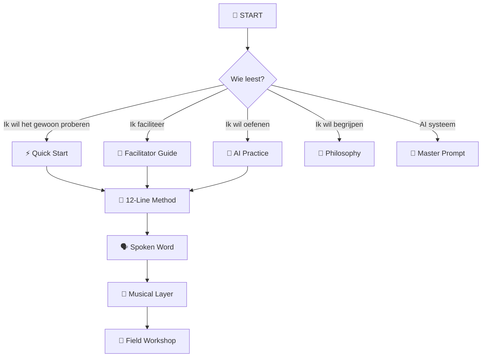

# 🗺️ Documentation Map

## Waar moet ik beginnen?



---

# 📚 Documentfuncties

| Document | Mens | AI | Functie |
|---|:---:|:---:|---|
| 🏠 `index.md` | ✅ | ✅ | startpunt |
| 🌱 `philosophy.md` | ✅ | ✅ | waarom |
| ⚡ `quick-start.md` | ✅ | ⚪ | onmiddellijk proberen |
| 🎤 `facilitator-guide.md` | ✅ | ✅ | begeleiden |
| 🗂️ `session-card.md` | ✅ | ⚪ | tijdens sessie |
| 🧱 `12-line-method.md` | ✅ | ✅ | tekststructuur |
| 🗣️ `spoken-word.md` | ✅ | ✅ | eerste performance |
| 🎸 `musical-layer.md` | ✅ | ✅ | muziek toevoegen |
| 🤖 `ai-practice.md` | ✅ | ✅ | simuleren |
| 🧪 `exercises.md` | ✅ | ✅ | trainen |
| 🛠️ `troubleshooting.md` | ✅ | ✅ | herstellen |
| 🌳 `field-workshop.md` | ✅ | ✅ | echte wereld |
| 🧠 `master-prompt.md` | ⚪ | ⭐ | AI-regels |
| 🤖 `ai-project-bootstrap.md` | ✅ | ⭐ | AI installeren |
| 🗺️ `documentation-map.md` | ✅ | ⭐ | navigeren |

Legenda:

```text
⭐ primair
✅ relevant
⚪ secundair
```

---

# 🧠 AI reading order

Voor AI:

```text
1 master-prompt.md
        ↓
2 philosophy.md
        ↓
3 12-line-method.md
        ↓
4 facilitator-guide.md
        ↓
5 ai-practice.md
        ↓
6 musical-layer.md
        ↓
7 troubleshooting.md
        ↓
8 field-workshop.md
```

---

# 👤 Facilitator reading order

```text
Quick Start
    ↓
Session Card
    ↓
12-Line Method
    ↓
AI Practice
    ↓
Exercises
    ↓
Field Workshop
```

---

# 🚨 Anti-documentation-loop

Wanneer je hier langer leest dan oefent:

```text
DOCS
 ↓
DOCS
 ↓
DOCS
 ↓
DOCS
 ↓
🛑 STOP
 ↓
🤖 SIMULATIE
```

De documentatie dient de workshop.

Niet andersom.

