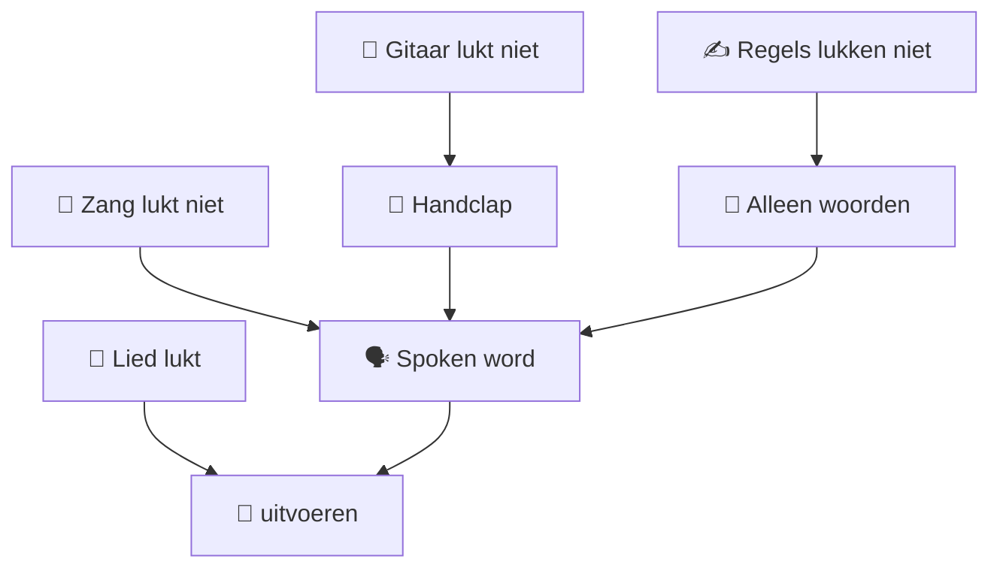

# 🎤 Facilitator Guide

## Vliegbasis71 Collaborative Song Method

Deze handleiding beschrijft wat de facilitator daadwerkelijk doet.

Niet theoretisch.

Maar:

> **Wat doe ik wanneer er acht mensen voor mij staan?**

---

# 🧳 Voorbereiding

Bereid vooraf voor:

- één thema;
- 6–12 reservewoorden;
- regels 1, 3, 7 en 11;
- één eenvoudige akkoordprogressie;
- één ritmepatroon;
- pen + papier / whiteboard;
- timer;
- optioneel looper.

---

# 🧱 Scaffolding

Voor beginners begint de workshop NIET met een leeg vel.

De facilitator levert een geraamte.

```text
1  [FACILITATOR]
2  [PUBLIEK]

3  [FACILITATOR]
4  [PUBLIEK]
5  [PUBLIEK]
6  [PUBLIEK]

7  [FACILITATOR]
8  [PUBLIEK]
9  [PUBLIEK]
10 [PUBLIEK]

11 [FACILITATOR]
12 [PUBLIEK]
```

Dit is de kern van de beginnersvariant.

---

# 🎯 Voorbeeld

Thema:

## ZONDAG

Vooraf voorbereid:

```text
1  Wakker met koffie
3  Vogels in mijn hoofd
7  Kattenvoer in bak
11 Klaar voor morgen
```

Het publiek hoeft dus niet een volledig lied te verzinnen.

Het vult gaten.

---

# 👥 Vrijblijvende deelname

Zeg expliciet:

> "Je mag één woord geven."

> "Je mag een hele regel geven."

> "Je mag alleen luisteren."

> "Je hoeft niet te zingen."

> "Er bestaat hier geen auditie."

---

# ⏱️ 15-minutenformat

| Tijd | Activiteit |
|---:|---|
| 0–2 min | Thema + uitleg |
| 2–5 min | Woorden verzamelen |
| 5–8 min | Regels aanvullen |
| 8–10 min | Tekst gezamenlijk spreken |
| 10–12 min | Ritme toevoegen |
| 12–14 min | Gitaar toevoegen |
| 14–15 min | Gezamenlijke uitvoering |

---

# 🎙️ Opening

Bijvoorbeeld:

> "We gaan niet proberen een perfect liedje te schrijven.
>
> We gaan spelen met taal.
>
> Over vijftien minuten bestaat er iets dat vijftien minuten geleden nog niet bestond."

---

# 🧩 Woorden verzamelen

Vraag:

> "Wanneer je aan zondag denkt, welk woord verschijnt als eerste?"

Mogelijke antwoorden:

```text
koffie
rust
regen
strand
familie
wandelen
croissant
kat
zon
uitslapen
```

Schrijf alles zichtbaar op.

Nog niet beoordelen.

---

# 🧠 Van woorden naar regels

Nu pas:

> "We hebben deze woorden. Wie kan hiermee regel twee maken?"

De facilitator bewaakt:

- kortheid;
- begrijpelijkheid;
- ongeveer dezelfde lengte;
- geen perfectionisme.

---

# ✂️ Faciliteren betekent ook schrappen

Iemand zegt misschien:

> "Wanneer ik op zondagochtend wakker word vind ik het altijd heerlijk om eerst rustig een grote kop koffie te drinken."

Maak daarvan samen:

> **Zondagochtend met koffie**

of:

> **Wakker met koffie**

Dat is geen afwijzing.

Dat is muzikale compressie.

---

# 🎭 Daarna spreken

Iedereen samen.

Geen gitaar.

```text
Wakker met koffie
Aan tafel ontbijt
...
```

---

# 👏 Daarna puls

```text
1 - 2 - 3 - 4
```

Laat iedereen meetikken.

---

# 🎸 Daarna gitaar

Pas nu komt:

```text
E → A → E → B
```

De gitaar arriveert dus relatief laat.

---

# 🎤 Daarna optioneel zang

Zeg:

> "Je mag zingen.
> Je mag spreken.
> Je mag neuriën.
> Je mag alleen luisteren."

---

# 🧯 Wanneer het mislukt

Dit is belangrijk.

Een workshop kan niet werkelijk mislukken zolang er een volgende eenvoudigere toestand bestaat.



---

# 🧭 Facilitatorhouding

Niet:

> "Ik ga jullie leren hoe je een lied schrijft."

Maar:

> "Ik heb een structuur waarmee we kunnen onderzoeken wat er ontstaat."

Dat verschil is fundamenteel.

---

# ✈️ De facilitator is niet de ster

```text
        👥 PUBLIEK
       /    |    \
      /     |     \
 woorden  verhaal  energie
      \     |     /
       \    |    /
        🎤 facilitator
             │
             ▼
         🎸 structuur
             │
             ▼
          🎶 resultaat
```

De facilitator houdt het raamwerk vast.

De groep vult het raamwerk met leven.

---

# ⭐ Succes

Succes is niet:

- perfecte zang;
- perfecte rijm;
- perfecte timing;
- een Spotifywaardig lied.

Succes is:

> **Mensen horen iets terug dat zij enkele minuten daarvoor zelf hebben ingebracht.**

