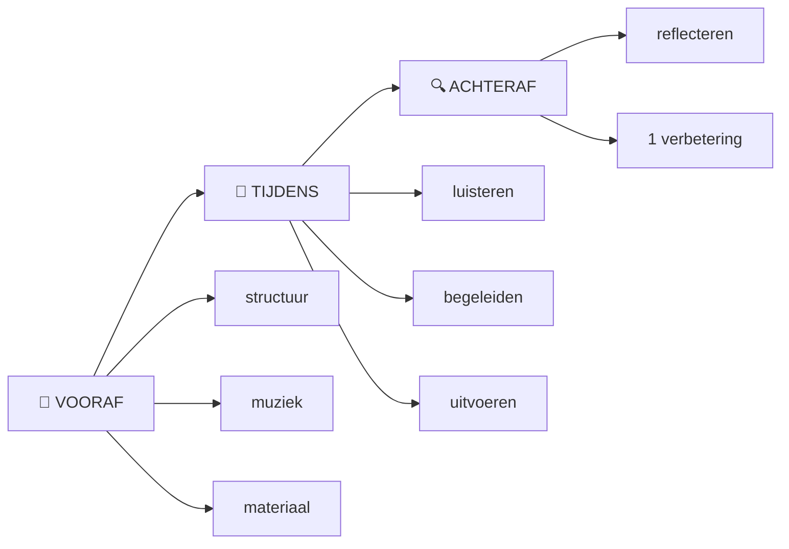
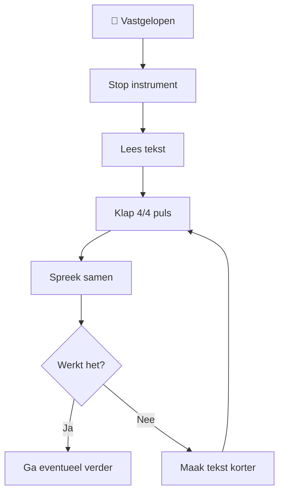

# 🎤 Facilitator Guide

> **Jouw taak is niet het beste liedje maken.  
> Jouw taak is zorgen dat mensen kunnen bijdragen.**

De facilitator is tegelijk:

- 🧭 gids;
- 👂 luisteraar;
- ✍️ lichte redacteur;
- 🥁 ritmehouder;
- 🎸 muzikale begeleider;
- 🧱 structuurhouder;
- 🙋 uitnodiger.

Dat lijkt veel.

Daarom wordt zoveel mogelijk **vooraf vereenvoudigd**.

---

# 🧭 De drie fasen van faciliteren



---

# 🎒 Fase A — Vooraf

## 1. Kies het niveau

| Niveau | Publiek | Voorbereiding |
|---|---|---|
| 🟢 L1 | Complete beginners | Zeer veel |
| 🟡 L2 | Enige ervaring | Veel |
| 🟠 L3 | Creatieve groep | Gemiddeld |
| 🔴 L4 | Ervaren improvisatoren | Weinig |

Voor de eerste praktijkproeven:

> **Gebruik L1.**

---

# 🎯 2. Kies één thema

Een goed beginnersthema:

- is herkenbaar;
- vraagt geen specialistische kennis;
- heeft veel associaties;
- hoeft niet persoonlijk te zijn.

### Voorbeelden

| 🟢 Makkelijk | 🟡 Iets abstracter |
|---|---|
| Zondag | Vrijheid |
| Koffie | Verandering |
| Strand | Verbinding |
| Regen | Avontuur |
| Vakantie | Thuiskomen |
| Ochtend | Moed |
| Fietsen | Nieuw begin |

---

# ✍️ 3. Bereid ankerregels voor

Voor het 12-Line Format:

```text
01  ANKER
02  publiek

03  ANKER
04  publiek
05  publiek
06  publiek

07  ANKER
08  publiek
09  publiek
10  publiek

11  ANKER
12  publiek
```

De ankerregels:

- geven richting;
- verminderen cognitieve belasting;
- voorkomen een volledig lege pagina;
- helpen het verhaal vooruit.

---

# 🧰 4. Maak een reservewoordenbank

Voor thema **Zondag**:

```text
koffie
rust
zon
ontbijt
wandelen
regen
familie
krant
muziek
bank
kat
park
```

Gebruik deze woorden alleen wanneer de groep vastloopt.

Niet wanneer de groep zelf genoeg materiaal produceert.

---

# 🎸 5. Automatiseer de muzikale basis

Voor een beginnerssessie moet je begeleiding bijna op automatische piloot kunnen.

Bijvoorbeeld:

```text
KEY:  E major
TIME: 4/4
BPM:  80

| E | A | B | A |
```

Oefen:

```text
gitaar
  ↓
gitaar + tellen
  ↓
gitaar + praten
  ↓
gitaar + willekeurige woorden
  ↓
gitaar + tekst
```

Wanneer `gitaar + praten` nog moeilijk is:

**vereenvoudig de gitaar.**

---

# 🎤 Fase B — Tijdens

# 1. Open kort

Doel:

**binnen ongeveer één minuut beginnen.**

Bijvoorbeeld:

> "We gaan samen spelen met woorden.
>
> Het thema is zondag.
> Jullie hoeven geen muzikant te zijn en niemand hoeft solo te zingen.
>
> Geef straks gewoon één tot drie woorden.
> Daarmee bouwen we samen iets."

Daarna:

**begin.**

---

# 👂 2. Stel één vraag tegelijk

## ❌ Niet

> "Geef drie woorden en probeer daar dan een zin van te maken die eventueel
> rijmt en ongeveer vier tellen heeft."

## ✅ Wel

> "Welke woorden passen voor jou bij zondag?"

Wacht.

Volgende stap pas daarna.

---

# ⏳ 3. Verdraag stilte

Na een vraag kan vijf seconden stilte enorm lang voelen.

Niet onmiddellijk zelf antwoorden.

```text
VRAAG
  ↓
...
  ↓
stilte
  ↓
denken
  ↓
antwoord
```

De facilitator hoeft niet iedere lege seconde te vullen.

---

# 💬 4. Herhaal bijdragen

Deelnemer:

> "Koffie."

Facilitator:

> "Koffie. Mooi."

Schrijf:

```text
☕ koffie
```

Dat doet drie dingen:

1. bevestigt dat je gehoord hebt;
2. maakt de bijdrage zichtbaar;
3. geeft de groep tijd om verder te denken.

---

# 🚫 5. Beoordeel ideeën niet te vroeg

Vermijd:

> "Nee."

> "Dat past niet."

> "Dat is moeilijk."

> "Daar kunnen we niks mee."

Gebruik liever:

> "Ik schrijf hem erbij."

of:

> "Laten we kijken waar hij past."

---

# ✂️ 6. Redigeer samen

Wanneer een regel te lang is:

```text
DEELNEMER
   ↓
lange gedachte
   ↓
FACILITATOR
"Kunnen we hem korter maken?"
   ↓
voorstel
   ↓
DEELNEMER akkoord?
   ↓
korte regel
```

### Voorbeeld

> "Ik vind het heerlijk om zondag heel lang in mijn bed te blijven liggen."

↓

> "Zondag blijf ik liggen."

↓

> "Zondag lekker liggen."

De groep kan kiezen.

---

# 🧠 7. Bewaak cognitieve belasting

Let op signalen:

- lange stilte;
- mensen kijken weg;
- grapjes uit ongemak;
- steeds dezelfde persoon antwoordt;
- deelnemers vragen wat ze moeten doen;
- discussie over regels in plaats van spelen.

Dan geldt:

```text
TE MOEILIJK
   ↓
VERKLEIN OPDRACHT
```

Bijvoorbeeld:

Van:

> "Maak een regel."

naar:

> "Kies: koffie of wandelen?"

---

# 🙋 8. Laat overslaan toe

Een eenvoudige zin:

> "Overslaan mag altijd."

kan de hele sfeer veranderen.

Iemand die niet gedwongen wordt, doet later soms juist vrijwillig mee.

---

# 🗣️ 9. Spreek vóór muziek

Wanneer de tekst klaar is:

**leg de gitaar nog even neer.**

Lees samen.

```text
tekst
 ↓
hardop
 ↓
accent
 ↓
puls
 ↓
ritme
```

Pas daarna:

```text
ritme
 ↓
gitaar
```

---

# 🎸 10. Muziek moet ondersteunen

Als jij tijdens het spelen denkt:

> "Shit, welk akkoord komt nou?"

dan is het arrangement waarschijnlijk te moeilijk.

Gebruik desnoods:

```text
E    E    E    E
```

één akkoord.

Een succesvolle sessie op één akkoord is beter dan een mislukte sessie op zeven.

---

# 🎤 11. Demonstreer vóór je deelname vraagt

De facilitator speelt eerst één keer.

```text
FACILITATOR
    ↓
demonstratie
    ↓
groep begrijpt vorm
    ↓
uitnodiging
    ↓
SAMEN
```

Mensen hoeven dan niet te gokken wat jij bedoelt.

---

# 👥 12. Bouw deelname trapsgewijs op

```text
👀 KIJKEN
    ↓
👏 PULS KLAPPEN
    ↓
🗣️ LAATSTE WOORD
    ↓
🗣️ HELE REGEL
    ↓
🔁 CHANT
    ↓
🎶 ZINGEN
```

Nooit:

```text
"Oké allemaal, ZINGEN!"
```

tegen een groep die drie minuten geleden nog dacht dat ze naar een praatje kwam.

---

# 😂 13. Gebruik fouten

Gitaar verkeerd?

> "Ha — verkeerde afslag. Nog een keer."

Regel vergeten?

> "Wie weet onze volgende regel?"

De groep kan je helpen.

Een fout kan daarmee juist participatie opleveren.

---

# ⏹️ 14. Weet wanneer je moet stoppen

Signalen van een goed stoppunt:

- iedereen heeft het eenmaal uitgevoerd;
- er wordt gelachen;
- het resultaat is herkenbaar;
- energie is nog hoog.

Stop dan.

Niet:

> "Nu gaan we hem professioneel arrangeren."

---

# 🆘 Noodprotocol

Wanneer de sessie ontspoort:



De gouden regel:

> **Wanneer muziek het moeilijker maakt, haal muziek tijdelijk weg.**

---

# 🔍 Fase C — Achteraf

Geen evaluatieformulier van vijf pagina's.

Beantwoord drie vragen.

## 🟢 Wat werkte?

...

## 🟠 Waar ontstond verwarring?

...

## 🔵 Wat verander ik één volgende keer?

...

---

# 📊 Facilitator self-check

| Vaardigheid | 😬 Nog lastig | 🙂 Redelijk | 😎 Automatisch |
|---|:---:|:---:|:---:|
| Korte uitleg geven | ☐ | ☐ | ☐ |
| Stilte verdragen | ☐ | ☐ | ☐ |
| Bijdragen samenvatten | ☐ | ☐ | ☐ |
| Lange regels inkorten | ☐ | ☐ | ☐ |
| Ritme vasthouden | ☐ | ☐ | ☐ |
| Gitaar + praten | ☐ | ☐ | ☐ |
| Fouten laten bestaan | ☐ | ☐ | ☐ |
| Vrijwilligheid bewaken | ☐ | ☐ | ☐ |
| Groepsenergie lezen | ☐ | ☐ | ☐ |
| Op tijd stoppen | ☐ | ☐ | ☐ |

---

# 🤖 AI-oefening

Voordat je een echte sessie doet, kun je een AI vragen een beginner te simuleren.

De facilitator voert vervolgens de **echte instructies** uit.

Niet:

> "Maak een goed liedje voor mij."

Maar:

> "Ik ben facilitator. Jij bent deelnemer. Reageer alleen op mijn opdrachten."

Daarmee oefen je vooral:

- instructies;
- vraagstelling;
- structuur;
- onverwachte antwoorden;
- tempo van de sessie.

---

# ⭐ Facilitator mantra

Wanneer je tijdens de workshop niet meer weet wat je moet doen:

> **Maak het kleiner.**

```text
LIEDJIE TE MOEILIJK?
      ↓
CHANT

CHANT TE MOEILIJK?
      ↓
SPREEK

REGEL TE MOEILIJK?
      ↓
ZINNETJE

ZINNETJE TE MOEILIJK?
      ↓
WOORD

WOORD?
      ↓
DAAR KUNNEN WE BEGINNEN
```
