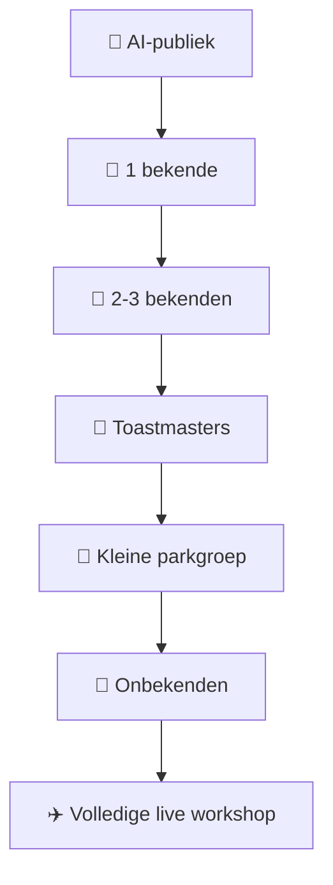

# 🌳 Field Workshop

## Van oefenkamer naar echte mensen

> De Collaborative Song Method is pas werkelijk getest wanneer iemand
> die niets van muziek weet binnen enkele minuten kan bijdragen.

---

## 🎯 Doel

De Field Workshop vertaalt de Collaborative Song Method naar:

- Toastmasters;
- park;
- huiskamer;
- workshop;
- buurthuis;
- open podium;
- spontane ontmoeting;
- kleine groep onbekenden.

Het primaire resultaat is **niet een perfect liedje**.

Het primaire resultaat is:

> **een groep mensen die samen iets heeft gemaakt.**

---

# 🌳 De Field Ladder



Ga niet direct van slaapkamer naar twintig onbekenden.

Iedere trede leert iets anders.

---

# 🧰 Voorbereiding facilitator

## Altijd vooraf klaarzetten

| Onderdeel | Voorbereid |
|---|:---:|
| Thema | ✅ |
| 6-12 reservewoorden | ✅ |
| Regel 1 | ✅ |
| Regel 3 | ✅ |
| Regel 7 | ✅ |
| Regel 11 | ✅ |
| Akkoordprogressie | ✅ |
| Tempo | ✅ |
| Basisritme | ✅ |
| Pen/stift | ✅ |
| Papier/whiteboard | ✅ |
| Panic Button | ✅ |

---

# 🎵 Muzikale default

Wanneer niets anders is afgesproken:

```text
Key: E major
Tempo: ± 76 BPM
Maatsoort: 4/4

Progressie:

E → A → E → B
```

De muzikale laag moet voorspelbaar zijn.

Waarom?

Omdat de improvisatie uit het publiek komt.

Als zowel:

- tekst;
- structuur;
- ritme;
- harmonie;
- melodie

tegelijk geïmproviseerd moeten worden, stijgt de cognitieve belasting enorm.

Daarom:

> **Improviseer één laag. Stabiliseer de rest.**

---

# 🗣️ Opening

Een mogelijke opening:

> "We gaan vandaag niet proberen een perfect liedje te schrijven.
>
> We gaan spelen met woorden.
>
> Je hoeft niet te kunnen zingen.
>
> Je hoeft geen muzikant te zijn.
>
> Eén woord is genoeg.
>
> En als je niets wilt zeggen, mag je gewoon passen."

---

# ⏱️ 15-Minute Workshop

## Minuut 0-2 — Uitleg

Leg alleen uit wat deelnemers **nu** nodig hebben.

Niet:

- muziektheorie;
- rijmschema's;
- toonladders;
- songwritingtheorie.

---

## Minuut 2-4 — Woorden

Vraag:

> "Welk woord komt bij jou op bij dit thema?"

Iedere deelnemer:

```text
1 woord
of
passen
```

---

## Minuut 4-8 — Regels

De facilitator heeft reeds:

```text
01 [M] vooraf voorbereid
03 [M] vooraf voorbereid
07 [M] vooraf voorbereid
11 [M] vooraf voorbereid
```

Het publiek vult de open ruimte.

```text
01 M
02 P

03 M
04 P
05 P
06 P

07 M
08 P
09 P
10 P

11 M
12 P
```

M = Michiel/facilitator  
P = publiek

---

# 🧱 Waarom de ankerregels?

Zonder scaffolding:

```text
lege pagina
    ↓
"bedenk iets"
    ↓
onzekerheid
```

Met scaffolding:

```text
bestaande regel
    ↓
kleine open ruimte
    ↓
één bijdrage
```

De tweede situatie is veel eenvoudiger.

---

# 🎤 Minuut 8-10 — Spoken Word

Nog geen zang.

Lees eerst samen de tekst.

Bijvoorbeeld:

```text
Wakker met koffie
zon op mijn gezicht

Zondag wordt langzaam
krant op de tafel
vogels bij het raam
niemand heeft haast
```

Het publiek hoort nu voor het eerst:

> "Dit hebben we gemaakt."

---

# 👏 Minuut 10-11 — Puls

Voeg alleen toe:

```text
1 2 3 4
1 2 3 4
```

Eventueel:

👏 klappen

of:

🦶 voet tikken.

---

# 🎸 Minuut 11-13 — Muziek

Facilitator speelt:

```text
E → A → E → B
```

Eerste ronde:

> publiek luistert.

Tweede ronde:

> publiek spreekt mee.

Derde ronde:

> wie wil mag zingen.

---

# 🎶 Minuut 13-14 — Samen

Maak bijvoorbeeld call-and-response:

```text
FACILITATOR:
Wakker met koffie

PUBLIEK:
Zondag begint langzaam
```

Geen verplichting.

Neuriën telt ook.

---

# 🎉 Minuut 14-15 — Afsluiting

Niet analyseren.

Niet vertellen wat muzikaal verkeerd ging.

Zeg bijvoorbeeld:

> "Vijftien minuten geleden bestond dit niet.
>
> Nu bestaat het omdat iedereen een klein stukje heeft toegevoegd."

Dat is de ervaring.

---

# 🌳 Parkvariant

Benodigd:

```text
🎸 gitaar
📋 clipboard
📄 papier
🖊️ dikke stift
📱 telefoon
```

Optioneel:

```text
🔊 kleine speaker
🎙️ microfoon
🔁 looper
```

Maar:

> apparatuur mag nooit noodzakelijk worden om de methode te laten werken.

---

# 🎤 Toastmasters-variant

Frame de activiteit als:

## Playing With Language

De link met Toastmasters:

```text
SPEECH
│
├── idee
├── structuur
├── woorden
├── ritme
├── publiek
└── uitvoering

SONG
│
├── idee
├── structuur
├── woorden
├── ritme
├── publiek
└── uitvoering
```

Het liedje is daarmee geen uitstapje buiten Toastmasters.

Het is een andere oefenvorm voor:

- taal;
- storytelling;
- improvisatie;
- luisteren;
- structureren;
- presenteren.

---

# 🆘 Field Panic Button

Wanneer alles ontspoort:

```text
CHAOS
  │
  ▼
STOP
  │
  ▼
LACH
  │
  ▼
LEES DE REGEL
  │
  ▼
E-AKKOORD
  │
  ▼
1-2-3-4
  │
  ▼
VERDER
```

---

# 🧠 De gouden regel

> **Het publiek hoeft het systeem niet te begrijpen.**
>
> De facilitator moet het systeem begrijpen.

De deelnemer hoeft alleen te weten:

> "Wat moet ik nú doen?"

---

# ✈️ Definition of Done

Een workshop is geslaagd wanneer:

- minstens enkele deelnemers vrijwillig bijdragen;
- niemand gedwongen wordt;
- er een herkenbare gezamenlijke tekst ontstaat;
- de groep de tekst minstens één keer hoort;
- fouten het proces niet stoppen;
- deelnemers begrijpen dat hun bijdrage onderdeel van het resultaat werd.

Muzikale perfectie staat niet in deze lijst.
