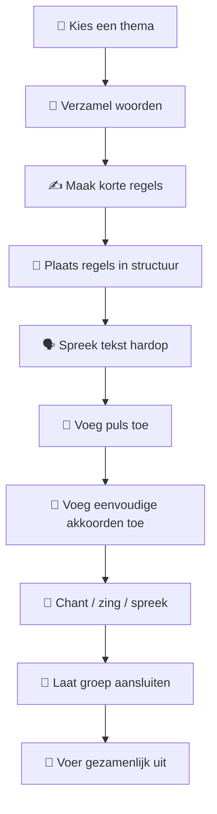
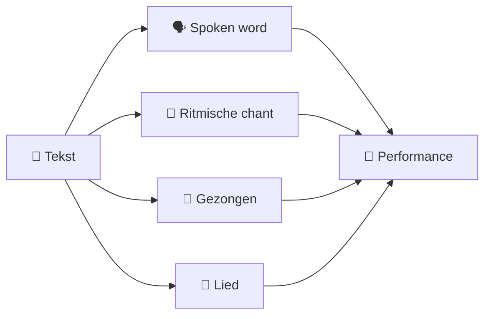

# 🎸 Vliegbasis71 Collaborative Live Song Method

> **Van losse woorden naar een gezamenlijk lied — zonder dat deelnemers muzikant hoeven te zijn.**

De **Vliegbasis71 Collaborative Live Song Method** is een praktische methode voor het gezamenlijk maken van een eenvoudig lied, chant of spoken-word performance met een publiek.

Het uitgangspunt is bewust eenvoudig:

> Deelnemers hoeven geen lied te kunnen schrijven.  
> Ze hoeven geen gitaar te kunnen spelen.  
> Ze hoeven niet te kunnen zingen.  
> Ze hoeven alleen iets kleins bij te dragen.

De facilitator zorgt voor de structuur.

---

## 🌱 Het basisidee

Een groep krijgt een thema.

Bijvoorbeeld:

> **Zondag**

De deelnemers leveren vervolgens kleine bijdragen:

- koffie;
- wakker;
- ontbijt;
- vogelzang;
- wandelen;
- kattenvoer;
- rust;
- regen.

Daaruit ontstaan korte regels.

Bijvoorbeeld:

```text
Wakker met koffie
Aan tafel ontbijt
Vogels zingen buiten
Zondag wordt langzaam licht
```

De facilitator plaatst deze regels vervolgens op een eenvoudig muzikaal raamwerk.

Bijvoorbeeld:

```text
4/4
70–90 BPM

| E | E | A | E |
```

Het resultaat hoeft geen perfect lied te zijn.

Het resultaat is:

> **iets dat enkele minuten geleden nog niet bestond en nu door de groep samen gemaakt is.**

---

# 🧭 De volledige route



---

# 🧠 Belangrijkste ontwerpprincipe

De centrale vraag is niet:

> **Hoe maken we een goed lied?**

De centrale vraag is:

> **Wat moet de deelnemer de komende 30 seconden concreet doen?**

Wanneer het antwoord ingewikkeld wordt, is de opdracht waarschijnlijk te groot.

---

# 👥 Wie kan deelnemen?

| Persoon | Kan deelnemen? | Mogelijke bijdrage |
|---|:---:|---|
| 🎸 Muzikant | ✅ | spelen, zingen, woorden |
| 🎤 Zanger | ✅ | zingen, neuriën |
| 🗣️ Niet-zanger | ✅ | spreken |
| ✍️ Schrijver | ✅ | woorden of regels |
| 😶 Verlegen deelnemer | ✅ | één woord |
| 👏 Ritmische deelnemer | ✅ | klappen |
| 👂 Alleen luisteraar | ✅ | luisteren |
| 🤖 AI | ✅ | simulatiepubliek / sparringpartner |

!!! important "Vrijwillige deelname"
    Niemand hoeft te zingen, improviseren of persoonlijke informatie te delen.

    Een deelnemer mag:

    - één woord geven;
    - een regel geven;
    - neuriën;
    - klappen;
    - luisteren;
    - of helemaal overslaan.

---

# 🚦 Moeilijkheidsniveaus

De methode is opgebouwd als een ladder.

```text
🟢 woorden
     ↓
🟢 korte regels
     ↓
🟢 gesproken tekst
     ↓
🟡 gesproken tekst + puls
     ↓
🟡 gesproken tekst + gitaar
     ↓
🟠 chant + gitaar
     ↓
🟠 zang + gitaar
     ↓
🔴 live publiek
     ↓
⭐ volledig geïmproviseerde workshop
```

De facilitator hoeft dus niet onmiddellijk te kunnen:

> zingen + gitaar spelen + improviseren + publiek begeleiden.

Die vaardigheden worden afzonderlijk opgebouwd.

---

# 🎸 Muzikale filosofie

Voor deze methode geldt:

> **Eenvoud is functionaliteit.**

Een enkel akkoord is voldoende.

```text
| E | E | E | E |
```

Twee akkoorden zijn voldoende.

```text
| E | A | E | A |
```

Een eenvoudige progressie is voldoende.

```text
| E | A | E | B |
```

Het muzikale raamwerk moet voorspelbaar genoeg zijn dat de facilitator aandacht overhoudt voor de mensen.

---

# 🗣️ Lied, chant of spoken word?

Alle drie zijn geldig.



Het **lied is niet het verplichte eindproduct**.

De gezamenlijke creatie is het eindproduct.

---

# 📚 Documentatie

| Document | Doel |
|---|---|
| [Philosophy](philosophy.md) | Waarom de methode zo is ontworpen |
| [Quick Start](quick-start.md) | Binnen enkele minuten beginnen |
| [12-Line Method](12-line-method.md) | De kernstructuur |
| `spoken-word.md` | Uitvoering zonder zang |
| `musical-layer.md` | Ritme, akkoorden en muziek |
| `facilitator-guide.md` | Een groep begeleiden |
| `session-card.md` | Praktische workshopkaart |
| `troubleshooting.md` | Wat te doen als het vastloopt |
| `practice-ladder.md` | De methode leren |
| `music-training.md` | Gitaar + stem trainen |
| `ai-practice.md` | ChatGPT als oefenpubliek |
| `field-workshop.md` | Park/event-versie |
| `field-test-log.md` | Experimenten documenteren |
| `master-prompt.md` | AI master prompt |

---

# 🚀 Begin hier

Nog nooit gedaan?

Ga naar:

➡️ **[Quick Start](quick-start.md)**

Wil je begrijpen waarom de methode bewust zo eenvoudig is?

➡️ **[Philosophy](philosophy.md)**

Wil je direct de liedstructuur leren?

➡️ **[12-Line Method](12-line-method.md)**

---

## Vliegbasis71

**Create → Play → Share → Learn → Repeat**

De eerste versie hoeft niet goed te zijn.

Hij moet bestaan.
