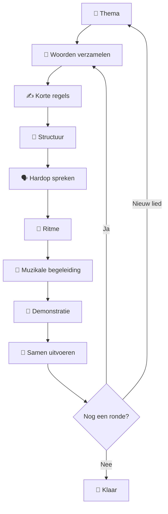

# 🎸 Vliegbasis71 Collaborative Song Method

> **Van losse woorden naar iets dat samen klinkt.**

De **Vliegbasis71 Collaborative Song Method** is een laagdrempelige methode
waarmee een groep mensen binnen korte tijd gezamenlijk een eenvoudige
muzikale of ritmische uitvoering kan maken.

Je hoeft daarvoor:

- ❌ geen muzikant te zijn;
- ❌ geen muziektheorie te kennen;
- ❌ geen liedjes te kunnen schrijven;
- ❌ niet te kunnen zingen;
- ❌ geen podiumervaring te hebben.

Je hoeft alleen iets te kunnen bijdragen.

Dat kan zelfs **één woord** zijn.

---

## 🌱 Het basisidee

Een lege pagina kan intimiderend zijn.

De opdracht:

> "Schrijf een liedje."

is daarom bewust **niet** het beginpunt van deze methode.

We beginnen veel kleiner.

```text
THEMA
  ↓
WOORD
  ↓
KORTE REGEL
  ↓
STRUCTUUR
  ↓
RITME
  ↓
SPREKEN
  ↓
MUZIEK
  ↓
SAMEN UITVOEREN
```

Iedere stap maakt gebruik van wat in de vorige stap is ontstaan.

Niemand hoeft het volledige proces zelf te beheersen.

---

# 🧭 De zeven stappen

| Stap | Activiteit | Vraag aan de deelnemer | Resultaat |
|---:|---|---|---|
| 🟦 1 | Thema | Waar gaat het over? | Gemeenschappelijk onderwerp |
| 🟩 2 | Woorden | Welke 1–3 woorden passen hierbij? | Woordenbank |
| 🟨 3 | Regels | Welke korte zin kunnen we hiermee maken? | Tekstmateriaal |
| 🟧 4 | Structuur | Waar plaatsen we de regels? | Liedstructuur |
| 🟥 5 | Ritme | Hoe klinkt dit wanneer we het spreken? | Ritmische tekst |
| 🟪 6 | Muziek | Welke eenvoudige muzikale basis past? | Muzikale vorm |
| 🟫 7 | Uitvoeren | Kunnen we dit samen doen? | Gezamenlijke uitvoering |

---

# 🧠 Belangrijk ontwerpprincipe

## Creëren en corrigeren zijn verschillende activiteiten

Tijdens het verzamelen van ideeën corrigeren we zo weinig mogelijk.

```text
💡 CREËREN
     │
     │ alles mag bestaan
     ▼
📝 STRUCTUREREN
     │
     │ materiaal ordenen
     ▼
🔧 AANPASSEN
     │
     │ korter / ritmischer / duidelijker
     ▼
🥁 UITVOEREN
```

Een woord hoeft niet meteen in een liedje te passen.

Een zin hoeft niet meteen te rijmen.

Een regel hoeft niet meteen muzikaal perfect te zijn.

Eerst ontstaat het materiaal.

Daarna maken we het bruikbaar.

---

# 👥 Rollen

De methode kent twee primaire rollen.

## 🎤 Facilitator

De facilitator:

- bereidt een eenvoudige structuur voor;
- legt telkens maar één volgende stap uit;
- verzamelt bijdragen;
- bewaakt de structuur;
- helpt lange zinnen korter maken;
- biedt ritme of muzikale begeleiding;
- bewaakt vrijwillige deelname;
- zorgt dat fouten onderdeel van het proces mogen zijn.

De facilitator hoeft geen professionele muzikant te zijn.

De belangrijkste vaardigheid is:

> **anderen helpen bijdragen.**

---

## 🙋 Deelnemer

Een deelnemer kan bijdragen door:

```text
KIJKEN
  ↓
ÉÉN WOORD GEVEN
  ↓
EEN KORTE REGEL MAKEN
  ↓
MEE SPREKEN
  ↓
MEE CHANTEN
  ↓
MEEZINGEN
  ↓
EVENTUEEL MEE SPELEN
```

Iedere trede is geldig.

Een deelnemer hoeft nooit naar de volgende trede.

---

# ❤️ Vrijwillige deelname

Een belangrijke regel van Vliegbasis71 is:

> **De uitnodiging is actief. De deelname is vrijwillig.**

Daarom is bijvoorbeeld dit prima:

**Facilitator**

> "Welk woord komt bij jou op?"

**Deelnemer**

> "Ik weet even niets."

**Facilitator**

> "Helemaal goed. Dan gaan we door en kom ik eventueel later terug."

De workshop mag niet veranderen in een kennistest.

---

# 🪜 Scaffolding

Improvisatie betekent niet dat alles geïmproviseerd moet worden.

Sterker nog:

> **Hoe minder ervaring het publiek heeft, hoe sterker de structuur van de facilitator moet zijn.**

Voor een beginnerssessie kan de facilitator bijvoorbeeld vooraf bepalen:

| Onderdeel | Voorbereid |
|---|---|
| Thema | Zondag |
| Structuur | 12 regels |
| Ankerregels | 1, 3, 7 en 11 |
| Toonsoort | E major |
| Tempo | 80 BPM |
| Maatsoort | 4/4 |
| Akkoorden | E – A – B – A |
| Ritme | Eén vooraf geoefend patroon |

Het publiek hoeft deze technische informatie niet allemaal te kennen.

Het is de **vangrail voor de facilitator**.

---

# 🔄 Het samenwerkingsmodel



---

# 🎵 Drie uitvoeringsvormen

Een lied hoeft niet onmiddellijk gezongen te worden.

De methode gebruikt drie niveaus.

| Niveau | Vorm | Muzikale ervaring nodig? |
|---|---|---:|
| 🗣️ **Speak** | Tekst ritmisch spreken | Nee |
| 🔁 **Chant** | Ritmisch op één of enkele tonen | Nee |
| 🎶 **Sing** | Eenvoudige melodie zingen | Een beetje |

De normale volgorde is:

```text
SPEAK
  ↓
CHANT
  ↓
SING
```

Maar **Speak** mag ook het eindresultaat zijn.

---

# ⏱️ De 15-minutenuitdaging

Een belangrijk experiment binnen Vliegbasis71 is:

> **Kunnen mensen die elkaar misschien nauwelijks kennen binnen ongeveer
> vijftien minuten gezamenlijk iets maken en uitvoeren?**

Een mogelijke tijdverdeling:

| Tijd | Activiteit |
|---:|---|
| 00:00–01:00 | Uitleg |
| 01:00–03:00 | Woorden |
| 03:00–07:00 | Regels |
| 07:00–09:00 | Structuur |
| 09:00–11:00 | Ritmisch spreken |
| 11:00–13:00 | Muziek toevoegen |
| 13:00–15:00 | Samen uitvoeren |

Dit is een **richtlijn**, geen stopwatchwedstrijd.

---

# 🧪 De methode is experimenteel

Versie **0.1** is bewust een praktijkprototype.

De methode wordt ontwikkeld door:

```text
IDEE
 ↓
SIMULATIE
 ↓
OEFENING
 ↓
ECHTE DEELNEMER
 ↓
KLEINE GROEP
 ↓
WORKSHOP
 ↓
REFLECTIE
 ↓
VERBETERING
 ↺
```

Feedback uit echte sessies heeft daarom meer gewicht dan theoretische elegantie.

---

# 🤖 AI als oefenpartner

De facilitator kan een AI-assistent gebruiken om het proces te oefenen.

AI kan bijvoorbeeld optreden als:

- 🙋 vriendelijke beginner;
- 🎭 realistische deelnemer;
- 🧑‍🏫 coach;
- 🔍 reviewer.

Een belangrijk uitgangspunt blijft echter:

> **Een echte workshop moet zonder realtime AI kunnen functioneren.**

AI ondersteunt het leren van de methode.

AI vervangt het publiek niet.

---

# 🎯 Wanneer is een sessie geslaagd?

Niet wanneer het lied perfect klinkt.

Niet wanneer niemand een fout maakt.

Niet wanneer alle regels rijmen.

Een sessie is geslaagd wanneer deelnemers kunnen ervaren:

> **"Dit bestond net nog niet — en nou hebben we dit samen gemaakt."**

Dat is de kern van Vliegbasis71.

---

# 🚀 Waar begin ik?

Voor een eerste sessie:

1. Kies één eenvoudig thema.
2. Bereid vier ankerregels voor.
3. Kies één eenvoudige akkoordprogressie.
4. Kies één ritme dat je zonder nadenken kunt spelen.
5. Vraag deelnemers om woorden.
6. Bouw samen korte regels.
7. Spreek de tekst eerst hardop.
8. Voeg daarna pas muziek toe.
9. Speel één voorbeeld.
10. Nodig de groep uit mee te doen.
11. Stop voordat perfectionisme het plezier overneemt.

➡️ Ga verder met **[Quick Start](quick-start.md)**.

---

## 🛫 Vliegbasis71

**Make words. Find rhythm. Play together.**
