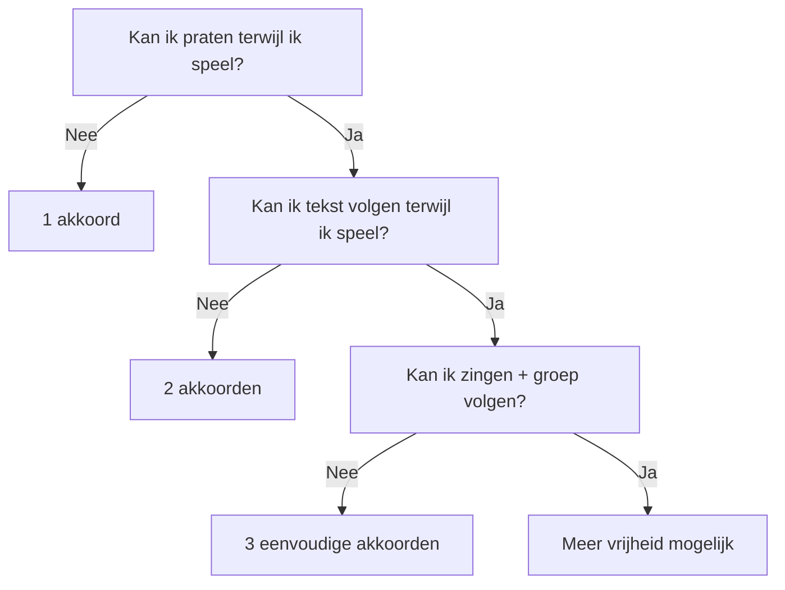

# 🎸 De Muzikale Laag

> **De muziek draagt de woorden. De woorden hoeven de muziek niet te bevechten.**

De muzikale laag wordt pas toegevoegd wanneer de tekst als gesproken vorm
voldoende werkt.

De volgorde is:

```text
TEKST
  ↓
SPREKEN
  ↓
PULS
  ↓
RITME
  ↓
AKKOORD
  ↓
CHANT
  ↓
MELODIE
```

Niet andersom.

---

# 🎯 Doel voor de facilitator

De begeleiding moet zo eenvoudig zijn dat je aandacht beschikbaar blijft voor:

- deelnemers;
- tekst;
- timing;
- fouten;
- groepsenergie;
- aanwijzingen.

Wanneer 90% van je brein bezig is met gitaarspelen, is de begeleiding te moeilijk.

---

# 🟢 Beginner Setup

Voor de eerste oefenfase:

```yaml
music:
  key: "E major"
  time_signature: "4/4"
  bpm: 80
  complexity: "very-low"
```

---

# 🎸 Progressie A — Eén akkoord

De eenvoudigste mogelijke variant:

```text
| E | E | E | E |
```

Ja.

Eén akkoord.

Dat is toegestaan.

## Gebruik wanneer

- gitaar + zingen nog moeilijk is;
- de groep onzeker is;
- tekst belangrijker is;
- je voor het eerst live faciliteert.

---

# 🎸 Progressie B — Twee akkoorden

```text
| E | A | E | A |
```

Hier ontstaat al beweging.

---

# 🎸 Progressie C — Drie akkoorden

```text
| E | A | B | A |
```

Dit is een goede eenvoudige oefenprogressie.

---

# 🎸 Progressie D — Vier-akkoord-loop

Later bijvoorbeeld:

```text
| E | B | C#m | A |
```

Gebruik dit pas wanneer het comfortabel voelt.

---

# 🧠 Beslisboom



---

# 🥁 Tempo

Begin niet te snel.

Richtlijn:

| BPM | Karakter |
|---:|---|
| 60–70 | zeer rustig |
| **70–90** | 🟢 beginner-vriendelijk |
| 90–110 | energiek |
| 110+ | alleen indien passend |

Een praktisch startpunt:

> **80 BPM**

---

# 🥁 Vierkwartsmaat

Gebruik:

```text
1      2      3      4
↓      ↓      ↓      ↓
```

De groep hoeft geen muziektheorie te kennen.

Zeg:

> "We tellen steeds tot vier."

---

# 🎸 Strumming Level 0

Eén slag per maat.

```text
1      2      3      4
↓
```

Bijvoorbeeld:

```text
E                 A
↓                 ↓
Wakker met koffie Ontbijt aan tafel
```

---

# 🎸 Strumming Level 1

Vier rustige downstrokes:

```text
1      2      3      4
↓      ↓      ↓      ↓
```

Dit is zeer bruikbaar voor oefenen.

---

# 🎸 Strumming Level 2

Wanneer Level 1 automatisch gaat:

```text
1   &   2   &   3   &   4   &
↓       ↓   ↑       ↑   ↓   ↑
```

Maar:

> **gebruik dit niet omdat het mooier klinkt wanneer het jouw aandacht opeet.**

---

# 🪕 Arpeggio Level 1

Voor een rustige uitvoering:

```text
TEL     1       2       3       4

SNAREN  bass    G       B       G
```

Herhalen.

Bij E bijvoorbeeld:

```text
E chord

1       2       3       4
6       3       2       3
```

Het doel is motorische voorspelbaarheid.

---

# 🪕 Arpeggio Level 2

Wanneer comfortabel:

```text
1   &   2   &   3   &   4   &
B       G       B       G
```

Of een ander patroon dat de facilitator volledig automatisch beheerst.

---

# 🚨 Belangrijke regel

> Het theoretisch beste patroon is niet automatisch het beste patroon voor de workshop.

De beste begeleiding is:

```text
DE MOEILIJKSTE BEGELEIDING
DIE JE ZONDER BEWUST NADENKEN
KUNT BLIJVEN SPELEN
```

Voor een beginner kan dat dus gewoon zijn:

```text
E E E E E E E E
```

---

# 🧪 Trainingsladder voor gitaar + stem

Dit is belangrijk voor een facilitator die apart kan spelen en zingen,
maar beide nog niet betrouwbaar tegelijk kan uitvoeren.

```text
LEVEL 0
gitaar alleen
   ↓
LEVEL 1
gitaar + 1-2-3-4
   ↓
LEVEL 2
gitaar + willekeurig praten
   ↓
LEVEL 3
gitaar + tekst spreken
   ↓
LEVEL 4
gitaar + chant
   ↓
LEVEL 5
gitaar + eenvoudige zang
   ↓
LEVEL 6
gitaar + zingen + publiek observeren
```

**Spring geen levels over.**

---

# 🟦 Level 0 — Gitaar

Doel:

> Progressie zonder stoppen.

Bijvoorbeeld vijf minuten:

```text
E → A → B → A
```

---

# 🟩 Level 1 — Tellen

Speel en zeg:

```text
1 2 3 4
1 2 3 4
1 2 3 4
1 2 3 4
```

Wanneer dit je gitaarspel verstoort:

blijf hier oefenen.

---

# 🟨 Level 2 — Praten

Speel terwijl je zegt:

> "Vandaag heb ik koffie gedronken en daarna ben ik gaan wandelen."

De inhoud maakt niet uit.

Het doel is motorische onafhankelijkheid.

---

# 🟧 Level 3 — Tekst spreken

```text
🎸 E

"Wakker met koffie"

🎸 A

"Ontbijt aan tafel"
```

Geen zang.

---

# 🟥 Level 4 — Chant

Gebruik één toon.

Bijvoorbeeld E.

```text
E E E E
Wakker met koffie
```

Daarna eventueel twee tonen.

---

# 🟪 Level 5 — Zang

Voeg pas een eenvoudige melodische contour toe.

Bijvoorbeeld:

```text
laag → midden → midden → laag
```

Niet noodzakelijk muziektheoretisch uitleggen aan deelnemers.

---

# 🟫 Level 6 — Faciliteren tijdens spelen

Dit is de moeilijkste vaardigheid.

Je speelt én ziet:

```text
Wie doet mee?
Wie haakt af?
Wie wil iets zeggen?
Loopt de tekst?
Is het tempo goed?
Moet ik stoppen?
```

Daarom moet de gitaar tegen die tijd bijna automatisch zijn.

---

# 🎤 Demonstratieprotocol

Voordat de groep meedoet:

## Pass 1

Facilitator alleen.

```text
🎸 + 🗣️
```

## Pass 2

Facilitator + groep spreekt.

```text
🎸 + 🗣️🗣️🗣️🗣️
```

## Pass 3

Optioneel chant.

```text
🎸 + 🔁🔁🔁🔁
```

## Pass 4

Optioneel zingen.

```text
🎸 + 🎶🎶🎶
```

---

# 👥 De groep hoeft niet jouw niveau te volgen

Als jij kunt zingen maar de groep wil spreken:

```text
JIJ      🎶
GROEP    🗣️
```

Dat kan prima.

Of:

```text
JIJ      🎸 + 🎶
GROEP    laatste woord
```

Ook prima.

---

# 🎤 Last-word participation

Een zeer laagdrempelige techniek:

Facilitator:

> "Wakker met..."

Groep:

> **"KOFFIE!"**

Facilitator:

> "Ontbijt aan..."

Groep:

> **"TAFEL!"**

Dit kan snel groepsenergie creëren.

---

# 🔁 Call-and-response met gitaar

```text
🎸 FACILITATOR:
Wakker met koffie

👥 GROEP:
Wakker met koffie

🎸 FACILITATOR:
Ontbijt aan tafel

👥 GROEP:
Ontbijt aan tafel
```

Daarna:

```text
🎸 + 👥
IEDEREEN SAMEN
```

---

# 🛟 Muzikale noodprocedure

Wanneer je tijdens de uitvoering verdwaalt:

```text
           🚨 FOUT
              │
              ▼
        STOP COMPLEXITEIT
              │
      ┌───────┴────────┐
      ▼                ▼
   1 AKKOORD        GITAAR WEG
      │                │
      └───────┬────────┘
              ▼
           👏 PULS
              │
              ▼
          🗣️ SPREEK
              │
              ▼
        🔁 START OPNIEUW
```

Niet proberen een fout te verbergen door sneller te spelen.

---

# 🎯 Eerste persoonlijke oefendoel

Niet:

> "Ik moet tegelijkertijd goed gitaar kunnen spelen en mooi zingen."

Maar:

> **"Ik kan een eenvoudige constante gitaarpuls vasthouden terwijl ik de tekst hardop spreek."**

Dat is de eerste echte mijlpaal.

---

# 🧪 10-minuten oefening

```text
MINUUT 0–2
E-akkoord + downstrokes

MINUUT 2–4
E → A

MINUUT 4–6
E → A + hardop tellen

MINUUT 6–8
E → A + willekeurig praten

MINUUT 8–10
E → A + workshoptekst spreken
```

Stop daarna.

De volgende dag opnieuw.

---

# 🧪 20-minuten oefening

```text
05 min  gitaar

05 min  gitaar + praten

05 min  gitaar + tekst

05 min  volledige mini-performance
```

---

# 📈 Progressie

```text
DAG 1
🎸

DAG 2
🎸 + tellen

DAG 3
🎸 + praten

DAG 4
🎸 + tekst

DAG 5
🎸 + chant

DAG 6
🎸 + eenvoudige zang

DAG 7
🎸 + gesimuleerd publiek
```

Dit is geen verplichte kalender.

Ga pas verder wanneer een laag voldoende automatisch voelt.

---

# 🤖 AI Practice Mode

AI kan de facilitator helpen oefenen zonder het creatieve proces over te nemen.

## AI kan:

```text
✓ deelnemer simuleren
✓ willekeurige woorden geven
✓ vreemde antwoorden geven
✓ om uitleg vragen
✓ zeggen "ik weet niks"
✓ lange zinnen produceren
✓ feedback geven na afloop
```

AI moet tijdens **REAL simulation mode** niet:

```text
✗ het hele lied schrijven
✗ jouw workshop overnemen
✗ automatisch alles verbeteren
✗ iedere stilte oplossen
✗ perfecte rijmwoorden leveren
```

---

# 🎛️ Muzikale configuratie — machine readable

```yaml
vliegbasis71_music_layer:

  version: "0.1"

  beginner_default:
    key: "E major"
    bpm: 80
    time_signature: "4/4"

  progression_levels:

    level_0:
      chords: ["E"]

    level_1:
      chords: ["E", "A"]

    level_2:
      chords: ["E", "A", "B", "A"]

    level_3:
      chords: ["E", "B", "C#m", "A"]

  performance_ladder:
    - guitar
    - guitar_counting
    - guitar_talking
    - guitar_spoken_text
    - guitar_chant
    - guitar_singing
    - guitar_singing_facilitating

  fallback:
    sequence:
      - simplify_chords
      - one_chord
      - remove_guitar
      - clap_pulse
      - speak_text

  constraints:
    singing_required: false
    melody_required: false
    complex_guitar_required: false
```

---

# 🌳 De volledige muzikale beslisboom

```text
                   TEKST KLAAR?
                       │
                ┌──────┴──────┐
               NEE            JA
                │              │
          tekst bouwen         ▼
                         KAN GROEP SPREKEN?
                              │
                       ┌──────┴──────┐
                      NEE            JA
                       │              │
                 tekst inkorten       ▼
                              PULS TOEVOEGEN
                                      │
                                      ▼
                               BLIJFT HET LOPEN?
                                      │
                               ┌──────┴──────┐
                              NEE            JA
                               │              │
                          terug spreken       ▼
                                      1 AKKOORD
                                              │
                                              ▼
                                       BLIJFT HET LOPEN?
                                              │
                                       ┌──────┴──────┐
                                      NEE            JA
                                       │              │
                                  gitaar weg          ▼
                                                2-3 AKKOORDEN
                                                      │
                                                      ▼
                                                 CHANT?
                                                      │
                                               ┌──────┴──────┐
                                              NEE            JA
                                               │              │
                                            klaar            ▼
                                                        ZINGEN?
                                                              │
                                                       ┌──────┴──────┐
                                                      NEE            JA
                                                       │              │
                                                    klaar        🎉 ZING
```

---

# ⭐ Muzikale hoofdregel

> **Voeg slechts complexiteit toe wanneer de vorige laag al werkt.**

Of nog korter:

```text
WORDS
  ↓
VOICE
  ↓
PULSE
  ↓
GUITAR
  ↓
CHANT
  ↓
SONG
```

Niet iedere sessie hoeft onderaan te komen.

**Iedere trede kan het eindpunt zijn.**

