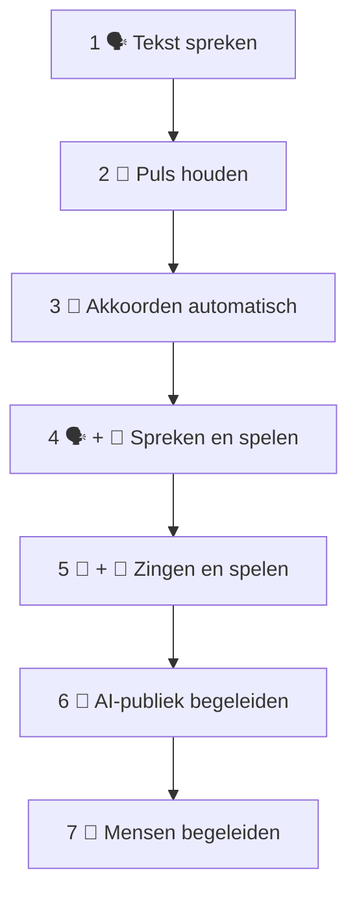

# 🎸 Personal Training Plan

## Van losse vaardigheden naar live faciliteren

---

# 🎯 Probleem

De uiteindelijke taak bestaat uit meerdere vaardigheden:

```text
denken
+
luisteren
+
spreken
+
ritme
+
gitaar
+
zingen
+
publiek begeleiden
```

Alles tegelijkertijd oefenen is inefficiënt.

Daarom trainen we ze afzonderlijk.

---

# 🪜 Skill Ladder



---

# LEVEL 1 — Tekst

Doel:

Lees twaalf regels vloeiend.

Geen gitaar.

Geen metronoom.

Geen zang.

### Geslaagd wanneer:

Je niet meer hoeft te zoeken waar de volgende regel staat.

---

# LEVEL 2 — Puls

Metronoom:

**±70–80 BPM**

Tik:

```text
1 2 3 4
1 2 3 4
```

Spreek tekst erboven.

### Geslaagd wanneer:

Je kunt blijven spreken zonder de puls kwijt te raken.

---

# LEVEL 3 — Gitaar

Speel:

```text
E → A → E → B
```

zonder tekst.

Herhaal minimaal tien cycli.

### Geslaagd wanneer:

Je ondertussen kunt praten.

Bijvoorbeeld:

> "Vandaag gaan we samen iets maken."

zonder dat je handen stoppen.

---

# LEVEL 4 — Spreken + gitaar

Nu:

```text
🎸 E → A → E → B
+
🗣️ tekst
```

Geen zang.

Dit is een zeer belangrijke tussenstap.

---

# LEVEL 5 — Zang + gitaar

Begin NIET met twaalf regels.

Begin met één:

> Wakker met koffie

Herhaal.

Daarna twee regels.

Daarna vier.

---

# 🎯 80%-regel

Ga door naar het volgende niveau wanneer het huidige niveau ongeveer **80% betrouwbaar** voelt.

Niet wachten op perfectie.

---

# LEVEL 6 — Facilitator Mode

Speel gitaar.

Stop.

Vraag AI om een woord.

Schrijf het op.

Pak gitaar opnieuw.

Dit leert:

> onderbreken → communiceren → muziek hervatten.

---

# LEVEL 7 — Chaos Mode

Laat AI onverwachte input geven.

Train herstel.

Bijvoorbeeld:

```text
verkeerde regel
       ↓
lach
       ↓
E-akkoord
       ↓
tel 1-2-3-4
       ↓
verder
```

---

# 📅 Compact dagelijks schema

| Minuten | Training |
|---:|---|
| 5 | E-A-E-B |
| 5 | tekst spreken |
| 5 | spreken + gitaar |
| 5 | zingen + gitaar |
| 10 | AI-simulatie |

Totaal:

**30 minuten**

---

# 🧠 Belangrijk

Een oefening hoeft niet goed te klinken.

Een oefening moet informatie opleveren.

Vraag na iedere sessie:

> **Waar moest ik nog bewust over nadenken?**

Dat onderdeel moet verder geautomatiseerd worden.


