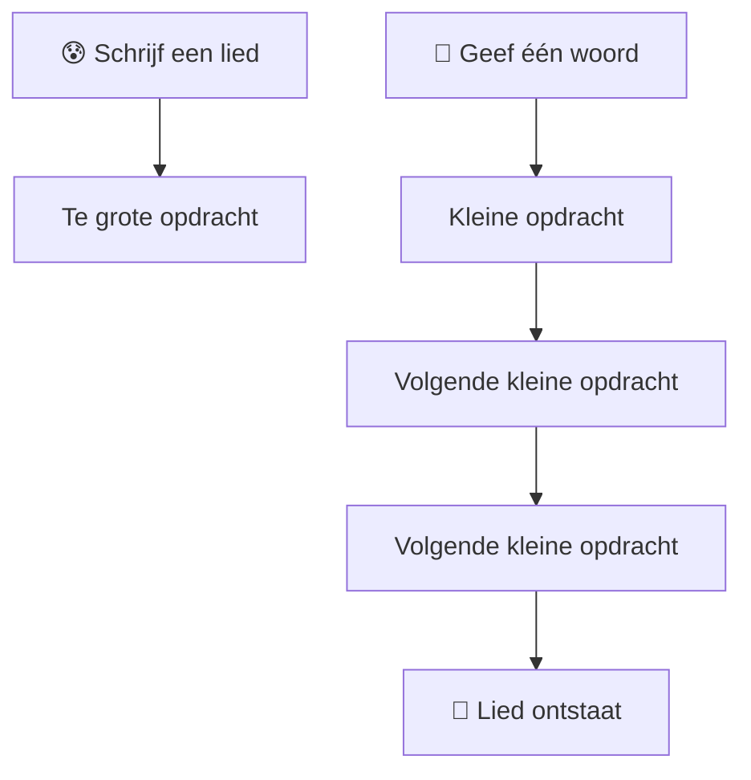
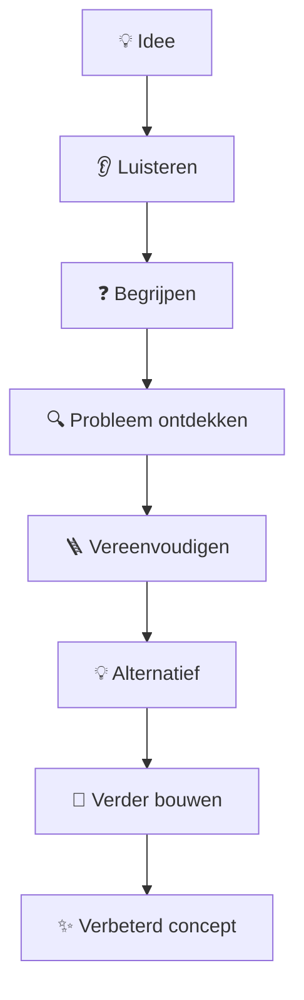
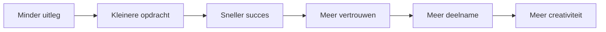
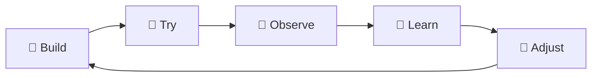

# 🌱 Philosophy

## Waarom bestaat deze methode?

Veel mensen zeggen:

> "Ik kan geen liedjes schrijven."

Of:

> "Ik kan niet zingen."

Of:

> "Ik ben niet muzikaal."

De Vliegbasis71-methode probeert die drempel weg te halen.

Niet door mensen eerst muziektheorie te leren.

Niet door eerst rijmschema's uit te leggen.

Niet door mensen te vertellen hoe een professioneel lied gebouwd wordt.

Maar door de opdracht klein genoeg te maken dat vrijwel iedereen iets kan bijdragen.

---

# 🧠 Van creativiteit naar deelname

Traditioneel kan de opdracht zijn:

> **Schrijf een lied over zondag.**

Dat klinkt eenvoudig.

Maar cognitief bevat die opdracht veel verborgen problemen:

```text
Waar begin ik?
↓
Waar gaat het lied over?
↓
Moet het rijmen?
↓
Hoeveel regels?
↓
Welke melodie?
↓
Welke akkoorden?
↓
Moet ik zingen?
↓
Wat als ik iets doms zeg?
```

De Vliegbasis71-methode splitst dit op.



---

# 🪜 Scaffolding

De facilitator bouwt als het ware een steiger.

De deelnemers hoeven het bouwwerk niet zelf vanaf nul te ontwerpen.

```text
FACILITATOR
│
├── geeft thema
├── geeft voorbeeld
├── bewaakt structuur
├── geeft ankerregels
├── bewaakt tijd
├── geeft ritme
└── draagt muzikale complexiteit

DEELNEMER
│
├── geeft woord
├── geeft korte regel
├── spreekt
├── neuriet
├── klapt
└── mag passen
```

Dat verschil is essentieel.

---

# ❤️ Creatie vóór kwaliteit

De eerste doelstelling is niet:

> **een goed lied.**

De eerste doelstelling is:

> **een gezamenlijke creatieve ervaring.**

Daarom is dit toegestaan:

- gekke woorden;
- eenvoudige regels;
- imperfect rijm;
- grammaticale eigenaardigheden;
- herhaling;
- lachen;
- opnieuw beginnen;
- onverwachte wendingen.

---

# 🔄 Het creatieve feedbackmodel

Een belangrijk principe ontstond tijdens het oorspronkelijke brainstormproces:



Het doel van feedback is hier niet:

> bewijzen dat het oorspronkelijke idee verkeerd was.

Het doel is:

> **het idee uitvoerbaar maken.**

---

# 🧭 De 30-secondenregel

Tijdens een workshop moet steeds duidelijk zijn:

> **Wat moet iemand nu doen?**

Daarom:

| Minder geschikt | Beter |
|---|---|
| Schrijf een couplet | Geef één woord |
| Maak iets muzikaals | Klap vier tellen |
| Bedenk een melodie | Herhaal deze toon |
| Maak het rijmend | Kies tussen deze twee woorden |
| Improviseer | Maak deze zin af |
| Zing mee | Praat, neurie of zing mee |

---

# 🎯 Participant-first design

De facilitator denkt voortdurend vanuit de deelnemer.

```text
Niet:

"Wat wil IK allemaal laten zien?"

Maar:

"Wat kan DEELNEMER nu succesvol doen?"
```

Daaruit volgt:



---

# 🎤 Geen zangplicht

Zingen kan kwetsbaar voelen.

Daarom kent de methode meerdere gelijkwaardige vormen:

| Niveau | Vorm |
|---|---|
| 👂 | luisteren |
| 👏 | klappen |
| 💬 | woord geven |
| 🗣️ | spreken |
| 🎵 | neuriën |
| 📣 | chant |
| 🎤 | zingen |

Geen van deze niveaus is moreel of creatief "beter".

---

# 🎸 De muziek dient de interactie

De gitarist hoeft niet indrukwekkend te spelen.

Sterker:

een ingewikkeld arrangement kan de methode slechter maken.

Waarom?

Omdat aandacht een beperkte bron is.

```text
complex gitaarspel
        ↓
meer aandacht naar handen
        ↓
minder aandacht voor publiek
        ↓
slechtere facilitatie
```

Daarom:

```text
eenvoudig gitaarspel
        ↓
automatisme
        ↓
aandacht blijft beschikbaar
        ↓
oogcontact
        ↓
luisteren
        ↓
groep begeleiden
```

---

# 🧪 Experiment boven perfectie

De methode moet in de praktijk ontwikkeld worden.

Daarom:

> **Build → Try → Observe → Adjust → Repeat**



Een mislukte workshop is dus niet automatisch een mislukking.

Als duidelijk wordt **waarom** iets niet werkte, is er informatie ontstaan.

---

# ⭐ Kernprincipes

1. **Deelname boven prestatie.**
2. **Eenvoud boven muzikale complexiteit.**
3. **Scaffolding boven uitleg.**
4. **Ervaring boven theorie.**
5. **Vrijwilligheid boven groepsdruk.**
6. **Samen creëren boven individueel presteren.**
7. **Experiment boven perfectionisme.**
8. **De facilitator draagt de complexiteit.**
9. **Iedere bijdrage mag klein zijn.**
10. **Het lied is het spoor dat de ontmoeting achterlaat.**

---

# 🛫 Vliegbasis71-principe

> **Maak het klein genoeg om te beginnen.  
> Maak het veilig genoeg om mee te doen.  
> Maak het open genoeg om verrast te worden.**

