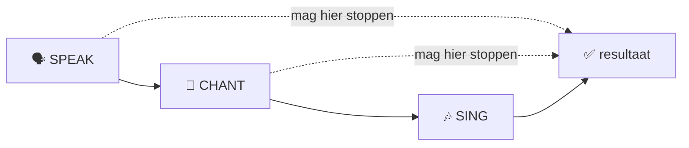

# 🌱 Filosofie

> **Mensen hoeven geen muzikant te worden om samen muziek te kunnen maken.**

De Vliegbasis71 Collaborative Song Method begint niet bij muziektheorie,
zangtechniek of compositie.

De methode begint bij iets dat vrijwel iedereen al bezit:

**woorden, ervaringen, associaties en nieuwsgierigheid.**

Het muzikale resultaat ontstaat daarna stap voor stap.

---

# 🎯 Het werkelijke product

Op het eerste gezicht lijkt het product van een sessie een liedje.

Dat is maar gedeeltelijk waar.

```text
ZICHTBAAR PRODUCT
      │
      ▼
   🎵 liedjie

MAAR DAARONDER:

woorden
   ↓
luisteren
   ↓
bijdragen
   ↓
verbinden
   ↓
samen creëren
   ↓
samen uitvoeren
```

Het liedje is het hoorbare resultaat.

**Participatie is het proces.**

---

# 🧠 Van grote opdracht naar kleine opdracht

Vergelijk deze twee opdrachten.

## ❌ Grote opdracht

> "Schrijf een liedje over zondag."

Een beginner moet dan tegelijkertijd nadenken over:

- onderwerp;
- verhaal;
- woorden;
- rijm;
- ritme;
- melodie;
- structuur;
- zingen;
- beoordeling door anderen.

Dat is veel.

---

## ✅ Kleine opdracht

> "Noem één woord waaraan jij bij zondag denkt."

Bijvoorbeeld:

> **koffie**

Dat is voldoende.

De volgende persoon zegt misschien:

> **zon**

En iemand anders:

> **uitslapen**

Nu bestaat er al materiaal.

```text
NIETS

  ↓

koffie

  ↓

koffie + zon

  ↓

koffie + zon + uitslapen

  ↓

woordenbank

  ↓

korte regels

  ↓

ritme

  ↓

uitvoering
```

---

# 🪜 Scaffolding

Een fundamenteel principe van Vliegbasis71 is:

> **Vrijheid werkt beter wanneer de deelnemer weet waarbinnen hij vrij is.**

Daarom creëert de facilitator vooraf een raamwerk.

```text
┌────────────────────────────────────┐
│         FACILITATOR-KADER          │
│                                    │
│  thema                             │
│  structuur                         │
│  ankerregels                       │
│  tijd                              │
│  ritme                             │
│  muzikale basis                    │
│                                    │
│     ┌──────────────────────┐       │
│     │ CREATIEVE RUIMTE     │       │
│     │                      │       │
│     │ woorden              │       │
│     │ ideeën               │       │
│     │ associaties          │       │
│     │ humor                │       │
│     │ onverwachte regels   │       │
│     └──────────────────────┘       │
└────────────────────────────────────┘
```

De facilitator bouwt de speelplaats.

De deelnemers spelen erin.

---

# 🟢 Voorbereiding is geen valsspelen

Een veelgemaakte denkfout bij improvisatie is:

> "Als ik iets voorbereid, is het niet meer spontaan."

Binnen Vliegbasis71 geldt het tegenovergestelde.

```text
MEER ERVARING DEELNEMERS
        ↑
        │
minder scaffolding nodig
        │
        │
meer scaffolding nodig
        ↓
MINDER ERVARING DEELNEMERS
```

Bij beginners mag de facilitator bijvoorbeeld vooraf hebben:

- het thema;
- vier ankerregels;
- een vaste structuur;
- een akkoordprogressie;
- een tempo;
- een ritme;
- reservewoorden;
- één demonstratie.

Wat niet vooraf vaststaat, is **wat de groep ermee gaat maken**.

---

# 🎨 Creëren vóór corrigeren

Tijdens creatieve processen kan vroege correctie het proces blokkeren.

Daarom kent de methode verschillende fasen.

| Fase | Vraag | Houding |
|---|---|---|
| 💡 Ontdekken | Wat komt bij ons op? | Open |
| 📝 Bouwen | Wat kunnen we ermee maken? | Speels |
| 🧱 Structureren | Waar past het? | Praktisch |
| 🔧 Redigeren | Hoe maken we het uitvoerbaar? | Selectief |
| 🎤 Uitvoeren | Hoe klinkt het samen? | Accepterend |

Een deelnemer die zegt:

> "Pannenkoek."

hoeft niet onmiddellijk te horen:

> "Dat rijmt nergens op."

Misschien wordt het later:

> "Pannenkoek op zondag."

Of:

> "Zondag ruikt naar pannenkoek."

Of het woord wordt helemaal niet gebruikt.

Dat is allemaal toegestaan.

---

# ❤️ Eigenaarschap

Wanneer de facilitator materiaal aanpast, blijft het belangrijk dat de
deelnemer zich eigenaar van zijn bijdrage kan voelen.

Bijvoorbeeld:

**Deelnemer**

> "Op zondag zit ik meestal heel lang met koffie aan tafel omdat ik dan
> eindelijk nergens heen hoef."

**Facilitator**

> "Kunnen we daarvan maken: `Koffie zonder haast`?"

**Deelnemer**

> "Ja."

Dan is het gezamenlijk geredigeerd.

Niet:

> "Nee, veel te lang. We maken er `Koffie zonder haast` van."

Het verschil lijkt klein.

Psychologisch is het groot.

---

# 🗣️ Muziek begint met taal

Vliegbasis71 behandelt gesproken taal al als ritmisch materiaal.

Neem:

> **Wakker met koffie**

Zonder melodie bezit die zin al:

- lettergrepen;
- accenten;
- timing;
- pauzes;
- klankkleur.

Daarom is de volgorde:

```text
WOORD
  ↓
ZIN
  ↓
SPREKEN
  ↓
PULS
  ↓
RITME
  ↓
CHANT
  ↓
MELODIE
```

Niet:

```text
WOORD
  ↓
HELP! WELKE MELODIE?
```

---

# 🗣️ Speak → 🔁 Chant → 🎶 Sing

De methode erkent drie volwaardige uitvoeringsvormen.

### 🗣️ Speak

Ritmisch gesproken tekst.

### 🔁 Chant

Herhalende tekst op één of enkele tonen.

### 🎶 Sing

Tekst met een melodische lijn.



**Zingen is dus geen verplicht eindpunt.**

---

# 🎸 Muzikale eenvoud

De muzikale begeleiding heeft in een beginnerssessie één primaire taak:

> **de groep dragen.**

Niet:

> de muzikale vaardigheden van de facilitator demonstreren.

Daarom heeft een eenvoudige progressie zoals:

```text
E → A → B → A
```

grote waarde wanneer de facilitator die zonder nadenken kan spelen.

Een complex arrangement kan muzikaal interessanter zijn en tegelijkertijd
een slechter workshopinstrument.

---

# 🧘 Fouten horen erbij

Een live creatieve sessie bevat onvermijdelijk:

- vergeten woorden;
- verkeerd ingezette akkoorden;
- lachen;
- verkeerde timing;
- iemand die te vroeg begint;
- iemand die niets weet;
- een zin die niet lekker loopt.

Dat zijn geen uitzonderingen op de methode.

Dat **is** de methode in werking.

```text
FOUT
 ↓
HERKENNEN
 ↓
LACHEN / HERSTELLEN
 ↓
DOORGAAN
```

---

# 🙋 Vrijwilligheid

Iedere deelnemer heeft het recht om:

- alleen te kijken;
- één woord te geven;
- een beurt over te slaan;
- niet te zingen;
- niet solo te spreken;
- alleen gezamenlijk mee te doen.

Daarom geldt:

> **Uitnodigen zonder verplichten.**

---

# 🌉 De facilitator als brug

De facilitator staat tussen twee werelden.

```text
DEELNEMER                        MUZIEK

"regen"                           maat
"koffie"                          ritme
"ik weet niks"                    structuur
"kat"                             akkoorden
"wandelen"                        melodie

          \                      /
           \                    /
            ▼                  ▼
             🎤 FACILITATOR
                   │
                   ▼
          gezamenlijk resultaat
```

De facilitator vertaalt menselijke input naar een vorm die uitvoerbaar wordt.

Dat maakt **luisteren** minstens zo belangrijk als gitaarspelen.

---

# 🌍 Van individu naar groep

De methode probeert een bijzonder moment mogelijk te maken:

```text
MIJN WOORD
   +
JOUW WOORD
   +
HAAR REGEL
   +
ZIJN IDEE
   +
ONS RITME

     ↓

IETS DAT VAN NIEMAND
ALLEEN IS
```

Daar zit de kern van collaborative creation.

---

# ⭐ Kernprincipes

| # | Principe |
|---:|---|
| 1 | 🎯 Maak de eerste opdracht klein |
| 2 | 🪜 Geef beginners meer scaffolding |
| 3 | 💡 Creëer vóór je corrigeert |
| 4 | ❤️ Bescherm eigenaarschap |
| 5 | 🗣️ Begin met spreken |
| 6 | 🎸 Houd muziek eenvoudig |
| 7 | 🙋 Maak deelname vrijwillig |
| 8 | 🤹 Accepteer imperfectie |
| 9 | 👥 Laat bijdragen zichtbaar samenkomen |
| 10 | 🎉 Stop terwijl het nog leuk is |

---

# 🛫 Samengevat

Vliegbasis71 probeert niet te bewijzen:

> **Iedereen is muzikant.**

Het probeert iets praktischers mogelijk te maken:

> **Iedereen kan iets bijdragen aan muziek die samen ontstaat.**

Dat ene woord kan voldoende zijn om te beginnen.

