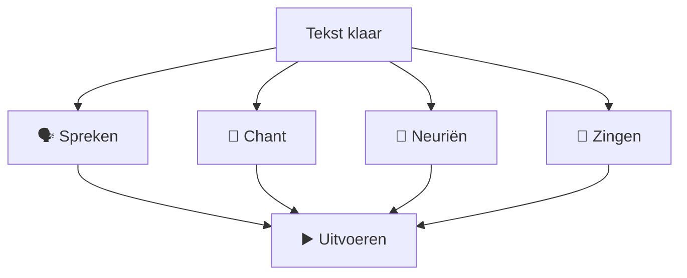
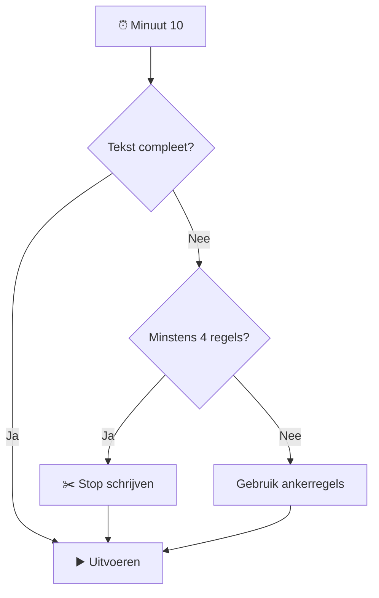

# ⚡ Quick Start

Deze pagina is bedoeld voor:

> **Ik wil het gewoon proberen.**

Geen muziektheorie nodig.

Geen workshopervaring nodig.

Geen perfect lied nodig.

---

# 🎯 Doel

Maak binnen ongeveer **15 minuten** een eenvoudige gezamenlijke tekst en voer hem ritmisch uit.

---

# 🧰 Wat heb je nodig?

### Minimum

- 1 facilitator;
- 1 deelnemer of AI;
- papier / whiteboard / tablet;
- timer.

### Optioneel

- 🎸 gitaar;
- 🥁 metronoom;
- 🎤 microfoon;
- 🔁 looper;
- 🤖 ChatGPT;
- 👥 meerdere deelnemers.

---

# 1️⃣ Kies een thema

Voor de eerste oefening:

> **Zondag**

Andere eenvoudige thema's:

- koffie;
- zomer;
- regen;
- strand;
- trein;
- ochtend;
- avontuur;
- thuis;
- vogels;
- stad.

---

# 2️⃣ Verzamel woorden

Vraag:

> **"Noem één tot drie woorden die jij met zondag associeert."**

Voorbeeld:

```text
koffie
wakker
ontbijt
vogelzang
wandelen
regen
kat
rust
```

Niet analyseren.

Nog niet rijmen.

Alleen verzamelen.

---

# 3️⃣ Gebruik vier ankerregels

Bereid voor beginners vier regels vooraf voor.

Bijvoorbeeld:

```text
1. Wakker met koffie

3. Buiten wordt het licht

7. We lopen langzaam verder

11. Morgen komt vanzelf
```

Deze regels zijn de steiger.

---

# 4️⃣ Vul de lege regels

```text
01  Wakker met koffie
02  ______________________

03  Buiten wordt het licht
04  ______________________
05  ______________________
06  ______________________

07  We lopen langzaam verder
08  ______________________
09  ______________________
10  ______________________

11  Morgen komt vanzelf
12  ______________________
```

Laat deelnemers één regel per keer voorstellen.

---

# 5️⃣ Maak regels klein

Goed:

```text
Regen op ramen
Kat naast mijn stoel
Koffie wordt koud
Vogels zingen buiten
```

Voor de eerste workshop liever niet:

```text
Terwijl ik contemplatief naar de regendruppels
op mijn keukenraam zit te kijken...
```

😁

---

# 6️⃣ Spreek alles hardop

Nog geen gitaar.

Lees gezamenlijk:

```text
Wakker met koffie
Regen op ramen

Buiten wordt het licht
Vogels zingen zacht
Kat naast mijn stoel
Koffie wordt koud
```

Vraag:

> **"Kunnen we dit makkelijk zeggen?"**

Zo niet:

➡️ korter maken.

---

# 7️⃣ Voeg een puls toe

Klap:

```text
1    2    3    4
👏   👏   👏   👏
```

Spreek vervolgens de tekst over de puls.

---

# 8️⃣ Voeg eventueel één akkoord toe

Gitaar:

```text
| E | E | E | E |
```

Meer is niet nodig.

---

# 9️⃣ Kies een uitvoeringsvorm



---

# 🔟 Uitvoeren

Niet opnieuw eindeloos verbeteren.

Tel af:

> **1 — 2 — 3 — 4**

En uitvoeren.

---

# ⏱️ 15-minutenformat

| Tijd | Activiteit |
|---:|---|
| 00:00–01:30 | 👋 uitleg |
| 01:30–03:00 | 🎯 thema |
| 03:00–05:00 | 💬 woorden |
| 05:00–08:00 | ✍️ regels |
| 08:00–10:00 | 🗣️ spreken |
| 10:00–12:00 | 👏 ritme |
| 12:00–14:00 | 🎵 uitvoeren |
| 14:00–15:00 | 🎉 afsluiten |

---

# 🚨 Belangrijk: stop met schrijven

Wanneer je rond minuut 10 bent:

> **STOP.**

Ook als slechts zes regels klaar zijn.

Gebruik die zes.



---

# 🟢 Succescriterium

De oefening is geslaagd wanneer:

- deelnemers iets hebben bijgedragen;
- er minimaal vier regels bestaan;
- de tekst minstens één keer is uitgevoerd.

Niet:

- perfecte zang;
- perfect rijm;
- perfecte timing;
- perfecte gitaar.

---

# 📝 Na afloop

Schrijf drie dingen op:

```text
WERKTE:
________________________________

MOEILIJK:
________________________________

VOLGENDE KEER:
________________________________
```

Dat is genoeg.

➡️ Volgende stap: [12-Line Method](12-line-method-2.md)

