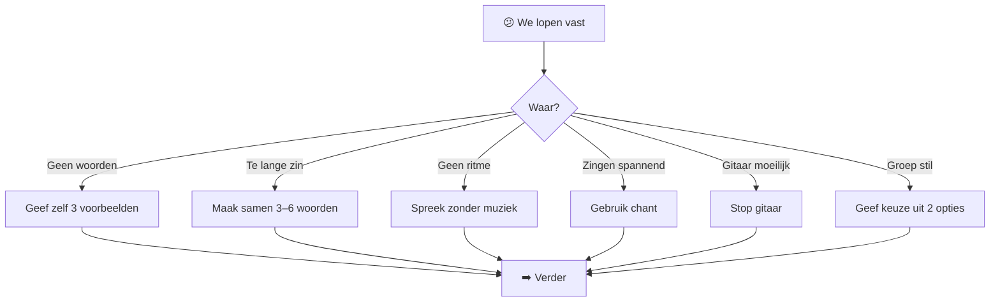
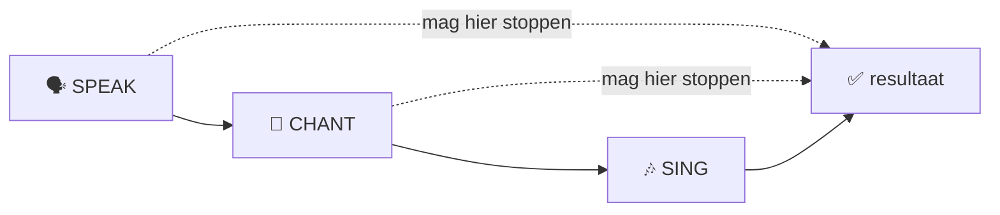
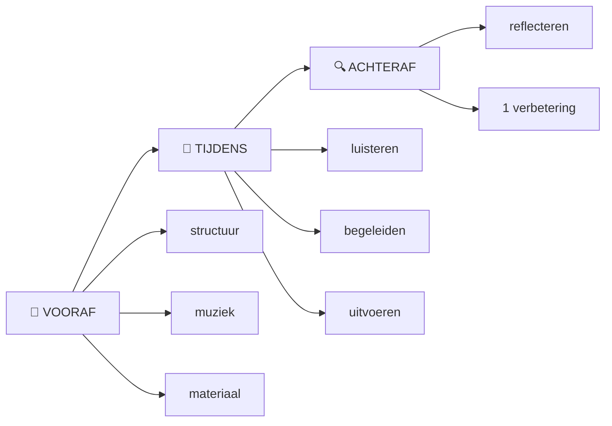
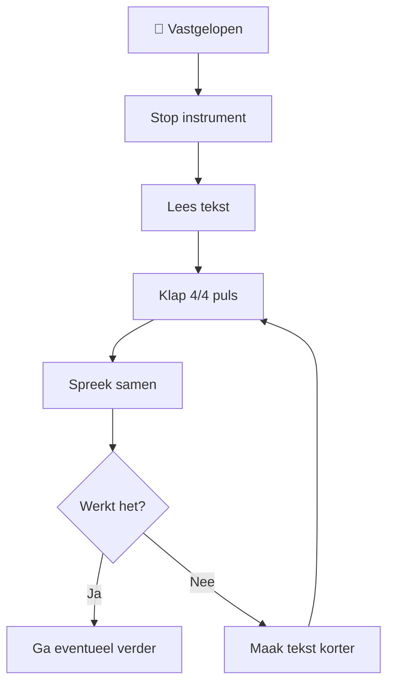

# ⚡ Quick Start — eerste sessie

> **Doel:** binnen ongeveer 15 minuten van losse woorden naar een gezamenlijke uitvoering.

---

# 🎒 Wat heb je nodig?

## Minimaal

- 👤 één facilitator;
- 🙋 één of meer deelnemers;
- 📝 papier, whiteboard of tablet;
- ⏱️ ongeveer 15 minuten.

## Optioneel

- 🎸 gitaar;
- 🎹 keyboard;
- 🥁 eenvoudig ritme;
- 🔊 kleine speaker;
- 📱 telefoon voor opname;
- 🤖 AI voor een oefensessie vooraf.

Je hebt **geen muziekapparatuur nodig** om de methode te testen.

Spoken word is een geldig eindresultaat.

---

# 🟦 VOORAF — 5 minuten voorbereiding

Maak vóór de sessie een Session Card.

```text
━━━━━━━━━━━━━━━━━━━━━━━━━━━━
       VLIEGBASIS71
         SESSION CARD
━━━━━━━━━━━━━━━━━━━━━━━━━━━━

THEMA       : Zondag
NIVEAU      : Beginner
DUUR        : 15 minuten

STRUCTUUR   : 12 regels
MAAT        : 4/4
TEMPO       : 80 BPM
KEY         : E major

AKKOORDEN
E  →  A  →  B  →  A

ANKERREGELS

01 Wakker met koffie
03 Zon door het raam
07 Buiten wordt het rustig
11 Klaar voor morgen

━━━━━━━━━━━━━━━━━━━━━━━━━━━━
```

---

# 🟢 STAP 1 — Leg het spel uit

⏱️ **± 1 minuut**

Gebruik weinig woorden.

Bijvoorbeeld:

> "We gaan samen spelen met woorden.
>
> Ik geef een thema.
> Jullie geven woorden en korte zinnetjes.
> Daarna proberen we daar ritme en eventueel muziek van te maken.
>
> Je hoeft niet te kunnen zingen en meedoen is vrijwillig."

Stop.

Begin.

**Niet eerst vijf minuten muziektheorie uitleggen.**

---

# 🟡 STAP 2 — Verzamel woorden

⏱️ **± 2 minuten**

Vraag:

> **"Noem één tot drie woorden waaraan jij bij zondag denkt."**

Schrijf alles zichtbaar op.

Bijvoorbeeld:

```text
☕ koffie
🌞 zon
😴 uitslapen
🥐 ontbijt
🐈 kat
🌳 wandelen
🎵 muziek
🌧️ regen
🛋️ rust
👨‍👩‍👧 familie
```

### Regel

Tijdens deze stap:

```text
GEEN RIJM
GEEN CORRECTIE
GEEN MUZIEKTHEORIE
GEEN DISCUSSIE

ALLEEN VERZAMELEN
```

---

# 🟠 STAP 3 — Bouw korte regels

⏱️ **± 4 minuten**

Laat jouw vooraf gemaakte ankerregels zien.

```text
01  Wakker met koffie
02  ______________________

03  Zon door het raam
04  ______________________
05  ______________________
06  ______________________

07  Buiten wordt het rustig
08  ______________________
09  ______________________
10  ______________________

11  Klaar voor morgen
12  ______________________
```

Vraag één deelnemer:

> "We hebben `ontbijt`, `kat` en `rust`.
> Welke korte zin kunnen we hiermee maken?"

Is het antwoord lang?

Maak het samen korter.

Bijvoorbeeld:

```text
ORIGINEEL
"Op zondag zit mijn kat altijd bij mij wanneer
ik rustig mijn ontbijt probeer te eten."

        ↓

KORTER
"Kat bij mijn ontbijt."

        ↓

REGEL
Kat naast mijn ontbijt
```

Vraag toestemming voor de verkorte versie.

---

# 🔵 STAP 4 — Lees alles hardop

⏱️ **± 2 minuten**

Nog geen gitaar.

Lees iedere regel.

Luister naar het natuurlijke taalritme.

```text
WAK-ker met KOF-fie

ZON door het RAAM

KAT naast mijn ONT-bijt
```

Klap eventueel een eenvoudige puls:

```text
1   2   3   4
👏  👏  👏  👏
```

Pas alleen regels aan die duidelijk niet werken.

---

# 🟣 STAP 5 — Maak er ritme van

⏱️ **± 2 minuten**

Spreek de regels opnieuw.

Nu in een vaste puls.

```text
| 1      2      3      4      |
| Wakker met koffie           |

| 1      2      3      4      |
| Zon door het raam           |
```

Het hoeft niet perfect metrisch te zijn.

De taal mag over de maat bewegen.

---

# 🎸 STAP 6 — Voeg eenvoudige muziek toe

⏱️ **± 2 minuten**

Voor de beginnersversie:

```text
KEY: E major
TIME: 4/4
BPM: ±80

| E | A | B | A |
```

Gebruik één patroon dat je vooraf hebt geoefend.

> ⚠️ Tijdens een workshop is een saai patroon dat automatisch gaat
> waardevoller dan een prachtig patroon waarbij de facilitator moet nadenken.

Speel eerst zonder zang.

Spreek daarna de tekst over het patroon.

---

# 🎤 STAP 7 — Demonstreer

Speel één volledige ronde.

De groep hoeft alleen te luisteren.

Daarna:

> **"Zullen we hem samen proberen?"**

Mogelijkheden:

```text
ALLEEN LUISTEREN
       ↓
LAATSTE WOORD MEEZEGGEN
       ↓
HELE REGEL MEEZEGGEN
       ↓
CHANT
       ↓
MEEZINGEN
```

Iedere deelnemer bepaalt zelf hoe ver hij of zij meegaat.

---

# 🎉 STAP 8 — Stop

Na één of twee succesvolle rondes:

**stop.**

Niet onmiddellijk:

- twintig arrangementwijzigingen;
- betere akkoorden zoeken;
- zang corrigeren;
- perfecte rijmwoorden bedenken.

Zeg bijvoorbeeld:

> "Vijftien minuten geleden hadden we alleen een thema.
> Nu hebben we iets dat we samen kunnen uitvoeren."

👏 Klaar.

---

# 🧭 Als je vastloopt



---

# 🆘 De belangrijkste noodknop

Wanneer alles tegelijk moeilijk wordt:

```text
STOP MUZIEK
    ↓
SPREEK TEKST
    ↓
KLAP PULS
    ↓
SAMEN SPREKEN
```

Dat **is nog steeds een succesvolle Vliegbasis71-sessie**.

---

# 🔁 Na afloop

Noteer slechts drie dingen.

| Vraag | Antwoord |
|---|---|
| 🟢 Wat werkte? | |
| 🟠 Waar ontstond verwarring? | |
| 🔵 Wat verander ik volgende keer? | |

Kies vervolgens **één** verbeterpunt voor de volgende sessie.

Niet tien.

---

# ⭐ Succescriterium

```text
NIETS
  ↓
WOORDEN
  ↓
SAMENWERKING
  ↓
RITME
  ↓
IETS DAT BESTAAT
```

> **Perfectie is niet het product. Participatie is het product.**


---
[2026-08-09 16:36 CEST, ID: T3K8R6M2]

Denkpatroon: Batch 1 is geaccepteerd. We bouwen nu de laag die bepaalt waarom de methode zo ontworpen is, hoe de facilitator zich gedraagt en wat vóór iedere sessie voorbereid moet worden. Ik houd dit bewust praktisch: de GitHub-repository heeft al een docs/-structuur en MkDocs-configuratie, dus deze bestanden kunnen straks rechtstreeks in die documentatieboom landen.  

Antwoord:

🚀 Ronde 5 — Batch 2

Deze batch bevat de volledige Markdown voor:

docs/collaborative-song/
│
├── philosophy.md          ← WAAROM
├── facilitator-guide.md   ← HOE
└── session-card.md        ← VOORBEREIDING

⸻

📄 1. philosophy.md

---
title: Filosofie
description: Ontwerpprincipes achter de Vliegbasis71 Collaborative Song Method.
version: 0.1
status: experimental
language: nl
---
# 🌱 Filosofie
> **Mensen hoeven geen muzikant te worden om samen muziek te kunnen maken.**
De Vliegbasis71 Collaborative Song Method begint niet bij muziektheorie,
zangtechniek of compositie.
De methode begint bij iets dat vrijwel iedereen al bezit:
**woorden, ervaringen, associaties en nieuwsgierigheid.**
Het muzikale resultaat ontstaat daarna stap voor stap.
---
# 🎯 Het werkelijke product
Op het eerste gezicht lijkt het product van een sessie een liedje.
Dat is maar gedeeltelijk waar.
```text
ZICHTBAAR PRODUCT
      │
      ▼
   🎵 liedjie
MAAR DAARONDER:
woorden
   ↓
luisteren
   ↓
bijdragen
   ↓
verbinden
   ↓
samen creëren
   ↓
samen uitvoeren
```
Het liedje is het hoorbare resultaat.
**Participatie is het proces.**
---
# 🧠 Van grote opdracht naar kleine opdracht
Vergelijk deze twee opdrachten.
## ❌ Grote opdracht
> "Schrijf een liedje over zondag."
Een beginner moet dan tegelijkertijd nadenken over:
- onderwerp;
- verhaal;
- woorden;
- rijm;
- ritme;
- melodie;
- structuur;
- zingen;
- beoordeling door anderen.
Dat is veel.
---
## ✅ Kleine opdracht
> "Noem één woord waaraan jij bij zondag denkt."
Bijvoorbeeld:
> **koffie**
Dat is voldoende.
De volgende persoon zegt misschien:
> **zon**
En iemand anders:
> **uitslapen**
Nu bestaat er al materiaal.
```text
NIETS
  ↓
koffie
  ↓
koffie + zon
  ↓
koffie + zon + uitslapen
  ↓
woordenbank
  ↓
korte regels
  ↓
ritme
  ↓
uitvoering
```
---
# 🪜 Scaffolding
Een fundamenteel principe van Vliegbasis71 is:
> **Vrijheid werkt beter wanneer de deelnemer weet waarbinnen hij vrij is.**
Daarom creëert de facilitator vooraf een raamwerk.
```text
┌────────────────────────────────────┐
│         FACILITATOR-KADER          │
│                                    │
│  thema                             │
│  structuur                         │
│  ankerregels                       │
│  tijd                              │
│  ritme                             │
│  muzikale basis                    │
│                                    │
│     ┌──────────────────────┐       │
│     │ CREATIEVE RUIMTE     │       │
│     │                      │       │
│     │ woorden              │       │
│     │ ideeën               │       │
│     │ associaties          │       │
│     │ humor                │       │
│     │ onverwachte regels   │       │
│     └──────────────────────┘       │
└────────────────────────────────────┘
```
De facilitator bouwt de speelplaats.
De deelnemers spelen erin.
---
# 🟢 Voorbereiding is geen valsspelen
Een veelgemaakte denkfout bij improvisatie is:
> "Als ik iets voorbereid, is het niet meer spontaan."
Binnen Vliegbasis71 geldt het tegenovergestelde.
```text
MEER ERVARING DEELNEMERS
        ↑
        │
minder scaffolding nodig
        │
        │
meer scaffolding nodig
        ↓
MINDER ERVARING DEELNEMERS
```
Bij beginners mag de facilitator bijvoorbeeld vooraf hebben:
- het thema;
- vier ankerregels;
- een vaste structuur;
- een akkoordprogressie;
- een tempo;
- een ritme;
- reservewoorden;
- één demonstratie.
Wat niet vooraf vaststaat, is **wat de groep ermee gaat maken**.
---
# 🎨 Creëren vóór corrigeren
Tijdens creatieve processen kan vroege correctie het proces blokkeren.
Daarom kent de methode verschillende fasen.
| Fase | Vraag | Houding |
|---|---|---|
| 💡 Ontdekken | Wat komt bij ons op? | Open |
| 📝 Bouwen | Wat kunnen we ermee maken? | Speels |
| 🧱 Structureren | Waar past het? | Praktisch |
| 🔧 Redigeren | Hoe maken we het uitvoerbaar? | Selectief |
| 🎤 Uitvoeren | Hoe klinkt het samen? | Accepterend |
Een deelnemer die zegt:
> "Pannenkoek."
hoeft niet onmiddellijk te horen:
> "Dat rijmt nergens op."
Misschien wordt het later:
> "Pannenkoek op zondag."
Of:
> "Zondag ruikt naar pannenkoek."
Of het woord wordt helemaal niet gebruikt.
Dat is allemaal toegestaan.
---
# ❤️ Eigenaarschap
Wanneer de facilitator materiaal aanpast, blijft het belangrijk dat de
deelnemer zich eigenaar van zijn bijdrage kan voelen.
Bijvoorbeeld:
**Deelnemer**
> "Op zondag zit ik meestal heel lang met koffie aan tafel omdat ik dan
> eindelijk nergens heen hoef."
**Facilitator**
> "Kunnen we daarvan maken: `Koffie zonder haast`?"
**Deelnemer**
> "Ja."
Dan is het gezamenlijk geredigeerd.
Niet:
> "Nee, veel te lang. We maken er `Koffie zonder haast` van."
Het verschil lijkt klein.
Psychologisch is het groot.
---
# 🗣️ Muziek begint met taal
Vliegbasis71 behandelt gesproken taal al als ritmisch materiaal.
Neem:
> **Wakker met koffie**
Zonder melodie bezit die zin al:
- lettergrepen;
- accenten;
- timing;
- pauzes;
- klankkleur.
Daarom is de volgorde:
```text
WOORD
  ↓
ZIN
  ↓
SPREKEN
  ↓
PULS
  ↓
RITME
  ↓
CHANT
  ↓
MELODIE
```
Niet:
```text
WOORD
  ↓
HELP! WELKE MELODIE?
```
---
# 🗣️ Speak → 🔁 Chant → 🎶 Sing
De methode erkent drie volwaardige uitvoeringsvormen.
### 🗣️ Speak
Ritmisch gesproken tekst.
### 🔁 Chant
Herhalende tekst op één of enkele tonen.
### 🎶 Sing
Tekst met een melodische lijn.

**Zingen is dus geen verplicht eindpunt.**
---
# 🎸 Muzikale eenvoud
De muzikale begeleiding heeft in een beginnerssessie één primaire taak:
> **de groep dragen.**
Niet:
> de muzikale vaardigheden van de facilitator demonstreren.
Daarom heeft een eenvoudige progressie zoals:
```text
E → A → B → A
```
grote waarde wanneer de facilitator die zonder nadenken kan spelen.
Een complex arrangement kan muzikaal interessanter zijn en tegelijkertijd
een slechter workshopinstrument.
---
# 🧘 Fouten horen erbij
Een live creatieve sessie bevat onvermijdelijk:
- vergeten woorden;
- verkeerd ingezette akkoorden;
- lachen;
- verkeerde timing;
- iemand die te vroeg begint;
- iemand die niets weet;
- een zin die niet lekker loopt.
Dat zijn geen uitzonderingen op de methode.
Dat **is** de methode in werking.
```text
FOUT
 ↓
HERKENNEN
 ↓
LACHEN / HERSTELLEN
 ↓
DOORGAAN
```
---
# 🙋 Vrijwilligheid
Iedere deelnemer heeft het recht om:
- alleen te kijken;
- één woord te geven;
- een beurt over te slaan;
- niet te zingen;
- niet solo te spreken;
- alleen gezamenlijk mee te doen.
Daarom geldt:
> **Uitnodigen zonder verplichten.**
---
# 🌉 De facilitator als brug
De facilitator staat tussen twee werelden.
```text
DEELNEMER                        MUZIEK
"regen"                           maat
"koffie"                          ritme
"ik weet niks"                    structuur
"kat"                             akkoorden
"wandelen"                        melodie
          \                      /
           \                    /
            ▼                  ▼
             🎤 FACILITATOR
                   │
                   ▼
          gezamenlijk resultaat
```
De facilitator vertaalt menselijke input naar een vorm die uitvoerbaar wordt.
Dat maakt **luisteren** minstens zo belangrijk als gitaarspelen.
---
# 🌍 Van individu naar groep
De methode probeert een bijzonder moment mogelijk te maken:
```text
MIJN WOORD
   +
JOUW WOORD
   +
HAAR REGEL
   +
ZIJN IDEE
   +
ONS RITME
     ↓
IETS DAT VAN NIEMAND
ALLEEN IS
```
Daar zit de kern van collaborative creation.
---
# ⭐ Kernprincipes
| # | Principe |
|---:|---|
| 1 | 🎯 Maak de eerste opdracht klein |
| 2 | 🪜 Geef beginners meer scaffolding |
| 3 | 💡 Creëer vóór je corrigeert |
| 4 | ❤️ Bescherm eigenaarschap |
| 5 | 🗣️ Begin met spreken |
| 6 | 🎸 Houd muziek eenvoudig |
| 7 | 🙋 Maak deelname vrijwillig |
| 8 | 🤹 Accepteer imperfectie |
| 9 | 👥 Laat bijdragen zichtbaar samenkomen |
| 10 | 🎉 Stop terwijl het nog leuk is |
---
# 🛫 Samengevat
Vliegbasis71 probeert niet te bewijzen:
> **Iedereen is muzikant.**
Het probeert iets praktischers mogelijk te maken:
> **Iedereen kan iets bijdragen aan muziek die samen ontstaat.**
Dat ene woord kan voldoende zijn om te beginnen.

⸻

📄 2. facilitator-guide.md

Dit wordt een van de belangrijkste documenten van het hele systeem.

---
title: Facilitator Guide
description: Praktische handleiding voor het begeleiden van een Vliegbasis71 Collaborative Song sessie.
version: 0.1
status: experimental
language: nl
---
# 🎤 Facilitator Guide
> **Jouw taak is niet het beste liedje maken.  
> Jouw taak is zorgen dat mensen kunnen bijdragen.**
De facilitator is tegelijk:
- 🧭 gids;
- 👂 luisteraar;
- ✍️ lichte redacteur;
- 🥁 ritmehouder;
- 🎸 muzikale begeleider;
- 🧱 structuurhouder;
- 🙋 uitnodiger.
Dat lijkt veel.
Daarom wordt zoveel mogelijk **vooraf vereenvoudigd**.
---
# 🧭 De drie fasen van faciliteren

---
# 🎒 Fase A — Vooraf
## 1. Kies het niveau
| Niveau | Publiek | Voorbereiding |
|---|---|---|
| 🟢 L1 | Complete beginners | Zeer veel |
| 🟡 L2 | Enige ervaring | Veel |
| 🟠 L3 | Creatieve groep | Gemiddeld |
| 🔴 L4 | Ervaren improvisatoren | Weinig |
Voor de eerste praktijkproeven:
> **Gebruik L1.**
---
# 🎯 2. Kies één thema
Een goed beginnersthema:
- is herkenbaar;
- vraagt geen specialistische kennis;
- heeft veel associaties;
- hoeft niet persoonlijk te zijn.
### Voorbeelden
| 🟢 Makkelijk | 🟡 Iets abstracter |
|---|---|
| Zondag | Vrijheid |
| Koffie | Verandering |
| Strand | Verbinding |
| Regen | Avontuur |
| Vakantie | Thuiskomen |
| Ochtend | Moed |
| Fietsen | Nieuw begin |
---
# ✍️ 3. Bereid ankerregels voor
Voor het 12-Line Format:
```text
01  ANKER
02  publiek
03  ANKER
04  publiek
05  publiek
06  publiek
07  ANKER
08  publiek
09  publiek
10  publiek
11  ANKER
12  publiek
```
De ankerregels:
- geven richting;
- verminderen cognitieve belasting;
- voorkomen een volledig lege pagina;
- helpen het verhaal vooruit.
---
# 🧰 4. Maak een reservewoordenbank
Voor thema **Zondag**:
```text
koffie
rust
zon
ontbijt
wandelen
regen
familie
krant
muziek
bank
kat
park
```
Gebruik deze woorden alleen wanneer de groep vastloopt.
Niet wanneer de groep zelf genoeg materiaal produceert.
---
# 🎸 5. Automatiseer de muzikale basis
Voor een beginnerssessie moet je begeleiding bijna op automatische piloot kunnen.
Bijvoorbeeld:
```text
KEY:  E major
TIME: 4/4
BPM:  80
| E | A | B | A |
```
Oefen:
```text
gitaar
  ↓
gitaar + tellen
  ↓
gitaar + praten
  ↓
gitaar + willekeurige woorden
  ↓
gitaar + tekst
```
Wanneer `gitaar + praten` nog moeilijk is:
**vereenvoudig de gitaar.**
---
# 🎤 Fase B — Tijdens
# 1. Open kort
Doel:
**binnen ongeveer één minuut beginnen.**
Bijvoorbeeld:
> "We gaan samen spelen met woorden.
>
> Het thema is zondag.
> Jullie hoeven geen muzikant te zijn en niemand hoeft solo te zingen.
>
> Geef straks gewoon één tot drie woorden.
> Daarmee bouwen we samen iets."
Daarna:
**begin.**
---
# 👂 2. Stel één vraag tegelijk
## ❌ Niet
> "Geef drie woorden en probeer daar dan een zin van te maken die eventueel
> rijmt en ongeveer vier tellen heeft."
## ✅ Wel
> "Welke woorden passen voor jou bij zondag?"
Wacht.
Volgende stap pas daarna.
---
# ⏳ 3. Verdraag stilte
Na een vraag kan vijf seconden stilte enorm lang voelen.
Niet onmiddellijk zelf antwoorden.
```text
VRAAG
  ↓
...
  ↓
stilte
  ↓
denken
  ↓
antwoord
```
De facilitator hoeft niet iedere lege seconde te vullen.
---
# 💬 4. Herhaal bijdragen
Deelnemer:
> "Koffie."
Facilitator:
> "Koffie. Mooi."
Schrijf:
```text
☕ koffie
```
Dat doet drie dingen:
1. bevestigt dat je gehoord hebt;
2. maakt de bijdrage zichtbaar;
3. geeft de groep tijd om verder te denken.
---
# 🚫 5. Beoordeel ideeën niet te vroeg
Vermijd:
> "Nee."
> "Dat past niet."
> "Dat is moeilijk."
> "Daar kunnen we niks mee."
Gebruik liever:
> "Ik schrijf hem erbij."
of:
> "Laten we kijken waar hij past."
---
# ✂️ 6. Redigeer samen
Wanneer een regel te lang is:
```text
DEELNEMER
   ↓
lange gedachte
   ↓
FACILITATOR
"Kunnen we hem korter maken?"
   ↓
voorstel
   ↓
DEELNEMER akkoord?
   ↓
korte regel
```
### Voorbeeld
> "Ik vind het heerlijk om zondag heel lang in mijn bed te blijven liggen."
↓
> "Zondag blijf ik liggen."
↓
> "Zondag lekker liggen."
De groep kan kiezen.
---
# 🧠 7. Bewaak cognitieve belasting
Let op signalen:
- lange stilte;
- mensen kijken weg;
- grapjes uit ongemak;
- steeds dezelfde persoon antwoordt;
- deelnemers vragen wat ze moeten doen;
- discussie over regels in plaats van spelen.
Dan geldt:
```text
TE MOEILIJK
   ↓
VERKLEIN OPDRACHT
```
Bijvoorbeeld:
Van:
> "Maak een regel."
naar:
> "Kies: koffie of wandelen?"
---
# 🙋 8. Laat overslaan toe
Een eenvoudige zin:
> "Overslaan mag altijd."
kan de hele sfeer veranderen.
Iemand die niet gedwongen wordt, doet later soms juist vrijwillig mee.
---
# 🗣️ 9. Spreek vóór muziek
Wanneer de tekst klaar is:
**leg de gitaar nog even neer.**
Lees samen.
```text
tekst
 ↓
hardop
 ↓
accent
 ↓
puls
 ↓
ritme
```
Pas daarna:
```text
ritme
 ↓
gitaar
```
---
# 🎸 10. Muziek moet ondersteunen
Als jij tijdens het spelen denkt:
> "Shit, welk akkoord komt nou?"
dan is het arrangement waarschijnlijk te moeilijk.
Gebruik desnoods:
```text
E    E    E    E
```
één akkoord.
Een succesvolle sessie op één akkoord is beter dan een mislukte sessie op zeven.
---
# 🎤 11. Demonstreer vóór je deelname vraagt
De facilitator speelt eerst één keer.
```text
FACILITATOR
    ↓
demonstratie
    ↓
groep begrijpt vorm
    ↓
uitnodiging
    ↓
SAMEN
```
Mensen hoeven dan niet te gokken wat jij bedoelt.
---
# 👥 12. Bouw deelname trapsgewijs op
```text
👀 KIJKEN
    ↓
👏 PULS KLAPPEN
    ↓
🗣️ LAATSTE WOORD
    ↓
🗣️ HELE REGEL
    ↓
🔁 CHANT
    ↓
🎶 ZINGEN
```
Nooit:
```text
"Oké allemaal, ZINGEN!"
```
tegen een groep die drie minuten geleden nog dacht dat ze naar een praatje kwam.
---
# 😂 13. Gebruik fouten
Gitaar verkeerd?
> "Ha — verkeerde afslag. Nog een keer."
Regel vergeten?
> "Wie weet onze volgende regel?"
De groep kan je helpen.
Een fout kan daarmee juist participatie opleveren.
---
# ⏹️ 14. Weet wanneer je moet stoppen
Signalen van een goed stoppunt:
- iedereen heeft het eenmaal uitgevoerd;
- er wordt gelachen;
- het resultaat is herkenbaar;
- energie is nog hoog.
Stop dan.
Niet:
> "Nu gaan we hem professioneel arrangeren."
---
# 🆘 Noodprotocol
Wanneer de sessie ontspoort:

De gouden regel:
> **Wanneer muziek het moeilijker maakt, haal muziek tijdelijk weg.**
---
# 🔍 Fase C — Achteraf
Geen evaluatieformulier van vijf pagina's.
Beantwoord drie vragen.
## 🟢 Wat werkte?
...
## 🟠 Waar ontstond verwarring?
...
## 🔵 Wat verander ik één volgende keer?
...
---
# 📊 Facilitator self-check
| Vaardigheid | 😬 Nog lastig | 🙂 Redelijk | 😎 Automatisch |
|---|:---:|:---:|:---:|
| Korte uitleg geven | ☐ | ☐ | ☐ |
| Stilte verdragen | ☐ | ☐ | ☐ |
| Bijdragen samenvatten | ☐ | ☐ | ☐ |
| Lange regels inkorten | ☐ | ☐ | ☐ |
| Ritme vasthouden | ☐ | ☐ | ☐ |
| Gitaar + praten | ☐ | ☐ | ☐ |
| Fouten laten bestaan | ☐ | ☐ | ☐ |
| Vrijwilligheid bewaken | ☐ | ☐ | ☐ |
| Groepsenergie lezen | ☐ | ☐ | ☐ |
| Op tijd stoppen | ☐ | ☐ | ☐ |
---
# 🤖 AI-oefening
Voordat je een echte sessie doet, kun je een AI vragen een beginner te simuleren.
De facilitator voert vervolgens de **echte instructies** uit.
Niet:
> "Maak een goed liedje voor mij."
Maar:
> "Ik ben facilitator. Jij bent deelnemer. Reageer alleen op mijn opdrachten."
Daarmee oefen je vooral:
- instructies;
- vraagstelling;
- structuur;
- onverwachte antwoorden;
- tempo van de sessie.
---
# ⭐ Facilitator mantra
Wanneer je tijdens de workshop niet meer weet wat je moet doen:
> **Maak het kleiner.**
```text
LIEDJIE TE MOEILIJK?
      ↓
CHANT
CHANT TE MOEILIJK?
      ↓
SPREEK
REGEL TE MOEILIJK?
      ↓
ZINNETJE
ZINNETJE TE MOEILIJK?
      ↓
WOORD
WOORD?
      ↓
DAAR KUNNEN WE BEGINNEN
```

⸻

📄 3. session-card.md

Dit document maken we bewust printbaar én AI-parseerbaar.

---
title: Session Card
description: Voorbereidingssjabloon voor een Vliegbasis71 Collaborative Song sessie.
version: 0.1
status: experimental
language: nl
---
# 🗂️ Vliegbasis71 Session Card
> Vul één Session Card in vóór iedere geplande sessie.
Een Session Card voorkomt dat de facilitator tijdens de workshop tegelijkertijd
de structuur, muziek én instructies moet verzinnen.
---
# 🟦 1. Sessiedetails
| Veld | Waarde |
|---|---|
| 📅 Datum | |
| 📍 Locatie | |
| 🎯 Thema | |
| 👥 Verwacht aantal deelnemers | |
| ⏱️ Beschikbare tijd | |
| 🪜 Niveau | Beginner / Intermediate / Advanced |
| 🗣️ Taal | |
| 🎵 Format | 4-Line / 8-Line / 12-Line / Spoken Word |
---
# 🟩 2. Doel
Maak het doel klein en observeerbaar.
**Vandaag wil ik dat deelnemers:**
> ...
Voorbeeld:
> Binnen ongeveer 15 minuten minimaal één woord bijdragen en gezamenlijk
> een korte ritmische tekst uitvoeren.
---
# 🟨 3. Openingsscript
Maximaal ongeveer 60 seconden.
```text
We gaan vandaag ____________________________________________
Het thema is ______________________________________________
Jullie hoeven niet _________________________________________
Ik vraag jullie straks om __________________________________
Overslaan mag altijd.
We beginnen met ____________________________________________
```
---
# 🟧 4. Woordenbank — reserve
> Alleen gebruiken wanneer de groep vastloopt.
| # | Woord |
|---:|---|
| 1 | |
| 2 | |
| 3 | |
| 4 | |
| 5 | |
| 6 | |
| 7 | |
| 8 | |
| 9 | |
| 10 | |
| 11 | |
| 12 | |
---
# 🟥 5. Tekststructuur
## 12-Line Template
```text
01  ______________________________________  ← ANKER
02  ______________________________________
03  ______________________________________  ← ANKER
04  ______________________________________
05  ______________________________________
06  ______________________________________
07  ______________________________________  ← ANKER
08  ______________________________________
09  ______________________________________
10  ______________________________________
11  ______________________________________  ← ANKER
12  ______________________________________
```
---
# 🟪 6. Voorbereide ankerregels
| Regel | Tekst | Functie |
|---:|---|---|
| 01 | | Start |
| 03 | | Richting |
| 07 | | Nieuwe beweging |
| 11 | | Landing |
---
# 🎵 7. Muzikale basis
| Parameter | Instelling |
|---|---|
| 🎼 Key | |
| 🥁 BPM | |
| ⏱️ Time signature | 4/4 |
| 🎸 Progression | |
| 🪕 Pattern | |
| 🗣️ Startvorm | Speak |
| 🔁 Tweede vorm | Chant |
| 🎶 Optionele vorm | Sing |
---
# 🎸 8. Akkoordkaart
```text
|       |       |       |       |
|_______|_______|_______|_______|
|       |       |       |       |
|_______|_______|_______|_______|
```
Voorbeeld:
```text
|   E   |   A   |   B   |   A   |
|_______|_______|_______|_______|
```
---
# 🥁 9. Ritmekaart
```text
TEL:
| 1       2       3       4       |
|         |       |       |       |
PATROON:
|_________________________________|
```
---
# 🛟 10. Backupplan
## Wanneer niemand woorden geeft
Ik geef deze drie voorbeelden:
1. __________________
2. __________________
3. __________________
---
## Wanneer regels te moeilijk worden
Ik verklein de opdracht naar:
> __________________________________________
---
## Wanneer zingen spannend wordt
```text
SING
 ↓
CHANT
 ↓
SPEAK
```
---
## Wanneer gitaarspelen misgaat
```text
STOP GITAAR
    ↓
KLAP PULS
    ↓
SPREEK SAMEN
```
---
# 🙋 11. Participatieladder
Tijdens de sessie mag iedere deelnemer zelf ergens op deze ladder blijven.
```text
👀 KIJKEN
    ↓
💬 WOORD
    ↓
✍️ REGEL
    ↓
👏 KLAPPEN
    ↓
🗣️ SPREKEN
    ↓
🔁 CHANT
    ↓
🎶 ZINGEN
    ↓
🎸 MEE SPELEN
```
---
# ⏱️ 12. Tijdplan
| Tijd | Activiteit | Klaar |
|---:|---|:---:|
| 00–01 | Intro | ☐ |
| 01–03 | Woorden | ☐ |
| 03–07 | Regels | ☐ |
| 07–09 | Hardop lezen | ☐ |
| 09–11 | Ritme | ☐ |
| 11–13 | Muziek | ☐ |
| 13–15 | Uitvoeren | ☐ |
---
# 🎬 13. Demonstratie
Wat demonstreer ik eerst?
```text
☐ Alleen ritme
☐ Ritme + spreken
☐ Gitaar + spreken
☐ Gitaar + chant
☐ Volledige zang
```
Mijn demonstratie duurt ongeveer:
> ______ seconden
---
# 🧠 14. Persoonlijke oefencheck vóór vertrek
```text
[ ] Ik kan de akkoordprogressie zonder nadenken spelen.
[ ] Ik kan tijdens het spelen hardop 1-2-3-4 tellen.
[ ] Ik kan tijdens het spelen praten.
[ ] Ik ken mijn vier ankerregels.
[ ] Ik weet wat mijn eerste vraag is.
[ ] Ik heb reservewoorden.
[ ] Ik weet wat ik doe wanneer niemand reageert.
[ ] Ik accepteer dat spoken word voldoende kan zijn.
[ ] Ik hoef geen perfecte uitvoering neer te zetten.
```
---
# 🔍 15. Evaluatie na afloop
## 🟢 Wat werkte?
> ...
---
## 🟠 Waar ontstond verwarring?
> ...
---
## 🔵 Eén verandering voor volgende keer
> ...
---
# 📊 Sessiescore
Geef geen rapportcijfer voor muzikale kwaliteit.
Beoordeel het **proces**.
| Aspect | 1 | 2 | 3 | 4 | 5 |
|---|:---:|:---:|:---:|:---:|:---:|
| Deelnemers begrepen opdracht | ○ | ○ | ○ | ○ | ○ |
| Deelname voelde vrijwillig | ○ | ○ | ○ | ○ | ○ |
| Mensen leverden materiaal | ○ | ○ | ○ | ○ | ○ |
| Structuur bleef begrijpelijk | ○ | ○ | ○ | ○ | ○ |
| Facilitator bleef ontspannen | ○ | ○ | ○ | ○ | ○ |
| Groep voerde iets samen uit | ○ | ○ | ○ | ○ | ○ |
| Er was plezier / nieuwsgierigheid | ○ | ○ | ○ | ○ | ○ |
---
# 🤖 Machine-readable Session Definition
Deze sectie maakt het mogelijk om dezelfde sessie later eenvoudig aan een
AI-assistent te geven.
```yaml
vliegbasis71_session:
  version: "0.1"
  theme: ""
  language: "nl"
  difficulty: "beginner"
  duration_minutes: 15
  participants: null
  format:
    type: "12-line"
    anchor_lines:
      - 1
      - 3
      - 7
      - 11
  music:
    key: ""
    bpm: null
    time_signature: "4/4"
    progression: []
    pattern: ""
  performance:
    start_mode: "speak"
    allow_chant: true
    allow_singing: true
    singing_required: false
  participation:
    voluntary: true
    minimum_contribution: "one-word"
    skipping_allowed: true
  facilitator:
    prepared_anchor_lines:
      1: ""
      3: ""
      7: ""
      11: ""
    reserve_words: []
  success:
    musical_perfection_required: false
    collaborative_output_required: true
```
---
# ⭐ Voorbeeld — ingevulde Session Card
## Thema: Zondag
| Parameter | Waarde |
|---|---|
| 🎯 Thema | Zondag |
| 👥 Personen | 4–8 |
| ⏱️ Tijd | 15 minuten |
| 🎼 Key | E major |
| 🥁 BPM | 80 |
| 🎸 Progression | E → A → B → A |
| 🗣️ Start | Speak |
| 🎶 Zingen | Optioneel |
### Ankerregels
```text
01 Wakker met koffie
03 Zon door het raam
07 Buiten wordt het rustig
11 Klaar voor morgen
```
### Reservewoorden
```text
koffie
ontbijt
zon
regen
kat
wandelen
rust
muziek
park
familie
```
### Noodplan
```text
MUZIEK WERKT NIET
       ↓
gitaar weg
       ↓
4/4 klappen
       ↓
tekst spreken
       ↓
SAMEN UITVOEREN
```
> **De sessie kan nog steeds slagen zonder één gezongen noot.**

⸻

🧩 Waarom die YAML-sectie belangrijk is

Dit is een kleine maar belangrijke uitbreiding op jouw oorspronkelijke wens dat de documentatie ook door AI goed gelezen moet kunnen worden.

We krijgen nu twee lagen:

                    DOCUMENT
                       │
           ┌───────────┴───────────┐
           ▼                       ▼
       👤 HUMAN                  🤖 AI
           │                       │
    uitleg + iconen            YAML schema
    diagrammen                 expliciete velden
    voorbeelden                vaste termen
    tabellen                   voorspelbare structuur
           │                       │
           └───────────┬───────────┘
                       ▼
                DEZELFDE METHODE

Ik wil dit patroon later ook gebruiken in master-prompt.md: menselijke uitleg bovenaan, daarna expliciete operationele instructies zodat een andere AI niet zelf hoeft te raden wat bijvoorbeeld PUBLIC, REAL, COACH of REVIEW betekent.

Stand na Batch 2

collaborative-song/
│
├── index.md                 ✅
├── philosophy.md            ✅ NIEUW
├── quick-start.md           ✅
├── facilitator-guide.md     ✅ NIEUW
├── session-card.md          ✅ NIEUW
│
├── 12-line-method.md        ⏭️
├── spoken-word.md           ⏭️
├── musical-layer.md         ⏭️
└── troubleshooting.md       later

En nu komen we bij een interessante overgang: Batch 3 wordt de technische kern van het creatieve systeem. Daar gaan we exact vastleggen hoe jouw 12-regelige brainstormschema uit de sessie met Patricia werkt, hoe we van gesproken woord naar ritme gaan en hoe E-major/4-4/gitaar daar als eenvoudige muzikale motor onder komt. Dat is het punt waarop jouw screenshot daadwerkelijk verandert van brainstormtekening in een reproduceerbare Vliegbasis71-procedure.

