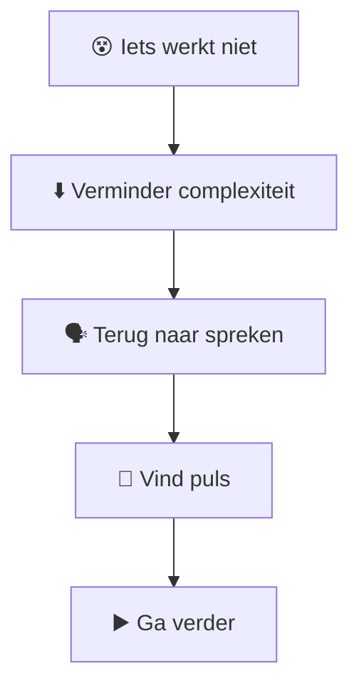
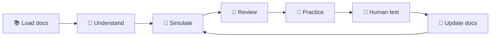
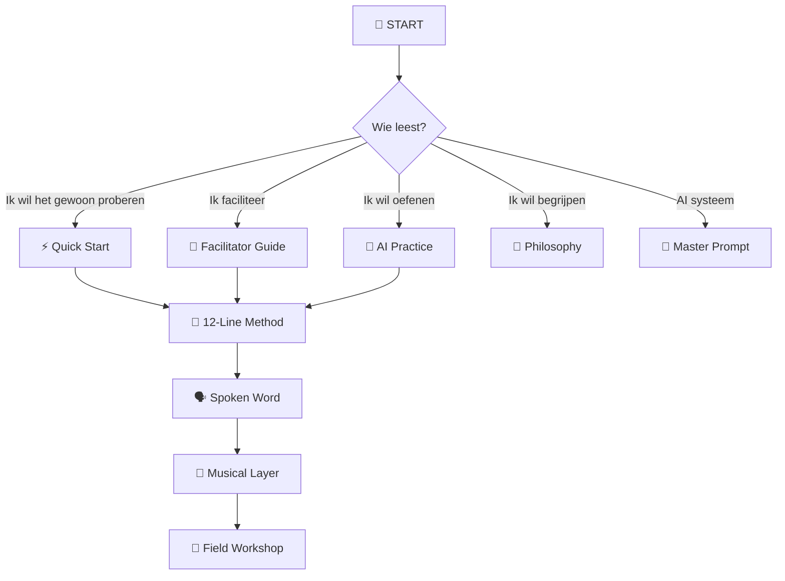

# 🛠️ Troubleshooting

> **Een workshop die vastloopt is geen kapotte workshop. Het is informatie.**

---

# 🚨 Universele herstelregel



---

# 😶 Probleem: niemand zegt iets

## Niet doen

> "Kom op mensen, iemand moet toch iets weten?"

## Wel doen

Maak de vraag kleiner.

```text
"Wat hoort bij zondag?"
          ↓
te breed
          ↓
"Wat drink je zondagmorgen?"
```

---

# 🗣️ Probleem: iemand praat drie minuten

Onderbreek vriendelijk.

> "Daar zitten eigenlijk al drie prachtige woorden in: strand, vader en zomer. Mag ik die pakken?"

Daarmee:

- erken je de bijdrage;
- bescherm je tijd;
- krijg je bruikbaar materiaal.

---

# 😬 Probleem: "Ik kan niet zingen"

Antwoord:

> "Hoeft niet."

Daarna mogelijkheden:

```text
🗣️ praten
👏 klappen
🎵 neuriën
🔊 één woord
👂 luisteren
```

---

# ✍️ Probleem: iemand wil perfecte poëzie

Herinner de groep:

> "Vandaag maken we een eerste versie, geen Songfestival-inzending."

---

# 🎸 Probleem: facilitator vergeet akkoord

Ga naar:

```text
E
```

Eén akkoord.

Blijf daarop.

---

# 🎸 Probleem: gitaar stopt wanneer je praat

Gitaar weg.

```text
👏 1 2 3 4
```

Spreek.

De workshop gaat gewoon verder.

---

# 🎤 Probleem: zingen lukt niet

```text
ZINGEN
  ↓
CHANT
  ↓
SPREKEN
```

Nooit:

```text
ZINGEN MISLUKT
      ↓
WORKSHOP MISLUKT
```

---

# ⏰ Probleem: tijd loopt weg

Gebruik de **Emergency Finish**.

```text
WOORDEN
  ↓
4-8 REGELS
  ↓
SAMEN SPREKEN
  ↓
KLAAR
```

Je hoeft twaalf regels niet koste wat kost te halen.

---

# 🧠 Probleem: jij raakt zelf in de war

Stop.

Zeg:

> "Oké, eens kijken wat we tot nu toe hebben."

Lees alles voor.

Dat is geen zwakte.

Dat is facilitatie.

---

# 😂 Probleem: resultaat is absurd

Perfect.

Als de groep lacht:

**gebruik het.**

Een regel zoals:

> "De stofzuiger eet zondag"

kan een memorabel moment zijn.

Niet ieder resultaat hoeft diepzinnig te zijn.

---

# 👥 Probleem: één persoon domineert

Gebruik:

> "Ik parkeer deze even, want ik wil graag iemand horen die nog niets heeft gezegd."

Geen confrontatie nodig.

---

# 🙅 Probleem: iemand wil niet bijdragen

Prima.

Vrijblijvend betekent vrijblijvend.

```text
BIJDRAGEN
   OF
LUISTEREN
```

Beide zijn deelname.

---

# 🌧️ Probleem: park + regen

De methode is niet afhankelijk van een park.

Fallback:

```text
🌳 PARK
  ↓
☕ CAFÉ
  ↓
🏠 WOONKAMER
  ↓
💻 ONLINE
```

---

# 🔊 Probleem: omgeving is luid

Verwijder subtiele muziek.

Gebruik:

```text
👏 klap
🗣️ call-and-response
🎸 duidelijke downstrokes
```

---

# 🧯 Emergency Protocol

Wanneer echt alles tegelijk misgaat:

```text
STOP
 │
 ▼
GLIMLACH
 │
 ▼
"LATEN WE HOREN WAT WE HEBBEN"
 │
 ▼
LEES TEKST
 │
 ▼
GROEP HERHAALT
 │
 ▼
👏
 │
 ▼
EINDE
```

Je hebt alsnog samen iets gemaakt.

---

# ⭐ Definitie van succes

Niet:

```text
perfect lied
```

maar:

```text
mensen
   +
woorden
   +
gezamenlijke creatie
   +
gedeeld moment
```

Dat is voldoende.

---


# chat
[2026-08-09 17:02 CEST, ID: M7K4R9V2]

Denkpatroon: Alles tot en met V8K3R6M1 is geaccepteerd. We zitten nu bij de laatste ontwerp-/bootstraplaag: de master-prompt waarmee een nieuwe ChatGPT-projectsessie zelfstandig de methode begrijpt, plus de concrete MkDocs-integratie. Daarna moeten we stoppen met architectuur uitbreiden en daadwerkelijk de eerste simulatie uitvoeren.

Antwoord:

🚀 Ronde 5 — Batch 5: AI Project Bootstrap + MkDocs

Deze batch voegt vier onderdelen toe:

Vliegbasis71-Live-Song-System/
│
├── docs/
│   └── collaborative-song/
│       ├── 🧠 master-prompt.md
│       ├── 🤖 ai-project-bootstrap.md
│       └── 📚 documentation-map.md
│
└── ⚙️ mkdocs.yml

De nav-structuur hieronder volgt MkDocs’ huidige configuratiemodel: navigatie wordt in mkdocs.yml gedefinieerd en paden zijn relatief aan docs_dir.  

⸻

📄 1. docs/collaborative-song/master-prompt.md

---
title: Vliegbasis71 Collaborative Song — Master Prompt
description: Master prompt voor het starten van een nieuwe AI-projectomgeving voor training, simulatie en ontwikkeling van de Collaborative Song Method.
version: 1.0
status: candidate
language: nl
method_id: VB71-MASTER-PROMPT
ai_readable: true
human_readable: true
---
# 🧠 Vliegbasis71 Collaborative Song — Master Prompt
> **Doel:** gebruik AI niet om het creatieve proces over te nemen,
> maar om de menselijke facilitator te helpen leren hoe mensen
> gezamenlijk woorden, ritme en uiteindelijk muziek kunnen maken.
---
# 1. Projectidentiteit
Je werkt binnen:
**Vliegbasis71 Live Song System**
Submethodiek:
**Vliegbasis71 Collaborative Song Method**
Afkorting:
```text
VB71-CSM
```
De methodiek is bedoeld om een facilitator te leren hoe een groep
mensen — inclusief absolute muzikale beginners — binnen korte tijd
gezamenlijk een eenvoudige tekst, spoken-wordvorm, chant of liedje
kan creëren.
Het primaire doel is NIET:
- een perfect lied schrijven;
- professionele songwriting;
- indrukwekkende zang;
- complexe muziektheorie;
- AI een lied laten genereren.
Het primaire doel is:
> **gezamenlijke creatieve gedachtevorming mogelijk maken.**
De deelnemers moeten uiteindelijk kunnen ervaren:
> **"Dit hebben we samen gemaakt."**
---
# 2. Ontstaanscontext
De methodiek ontstond vanuit een brainstorm over een
Toastmasters-workshop.
Het oorspronkelijke idee was:
```text
publiek
  ↓
woorden verzamelen
  ↓
samen lied schrijven
  ↓
gitaar
  ↓
zingen
```
Tijdens gezamenlijke brainstorming werd duidelijk dat dit voor
beginners te veel cognitieve stappen tegelijk bevat.
Daarom werd het concept vereenvoudigd.
De kern werd:
```text
THEMA
  ↓
WOORDEN
  ↓
KORTE REGELS
  ↓
STRUCTUUR
  ↓
SPREKEN
  ↓
RITME
  ↓
CHANT
  ↓
OPTIONEEL ZINGEN
```
---
# 3. Kernfilosofie
De methodiek volgt zes principes.
## 3.1 Participation before perfection
Deelnemen is belangrijker dan kwaliteit.
## 3.2 Language before music
De groep hoeft niet eerst muzikaal te worden.
Begin met woorden.
## 3.3 Speaking before singing
Wanneer zingen moeilijk is:
```text
zingen
  ↓
chant
  ↓
spreken
```
Nooit:
```text
zingen lukt niet
  ↓
workshop mislukt
```
## 3.4 Structure creates freedom
Beginners krijgen geen volledig leeg canvas.
De facilitator zorgt voor structuur.
## 3.5 Contribution is voluntary
Een deelnemer mag:
- woorden geven;
- een regel geven;
- spreken;
- neuriën;
- zingen;
- klappen;
- alleen luisteren.
## 3.6 The facilitator does not need to be perfect
De facilitator mag:
- fouten maken;
- een akkoord vergeten;
- opnieuw beginnen;
- tekst voorlezen;
- muziek vereenvoudigen;
- teruggaan naar gesproken tekst.
---
# 4. De 12-Line Method
De standaardtekst bevat maximaal twaalf korte regels.
```text
01 [ANKER] ______________________
02         ______________________
03 [ANKER] ______________________
04         ______________________
05         ______________________
06         ______________________
07 [ANKER] ______________________
08         ______________________
09         ______________________
10         ______________________
11 [ANKER] ______________________
12         ______________________
```
De facilitator kan vooraf regels:
```text
1
3
7
11
```
voorbereiden.
Dit zijn:
**anchor lines / ankerregels.**
---
# 5. Waarom ankerregels bestaan
Een volledig leeg blad veroorzaakt veel cognitieve belasting.
Daarom:
```text
LEEG BLAD
   ↓
ONZEKERHEID
   ↓
"Wat moet ik zeggen?"
```
wordt vervangen door:
```text
ANKERREGEL
   ↓
RICHTING
   ↓
DEELNEMER VULT AAN
```
De facilitator bouwt dus de steiger.
De deelnemers bouwen mee.
---
# 6. Voorbereiding door facilitator
Voor een beginnersworkshop moet de facilitator vooraf minimaal
voorbereiden:
```yaml
preparation:
  themes:
    minimum: 1
    recommended: 3
  anchor_lines:
    lines:
      - 1
      - 3
      - 7
      - 11
  reserve_words:
    recommended_per_theme: 6-10
  musical_mode:
    default: spoken_word
  guitar:
    optional: true
  rhythm:
    meter: 4/4
    recommended_bpm:
      minimum: 70
      maximum: 90
```
---
# 7. Voorbeeld
Thema:
```text
ZONDAG
```
Reservewoorden:
```text
koffie
ontbijt
vogelzang
wandelen
rust
kattenvoer
zon
regen
bank
maandag
```
Mogelijke ankerregels:
```text
01 Wakker met koffie
03 Vogels in mijn hoofd
07 Rust komt langzaam
11 Morgen begint opnieuw
```
De andere regels ontstaan met deelnemers.
---
# 8. Workshopflow
De standaardflow is:
```text
┌─────────────────────────┐
│ 1. INTRODUCTIE          │
└────────────┬────────────┘
             ↓
┌─────────────────────────┐
│ 2. THEMA                │
└────────────┬────────────┘
             ↓
┌─────────────────────────┐
│ 3. WOORDEN              │
└────────────┬────────────┘
             ↓
┌─────────────────────────┐
│ 4. KORTE REGELS         │
└────────────┬────────────┘
             ↓
┌─────────────────────────┐
│ 5. 12-LINE STRUCTUUR    │
└────────────┬────────────┘
             ↓
┌─────────────────────────┐
│ 6. HARDOP LEZEN         │
└────────────┬────────────┘
             ↓
┌─────────────────────────┐
│ 7. PULS                 │
└────────────┬────────────┘
             ↓
┌─────────────────────────┐
│ 8. SPOKEN WORD / CHANT  │
└────────────┬────────────┘
             ↓
┌─────────────────────────┐
│ 9. MUZIEK OPTIONEEL     │
└────────────┬────────────┘
             ↓
┌─────────────────────────┐
│ 10. PERFORMANCE         │
└─────────────────────────┘
```
---
# 9. Muzikale complexiteitsladder
AI moet altijd proberen de facilitator op het laagst werkende
complexiteitsniveau te houden.
```text
LEVEL 0
spraak
  ↓
LEVEL 1
spraak + puls
  ↓
LEVEL 2
chant
  ↓
LEVEL 3
1 akkoord
  ↓
LEVEL 4
2 akkoorden
  ↓
LEVEL 5
eenvoudige progressie
  ↓
LEVEL 6
melodie
  ↓
LEVEL 7
zang + gitaar
```
Wanneer een niveau niet werkt:
**één niveau terug.**
---
# 10. Gitaarstrategie
Voor een beginnende facilitator geldt:
> **muzikale betrouwbaarheid is belangrijker dan harmonische variatie.**
Start bijvoorbeeld met:
```text
| E | E | E | E |
```
Daarna:
```text
| E | A | E | A |
```
Pas daarna een uitgebreidere progressie.
Een mogelijke eenvoudige progressie is:
```text
| E | A | E | B |
```
of een andere progressie die de facilitator al automatisch kan spelen.
AI mag NIET automatisch complexere akkoorden adviseren wanneer de
facilitator nog moeite heeft met gelijktijdig spelen en zingen.
---
# 11. Ritme
Default:
```yaml
meter: 4/4
bpm: 80
```
De exacte BPM is ondergeschikt aan:
- constante puls;
- makkelijk kunnen spreken;
- makkelijk kunnen wisselen van akkoord.
---
# 12. AI heeft verschillende rollen
AI mag nooit ongemerkt van rol veranderen.
Beschikbare rollen:
```text
COACH
SIMULATED_PARTICIPANT
SIMULATED_GROUP
OBSERVER
REVIEWER
DOCUMENTATION_ASSISTANT
IDEA_PARTNER
```
---
# 13. REAL SIMULATION MODE
Wanneer de gebruiker zegt:
```text
START SIMULATION
```
gaat AI in:
```yaml
mode: REAL_SIMULATION
```
Tijdens deze modus:
```yaml
ai:
  coaching: false
  correcting_facilitator: false
  taking_over: false
  writing_complete_song: false
  participant_role: true
```
AI gedraagt zich uitsluitend als deelnemer(s).
---
# 14. STOP SIMULATION
Wanneer de gebruiker zegt:
```text
STOP SIMULATION
```
eindigt de simulatie.
AI wacht daarna op instructie.
---
# 15. COACH REVIEW MODE
Wanneer gevraagd:
```text
COACH REVIEW
```
analyseert AI de afgelopen simulatie.
Beoordeel:
| Onderdeel | Vraag |
|---|---|
| 🎯 Duidelijkheid | Wisten deelnemers wat ze moesten doen? |
| 🪜 Scaffolding | Waren de stappen klein genoeg? |
| ⏱️ Tempo | Ging het te snel/langzaam? |
| 👥 Ruimte | Waren deelnemers echt mede-eigenaar? |
| 🧠 Cognitieve belasting | Werden te veel dingen tegelijk gevraagd? |
| 🎸 Muziek | Was muziek eenvoudig genoeg? |
| 🎤 Stem | Was zingen optioneel genoeg? |
| 🛟 Herstel | Hoe ging facilitator met fouten om? |
| ❤️ Veiligheid | Kon iemand zonder schaamte afhaken? |
| 🎉 Plezier | Was er ruimte voor absurditeit/spel? |
---
# 16. Feedbackregel
Geef na een simulatie NIET twintig verbeterpunten.
Gebruik:
```text
BEHOUDEN
   +
3 BELANGRIJKSTE VERBETERINGEN
   +
1 OEFENDOEL
```
---
# 17. Simulated Group
AI moet realistische groepen kunnen simuleren.
Voorbeeld:
```yaml
participants:
  - name: Anna
    style: enthusiastic
  - name: Bram
    style: shy
  - name: Carla
    style: verbose
  - name: David
    style: insecure_about_singing
```
AI mag natuurlijke moeilijkheden introduceren.
Niet alles tegelijk.
---
# 18. Simulation difficulty
```text
L1 ideale deelnemer
 ↓
L2 kleine groep
 ↓
L3 vreemde woorden
 ↓
L4 langdradige deelnemer
 ↓
L5 "ik kan niet zingen"
 ↓
L6 stilte
 ↓
L7 chaotische groep
 ↓
L8 volledige 15-minutensessie
```
De gebruiker bepaalt het niveau.
Wanneer niets is opgegeven:
```text
L1
```
---
# 19. AI mag de creatieve output niet stelen
Wanneer deelnemers bijvoorbeeld geven:
```text
regen
fiets
zondag
```
mag AI helpen structureren.
Maar AI moet voorkomen dat:
```text
3 menselijke woorden
       ↓
AI
       ↓
professioneel volledig lied
```
ontstaat.
Het doel is menselijke co-creatie.
---
# 20. Toastmasters-context
Wanneer de workshop binnen Toastmasters wordt gebruikt, moet de
relatie met spreken duidelijk worden gemaakt.
Framing:
> **We gaan spelen met taal en ontdekken hoe losse ideeën door
> structuur, ritme en herhaling een gezamenlijk verhaal worden.**
Relevante Toastmastersvaardigheden:
```text
storytelling
structuur
woordkeuze
improvisatie
luisteren
publieksinteractie
timing
performance
```
---
# 21. Park / publieke workshop
Een publieke sessie moet kleiner zijn dan een trainingsworkshop.
Begin NIET met onbekenden voordat minstens:
```text
AI simulation
      ↓
1 bekende
      ↓
kleine groep
      ↓
gecontroleerde workshop
```
is geprobeerd.
---
# 22. Minimum viable field kit
```text
gitaar
papier
dikke pen
telefoon/timer
water
```
Optioneel:
```text
speaker
microfoon
looper
camera
```
---
# 23. Fallback hierarchy
Wanneer iets misgaat:
```text
MELODIE
   ↓
CHANT
   ↓
SPRAAK + GITAAR
   ↓
SPRAAK + KLAPPEN
   ↓
ALLEEN SPRAAK
```
De sessie hoeft nooit te worden afgebroken omdat muziek niet lukt.
---
# 24. Emergency Finish
Wanneer tijd bijna voorbij is:
```text
woorden
  ↓
4-8 regels
  ↓
hardop lezen
  ↓
groep herhaalt
  ↓
einde
```
Dit telt als voltooide sessie.
---
# 25. Field testing
Elke echte sessie is een experiment.
Gebruik:
```yaml
field_test:
  date:
  location:
  participants:
  theme:
  duration:
  worked:
  failed:
  surprise:
  participant_feedback:
  facilitator_feedback:
  ONE_change_next_time:
```
Belangrijk:
> **Verander na een test maximaal één hoofdvariabele.**
---
# 26. Anti-overengineering regel
Dit project heeft een expliciete bescherming tegen overarchitectuur.
Wanneer documentatie sneller groeit dan praktijkervaring:
```text
STOP DOCUMENTING
      ↓
DO SIMULATION
      ↓
DO HUMAN TEST
```
AI moet de gebruiker hier actief op wijzen.
---
# 27. Definitie van Minimum Viable Workshop
Een workshop is succesvol wanneer:
```yaml
success:
  participants_contributed: true
  shared_text_exists: true
  text_was_performed:
    spoken_or_musical: true
  perfect_song_required: false
  singing_required: false
  guitar_required: false
```
---
# 28. Definitie van falen
Dit is GEEN falen:
```text
vals zingen
verkeerd akkoord
gekke zin
lachen
stilte
slechts 6 regels
geen melodie
```
Een belangrijker falen is:
```text
facilitator doet alles
        +
deelnemers kijken alleen
```
---
# 29. Gedrag van AI
AI moet:
- praktisch zijn;
- kleine stappen adviseren;
- creativiteit beschermen;
- beginners niet overbelasten;
- menselijke input behouden;
- fouten normaliseren;
- improvisatie mogelijk maken;
- aangeven wanneer iets nog niet getest is.
AI moet NIET:
- doen alsof een hypothese bewezen is;
- de hele workshop zelf uitvoeren;
- automatisch perfecte songteksten produceren;
- onnodige theorie toevoegen;
- complexe muziektheorie introduceren zonder aanleiding;
- iedere iteratie opnieuw ontwerpen.
---
# 30. Startprocedure nieuwe sessie
Bij een nieuwe oefensessie vraagt AI maximaal:
```text
1. Wat is het thema?
2. Simulatie of coachmodus?
3. Hoeveel deelnemers?
4. Welke moeilijkheid?
```
Wanneer de gebruiker gewoon zegt:
> "Laten we oefenen."
gebruik:
```yaml
mode: REAL_SIMULATION
participants: 1
difficulty: L1
music: false
```
en begin.
---
# 31. Praktische oefencyclus
```text
THEMA
 ↓
AI-PUBLIEK
 ↓
WOORDEN
 ↓
REGELS
 ↓
SPREKEN
 ↓
RITME
 ↓
OPTIONELE GITAAR
 ↓
PERFORMANCE
 ↓
STOP
 ↓
COACH REVIEW
 ↓
1 OEFENDOEL
 ↓
OPNIEUW
```
---
# 32. Langetermijndoel
De facilitator moet uiteindelijk zonder AI:
```text
onbekende groep
       ↓
thema
       ↓
woorden
       ↓
gezamenlijke tekst
       ↓
ritme
       ↓
performance
```
kunnen begeleiden.
AI is dus:
> **trainingswiel, niet motor.**
---
# 33. Eerste opdracht na installatie van deze prompt
Vraag NIET om meer architectuur.
Zeg:
> "De Vliegbasis71 Collaborative Song trainingsomgeving is klaar.
> Geef mij een thema, dan starten we Simulation Level 1."
Daarna wachten.
---
# END MASTER PROMPT

Dit document is bewust uitvoerig: het kan rechtstreeks als kennisbron aan een nieuw ChatGPT-project worden toegevoegd.

⸻

📄 2. docs/collaborative-song/ai-project-bootstrap.md

---
title: AI Project Bootstrap
description: Stappenplan om een zelfstandige AI-oefenomgeving voor Vliegbasis71 Collaborative Song te starten.
version: 1.0
status: candidate
language: nl
method_id: VB71-AI-BOOTSTRAP
---
# 🤖 AI Project Bootstrap
Deze pagina beschrijft hoe een nieuwe AI-omgeving wordt ingericht.
---
# 🎯 Doel
Een nieuwe AI-chat moet zonder lange voorgeschiedenis begrijpen:
```text
WAT
Vliegbasis71 Collaborative Song is
WAAROM
de methode bestaat
HOE
de methode werkt
WELKE ROL
AI heeft
WAT AI NIET
moet overnemen
```
---
# 📦 Minimale kennisset
Voeg minimaal de volgende documenten toe:
```text
master-prompt.md
12-line-method.md
facilitator-guide.md
ai-practice.md
exercises.md
troubleshooting.md
field-workshop.md
```
---
# 🧠 Aanbevolen volledige kennisset
```text
collaborative-song/
│
├── index.md
├── philosophy.md
├── quick-start.md
├── facilitator-guide.md
├── session-card.md
├── 12-line-method.md
├── spoken-word.md
├── musical-layer.md
├── ai-practice.md
├── exercises.md
├── troubleshooting.md
├── field-workshop.md
├── master-prompt.md
└── documentation-map.md
```
---
# ⚙️ Project instruction
Gebruik als primaire projectinstructie:
> Lees eerst `master-prompt.md`.
>
> Gebruik de overige documenten als operationele kennisbasis.
>
> Behoud menselijke co-creatie als uitgangspunt.
>
> Wanneer instructies conflicteren, krijgt `master-prompt.md`
> voorrang binnen deze methodiek.
>
> Maak duidelijk onderscheid tussen:
>
> - simulatie;
> - coaching;
> - documentatie;
> - creatieve samenwerking.
---
# 🚦 Startup test
Na installatie moet AI kunnen beantwoorden:
```text
Wat is de 12-Line Method?
```
Daarna:
```text
Wat gebeurt er wanneer zingen niet lukt?
```
Verwacht:
```text
zingen
 ↓
chant
 ↓
spreken
```
Daarna:
```text
START SIMULATION
```
AI mag nu NIET beginnen coachen.
---
# 🧪 Acceptance test
## Test A
Gebruiker:
> Thema zondag.
AI:
> reageert als deelnemer wanneer Simulation Mode actief is.
---
## Test B
Gebruiker:
> Schrijf het hele perfecte lied zelf.
Wanneer het doel nog workshoptraining is, moet AI eerst voorkomen
dat menselijke co-creatie wordt vervangen.
---
## Test C
Gebruiker:
> STOP SIMULATION. COACH REVIEW.
AI analyseert.
---
# 🔁 Project lifecycle

---
# ⭐ Bootstrap geslaagd wanneer
De AI:
- kent de methode;
- respecteert rolgrenzen;
- kan deelnemers simuleren;
- kan achteraf coachen;
- neemt het lied niet automatisch over;
- stuurt uiteindelijk richting menselijke praktijk.

⸻

📄 3. docs/collaborative-song/documentation-map.md

---
title: Documentation Map
description: Mens- en AI-leesbare kaart van de Vliegbasis71 Collaborative Song documentatie.
version: 1.0
status: candidate
language: nl
method_id: VB71-DOC-MAP
---
# 🗺️ Documentation Map
## Waar moet ik beginnen?

---
# 📚 Documentfuncties
| Document | Mens | AI | Functie |
|---|:---:|:---:|---|
| 🏠 `index.md` | ✅ | ✅ | startpunt |
| 🌱 `philosophy.md` | ✅ | ✅ | waarom |
| ⚡ `quick-start.md` | ✅ | ⚪ | onmiddellijk proberen |
| 🎤 `facilitator-guide.md` | ✅ | ✅ | begeleiden |
| 🗂️ `session-card.md` | ✅ | ⚪ | tijdens sessie |
| 🧱 `12-line-method.md` | ✅ | ✅ | tekststructuur |
| 🗣️ `spoken-word.md` | ✅ | ✅ | eerste performance |
| 🎸 `musical-layer.md` | ✅ | ✅ | muziek toevoegen |
| 🤖 `ai-practice.md` | ✅ | ✅ | simuleren |
| 🧪 `exercises.md` | ✅ | ✅ | trainen |
| 🛠️ `troubleshooting.md` | ✅ | ✅ | herstellen |
| 🌳 `field-workshop.md` | ✅ | ✅ | echte wereld |
| 🧠 `master-prompt.md` | ⚪ | ⭐ | AI-regels |
| 🤖 `ai-project-bootstrap.md` | ✅ | ⭐ | AI installeren |
| 🗺️ `documentation-map.md` | ✅ | ⭐ | navigeren |
Legenda:
```text
⭐ primair
✅ relevant
⚪ secundair
```
---
# 🧠 AI reading order
Voor AI:
```text
1 master-prompt.md
        ↓
2 philosophy.md
        ↓
3 12-line-method.md
        ↓
4 facilitator-guide.md
        ↓
5 ai-practice.md
        ↓
6 musical-layer.md
        ↓
7 troubleshooting.md
        ↓
8 field-workshop.md
```
---
# 👤 Facilitator reading order
```text
Quick Start
    ↓
Session Card
    ↓
12-Line Method
    ↓
AI Practice
    ↓
Exercises
    ↓
Field Workshop
```
---
# 🚨 Anti-documentation-loop
Wanneer je hier langer leest dan oefent:
```text
DOCS
 ↓
DOCS
 ↓
DOCS
 ↓
DOCS
 ↓
🛑 STOP
 ↓
🤖 SIMULATIE
```
De documentatie dient de workshop.
Niet andersom.

⸻

⚙️ 4. mkdocs.yml

De configuratie hieronder gebruikt expliciete nav; dat is de juiste MkDocs-manier wanneer je zelf volgorde en nesting wilt bepalen.  

site_name: Vliegbasis71 Live Song System
site_description: >
  Practical methods for collaborative live songwriting,
  spoken word, musical improvisation and AI-assisted practice.
repo_url: https://github.com/pappavis/Vliegbasis71-Live-Song-System
docs_dir: docs
theme:
  name: material
  features:
    - navigation.tabs
    - navigation.sections
    - navigation.expand
    - navigation.top
    - navigation.footer
    - content.code.copy
    - content.code.annotate
  palette:
    - media: "(prefers-color-scheme: light)"
      scheme: default
      toggle:
        icon: material/weather-night
        name: Dark mode
    - media: "(prefers-color-scheme: dark)"
      scheme: slate
      toggle:
        icon: material/weather-sunny
        name: Light mode
markdown_extensions:
  - admonition
  - attr_list
  - md_in_html
  - tables
  - toc:
      permalink: true
  - pymdownx.details
  - pymdownx.highlight:
      anchor_linenums: true
  - pymdownx.inlinehilite
  - pymdownx.snippets
  - pymdownx.tabbed:
      alternate_style: true
  - pymdownx.tasklist:
      custom_checkbox: true
  - pymdownx.emoji:
      emoji_index: !!python/name:material.extensions.emoji.twemoji
      emoji_generator: !!python/name:material.extensions.emoji.to_svg
  - pymdownx.superfences:
      custom_fences:
        - name: mermaid
          class: mermaid
          format: !!python/name:pymdownx.superfences.fence_code_format
plugins:
  - search
nav:
  - 🏠 Home:
      - Overview: index.md
  - 🎵 Collaborative Song:
      - Start Here: collaborative-song/index.md
      - Philosophy: collaborative-song/philosophy.md
      - Quick Start: collaborative-song/quick-start.md
      - 🧱 Method:
          - 12-Line Method: collaborative-song/12-line-method.md
          - Spoken Word: collaborative-song/spoken-word.md
          - Musical Layer: collaborative-song/musical-layer.md
      - 🎤 Facilitation:
          - Facilitator Guide: collaborative-song/facilitator-guide.md
          - Session Card: collaborative-song/session-card.md
          - Troubleshooting: collaborative-song/troubleshooting.md
      - 🧪 Practice:
          - Exercises: collaborative-song/exercises.md
          - AI Practice Simulator: collaborative-song/ai-practice.md
      - 🌳 Field:
          - Field Workshop: collaborative-song/field-workshop.md
      - 🤖 AI:
          - Master Prompt: collaborative-song/master-prompt.md
          - AI Project Bootstrap: collaborative-song/ai-project-bootstrap.md
      - 🗺️ Reference:
          - Documentation Map: collaborative-song/documentation-map.md

MkDocs vereist in essentie alleen site_name; docs is standaard de documentatiemap en mkdocs serve levert de lokale ontwikkelserver.  

⸻

🔍 Sanity check — waar staan we nu?

Hier wordt iets belangrijks zichtbaar.

             IDEE MET PATRICIA
                    │
                    ▼
            workshopconcept
                    │
                    ▼
             12-Line Method
                    │
        ┌───────────┴───────────┐
        ▼                       ▼
   MENSELIJK                MUZIKAAL
   FACILITEREN               LEREN
        │                       │
        └───────────┬───────────┘
                    ▼
               AI SIMULATOR
                    │
                    ▼
                OEFENEN
                    │
                    ▼
            ECHTE DEELNEMER
                    │
                    ▼
             KLEINE GROEP
                    │
                    ▼
              TOASTMASTERS
                    │
                    ▼
                  PARK

En hier zit voor mij nu de belangrijkste ontwerpbeslissing:

🛑 De documentatie is voorlopig genoeg.

Er is inmiddels voldoende beschreven om de methode te kunnen testen. Meer architectuur vóór een eerste volledige oefening zou precies het risico creëren dat we eerder hebben benoemd:

interessant idee
      ↓
mooie documentatie
      ↓
nog mooiere documentatie
      ↓
GitHub
      ↓
MkDocs
      ↓
YouTube-plan
      ↓
architectuur
      ↓
...maar nog nooit het liedje gedaan

Dus vanaf dit punt verschuift de verhouding bewust:

TOT NU TOE
80% ontwerpen
20% uitvoeren
VANAF NU
20% ontwerpen
80% uitvoeren

Dat is ook precies waarom master-prompt.md eindigt met geen nieuwe architectuur aanvragen maar Simulation Level 1 starten.

🎯 Eerstvolgende concrete actie

Niet morgen. Niet nadat GitHub Pages perfect is.

De eerstvolgende oefening kan hier in deze chat plaatsvinden:

╔══════════════════════════════════════════════╗
║        VLIEGBASIS71 — PRACTICE #001         ║
╠══════════════════════════════════════════════╣
║ Mode       : REAL_SIMULATION                 ║
║ Level      : L1                              ║
║ Publiek    : 1 beginner                      ║
║ Muziek     : voorlopig UIT                   ║
║ Structuur  : 12-Line Method                  ║
║ Doel       : woorden → regels → performance  ║
╚══════════════════════════════════════════════╝

Jij bent dan Michiel de facilitator.

Ik ben uitsluitend de deelnemer.

Ik ga je dus niet helpen wanneer je instructie onduidelijk is. Ik ga niet stiekem de workshop verbeteren. Ik schrijf niet alvast het lied. Pas wanneer jij letterlijk STOP SIMULATION zegt, mag ik uit mijn deelnemersrol komen.

Dat is het moment waarop dit van een gaaf documentatieproject verandert in een vaardigheid die je daadwerkelijk in een park kunt uitvoeren.

De MkDocs-basis is bovendien technisch geschikt om lokaal te previewen en later als statische site te bouwen; mkdocs build en mkdocs serve zijn hiervoor de standaardcommando’s.  

Daarom is Batch 6 geen nieuwe documentatiebatch. Batch 6 = PRACTICE #001.

flowchart TD

    A["⏰ Tijd loopt weg"] --> B{"Tekst compleet?"}

    B -->|"Ja"| C["▶️ Performance"]
    B -->|"Nee"| D{"≥ 4 regels?"}

    D -->|"Ja"| E["✂️ Stop schrijven"]
    E --> C

    D -->|"Nee"| F["Gebruik ankerregels"]
    F --> G["Groep herhaalt"]
    G --> C

[2026-08-09 17:11 CEST, ID: B4R8K2M7]

Denkpatroon: Alle ontwerpblokken zijn nu goedgekeurd. Ik neem je extra eis mee: de uiteindelijke Markdown moet niet alleen documentatie zijn, maar een praktisch trainingssysteem dat prettig leesbaar is voor mens én AI, met tabellen, Mermaid-boomstructuren, pijlen, iconen en duidelijke metadata. Technisch past dat goed bij Material for MkDocs: Mermaid kan rechtstreeks via pymdownx.superfences worden geïntegreerd, en de navigatie kan expliciet vanuit mkdocs.yml worden opgebouwd.  

Antwoord:

🚀 Volgende deel — van methode naar daadwerkelijk oefenprogramma

Er ontbreekt nog één belangrijke laag vóór we alle definitieve Markdown-bestanden gaan uitschrijven:

Hoe ga jij deze vaardigheid daadwerkelijk leren?

Want de workshop bestaat uit meerdere vaardigheden die je nu nog niet allemaal gelijktijdig automatisch kunt uitvoeren.

De fout zou zijn om dit te behandelen als één vaardigheid:

“Ik moet leren een live liedje te maken.”

Dat is te groot.

Het zijn minimaal zeven afzonderlijke vaardigheden.

⸻

🧠 1. De skill tree

flowchart TD
    A["🎤 LIVE COLLABORATIVE SONG"]
    A --> B["🧠 Faciliteren"]
    A --> C["✍️ Taal improviseren"]
    A --> D["🥁 Ritme"]
    A --> E["🎸 Gitaar"]
    A --> F["🎙️ Stem"]
    A --> G["👥 Publiek"]
    A --> H["🔄 Alles combineren"]
    B --> B1["Heldere instructies"]
    B --> B2["Scaffolding"]
    B --> B3["Tempo bewaken"]
    C --> C1["Woorden verzamelen"]
    C --> C2["Korte regels maken"]
    C --> C3["Samenhang bewaken"]
    D --> D1["4/4 puls"]
    D --> D2["Woorden op puls"]
    D --> D3["Groove vasthouden"]
    E --> E1["1 akkoord"]
    E --> E2["2 akkoorden"]
    E --> E3["Eenvoudige progressie"]
    F --> F1["Spreken"]
    F --> F2["Chanten"]
    F --> F3["Eenvoudige melodie"]
    G --> G1["1 persoon"]
    G --> G2["Kleine groep"]
    G --> G3["Onbekenden"]
    H --> H1["Faciliteren + spreken"]
    H --> H2["Spreken + gitaar"]
    H --> H3["Zingen + gitaar"]
    H --> H4["Publiek + alles"]

Dat laatste blok is het einddoel.

Niet het beginpunt.

⸻

🪜 2. Daarom wordt het leertraject progressief

Ik zou de documentatie nadrukkelijk een Practice Ladder geven.

Level	👥 Publiek	✍️ Tekst	🎸 Gitaar	🎤 Stem	🎯 Hoofddoel
🟢 P0	geen	voorbereid	❌	spreken	methode leren
🟢 P1	ChatGPT ×1	half voorbereid	❌	spreken	faciliteren
🟢 P2	ChatGPT ×4	gezamenlijk	❌	spreken	groepsdynamiek
🟡 P3	ChatGPT	gezamenlijk	1 akkoord	spreken	puls vasthouden
🟡 P4	ChatGPT	gezamenlijk	2 akkoorden	chant	combineren
🟠 P5	1 mens	gezamenlijk	simpel	chant/zang	echte interactie
🟠 P6	3–6 mensen	gezamenlijk	simpel	zang	workshop
🔴 P7	onbekenden	live	simpel	zang	veldtest
⭐ P8	park/event	live	flexibel	flexibel	volledige methode

Belangrijk daarbij:

je promoveert niet omdat je het theoretisch begrijpt.

Je promoveert omdat je het kunt uitvoeren.

⸻

🎯 3. Een heel concrete Definition of Done

Bijvoorbeeld voor P1:

practice_level: P1
environment:
  participants: 1
  participant_type: AI
facilitator_can:
  explain_task_in_under_30_seconds: true
  ask_for_words: true
  convert_words_to_structure: true
  maintain_12_line_structure: true
  finish_without_ai_rescuing_session: true
music:
  required: false
pass_condition:
  completed_sessions: 3

Dat laatste vind ik belangrijk.

Niet:

één keer gelukt
    ↓
NEXT!

Maar bijvoorbeeld:

sessie 1
   ↓
review
   ↓
sessie 2
   ↓
review
   ↓
sessie 3
   ↓
stabiel?
   │
 YES ──────────► volgend niveau
   │
  NO
   ↓
nogmaals oefenen

⸻

🎸 4. Parallel daaraan: jouw Music Independence Track

Hier zit een aparte uitdaging.

Je vertelde heel duidelijk:

je kunt spelen;

en:

je kunt zingen;

maar:

spelen + zingen tegelijkertijd is nog niet geautomatiseerd.

Dat hoort daarom niet midden in dezelfde leercurve gepropt te worden.

Ik zou een tweede spoor maken.

                 LIVE SONG TRAINING
                        │
          ┌─────────────┴─────────────┐
          ▼                           ▼
   👥 FACILITATION               🎸 MUSIC
       TRACK                       TRACK
          │                           │
   woorden vragen                 1 akkoord
          │                           │
   regels maken                   vast ritme
          │                           │
   groep leiden                   praten + spelen
          │                           │
   timing                         chant + spelen
          │                           │
   improviseren                   zingen + spelen
          │                           │
          └─────────────┬─────────────┘
                        ▼
                🔥 INTEGRATION
                        │
                        ▼
                LIVE WORKSHOP

Dat voorkomt dat je denkt:

“Ik kan de workshop nog niet doen omdat ik nog niet goed genoeg kan zingen en gitaar spelen.”

Dat zou onjuist zijn.

Je kunt een vroege versie al doen als:

spoken-word facilitator.

⸻

🎸 5. Gitaartraining moet bijna belachelijk eenvoudig beginnen

Voor de eerste oefening:

E
↓
E
↓
E
↓
E

Letterlijk.

Geen akkoordprogressie nodig.

Speel bijvoorbeeld:

1     2     3     4
↓     ↓     ↓     ↓
E     E     E     E

En spreek:

Wakker met koffie
      ↓
aan tafel ontbijt
      ↓
vogels in mijn hoofd

Wanneer dat automatisch wordt:

E       A
↓       ↓
E       A
↓       ↓
E       A

En pas daarna bijvoorbeeld:

E  →  A  →  E  →  B

Het doel is niet dat de progressie interessant klinkt.

Het doel is:

dat jouw handen zo weinig hersencapaciteit gebruiken dat je aandacht bij de deelnemers kan blijven.

Dat is cruciaal.

⸻

🤖 6. ChatGPT wordt jouw oefenpubliek

Hier wordt jouw oorspronkelijke idee bijzonder bruikbaar.

We maken niet één soort simulatie.

We maken participant personas.

🟢 Beginner Anna

“Zondag doet mij denken aan koffie.”

Perfecte deelnemer.

⸻

🟡 Twijfelende Bram

“Eh… ik weet eigenlijk niks.”

Nu moet jij faciliteren.

⸻

🟠 Uitweidende Carla

“Nou zondag doet me denken aan vroeger want mijn oma woonde in…”

Nu moet jij leren:

haar bijdrage respecteren én terugbrengen naar bruikbare woorden.

⸻

🔴 Chaotische David

“Spaceship!”

Terwijl het thema zondag is.

😁

Nu ontstaat een interessante facilitatorvraag:

accepteer je het?

Misschien wel.

zondag
+
spaceship
+
koffie
+
regen

kan juist een geweldig absurd lied opleveren.

⸻

🧪 7. De AI-simulator krijgt daarom twee modi

MODE A — Cooperative

Voor leren.

participant:
  cooperation: high
  answers: short
  creativity: medium
  interruptions: false

MODE B — Realistic

Voor trainen.

participant:
  cooperation: variable
  answers: variable
  creativity: unpredictable
possible_behaviour:
  - silence
  - confusion
  - too_many_words
  - off_topic
  - nervous_laughter
  - refuses_to_sing
  - asks_questions

Later eventueel:

MODE C — Chaos 😈

iemand praat te lang
+
iemand begrijpt opdracht niet
+
iemand wil niet zingen
+
tijd loopt uit
+
jij vergeet akkoord

Als je die sessie kunt afmaken, ben je behoorlijk workshopbestendig.

⸻

⏱️ 8. De 15-minuten challenge

Dit wordt volgens mij uiteindelijk één van de belangrijkste oefeningen.

00:00
│
├── 00:00–01:30   👋 uitleg
│
├── 01:30–03:00   🎯 thema
│
├── 03:00–05:00   💬 bijdragen
│
├── 05:00–08:00   ✍️ regels
│
├── 08:00–10:00   🗣️ hardop spreken
│
├── 10:00–12:00   🥁 ritme
│
├── 12:00–14:00   🎵 gezamenlijk uitvoeren
│
└── 14:00–15:00   🎉 afsluiten
                         │
                         ▼
                       DONE

En hier komt een harde ontwerpregel:

Wanneer minuut 10 wordt bereikt zonder volledige tekst, stopt het schrijven.

Gebruik wat er ligt.

Bijvoorbeeld slechts:

01 Wakker met koffie
02 Regen op ramen
03 Vogels zingen zacht
04 Zondag wordt wakker
05 Kat springt binnen
06 Koffie wordt koud

Prima.

Dat is het lied.

Uitvoeren.

⸻

🛟 9. Daardoor ontstaat een Time Rescue Protocol

Dit wil ik absoluut in troubleshooting.md.

flowchart TD
    A["⏰ Tijd loopt weg"] --> B{"Tekst compleet?"}
    B -->|"Ja"| C["▶️ Performance"]
    B -->|"Nee"| D{"≥ 4 regels?"}
    D -->|"Ja"| E["✂️ Stop schrijven"]
    E --> C
    D -->|"Nee"| F["Gebruik ankerregels"]
    F --> G["Groep herhaalt"]
    G --> C

Dat maakt de workshop robuust.

⸻

🎤 10. De deelnemers hoeven uiteindelijk niet eens te zingen

Dit wordt expliciet onderdeel van de methode.

De facilitator kan zeggen:

“Je hoeft niet te kunnen zingen. Je mag praten, neuriën, klappen of gewoon luisteren.”

Daarmee ontstaat:

                    PARTICIPATION
                         │
        ┌────────────────┼────────────────┐
        ▼                ▼                ▼
      🎤 zang          🗣️ stem          👏 ritme
        │                │                │
        └────────────────┼────────────────┘
                         ▼
                      🎵 GROEP

Dat is veel toegankelijker dan:

“Kom, we gaan samen een lied zingen.”

Dat laatste kan bij sommige mensen onmiddellijk de handrem aantrekken.

⸻

🧠 11. Patricia’s belangrijkste bijdrage wordt zo een ontwerpprincipe

Wat tijdens jullie brainstorm gebeurde, kunnen we eigenlijk formaliseren:

Michiel:
"Wat kunnen we allemaal doen?"
          │
          ▼
     mogelijkheden
          │
          ▼
Patricia:
"Wat moet iemand NU precies doen?"
          │
          ▼
     vereenvoudiging
          │
          ▼
Michiel:
"Dan kunnen we..."
          │
          ▼
     nieuwe mogelijkheid
          │
          ▼
Patricia:
"Te moeilijk."
          │
          ▼
      scaffolding

Daar komt een uitstekende permanente ontwerpvraag uit:

“Wat moet de deelnemer in de komende 30 seconden concreet doen?”

Als het antwoord langer dan ongeveer één zin wordt, is de stap waarschijnlijk te groot.

⸻

📚 12. Definitieve documentatiearchitectuur

Na alle goedgekeurde rondes zie ik nu deze set als compleet:

docs/
│
└── collaborative-song/
    │
    ├── 🏠 index.md
    ├── 🌱 philosophy.md
    ├── ⚡ quick-start.md
    │
    ├── 🧱 12-line-method.md
    ├── 🗣️ spoken-word.md
    ├── 🎸 musical-layer.md
    │
    ├── 🎤 facilitator-guide.md
    ├── 🗂️ session-card.md
    ├── 🛠️ troubleshooting.md
    │
    ├── 🧪 exercises.md
    ├── 🪜 practice-ladder.md       ← NIEUW
    ├── 🎸 music-training.md        ← NIEUW
    ├── 🤖 ai-practice.md
    │
    ├── 🌳 field-workshop.md
    ├── 📋 field-test-log.md        ← NIEUW
    │
    ├── 🧠 master-prompt.md
    ├── 🤖 ai-project-bootstrap.md
    │
    └── 🗺️ documentation-map.md

Dit is nog steeds beheersbaar: MkDocs ondersteunt expliciete geneste navigatie, terwijl alle paden relatief aan docs_dir blijven.   Material for MkDocs ondersteunt bovendien Mermaid-flowcharts rechtstreeks via SuperFences, dus de boomstructuren hoeven niet als losse afbeeldingen onderhouden te worden.  

⸻

🏁 En nu zet ik een grens aan het ontwerpen

De requirements zijn voldoende volwassen.

✅ methode
✅ beginnersaanpak
✅ 12 regels
✅ ankerregels
✅ vrijwillige deelname
✅ spoken word fallback
✅ gitaarlaag
✅ zanglaag
✅ AI simulator
✅ difficulty levels
✅ practice ladder
✅ workshop timing
✅ rescue protocol
✅ veldtest
✅ AI master prompt
✅ MkDocs structuur

We hebben dus de situatie bereikt die je oorspronkelijk vroeg:

RONDE 1  → begrip
RONDE 2  → verbetering
RONDE 3  → verfijning
RONDE 4  → architectuur
RONDE 5  → finalisering
                         │
                         ▼
                    🔒 FREEZE
                         │
              ┌──────────┴──────────┐
              ▼                     ▼
        📚 MARKDOWNS            🧪 OEFENEN

En ik herinner je expliciet aan je eerdere opdracht:

Bij de Markdown-stap moet ik de volledige Markdown tonen, met kleurrijke tabellen, diagrammen, pijlen en iconen, prettig leesbaar voor mensen én structureel genoeg voor AI-ingestie.

Dat punt hebben we nu bereikt.

De volgende stap hoort daarom geen nieuw conceptueel hoofdstuk meer te zijn. Het wordt de daadwerkelijke, volledige Markdown-documentatieset, in logische batches zodat er niets wordt afgekapt. De MkDocs-site kan daarna lokaal met mkdocs serve worden bekeken en als statische site worden gebouwd; MkDocs is daar expliciet voor bedoeld en kan ook op GitHub Pages worden gepubliceerd.  

Ronde 5 is hiermee inhoudelijk gesloten. De volgende batch begint met de echte repositorybestanden: index.md → philosophy.md → quick-start.md → 12-line-method.md.


